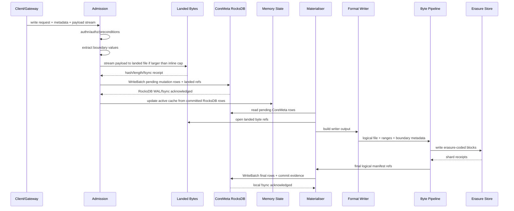
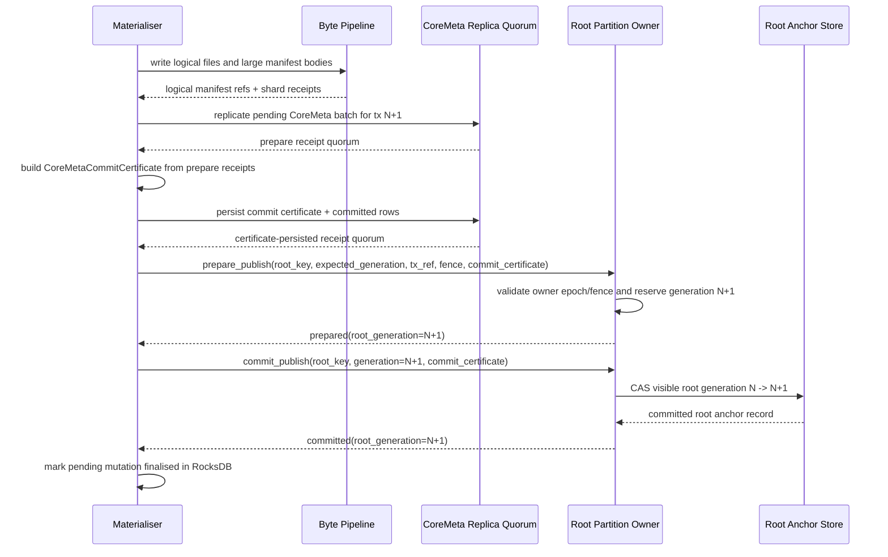
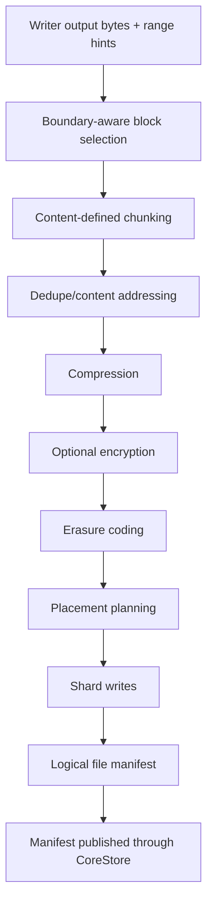
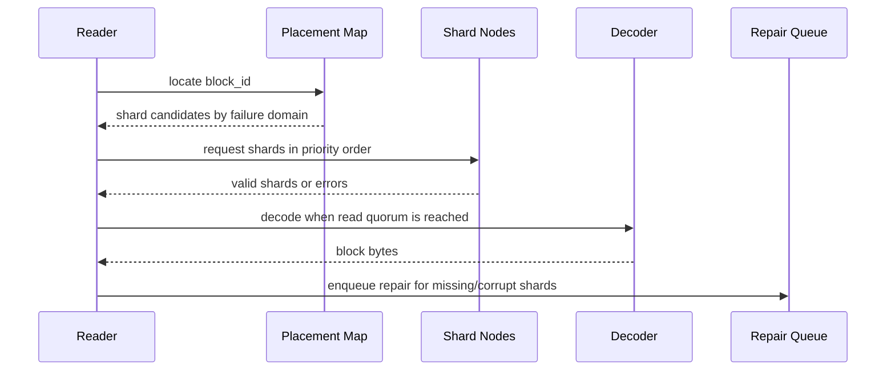
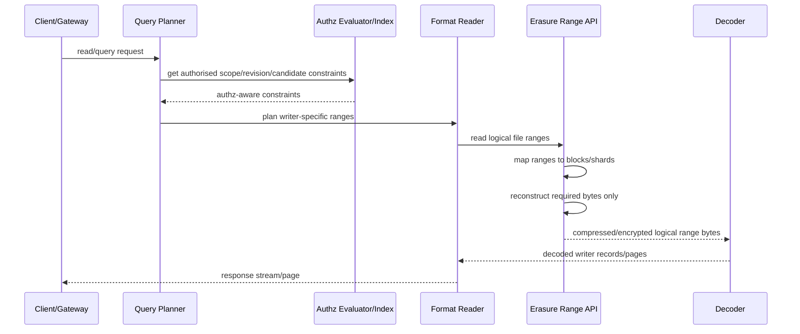

# ANVIL-0007: CoreStore Unified Storage Manifest

Status: Draft for implementation
Audience: Anvil implementors, operators, storage engineers
Scope: CoreStore storage architecture, file formats, write/read paths, observability, and performance gates

## 1. Summary

Anvil must have one durable storage substrate: CoreStore. CoreStore is split
like a BlueStore-style engine: RocksDB is the local metadata plane, and the
CoreStore byte pipeline is the blob/shard plane. Object bodies, stream payloads,
index segment bytes, PersonalDB snapshots, registry blobs, and every other large
byte range are stored outside RocksDB as landed bytes or erasure-coded block
shards. RocksDB stores only compact metadata: refs, heads, manifests or manifest
locators, root cache rows, boundary rows, index keys, authz projections, lease
fences, mesh rows, registry catalogue rows, observability checkpoints, and
materialisation state.

Feature-specific writers are allowed and required. They decide how to arrange
bytes for their own read paths. They do not own separate durability,
replication, quorum, or distribution systems. They emit compact metadata rows
into the CoreStore RocksDB plane and emit large binary outputs into the CoreStore
byte pipeline. The byte pipeline performs chunking, dedupe, compression,
optional encryption, erasure coding, placement, and manifest publication.

Fast writes are admitted through RocksDB-backed pending mutation records plus
landed byte files. RocksDB's own WAL is the only metadata WAL. Anvil does not
define a second metadata WAL file format. Large bytes land locally once, are
referenced by pending mutation records, and are later materialised into final
erasure-coded CoreStore blocks. Compact refs, heads, manifests, indexes, root
state, transaction state, leases, fences, and materialisation cursors are
committed to RocksDB. Recent RocksDB state is mirrored in memory so hot reads do
not rescan metadata tables or blob files.

CoreMeta keys are order-preserving physical database keys, not merely canonical
serialized tuples. Point reads, prefixes, ranges, and cursor continuation map
directly to RocksDB seeks and bounded iterators. Every mutable collection has an
authoritative point-readable current head, while retained history remains
separately addressable. No ordinary request reconstructs current state by
scanning history.

Anvil tenants may store data for many application tenants, organisations,
customers, projects, or legal realms inside one bucket. Anvil therefore exposes a
user-defined boundary schema. Boundary dimensions tell Anvil which object or
record properties are meaningful for chunking, placement, compaction, query
pruning, and prefetching. Boundary dimensions are layout hints and planning
inputs. They are not authorisation grants.

This RFC is prescriptive. Implementors must not introduce sidecar durable JSON
files, feature-specific local stores, or independent replication mechanisms for
subsystems. RocksDB is the only local metadata store. Local temporary files, lock
files, RocksDB's own WAL/SST/MANIFEST files, and caches are allowed only as
implementation artifacts with explicit recovery semantics.

## 2. Goals

- Provide one final durable storage system for all Anvil features.
- Use RocksDB as the CoreStore local metadata plane and never as a large blob
  store.
- Support very fast writes without putting large payloads inside RocksDB or its
  WAL.
- Recover safely after process, node, or machine failure.
- Allow format-aware writers to optimise binary structures for their readers.
- Route every writer's large binary output through one byte pipeline and every
  writer's durable metadata through one RocksDB metadata plane.
- Support object-level and range-level user-defined boundary metadata.
- Preserve efficient range reads over erasure-coded blocks.
- Support search, vector, log, authz, PersonalDB, registry, and mesh data without
  separate durable storage stacks.
- Include tracing and metrics from request entry through RocksDB write batches,
  landed-byte fsync, materialisation, writer output, byte pipeline, erasure
  coding, block placement, reads, and fsync.
- Define a repeatable performance baseline comparable to MinIO, S3-compatible
  object systems, and specialised systems used for logs/search where applicable.
- Make point reads `O(1)` at the CoreMeta key layer and bounded prefix/range
  pages `O(log N + page/candidate window)`, independent of unrelated history.
- Compile each public mutation into the minimum root-grouped RocksDB/quorum
  batches and keep derived maintenance off the foreground path.
- Make every growing public collection cursor-bounded and every watch gap-free
  without per-subscriber durable polling.

## 3. Non-Goals

- Reimplement Kafka, Pulsar, Lucene, Tantivy, Elasticsearch, or any other
  external system. Anvil may adopt proven ideas from them but must keep a
  coherent CoreStore design.
- Require every writer to use the same file format. Writers produce different
  binary structures; the final storage substrate is unified.
- Treat S3 semantics as the core Anvil data model. S3 is one gateway.
- Use boundary metadata as an authorisation mechanism.
- Allow unbounded RocksDB pending-mutation or landed-byte growth.
- Allow durable feature state outside CoreStore final storage.
- Store large object, stream, index, PersonalDB, or registry payloads in
  RocksDB.

## 4. Normative Language

The words MUST, MUST NOT, REQUIRED, SHOULD, SHOULD NOT, and MAY are normative.

## 4.1 Canonical Encoding, Hashing, and Signing Profile

All hashes, signatures, receipts, manifests, root records, pending mutation
records, writer segments, and page tokens in this RFC use one canonical profile.
Any section that says `canonical(...)`, `deterministic protobuf`,
`signed_payload_hash`, `root_hash`, `segment_hash`, `manifest_hash`, or
`receipt_hash` refers to this profile unless that section explicitly defines a
more restrictive byte format. Implementations MUST NOT choose alternate encodings
per subsystem.

Canonical scalar rules:

```text
integers                  little-endian fixed width in binary records; shortest valid integer in JSON
strings                   UTF-8, Unicode NFC, no embedded NUL for identifiers
bytes                     length-prefixed raw bytes in binary records; base64url without padding in JSON
hashes                    algorithm id + raw digest in binary records; "algorithm:hex" in JSON/diagnostics
time                      unix nanoseconds as u64 unless a field says signed timestamp
bools                     0x00 false, 0x01 true in binary records
optional<T>               absent fields omitted in deterministic protobuf canonical hash input; binary uses 0x00/0x01
repeated<T>               semantic order is the order declared by the section; sets are sorted before hashing
maps                      sorted by canonical encoded key bytes
unknown fields            rejected in signed or hashed protocol payloads
default fields            included only when the field is explicitly present in the schema's hash input
```

Canonical JSON is RFC 8785-style canonical JSON: object keys sorted by Unicode
codepoint, no insignificant whitespace, shortest numeric representation, and NFC
strings. JSON is used only for operator-facing policy/query documents, object
payloads whose application content type is JSON, and gateway payloads that are
already specified as JSON by their public protocol. CoreStore internal pending
mutation, stream, transaction, root, and metadata records MUST NOT use JSON as
their structured storage format.

Deterministic protobuf is allowed only for messages whose schema is fixed in this
RFC. It uses deterministic serialization, numeric field order, no unknown fields,
no implicit default-field hashing, and repeated fields in the exact order declared
by the enclosing data structure. Before a deterministic protobuf message is
accepted from disk or network, the receiver MUST decode it and re-encode it
deterministically; the bytes must match exactly.

Domain-separated hashes:

```text
Hash(domain, bytes...) = blake3(domain || 0x00 || len(bytes_0) || bytes_0 || ...)
```

Normative domains:

```text
anvil.request_hash.v1
anvil.pending_mutation.row.v1
anvil.root.key.v1
anvil.root.anchor_record.v1
anvil.transaction_manifest.v1
anvil.logical_file_manifest.v1
anvil.writer.segment.v1
anvil.block.plain.v1
anvil.block.encoded.v1
anvil.shard.receipt.v1
anvil.page_token.v1
anvil.query.plan.v1
anvil.root.cohort.v1
anvil.root.genesis_config.v1
anvil.block.id.v1
anvil.coremeta.row.v1
anvil.coremeta.pending_batch.v1
anvil.coremeta.committed_batch.v1
anvil.coremeta.batch_receipt.v1
anvil.coremeta.commit_certificate.v1
anvil.coremeta.certificate_persist_receipt.v1
```

CoreMeta hash inputs are exact:

```text
CoreMetaRowHash =
  Hash(anvil.coremeta.row.v1,
       canonical(column_family), CoreMetaKey, CoreMetaValue)

CoreMetaPendingBatchHash =
  Hash(anvil.coremeta.pending_batch.v1,
       root_key_hash, expected_root_generation, post_root_generation,
       transaction_id, sorted(CoreMetaRowHash))

CoreMetaPrepareReceiptHash =
  Hash(anvil.coremeta.batch_receipt.v1,
       replica_node_id, write_sequence, pending_batch_hash, root_key_hash,
       expected_root_generation, post_root_generation, transaction_id)

CoreMetaCommittedBatchHash =
  Hash(anvil.coremeta.committed_batch.v1,
       root_key_hash, expected_root_generation, post_root_generation,
       transaction_id, pending_batch_hash,
       sorted(CoreMetaRowHash with visibility_state=committed))

CoreMetaCommitCertificateHash =
  Hash(anvil.coremeta.commit_certificate.v1,
       root_key_hash, expected_root_generation, post_root_generation,
       transaction_id, pending_batch_hash, sorted(CoreMetaPrepareReceiptHash))

CoreMetaCertificatePersistReceiptHash =
  Hash(anvil.coremeta.certificate_persist_receipt.v1,
       replica_node_id, write_sequence, certificate_hash,
       committed_batch_hash, root_key_hash, post_root_generation,
       transaction_id)
```

CoreMeta prepare receipt signatures sign `CoreMetaPrepareReceiptHash`.
Certificate persistence receipt signatures sign
`CoreMetaCertificatePersistReceiptHash`. Commit certificate hashes are unsigned
aggregate identities over signed prepare receipts. A certificate is valid only
when every included receipt signature verifies, the receipt set satisfies the
metadata quorum profile, and the computed certificate hash equals the carried
certificate hash. A receiver MUST verify the signed receipt hashes, each node's
membership in the metadata replica set for the root
partition, and each node key's validity at the root generation being published.

Signatures use Ed25519 unless a later RFC updates this profile. A signature field
MUST sign exactly the domain-separated hash named by the message. Node signing
keys, partition-owner signing keys, and admin/service principal keys are looked
up from the system authz realm at the revision carried by the signed message. A
receiver MUST reject a signature when the key is absent, revoked at that revision,
not authorised for the message role, or not bound to the claimed node/principal.

The byte form used for a hash is always the stored wire form after canonical
encoding, not a debug string or display path. Diagnostic paths are never hash
input.

## 5. Architecture Overview

```text
                              API / gateway request
                    Native API | S3 | registry | admin | internal
                                      |
                                      v
                       authn, authz, validation, routing
                                      |
                                      v
+----------------------------------------------------------------------------+
| Fast write admission                                                       |
|----------------------------------------------------------------------------|
| - assign mutation id and idempotency context                               |
| - validate request preconditions                                           |
| - extract and validate boundary values                                     |
| - stream large bytes into landed byte files                                |
| - write RocksDB pending mutation rows referencing landed bytes             |
| - store eligible tiny payloads in cf_inline_payloads                       |
| - update in-memory active state                                            |
+----------------------------------------------------------------------------+
                                      |
                    +-----------------+------------------+
                    |                                    |
                    v                                    v
        RocksDB pending metadata rows           Landed byte files
        fsynced through RocksDB WAL             content-addressed, checked
        no large payload bodies                 referenced by pending rows
                    |                                    |
                    +-----------------+------------------+
                                      |
                                      v
                            in-memory active state
              refs, stream heads, recent object versions, hot query deltas,
              pending materialisation cursors, boundary maps
                                      |
                                      v
+----------------------------------------------------------------------------+
| Materialisation engine                                                     |
|----------------------------------------------------------------------------|
| - reads staged/pending CoreMeta rows                                       |
| - consumes landed byte refs                                                |
| - invokes the responsible format-aware writer                              |
| - writes compact metadata using RocksDB WriteBatch                         |
| - sends large writer output to the unified byte pipeline                    |
| - publishes final manifests/refs/checkpoints                               |
| - marks staged rows committed/rolled back only after final storage is safe  |
+----------------------------------------------------------------------------+
                                      |
                    +-----------------+------------------+
                    |                                    |
                    v                                    v
+-----------------------------------------+  +-------------------------------+
| CoreMeta RocksDB metadata plane         |  | Format-aware large outputs    |
| refs, heads, manifest locators, authz,  |  | object blobs, stream segment  |
| indexes, leases, mesh, registry rows    |  | payloads, index segments,     |
| inline payload cap; no large blobs      |  | snapshots, registry blobs     |
+-----------------------------------------+  +-------------------------------+
                    |                                    |
                    |                                    v
                    |                  +-------------------------------------+
                    |                  | Unified byte pipeline              |
                    |                  |-------------------------------------|
                    |                  | boundary-aware block selection ->  |
                    |                  | content-defined chunking -> dedupe |
                    |                  | -> compression -> optional         |
                    |                  | encryption -> erasure coding ->    |
                    |                  | placement -> manifest publication |
                    |                  +-------------------------------------+
                    |                                    |
                    +-----------------+------------------+
                                      v
                        CoreStore final storage engine
                   RocksDB metadata + erasure-coded block shards
```

## 6. Storage Responsibility Boundary

CoreStore has three durability classes.

```text
Class A: final durable storage
  Everything that must survive and be queryable after materialisation.
  Compact metadata MUST be stored in CoreMeta RocksDB. Large byte ranges MUST be
  stored through the unified byte pipeline and erasure-coded block store.

Class B: recovery/admission storage
  Landed byte files for large payload admission. Pending mutation metadata is
  Class A CoreMeta data in RocksDB. Landed bytes are bounded and eventually
  materialised or garbage-collected.

Class C: local operational storage
  locks, pid files, local caches, process telemetry buffers, temporary build or
  upload scratch. Never authoritative.
```

Only Class A is the final source of truth. Class B may temporarily contain large
payload bytes that are already represented by RocksDB pending mutation rows, but
only until materialisation checkpoints make the corresponding final CoreStore
state durable in RocksDB metadata rows and/or CoreStore block shards. Class C
must be rebuildable or expendable.

## 7. Local Directory Model

This is the only allowed local directory model. Names are illustrative; the
semantics are normative.

```text
<anvil-data>/
  admission/
    landed-bytes/
      sha256/
        <hh>/
          <hash>.landed
          <hash>.meta

  corestore/
    meta/
      rocksdb/
        CURRENT
        MANIFEST-*
        *.sst
        *.log
        OPTIONS-*
      # authoritative local metadata engine for this node
      # includes RocksDB WAL, MANIFEST, SST, OPTIONS, and compaction artifacts

    blocks/
      local-cache/
        <erasure-set-id>/
          shard-<shard-index>-<block-id>.anb
      # physical final shards owned by this node

    manifests-cache/
      # optional cache only. Final manifests are themselves CoreStore data.

    staging/
      locks/
      tmp/
      # non-authoritative local operational files

  telemetry/
    local-buffer/
      # optional, non-authoritative performance/event export buffer
```

MUST NOT exist as final durable stores:

```text
corestore/refs/*.json
corestore/streams/*.jsonl
corestore/transactions/*.json
corestore/manifests/*.json as the source of truth
feature-specific journals outside the unified substrate
additional embedded KV stores besides CoreMeta RocksDB
large payload bytes inside CoreMeta RocksDB values
```

A developer may use JSON inside public/operator policy documents, query
documents, manifests whose schema explicitly says JSON, or object/application
payloads whose content type is JSON. The prohibition is on sidecar JSON files
acting as a separate final storage system and on internal CoreStore control
records using JSON where this RFC defines deterministic protobuf.

### 7.1 CoreMeta RocksDB Plane

`corestore/meta/rocksdb/` is the only persistent local metadata database. It is
part of CoreStore, not a feature-specific sidecar. Every column family and every
record type must be declared in this RFC and covered by conformance tests before
use.

CoreMeta records use this key shape:

```text
CoreMetaKey =
  version                u8          # initial and only development format value 1
  table_id               u16-be      # globally assigned table id
  partition_id           u64-be      # CoreStore partition id, 0 when unpartitioned
  tuple_key              CoreMetaTupleKey, consumes the remainder of the key

CoreMetaTupleKey =
  part*                  CoreMetaTupleKeyPart, in table-declared order; no part count

CoreMetaTupleKeyPart =
  kind                   u8
  value                  kind-specific order-preserving bytes

kind =
  0x01 utf8_nfc_string   # escaped UTF-8 NFC bytes followed by 0x00 0x00
  0x02 u64_sortable      # u64 big-endian, exactly 8 bytes
  0x03 i64_sortable      # sign-bit flip followed by u64 big-endian, exactly 8 bytes
  0x04 hash_string       # escaped ASCII "algorithm:hex" followed by 0x00 0x00
  0x05 raw_bytes         # escaped uninterpreted bytes followed by 0x00 0x00
  0x06 bool              # exactly one byte: 0x00 false or 0x01 true
```

Variable-width values use the following byte escaping. Every source `0x00` byte
is encoded as `0x00 0xff`; the value terminator is `0x00 0x00`. Any other byte is
encoded unchanged. The decoder rejects a lone trailing `0x00`, an escape other
than `0x00 0xff`, and bytes after a malformed terminator. UTF-8 strings reject
embedded NUL before escaping and MUST be NFC-normalised. Hash strings use the
same escaping and the canonical lowercase `algorithm:hex` ASCII grammar.

The tuple-key type is intentionally independent of protobuf because it is the
RocksDB ordering key. It MUST therefore satisfy all of these properties, which
are release-blocking invariants rather than implementation suggestions:

1. The encoding of a complete logical tuple prefix is the exact byte prefix of
   every descendant tuple.
2. RocksDB bytewise comparison produces the table-declared logical order for
   every component type.
3. Shorter variable-width values sort before a longer value sharing the shorter
   value as a prefix.
4. Signed integers sort from `i64::MIN` through `i64::MAX`; unsigned integers
   sort from zero through `u64::MAX`.
5. Encoding is injective and canonical: one logical tuple has exactly one byte
   representation.
6. A tuple can be decoded to the end of the RocksDB key without an external
   length or part count.

Table definitions below list tuple-key parts by name. A complete row key MUST
contain exactly those parts in that order with the implied kind. A scan prefix
MAY contain any complete leading subset of those parts, including zero parts.
Unknown kinds, malformed escapes, overlong values, non-NFC strings, and complete
row keys with extra or missing parts are corrupt and MUST be rejected before a
row is visible to readers. An encoded tuple key MUST NOT exceed 65,535 bytes.

`CoreMetaPrefix(table_id, partition_id, tuple_prefix)` is the fixed 11-byte key
header followed by the encoded tuple prefix. A prefix scan MUST seek directly to
that byte string and MUST stop at its exclusive upper bound. The upper bound is
computed by copying the prefix, incrementing the rightmost byte that is not
`0xff`, and truncating all following bytes. When every byte is `0xff`, the scan
has no finite upper bound and MUST stop on the first key that does not start with
the prefix. Implementations MUST configure RocksDB iterator lower/upper bounds;
they MUST NOT start at the table prefix and filter unrelated rows in application
code.

Range scans use the physical encoding of their complete logical lower and upper
bounds. Unless an API explicitly states otherwise, ranges are half-open:
`[lower_bound, upper_bound)`. Reverse scans seek immediately below the exclusive
upper bound. Cursor tokens carry the last physical key and committed root/index
generation, allowing the next page to seek rather than rescan.

This document defines the initial development format, not a compatibility
migration. Pre-release stores written with the superseded length-prefixed key
encoding are invalid and MUST be deleted and recreated. Anvil MUST NOT ship a
dual reader, fallback table scan, lazy conversion, or legacy compatibility path.

The following lowercase hexadecimal vectors are normative. They use table
`0x8501` and partition zero where a full CoreMeta key is shown:

```text
header
  0185010000000000000000

tuple utf8("")
  010000
tuple utf8("a")
  01610000
tuple utf8("aa")
  0161610000
tuple raw([0x41, 0x00, 0x42])
  054100ff420000

tuple i64(MIN)
  030000000000000000
tuple i64(-1)
  037fffffffffffffff
tuple i64(0)
  038000000000000000
tuple i64(MAX)
  03ffffffffffffffff

CoreMetaPrefix(0x8501, 0, [utf8("schema_revision"), i64(2)])
  018501000000000000000001736368656d615f7265766973696f6e0000038000000000000002

CoreMetaKey(0x8501, 0,
  [utf8("schema_revision"), i64(2), utf8("system"), u64(100)])
  018501000000000000000001736368656d615f7265766973696f6e00000380000000000000020173797374656d0000020000000000000064

exclusive successor of the schema/tenant prefix above
  018501000000000000000001736368656d615f7265766973696f6e0000038000000000000003
```

Conformance tests MUST prove the prefix is a byte prefix of the complete key,
the complete key is inside the half-open prefix range, round trips are canonical,
malformed escapes are rejected, and generated value pairs preserve logical
ordering. Property tests cover random values and tuples in addition to these
fixed vectors.

CoreMeta values use this deterministic protobuf envelope:

```protobuf
message CoreMetaValueEnvelope {
  uint32 table_id = 1;               // values > 65535 are rejected
  uint32 schema_version = 2;
  bytes payload = 3;                 // table-specific deterministic protobuf
  string payload_hash = 4;           // blake3 hex over payload bytes
}
```

The envelope bytes are the `CoreMetaValue` hash input. A row MUST decode the
envelope, verify `table_id`, verify `schema_version`, recompute
`payload_hash`, decode the table-specific payload using the fixed schema below,
and re-encode both payload and envelope deterministically before acceptance.

CoreMeta value limits are normative. A value MUST NOT exceed 64 KiB after
envelope encoding. Stream-record index rows and high-cardinality index rows MUST
NOT exceed 16 KiB. Inline object payload eligibility is measured against the raw
payload bytes accepted by Anvil before RocksDB compression. The default
`max_inline_payload_bytes` is 32 KiB, implementations MAY lower it, and the
absolute maximum is 64 KiB including the CoreMeta envelope and row overhead.
RocksDB compression is an internal storage optimisation and MUST NOT be used to
make a large logical payload inline-eligible. If a manifest, stream record, index
segment, PersonalDB page, registry blob, authz page, mesh record, or object body
exceeds the relevant limit, the large bytes MUST be written through the byte
pipeline and CoreMeta MUST store only a locator, hash, length, generation, and
any small query keys required for point or range lookup.

Active RocksDB files MUST NOT be erasure-coded as the primary replication model.
RocksDB WAL, SST, MANIFEST, CURRENT, OPTIONS, and compaction output are local
materialisation artifacts for one metadata replica. Replication happens at the
logical CoreMeta row level. RocksDB checkpoints or backups MAY be sealed and
stored through the erasure-coded byte pipeline as cold recovery artifacts, but
they are not the live consistency mechanism.

Initial column families:

```text
cf_meta_version          metadata schema version and upgrade fence
cf_root_cache            local cache of root anchors and root checkpoints
cf_transactions          transaction manifest locator rows and commit evidence
cf_object_heads          current object/link/delete heads
cf_object_versions       object version metadata and manifest locators
cf_inline_payloads       bounded tiny object payload bodies
cf_stream_heads          stream head metadata
cf_stream_records        stream record index rows and payload locators
cf_index_defs            index definitions and extractor metadata
cf_index_rows            typed/path/full-text/vector/hybrid index keys and segment locators
cf_boundary              boundary schema generations and extracted boundary values
cf_authz                 Zanzibar schema, active tuple projections, derived usersets, and revision rows
cf_personaldb            PersonalDB group, snapshot, changeset, projection rows/locators
cf_registry              registry catalogue, version, credential, and blob locator rows
cf_mesh                  region, cell, node, partition, root-owner, signing-key rows
cf_leases_fences         task lease and mutation fence rows
cf_materialisation       pending-mutation cursor, landed-byte, and materialisation checkpoints
cf_refcounts             landed/block/blob reference counts and tombstone state
cf_observability         durable trace cursor and metric checkpoint rows
```

Initial CoreMeta table registry:

| Table id | Column family | Tuple key | Payload schema | Visibility |
|---:|---|---|---|---|
| `0x8001` | `cf_meta_version` | `schema` | `CoreMetaSchemaVersionRow` | immediately visible after DB open |
| `0x8002` | `cf_root_cache` | `root_key_hash` | `CoreRootCacheRow` | committed root generation only |
| `0x8003` | `cf_transactions` | `root_key_hash / post_generation / mutation_id` | `CoreTransactionLocatorRow` | pending until root CAS commits |
| `0x8004` | `cf_transactions` | `mutation_id` | `CoreTransactionCommitEvidenceRow` | pending until root CAS commits |
| `0x8005` | `cf_transactions` | `manifest_hash` | `InlineManifestBodyRow` | committed root generation only |
| `0x8006` | `cf_transactions` | `transaction_id` | `ExplicitTransactionRow` | transaction lifecycle state |
| `0x8007` | `cf_transactions` | `transaction_id / mutation_id` | `PendingMutationRow` | staged until commit or rollback |
| `0x8101` | `cf_object_heads` | `realm / bucket / object_key` | `ObjectHeadRow` | committed root generation only |
| `0x8102` | `cf_object_versions` | `realm / bucket / object_key / version_id` | `ObjectVersionMetaRow` | committed root generation only |
| `0x8103` | `cf_inline_payloads` | `realm / bucket / object_key / version_id` | `InlinePayloadRow` | committed root generation only |
| `0x8201` | `cf_stream_heads` | `stream-head / stream_id_byte[0] / ... / stream_id_byte[n-1]` | `StreamHeadRow` | committed root generation only |
| `0x8202` | `cf_stream_records` | `stream-record / stream_id_byte[0] / ... / stream_id_byte[n-1] / sequence` | `StreamRecordIndexRow` | committed root generation only |
| `0x8203` | `cf_stream_records` | `realm / stream_id / idempotency_key_hash` | `StreamIdempotencyRow` | committed root generation only |
| `0x8301` | `cf_index_defs` | `index_definition_current / tenant_id / bucket_id / index_name`; `index_definition_enabled / tenant_id / bucket_id / index_name`; or `index_definition_state / tenant_id / bucket_id` | `IndexDefinitionCurrentRow`; or `IndexDefinitionStateRow` | committed index-definition generation only |
| `0x8302` | `cf_index_rows` | `realm / bucket / index_id / encoded_sort_key / object_ref` | `IndexRow` | committed root generation only |
| `0x8401` | `cf_boundary` | `bucket / generation` | `BoundarySchemaRow` | committed root generation only |
| `0x8402` | `cf_boundary` | `bucket / dimension_id / encoded_value / object_ref / range_ref` | `BoundaryValueRow` | committed root generation only |
| `0x8404` | `cf_boundary` | `bucket` | `BoundarySchemaRow` | current boundary schema point row; committed atomically with `0x8401` |
| `0x8501` | `cf_authz` | `schema_revision / tenant / schema_id / revision`; `schema_latest / tenant / schema_id`; `schema_digest / tenant / schema_id / digest`; or `schema_binding / tenant / realm` | `AuthzSchemaRow` | committed authz root generation only |
| `0x8502` | `cf_authz` | `derived_userset_index / tenant / derived_index_id` | `AuthzDerivedUsersetIndexRow` | committed derived-index generation only |
| `0x8503` | `cf_authz` | `tenant / principal / operation_hash` | `AuthzIdempotencyReceiptRow` | committed atomically with the tuple batch revision |
| `0x8504` | `cf_authz` | `tenant` | `AuthzHeadRow` | committed atomically with every schema, binding, or tuple mutation |
| `0x8505` | `cf_authz` | `tenant / realm / namespace / object_id / relation / subject_kind / subject_id / caveat_hash` | `AuthzStoredPayloadRow(authz_tuple_current -> AuthzTupleCurrentRow)` | active tuples only, object ordered; committed atomically with `AuthzHeadRow` and the tuple journal |
| `0x8506` | `cf_authz` | `tenant / realm / subject_kind / subject_id / caveat_hash / namespace / object_id / relation` | `AuthzStoredPayloadRow(authz_tuple_current -> AuthzTupleCurrentRow)` | active tuples only, subject ordered; committed atomically with `AuthzHeadRow` and the tuple journal |
| `0x8601` | `cf_personaldb` | `realm / group_id / generation` | `PersonalDbGroupRow` | committed root generation only |
| `0x8602` | `cf_personaldb` | `realm / group_id / snapshot_or_changeset_id` | `PersonalDbDataLocatorRow` | committed root generation only |
| `0x8701` | `cf_registry` | `realm / registry_kind / namespace / package / version` | `RegistryVersionRow` | committed root generation only |
| `0x8702` | `cf_registry` | `realm / registry_kind / blob_hash` | `RegistryBlobLocatorRow` | committed root generation only |
| `0x8801` | `cf_mesh` | `region / cell / node_id` | `MeshNodeRow` | committed mesh root generation only |
| `0x8802` | `cf_mesh` | `partition_id / epoch` | `MeshPartitionRow` | committed mesh root generation only |
| `0x8803` | `cf_mesh` | `scope_kind / scope_id / scope_revision` | `RepairFindingRow` | immutable finding at the committed repair-scope generation |
| `0x8804` | `cf_mesh` | `tenant_id / bucket_name` | `BucketCurrentRow` | active tenant bucket rows only; removed on delete |
| `0x8805` | `cf_mesh` | `bucket_id` | `BucketCurrentRow` | retained global bucket identity row, including deletion state |
| `0x8806` | `cf_mesh` | one of the control-plane tuple forms below | `ControlCurrentRow` | committed control-plane generation only |
| `0x880a` | `cf_mesh` | `scope_kind / scope_id` | `RepairFindingHeadRow` | current repair-scope revision point lookup |
| `0x880b` | `cf_mesh` | `scope_kind / scope_id / finding_id` | `RepairFindingIdRow` | immutable finding-id-to-revision point lookup |
| `0x880c` | `cf_mesh` | `bucket-id-allocator` | `BucketIdAllocatorRow` | current global bucket-id allocation point |
| `0x880d` | `cf_mesh` | `tenant_id / bucket_name` | `BucketEventHeadRow` | latest tenant bucket event point lookup; retained after delete |
| `0x8d01` | `cf_mesh` | `principal_or_node_id / key_id` | `NodeSigningKeyRow` | committed mesh root generation only |
| `0x8d02` | `cf_mesh` | `system / personaldb-signing-key / key_id` | `PersonalDbSigningKeyRow` | current encrypted key record ordered by key id |
| `0x8d03` | `cf_mesh` | `system / personaldb-signing-key` | `PersonalDbSigningKeyHeadRow` | current signing-key collection revision point lookup |
| `0x8d04` | `cf_mesh` | `node-identity / local` | `LocalNodeIdentityRow` | node-private stable process identity; excluded from portable topology snapshots |
| `0x8901` | `cf_leases_fences` | `realm / lease_id` | `LeaseFenceRow` | committed root generation only |
| `0x8a01` | `cf_materialisation` | `node_id / materialisation_epoch` | `MaterialisationCursorRow` | local committed metadata |
| `0x8a02` | `cf_materialisation` | `writer_family / scope_hash / generation` | `WriterSegmentRow` | immutable historical segment catalogue row |
| `0x8a03` | `cf_materialisation` | `watch_family / scope_hash / consumer_id` | `WatchCheckpointRow` | durable consumer checkpoint where the protocol defines one |
| `0x8a04` | `cf_materialisation` | `writer_family / scope_hash` | `WriterHeadRow` | current writer generation point lookup |
| `0x8b02` | `cf_materialisation` | `landing_id` | `LandedByteRefRow` | local committed metadata |
| `0x8b01` | `cf_refcounts` | `ref_kind / ref_id` | `RefCountRow` | committed root generation only |
| `0x8c01` | `cf_observability` | `stream / cursor_id` | `ObservabilityCursorRow` | local committed metadata |

Every payload schema named above MUST use deterministic protobuf with the exact
field numbers below. Unknown protobuf fields are corrupt. All row payloads carry
`CoreMetaRowCommon common = 1`; local-only tables set `realm_id` and
`root_key_hash` to the empty string and `root_generation` to zero. Readers MUST
ignore `VISIBILITY_PENDING`, `VISIBILITY_ABORTED`, and
`VISIBILITY_ROLLED_BACK` rows unless they are executing recovery for the owning
materialisation transaction.

Stream ids use one single-byte raw tuple part per UTF-8 byte. This is an
intentional physical projection rather than the logical stream-id encoding used
inside the payload. It makes every arbitrary stream-id prefix a complete
CoreMeta tuple prefix, so a watch over `tenant/workspace/` seeks directly to the
first matching stream head or record and stops at the prefix upper bound. A
reader MUST NOT scan the stream table and filter stream ids in application code.
The final sequence part of a stream-record key is an eight-byte unsigned
big-endian raw part and therefore orders records by sequence within one exact
stream id. Complete
row decoders recover the stream id from the payload and MUST verify that its
bytewise projection and sequence reproduce the physical key.

```protobuf
enum CoreMetaVisibilityState {
  VISIBILITY_UNSPECIFIED = 0;
  VISIBILITY_PENDING = 1;
  VISIBILITY_COMMITTED = 2;
  VISIBILITY_ABORTED = 3;
  VISIBILITY_ROLLED_BACK = 4;
}

message CoreMetaRowCommon {
  string realm_id = 1;
  string root_key_hash = 2;
  uint64 root_generation = 3;
  string transaction_id = 4;
  CoreMetaVisibilityState visibility_state = 5;
  uint64 created_at_unix_nanos = 6;
  uint32 payload_schema_version = 7;
}

message CoreMetaLocator {
  string storage_kind = 1;           // coremeta-inline, corestore-blocks
  string manifest_hash = 2;
  string root_key_hash = 3;
  uint64 root_generation = 4;
  string locator_hash = 5;
  bytes encoded_locator = 6;         // deterministic wire bytes of the locator type named by storage_kind
}

message CoreMetaInlineOrLocator {
  bytes inline_payload = 1;
  CoreMetaLocator locator = 2;
}

message CoreMetaSchemaVersionRow {
  CoreMetaRowCommon common = 1;
  uint32 core_meta_schema_version = 2;
  string created_by_binary_version = 3;
  string minimum_supported_binary_version = 4;
  string column_family_set_hash = 5;
}

message CoreRootCacheRow {
  CoreMetaRowCommon common = 1;
  string root_anchor_key = 2;
  string root_anchor_record_hash = 3;
  uint64 cached_root_generation = 4;
  CoreMetaLocator transaction_manifest_locator = 5;
  CoreMetaLocator checkpoint_manifest_locator = 6;
  string core_meta_commit_certificate_hash = 7;
}

message CoreTransactionLocatorRow {
  CoreMetaRowCommon common = 1;
  uint64 pre_root_generation = 2;
  uint64 post_root_generation = 3;
  repeated string mutation_ids = 4;
  CoreMetaLocator transaction_manifest_locator = 5;
  repeated CoreMetaLocator logical_manifest_locators = 6;
  uint64 core_meta_mutation_count = 7; // exact count of CoreMeta rows in the pending batch
  repeated string byte_pipeline_receipt_hashes = 8;
}

message CoreTransactionCommitEvidenceRow {
  CoreMetaRowCommon common = 1;
  string mutation_id = 2;
  string transaction_payload_hash = 3;
  string pending_batch_hash = 4;
  string committed_batch_hash = 5;
  bytes core_meta_commit_certificate = 6;
  string root_anchor_hash = 7;
  uint64 core_meta_row_count = 8;     // exact count of committed CoreMeta rows covered by committed_batch_hash
}

message InlineManifestBodyRow {
  CoreMetaRowCommon common = 1;
  string manifest_hash = 2;
  bytes manifest_bytes = 3;          // deterministic manifest wire bytes; hash(manifest_bytes) == manifest_hash
  string referenced_by_transaction_id = 4;
}

message ExplicitTransactionRow {
  CoreMetaRowCommon common = 1;
  string transaction_id = 2;
  string idempotency_key_hash = 3;
  string root_anchor_key = 4;
  string root_key_hash = 5;
  string state = 6;                  // open, committing, committed, rolled_back, expired, failed
  uint64 opened_at_unix_nanos = 7;
  uint64 expires_at_unix_nanos = 8;
  repeated string staged_mutation_ids = 9;
  repeated string precondition_hashes = 10;
  string terminal_error_code = 11;
}

message ObjectHeadRow {
  CoreMetaRowCommon common = 1;
  string bucket_id = 2;
  string object_key = 3;
  string head_kind = 4;              // object, link, delete_marker
  string version_id = 5;
  CoreMetaLocator manifest_locator = 6;
  string etag = 7;
  string content_type = 8;
  string user_metadata_hash = 9;
  bool delete_marker = 10;
}

message ObjectVersionMetaRow {
  CoreMetaRowCommon common = 1;
  string bucket_id = 2;
  string object_key = 3;
  string version_id = 4;
  string payload_hash = 5;
  uint64 payload_length = 6;
  CoreMetaLocator manifest_locator = 7;
  string boundary_value_hash = 8;
  string created_by_mutation_id = 9;
}

message InlinePayloadRow {
  CoreMetaRowCommon common = 1;
  string bucket_id = 2;
  string object_key = 3;
  string version_id = 4;
  string payload_hash = 5;
  uint64 raw_payload_length = 6;
  string content_type = 7;
  string user_metadata_hash = 8;
  bytes payload_bytes = 9;           // raw accepted payload bytes; never pre-compressed by Anvil
}

message StreamHeadRow {
  CoreMetaRowCommon common = 1;
  string stream_id = 2;
  uint64 last_sequence = 3;
  uint64 record_count = 4;
  CoreMetaLocator tail_segment_locator = 5;
  string open_segment_id = 6;
  uint64 sealed_through_sequence = 7;
  bool idempotency_index_complete = 8;
}

message StreamRecordIndexRow {
  CoreMetaRowCommon common = 1;
  string stream_id = 2;
  uint64 sequence = 3;
  string idempotency_key_hash = 4;
  int64 timestamp_nanos = 5;
  string payload_hash = 6;
  uint64 payload_len = 7;
  CoreMetaInlineOrLocator inline_payload_or_locator = 8;
  CoreMetaLocator segment_locator = 9;
}

message StreamIdempotencyRow {
  CoreMetaRowCommon common = 1;
  string schema = 2;                 // anvil.core.stream_idempotency.v1
  string stream_id = 3;
  uint64 sequence = 4;
  string cursor = 5;
  string event_hash = 6;
  string record_kind = 7;
  string payload_hash = 8;
  optional string transaction_id = 9;
  string idempotency_key_hash = 10;
  string created_at = 11;            // RFC 3339
}

Every stream is created with `idempotency_index_complete = true`. Every append
with an idempotency key MUST commit the compact `StreamIdempotencyRow`, stream
record, and stream head in the same root generation. A repeated key is therefore
a single CoreMeta point lookup rather than a replay of stream history. A missing
or false completeness marker is corrupt pre-release state and the store must be
recreated; Anvil does not retain a historical-replay compatibility path.

message IndexDefinitionCurrentRow {
  CoreMetaRowCommon common = 1;
  string schema = 2;                 // anvil.coremeta.index_definition_current.v1
  int64 tenant_id = 3;
  int64 bucket_id = 4;
  string index_name = 5;
  bool deleted = 6;                  // MUST be false; dropped rows are physically removed
  int64 cursor = 7;
  int64 index_version = 8;
  bytes event_payload = 9;
  uint64 updated_at_unix_nanos = 10;
}

message IndexDefinitionStateRow {
  CoreMetaRowCommon common = 1;
  string schema = 2;                 // anvil.coremeta.index_definition_state.v1
  int64 tenant_id = 3;
  int64 bucket_id = 4;
  int64 latest_cursor = 5;
  int64 max_index_id = 6;
  uint64 updated_at_unix_nanos = 7;
}

`IndexDefinitionCurrentRow` is the payload for two ordered current
projections. The all-definition projection key is exactly
`("index_definition_current", tenant_id, bucket_id, index_name)` and contains
every non-dropped definition, including disabled definitions. The enabled-only
projection key is exactly
`("index_definition_enabled", tenant_id, bucket_id, index_name)` and contains
only enabled, non-dropped definitions. The state row key is exactly
`("index_definition_state", tenant_id, bucket_id)` and is the point-readable
collection head as well as the index-id allocator state.

Every definition create, update, enable, disable, or drop MUST append the
definition event and update both ordered projections and the state row in one
mutation. The event cursor is exactly the durable definition-stream sequence.
The mutation compares the prior state-row payload hash, and the stream head and
state cursor MUST agree before admission; disagreement is corruption, not a
request-path replay fallback. Concurrent writers retry after the bounded state
CAS rather than scanning definition history.
Create, update, and enable write the all-definition row and write or replace the
enabled-only row. Disable writes the all-definition row and physically deletes
the enabled-only row. Drop physically deletes both rows. Retained delete-marker
rows or disabled rows in the enabled-only projection are corrupt current state.

`ListIndexes` reads the state row, binds its signed cursor token to
`latest_cursor`, and selects the all-definition prefix when
`include_disabled=true` or the enabled-only prefix otherwise. It seeks that
prefix immediately after the token's physical tuple key and visits at most
`page_size + 1` rows. It verifies the state revision again after the page read.
Implementations MUST NOT replay the definition event stream, scan or sort the
complete current projection, filter disabled rows from a broader candidate
page, or derive the revision by hashing collection contents.

message IndexRow {
  CoreMetaRowCommon common = 1;
  string bucket_id = 2;
  string index_id = 3;
  bytes encoded_sort_key = 4;
  string object_ref = 5;
  uint64 source_revision = 6;
  CoreMetaLocator segment_locator = 7;
  string authz_scope_hash = 8;
}

message BoundarySchemaRow {
  CoreMetaRowCommon common = 1;
  string bucket_id = 2;
  uint64 generation = 3;
  repeated string dimensions = 4;
  string dimension_hash = 5;
  uint64 activation_root_generation = 6;
}

message BoundaryValueRow {
  CoreMetaRowCommon common = 1;
  string bucket_id = 2;
  string dimension_id = 3;
  bytes encoded_value = 4;
  string object_ref = 5;
  string range_ref = 6;
  string boundary_strength = 7;
}

message AuthzSchemaRow {
  CoreMetaRowCommon common = 1;
  uint64 schema_generation = 2;
  string namespace_config_hash = 3;
  CoreMetaInlineOrLocator schema_locator_or_inline_payload = 4;
  uint64 activated_at_revision = 5;
}

message AuthzStoredPayloadRow {
  CoreMetaRowCommon common = 1;
  string schema = 2; // "anvil.authz.coremeta_payload_row.v1"
  string payload_kind = 3; // "authz_tuple_current" for 0x8505 and 0x8506
  string payload_hash = 4; // canonical sha256 digest
  uint64 payload_length = 5;
  CoreMetaInlineOrLocator payload = 6; // deterministic AuthzTupleCurrentRow bytes
}

message AuthzTupleCurrentRow {
  CoreMetaRowCommon common = 1;
  string schema = 2; // "anvil.authz.tuple_current_row.v1"
  AuthzTupleRecord record = 3; // operation is always add
}

message AuthzHeadRow {
  CoreMetaRowCommon common = 1;
  string schema = 2; // "anvil.authz.head.v1"
  int64 tenant_id = 3;
  uint64 committed_revision = 4;
  uint64 tuple_revision = 5;
  uint64 schema_revision = 6;
  uint64 derived_through_revision = 7;
  string tuple_stream_head_hash = 8;
  string active_schema_bindings_hash = 9;
  uint64 updated_at_unix_nanos = 10;
  uint64 tuple_fence_token = 11;
}

`AuthzHeadRow` is the sole allocator and current-revision source for one storage
tenant's authorization domain. Every tuple batch, schema revision, and schema
binding mutation MUST compare-and-swap `committed_revision`, allocate exactly
`committed_revision + 1`, and publish the domain mutation plus the new head in
one authz-root transaction. Readers MUST obtain the current revision with one
point lookup. Scanning schema rows, tuple history, bindings, or segment catalogues
to infer the current revision is forbidden. `derived_through_revision` may lag,
but permission evaluation at a newer committed revision MUST apply the complete
delta from that watermark through `committed_revision` or wait for catch-up; it
must never answer from stale derived state.

`tuple_stream_head_hash` is the SHA-256 commitment to the latest logical tuple
journal payload, independent of the internal CoreStore stream envelope hash.
`tuple_fence_token` is the partition fence carried by that same tuple mutation.
Writers update it atomically with the journal append, current-tuple projections,
and head. Materialisers obtain the latest source fence with this point read;
replaying tuple history to discover the maximum fence token is forbidden.
`active_schema_bindings_hash` is a rolling SHA-256 commitment over binding
mutations serialized by `committed_revision`; updating it MUST NOT scan the
binding history or current binding rows.

`0x8505` and `0x8506` are the only active current-tuple projections. Tuple
components are encoded as typed CoreMeta tuple parts in the exact order shown in
the registry; `tenant` is `i64` and every other component is UTF-8. The `realm`
and local `namespace` are separate tuple parts even though the journal record
retains the canonical realm-qualified namespace. An add writes identical
`AuthzStoredPayloadRow` payloads containing a deterministic
`AuthzTupleCurrentRow` to both projections. A remove deletes both rows.
The journal append, both projection mutations, any idempotency receipt, and the
new `AuthzHeadRow` MUST be one `CoreMutationBatch`. A remove marker or historical
tuple MUST NOT remain in either active table.

Current tuple collection reads first point-read `AuthzHeadRow` and bind their
opaque cursor to `committed_revision`, tenant, principal, filter, page size, and
physical projection order. `ReadAuthzTuples` uses the subject projection when a
subject-kind filter is present and otherwise uses the object projection.
`ListAccessGrants` uses the subject projection with the application subject and
system realm fixed in its prefix. A page reads no more than
`min(16_384, max(page_size + 1, page_size * 16 + 1))` candidate rows and returns
a continuation from the last returned or last visited physical tuple key. A
sparse filter may therefore return a partial or empty page with a non-empty
continuation. Each ordered CoreMeta source seek reads at most 4,096 rows; a
request may issue successive seeks from the last visited key but MUST stop at
the request candidate budget. The reader MUST point-read `AuthzHeadRow` again
after decoding the page and fail with `AuthzRevisionUnavailable` if the revision
changed.
The cursor position supports the complete 65,535-byte CoreMeta tuple-key bound;
the signed, base64url-encoded token is rejected above 128 KiB.

The active projections deliberately do not serve historical collection reads.
`ReadAuthzTuples` with an exact historical revision, or a continuation token
whose revision is no longer current, MUST fail with `AuthzRevisionUnavailable`;
it MUST NOT reconstruct a list by replaying the journal. Historical point checks
remain supported by the journal/segment resolver because their bounded lookup
semantics do not require a tenant-wide historical collection replay.

message PersonalDbGroupRow {
  CoreMetaRowCommon common = 1;
  string group_id = 2;
  string replica_set_hash = 3;
  string witness_policy_hash = 4;
  string latest_commit = 5;
  CoreMetaLocator snapshot_locator = 6;
}

message PersonalDbDataLocatorRow {
  CoreMetaRowCommon common = 1;
  string group_id = 2;
  string data_id = 3;
  string data_kind = 4;
  string sqlite_changeset_hash = 5;
  CoreMetaLocator payload_locator = 6;
  repeated string projection_keys = 7;
}

message RegistryVersionRow {
  CoreMetaRowCommon common = 1;
  string registry_kind = 2;
  string namespace = 3;
  string package_name = 4;
  string version = 5;
  string manifest_hash = 6;
  CoreMetaLocator manifest_locator = 7;
  string published_by_principal = 8;
}

message RegistryBlobLocatorRow {
  CoreMetaRowCommon common = 1;
  string registry_kind = 2;
  string blob_hash = 3;
  uint64 blob_length = 4;
  CoreMetaLocator blob_locator = 5;
  string media_type = 6;
  string refcount_key = 7;
}

message MeshNodeRow {
  CoreMetaRowCommon common = 1;
  string region_id = 2;
  string cell_id = 3;
  string node_id = 4;
  repeated string node_role_set = 5;
  repeated string advertised_endpoints = 6;
  string drain_state = 7;
  repeated string signing_key_ids = 8;
}

message MeshPartitionRow {
  CoreMetaRowCommon common = 1;
  uint64 partition_id = 2;
  uint64 epoch = 3;
  string owner_node_id = 4;
  repeated string replica_node_ids = 5;
  repeated string root_key_ranges = 6;
  uint64 fence_token = 7;
}

message BucketCurrentRow {
  CoreMetaRowCommon common = 1;
  string schema = 2; // "anvil.core.bucket_current.v1"
  bool deleted = 3;
  int64 bucket_id = 4;
  int64 tenant_id = 5;
  string bucket_name = 6;
  string region = 7;
  string created_at = 8;
  bool is_public_read = 9;
}

message BucketIdAllocatorRow {
  CoreMetaRowCommon common = 1;
  string schema = 2; // "anvil.core.bucket_id_allocator.v1"
  int64 max_allocated_id = 3;
}

message BucketEventHeadRow {
  CoreMetaRowCommon common = 1;
  string schema = 2; // "anvil.core.bucket_event_head.v1"
  int64 tenant_id = 3;
  string bucket_name = 4;
  uint64 stream_sequence = 5;
  bytes event_payload = 6; // deterministic BucketMetadataBody
}

The tenant-name table is the ordered current collection used by
`ListBuckets`. Its physical key is exactly `(tenant_id, bucket_name)`, so a page
seek starts after the prior encoded tuple and visits at most `page_size + 1`
rows. A delete removes this row in the same tenant-root mutation that appends
the delete event. Deleted tenant rows MUST NOT remain as tombstones in the
current collection. The global id table retains the last row for every allocated
bucket id, including `deleted=true`, so an id is never recycled and a point read
can distinguish a deleted identity from one that never existed.

The global bucket-id allocator is the single row keyed by
`("bucket-id-allocator")`. Allocation is a point read followed by a compare-and-
swap update of that row under the global bucket partition fence. A caller retries
only this bounded CAS on contention. Scanning the global bucket-id collection to
derive the next id, or protecting allocation with a process-global mutex, is
forbidden. Reserved ids are never reused; a later bucket-creation failure may
therefore leave a harmless gap.

The tenant bucket metadata stream head is the collection revision. The stream
append, current-row put/delete, and `BucketEventHeadRow` replacement MUST be
committed in one root mutation. The append uses a point-read stream-head
precondition, so `stream_sequence` is the exact tenant stream sequence assigned
to `event_payload`; contention retries the bounded mutation rather than scanning
history. `GetLatestBucketMetadataEvent` is a single `0x880d` point read and MUST
NOT replay or reverse-scan the tenant event stream. Page
tokens bind to the point-read stream head sequence and event hash; a head change
before or during a page read invalidates the page. Implementations MUST NOT hash,
sort, or materialize all bucket rows to construct a page token.

Both native `BucketService.ListBuckets` and S3 `ListBuckets` MUST use this
ordered current collection. Native callers use `PageRequest` with the global
collection bounds in this RFC. S3 callers use `max-buckets` with a default and
maximum of 1,000 and an opaque authenticated `continuation-token`. Anvil returns
the next opaque token in the S3 `ContinuationToken` response field only when
more rows exist. A malformed, cross-principal, cross-page-size, expired, or
stale-revision token MUST be rejected; neither protocol has an unbounded
compatibility mode.

`ControlCurrentRow` uses a closed set of tuple forms. The leading UTF-8 value is
a table-local discriminator; the remaining parts are the direct lookup or sort
key and MUST NOT include redundant hashes:

```text
("revision")
("id-allocator")
("region", region_name)
("tenant-id", tenant_id)
("tenant-name", tenant_name)
("app-id", app_id)
("app-tenant", tenant_id, app_name)
("app-client", client_id)
```

Tenant creation writes both tenant rows and the allocator row in the same
control-root mutation. Application creation and secret rotation write the
`app-id`, `app-tenant`, and `app-client` rows in the same mutation. Application
deletion retains an inactive `app-id` identity row but physically deletes the
tenant/name and client-id rows. The public application lookup paths are point
reads over these rows. `ListApplications` seeks the `("app-tenant", tenant_id)`
prefix and reads at most `page_size + 1` rows; it MUST NOT reconstruct all
control state or paginate an in-memory collection.

The `("revision")` row is the current control collection head. Every control
mutation MUST update it atomically with the current projection rows affected by
that mutation. It is the revision bound into application-list continuation
tokens. A mutation may therefore invalidate a page for an unrelated control
collection, but obtaining or validating the revision remains an `O(1)` point
read and cannot race the later publication of the history stream record.
Reconstructing a collection revision from rows or history is forbidden. A
narrower per-collection head may replace the global head only when it is updated
atomically with every row in that collection.

Control writers MUST use the control stream-head and affected current rows as
CoreStore preconditions. A process-global control-plane mutex is forbidden.
Contending writers recompute the minimal point-read mutation and retry only a
typed stream-head or CoreMeta-row precondition conflict, with a bounded attempt
count. The id allocator, tenant-name claim, application tenant/name claim, and
application client-id claim are part of that same mutation, so concurrent
writers cannot allocate the same id or publish two owners for a claimed key.
Local named locks are only a contention optimisation and MUST be scoped to the
canonical stream/row keys; correctness comes from the durable preconditions.

message RepairFindingRow {
  CoreMetaRowCommon common = 1;
  uint32 format_version = 2;
  string finding_id = 3;
  string scope_kind = 4;
  string scope_id = 5;
  string repair_task_id = 6;
  uint64 lease_fence_token = 7;
  RepairFindingSeverity severity = 8;
  RepairFindingStatus status = 9;
  string code = 10;
  string message = 11;
  repeated RepairSubjectRef subjects = 12;
  RepairActionKind proposed_action = 13;
  RepairJsonValue evidence = 14;
  int64 created_at_nanos = 15;
  optional string finding_hash = 16;
  optional string finding_signature = 17;
  uint64 scope_revision = 18;
}

message RepairFindingHeadRow {
  CoreMetaRowCommon common = 1;
  string schema = 2; // "anvil.repair.finding_head.v1"
  string scope_kind = 3;
  string scope_id = 4;
  uint64 revision = 5;
  uint64 finding_count = 6;
  string last_finding_id = 7;
  string last_finding_hash = 8;
}

message RepairFindingIdRow {
  CoreMetaRowCommon common = 1;
  string schema = 2; // "anvil.repair.finding_id.v1"
  string scope_kind = 3;
  string scope_id = 4;
  string finding_id = 5;
  uint64 revision = 6;
}

`RepairFindingRow`, its `RepairFindingIdRow`, and the replacement
`RepairFindingHeadRow` MUST be committed in one repair-scope root transaction.
The transaction assigns the next contiguous `scope_revision`; that revision is
both the finding tuple suffix and `CoreMetaRowCommon.root_generation` on all
three rows. Finding ids are immutable. An exact retry returns the existing
finding without advancing the head, while a different payload under an existing
id fails. The table id already identifies each row family, so tuple keys MUST
NOT include redundant literal row-kind prefixes.

Repair findings are listed only through the revision-bound operation:

```text
PageRepairFindings(scope_kind, scope_id, after_revision,
                   through_revision, page_size)
  -> findings, next_revision?
```

`page_size` MUST be in `1..=1000`. The first page reads the point head and binds
the cursor token to that revision. Each page seeks directly to
`after_revision + 1`, stops at `through_revision`, and reads no more than
`page_size + 1` rows. If the scope head changes, an old token is rejected and
the caller restarts. Point reads by `finding_id` use `RepairFindingIdRow`; they
MUST NOT scan the finding history.

PersonalDB protocol signing keys use a dedicated ordered table rather than the
node-signing-key table. The final key-id tuple part is UTF-8, not a hash, so an
admin listing can seek and resume directly in canonical key-id order. Every
import or status mutation writes the key row and increments the collection head
in the same CoreMeta commit group:

```text
PersonalDbSigningKeyRow  = ("system", "personaldb-signing-key", key_id)
PersonalDbSigningKeyHead = ("system", "personaldb-signing-key")
```

`ListPersonalDbSigningKeys` MUST bind its signed continuation token to the head
revision and read no more than `page_size + 1` key rows. Page sizes are in
`1..=1000`; the persisted collection is capped at 4096 keys because loading the
complete trust set is required to verify historical signatures. Imports beyond
that cap MUST fail rather than allowing an unbounded runtime trust-store load.
Hashing `key_id` in the physical key or materialising all rows before paging is
forbidden.

message NodeSigningKeyRow {
  CoreMetaRowCommon common = 1;
  string principal_or_node_id = 2;
  string key_id = 3;
  bytes public_key = 4;
  CoreMetaInlineOrLocator private_key_locator_or_inline_secret = 5;
  uint64 valid_from_revision = 6;
  uint64 revoked_at_revision = 7;
}

message LocalNodeIdentityRow {
  CoreMetaRowCommon common = 1;
  string schema = 2; // "anvil.coremeta.local_node_identity.v1"
  string node_id = 3;
}

`LocalNodeIdentityRow` is process-private bootstrap state. It is read before
portable root visibility is available, its `node_id` is immutable for the life
of the storage root, and it MUST be excluded from every portable topology
snapshot. Receipt-signing key material is stored independently; this row MUST
NOT contain a transport keypair or transport-specific peer identity.

message LeaseFenceRow {
  CoreMetaRowCommon common = 1;
  string lease_id = 2;
  string owner_principal = 3;
  uint64 fence_token = 4;
  uint64 expires_at_unix_nanos = 5;
  string checkpoint_hash = 6;
  string force_release_evidence = 7;
}

message MaterialisationCursorRow {
  CoreMetaRowCommon common = 1;
  string node_id = 2;
  uint64 materialisation_epoch = 3;
  uint64 last_scanned_pending_sequence = 4;
  uint64 last_finalised_sequence = 5;
  uint64 last_root_generation = 6;
  string lag_metrics = 7;
}

message WriterSegmentRow {
  CoreMetaRowCommon common = 1;
  string schema = 2; // "anvil.coremeta.writer_segment_locator.v1"
  string writer_family = 3;
  string scope = 4;
  string segment_ref = 5;
  string core_object_ref_target = 6;
  string segment_hash = 7;
  uint64 segment_length = 8;
  uint64 generation = 9;
  uint64 source_cursor = 10;
  uint64 created_at_unix_nanos = 11;
  uint64 publication_generation = 12;
}

message WriterHeadRow {
  CoreMetaRowCommon common = 1;
  string schema = 2; // "anvil.coremeta.writer_head.v1"
  string writer_family = 3;
  string scope = 4;
  string scope_hash = 5;
  uint64 current_generation = 6;
  uint64 source_cursor = 7;
  string segment_ref = 8;
  string core_object_ref_target = 9;
  string segment_hash = 10;
  uint64 segment_length = 11;
  uint64 compacted_through_cursor = 12;
  uint64 segment_created_at_unix_nanos = 13;
  uint64 publication_generation = 14;
  uint64 published_at_unix_nanos = 15;
  string publication_transaction_id = 16;
}

message WatchCheckpointRow {
  CoreMetaRowCommon common = 1;
  string watch_family = 2;
  string scope_hash = 3;
  string consumer_id = 4;
  uint64 durable_cursor = 5;
  uint64 root_generation = 6;
  uint64 updated_at_unix_nanos = 7;
}

A writer publishes its immutable `WriterSegmentRow` and replacement
`WriterHeadRow` in the same root transaction. Resolving the current segment is a
single point read of `WriterHeadRow`; listing all historical segments to compute
the maximum generation is forbidden. Historical segment scans are permitted
only for explicit history, repair, or diagnostics APIs and must themselves be
bounded and paginated.

`generation` is the writer family's logical generation and MAY begin above one
when a writer adopts an existing source cursor. `publication_generation` is the
contiguous CoreMeta root generation for the `(writer_family, scope_hash)` root.
Each successful publication increments `publication_generation` by exactly one;
the immutable segment row and replacement head carry that same value in both
their payload and `CoreMetaRowCommon.root_generation`. Forward logical
generations need not be contiguous. A writer MAY publish a previously missing
historical generation for an explicit historical read or repair. Such a
publication still advances `publication_generation` atomically but republishes
the existing logical head unchanged; it never moves `current_generation`
backwards. An existing logical generation is immutable: an exact retry succeeds
idempotently and different content fails. This separation prevents source or
historical-generation order from being misinterpreted as CoreMeta commit order.

Writer history is exposed internally only as an ordered page:

```text
PageWriterSegments(writer_family, scope_hash, after_generation,
                   through_generation, page_size)
  -> records, next_generation?
```

`page_size` MUST be in `1..=1000`. The implementation seeks directly to
`after_generation + 1`, applies the physical upper bound for
`through_generation`, and reads at most `page_size + 1` rows. There is no
unbounded writer-catalogue list operation. A caller that intentionally needs
more history advances `after_generation` using `next_generation`; ordinary
latest-state reads use `WriterHeadRow` and never call this page API.

message LandedByteRefRow {
  CoreMetaRowCommon common = 1;
  string landing_id = 2;
  string hash = 3;
  uint64 length = 4;
  string local_path_hash = 5;
  uint64 fsync_sequence = 6;
  uint64 refcount = 7;
  CoreMetaLocator materialised_locator = 8;
}

message RefCountRow {
  CoreMetaRowCommon common = 1;
  string ref_kind = 2;
  string ref_id = 3;
  uint64 count = 4;
  uint64 last_increment_generation = 5;
  uint64 tombstone_generation = 6;
  string compaction_state = 7;
}

message ObservabilityCursorRow {
  CoreMetaRowCommon common = 1;
  string stream = 2;
  string cursor_id = 3;
  uint64 last_exported_sequence = 4;
  string last_exported_trace_id = 5;
  string export_checkpoint_hash = 6;
}
```

Rows that contain a `CoreMetaInlineOrLocator` field MUST use the inline form only
when the encoded payload fits the table's CoreMeta value limit. Otherwise the
field stores a locator and the payload bytes live in CoreStore blocks.
`InlineManifestBodyRow` is the only row whose `manifest_bytes` field contains a
transaction manifest body directly; `manifest_hash` is computed over
`manifest_bytes`, not over the whole row payload, and the row is allowed only when
the body fits within the CoreMeta value limit.

RocksDB write batches are the only allowed mechanism for atomic local metadata
updates. A local metadata update that also creates block shards must be ordered as:
write/fsync landed or shard bytes, validate hashes, write the CoreMeta batch with
locators, then publish or advance the root/register state. The reverse order is
forbidden because it can expose metadata pointing at missing bytes.

### 7.2 Authoritative File/Record Inventory

Implementors must classify every persistent artifact in code review. The
following inventory is normative.

| Artifact | Class | Location | Authoritative? | Replicated? | Notes |
|---|---:|---|---:|---:|---|
| Landed byte file | B | `admission/landed-bytes/*` | temporary | no | Large payload admission before final blocks; always referenced by RocksDB pending mutation rows. |
| CoreMeta RocksDB database | A | `corestore/meta/rocksdb/*` | yes for local metadata | replicated by partition/root protocol | Single metadata plane; no large blobs. |
| Logical file manifest locator | A | `cf_transactions`, `cf_object_versions`, writer CFs | yes | replicated by partition/root protocol | Compact locator, hash, length, and generation. |
| Logical file manifest body | A | CoreStore block store when > CoreMeta limit | yes | yes | Large manifest bodies are blobs, not RocksDB values. |
| Block shard file | A | `corestore/blocks/local-cache/*` or node-owned block path | yes for local shard | yes via erasure set | Physical shard for one erasure-coded block. |
| Object version metadata | A | `cf_object_versions` | yes | replicated by partition/root protocol | Object writer metadata and payload locator. |
| Inline payload row | A | `cf_inline_payloads` | yes for bounded tiny payloads | replicated by CoreMeta quorum | Full-copy metadata replication, not erasure-coded. |
| Stream head/record index | A | `cf_stream_heads`, `cf_stream_records` | yes | replicated by partition/root protocol | Payload in CoreStore blocks when not inline-small. |
| Index definition/row metadata | A | `cf_index_defs`, `cf_index_rows` | yes | replicated by partition/root protocol | Segment bytes in CoreStore blocks. |
| Authz tuple/revision page metadata | A | `cf_authz` | yes | replicated by partition/root protocol | Same Zanzibar engine, reserved Anvil schema plus user schemas. |
| Registry catalog/blob metadata | A | `cf_registry` | yes | replicated by partition/root protocol | Gateway catalogue in metadata, blobs in block store. |
| Mesh/region/node control metadata | A | `cf_mesh` | yes | replicated by partition/root protocol | No sidecar cluster database. |
| Root register shard | A-root | `corestore/blocks/register/*/generation-*/*.anr` | yes, pointer only | yes, root-register-r3 | Only mutable CoreStore anchor primitive; never feature payload/state. |
| Failover vote record | A-root | `corestore/blocks/register/*/votes/*/*.anfv` | yes for failover decision | yes, root-register quorum | Votes are control-plane safety records for root ownership. |
| CoreMeta prepare receipt | A | `cf_transactions` | yes | replicated by CoreMeta quorum | Replica-signed evidence that a pending metadata batch was fsynced. |
| CoreMeta commit certificate | A | `cf_transactions` | yes | replicated by CoreMeta quorum | Aggregate proof persisted before root publication. |
| Shard receipt/certificate | A | manifest rows or manifest body | yes | via CoreMeta for manifest evidence | Aggregate proof for erasure-coded byte durability. |
| Local cache | C | `corestore/*-cache`, `telemetry/*` | no | no | Rebuildable and expendable. |

Any new persistent artifact not listed here must be added to this table before
implementation. If the artifact is Class A metadata, it must be stored in
CoreMeta RocksDB. If it is Class A large bytes, it must be written through the
unified byte pipeline. The only exception is Class A-root, the minimal root
register primitive that makes the first and latest CoreStore roots discoverable;
it is not available to feature writers and cannot store feature payloads, indexes,
streams, tuples, registry data, or application data.

## 8. Write Path

### 8.1 Write Admission Sequence



Anvil admission is RocksDB-backed. The local crash-recovery boundary for
metadata is RocksDB's WAL and MANIFEST/SST state. Anvil MUST NOT maintain a
second metadata WAL. Pending mutation records, transaction records, landed-byte
references, idempotency rows, and materialisation cursors are CoreMeta rows.
Large bytes are staged as landed byte files outside RocksDB and referenced from
those rows by hash, length, and landing id.

### 8.2 Admission Atomicity

A write is admitted only when:

1. request-level validation succeeds;
2. boundary extraction succeeds for all required dimensions;
3. large landed bytes, if any, have been fully written, fsynced, and
   hash-verified;
4. the RocksDB `WriteBatch` containing the pending mutation rows has been
   durably written through RocksDB's configured WAL/fsync policy;
5. the in-memory active cache has been updated from the same row set or can be
   rebuilt from RocksDB.

If any of those fail, the write is not admitted. Partial landed bytes are garbage
collectable because no durable pending mutation row can reference them.

Every pending mutation has a globally unambiguous admission identity:

```text
(admission_shard_hash, source_node_id, source_incarnation_epoch, mutation_sequence)
```

`source_node_id` is the node's persisted mesh identity; it MUST NOT be a
process-wide placeholder shared by different nodes. `source_incarnation_epoch`
is a non-zero value bound to the node's durable receipt-signing identity. It is
stable across restart with the same local storage and changes when a node is
recreated with fresh storage and a fresh signing identity. `mutation_sequence`
is monotonically allocated within the local admission shard and is unique only
inside that node incarnation. This compound identity is used by admission
evidence, finalisation rows, and finalisation-stream idempotency keys, so equal
peers cannot collide when their local shard sequences advance independently.

The receipt-signing public key bound to a `source_node_id` is immutable. A node
MUST reject an attempt to register a different key under an existing node id;
silent replacement would invalidate or reinterpret durable historical
evidence. Standalone bootstrap may seed synthetic local control-replica ids only
when their key rows are absent. Portable bootstrap and distributed catch-up can
already contain the authoritative key for those synthetic ids, and subsequent
startup MUST retain it. Key rotation therefore requires a new node incarnation
and identity, or a future explicitly specified and signed identity-transition
protocol; ordinary startup and projection refresh are not key-rotation paths.

A committed finalisation-stream event is canonical recovery evidence. If its
root publication succeeds but the shard-local finalisation marker is absent,
recovery MUST read and validate the event by its compound admission identity and
reuse its exact payload. It MUST NOT reconstruct a nominally equivalent event
with a new timestamp or other nondeterministic field, because doing so would turn
acknowledgement loss into an idempotency conflict.

### 8.2a Canonical Mutation Plan and Batching

Every public mutation is compiled exactly once into a `CoreMutationPlan` before
durable admission. Feature services and writers MUST describe their mutation to
CoreStore; they MUST NOT perform a sequence of independent CoreMeta commits.

```rust
pub struct CoreMutationPlan {
    pub mutation_id: MutationId,
    pub idempotency_key_hash: Option<Hash32>,
    pub root_groups: Vec<RootMutationGroup>,
    pub landed_bytes: Vec<LandedByteIntent>,
    pub watch_records: Vec<WatchRecordIntent>,
    pub deferred_tasks: Vec<DeferredTaskIntent>,
}

pub struct RootMutationGroup {
    pub root_key: RootAnchorKey,
    pub expected_generation: u64,
    pub rows: Vec<CoreMetaMutation>,
}
```

For each affected root, the plan MUST batch all compact state belonging to the
logical mutation, including where applicable:

- the authoritative history/journal record;
- the current head or current-value projection;
- idempotency/claim state;
- watch-log record;
- immutable segment and current writer-head publication;
- bounded durable task descriptors for derived work;
- transaction outcome and commit evidence.

CoreStore performs one prepare/certificate/publication sequence per affected
root group, not one sequence per row or per feature helper. Local replicas apply
each root group's rows with one RocksDB `WriteBatch` and one WAL durability
decision. Multiple logical mutations MAY use group commit when each mutation's
individual certificate, ordering, idempotency, and acknowledgement boundary
remain independently provable.

Every row in one `RootMutationGroup` carries the same `post_generation =
expected_generation + 1`. Supplying two embedded generations for the same root
in one logical mutation is invalid and MUST fail before any row is written; the
implementation MUST NOT split it into successive root commits. Historical rows,
current projections, claims, heads, and watch records produced by one mutation
are distinct physical rows at that one root generation.

A mutation spanning multiple roots uses the explicit transaction protocol when
atomic visibility is required, or the Saga protocol when the operation is
intentionally compensatable. It MUST NOT approximate multi-root atomicity with a
series of unrelated commits in a service method.

Foreground code may durably enqueue deferred work, but it MUST NOT execute index
builds, compaction, broad repair, snapshot generation, full-history replay, media
extraction, embedding, or other derived maintenance before acknowledging an
otherwise committed mutation. The response states in section 8.5 distinguish
admission, committed authoritative state, and optional derived-materialisation
catch-up.

### 8.2b Lock Scope and Concurrency

Locking follows the narrowest authoritative ownership boundary:

1. root/partition ownership fence;
2. root publication lock;
3. stream, object-key, task, or other feature-specific row lock where required;
4. local RocksDB batch application.

The root/partition owner fence is the sole ownership authority for ordinary
data and control mutations in that partition. Implementations MUST NOT stack a
generic coordination lease over the same write path: two independently
expiring ownership records create contradictory failover authorities and can
prevent a root-register quorum from replacing an unreachable owner. Generic
resource leases remain valid for independently scheduled roles such as index
builders, watch materialisers, and externally coordinated tasks, but they MUST
NOT duplicate the partition fence carried by a mutation.

Locks at the same level are acquired in canonical bytewise key order. A caller
MUST acquire all required named locks before taking a root publication lock.
CoreStore MUST NOT hold a process-wide data-plane write lock while performing
network calls, quorum collection, filesystem IO, hashing, compression, erasure
coding, index construction, authorization graph expansion, or any other awaited
or unbounded work. A process-wide lock is permitted only for startup, shutdown,
or an offline metadata-format operation; it is forbidden on normal public read
and write paths.

The root publication lock is held only for the bounded operation that validates
the expected generation and publishes the already-prepared local metadata
batch. Expensive bytes and deterministic row payloads are prepared before it is
acquired. Independent roots and partitions MUST make progress concurrently.

An owner may additionally hold one canonical `coremeta-root-mutation` permit per
affected root while collecting prepare and certificate-persistence quorums. The
permit serializes competing logical mutations from that owner; it is not the
replica publication lock and never covers payload ingestion, extraction,
encoding, or mutation planning. Multi-root operations acquire these permits in
bytewise root-hash order. Replicas still take their bounded publication lock
only for expected-generation validation and local batch application.

Within one process, named-lock contenders MUST first coalesce on a keyed async
mutex so they do not poll the filesystem against each other. Cross-process
exclusion uses an operating-system advisory lock on a stable lock file. Lock
files are names, not ownership records: they MAY remain after unlock or process
failure and MUST NOT be unlinked during normal release or blindly deleted at
startup. Ownership ends when the open file description is closed. This avoids
both fixed-interval in-process polling and the correctness failure where one
process deletes another live process's lock file.

Optimistic conflicts may retry only the minimal CAS/publication operation. A
retry MUST NOT repeat payload ingestion, authorization, extraction, logical-file
construction, or unrelated CoreMeta commits. Every retry loop has a bounded
attempt count, exponential jitter, conflict metrics, and a test proving work is
proportional to actual contention rather than retained history.

### 8.3 RocksDB Does Not Store Large Bytes

RocksDB stores metadata and bounded small payloads only. Object payloads are
inline-eligible only when the raw payload bytes accepted by Anvil are at or below
`max_inline_payload_bytes`. RocksDB compression MUST NOT affect eligibility. A
payload that is 5 MiB before RocksDB compression is a large payload even if it
would compress to 20 KiB in an SST file.

```text
max_inline_payload_bytes default: 32 KiB
max_inline_payload_bytes minimum recommended: 16 KiB
max_inline_payload_bytes absolute maximum: 64 KiB including row/envelope overhead
```

Inline payloads are stored in `cf_inline_payloads`, replicated as full CoreMeta
rows, and sized as metadata-plane capacity. Large payloads MUST use landed bytes
and the erasure-coded byte pipeline. This keeps RocksDB WAL, memtables,
compaction, cache, recovery, and CoreMeta replication bounded.

### 8.4 Native Write API Sketch

All gateways are adapters over the native write model. Gateways may hide fields
from their callers, but they must still produce this internal request.

```rust
pub struct CoreWriteRequest {
    pub request_id: RequestId,
    pub idempotency_key: Option<IdempotencyKey>,
    pub tenant: AnvilStorageTenantId,
    pub authz_scope: AuthzScope,
    pub family: WriterFamily,
    pub target: CoreTarget,
    pub headers: WriteHeaders,
    pub user_metadata: BTreeMap<String, String>,
    pub boundary_values: Vec<BoundaryValue>,
    pub preconditions: Vec<WritePrecondition>,
    pub transaction_id: Option<TransactionId>,
    pub body: WriteBody,
}

pub enum WriteBody {
    Empty,
    Bytes(Bytes),
    Stream(Box<dyn AsyncRead + Send + Unpin>),
    ExistingCoreObject { locator: ManifestLocator, range: ByteRange },
}

pub enum WritePrecondition {
    ObjectVersionEquals(ObjectVersionId),
    ObjectAbsent,
    LinkTargetEquals(ManifestRef),
    LeaseFence {
        lease_id: LeaseId,
        fence_token: u64,
        owner_principal: PrincipalId,
    },
    AuthzRevisionAtLeast(AuthzRevision),
}
```

The admission layer must convert each `CoreWriteRequest` into exactly one staged
or implicit mutation or a clear rejection. It must not let a gateway bypass
boundary extraction, RocksDB pending mutation admission, transaction scoping, or
writer selection.

### 8.5 Response States and Durability

Anvil distinguishes internal staging from externally visible durability.

```text
Received
  request entered the server, no durability promised.

Staged
  durable only as pending CoreMeta state. The local node has validated the
  request, written any landed bytes, and written RocksDB pending rows. Normal
  readers ignore this state.

Committed
  safe response state for writes. Required byte-plane receipts exist, the
  CoreMeta batch and CoreMeta commit certificate have reached the configured
  metadata quorum, and the root generation has been published.

Finalised
  all post-commit materialisation and repair obligations are complete. For large
  byte writes this means every required shard or configured repair completion
  condition has been satisfied.

FinalisationFailed
  the mutation was staged but deterministic materialisation rejected it before
  root publication, or an explicit transaction was rolled back/expired. It is not
  visible in any committed root generation.
```

Default public write APIs return only after `Committed`. A caller may request
`wait_for_finalization=true`; then the response returns only after `Finalised`,
`FinalisationFailed`, or an explicit timeout while preserving idempotency. A retry
with the same idempotency key returns the same terminal state. Reads never expose
`FinalisationFailed` mutations because they have no root anchor publication.

### 8.6 CoreMeta Replication Profiles

CoreMeta replication is logical Anvil-row replication. The owner sends
CoreMeta mutation batches to the metadata replica set. It never ships RocksDB WAL
bytes, SST files, MANIFEST files, or compaction output.

The default production metadata profile is `metadata-r3-q2`:

```text
metadata replicas:              3 full logical CoreMeta replicas
prepare quorum:                 2 durable prepare receipts
commit-certificate quorum:       2 durable commit-evidence receipts
machine-loss guarantee:          survives loss of any one metadata replica
```

Operators MAY define stricter named profiles such as `metadata-r5-q3` or
`metadata-r3-all`. Profile selection is operator/admin controlled by realm,
bucket storage class, or root class. Tenants MAY choose only from storage classes
explicitly exposed by the operator and MUST NOT weaken durability below the
operator-defined minimum.

Metadata commit is a two-step quorum protocol:

1. the owner validates authz, root ownership, fences, preconditions, and storage
   class;
2. the owner builds a deterministic CoreMeta pending batch;
3. each selected replica writes the pending batch into local RocksDB using a
   `WriteBatch`, fsyncs according to profile, and returns a signed
   `CoreMetaPrepareReceipt`;
4. once prepare quorum is reached, the owner builds a
   `CoreMetaCommitCertificate` over the signed prepare receipts;
5. the owner sends the commit certificate back to the metadata replica set;
6. quorum replicas persist a commit-evidence row containing the certificate and
   return signed certificate-persisted receipts;
7. only then may the owner publish the root generation referencing the CoreMeta
   commit certificate hash.

Publication preparation MUST NOT write a candidate mutation to its canonical
CoreMeta key. This applies especially to current-row tables whose physical key
does not include a generation: overwriting such a key before root publication
would hide the previously committed value from visibility-aware readers. Before
quorum work begins, the owner instead writes one durable publication intent in
`cf_transactions`. The intent contains the exact encoded put/delete mutations,
the exact local-only mutations, every participant root and generation, the
coordinator identity, the publisher node id, and one persisted creation
timestamp. Candidate mutations are stored beneath immutable
`(transaction_id, root, generation, row, chunk)` intent keys. Retries MUST reuse
those bytes and timestamp exactly; a retry that changes any staged mutation,
root plan, publisher, or timestamp is rejected.

Direct stream appends use the deterministic publication transaction id
`stream:<stream_id>:<first_sequence>:<last_sequence>`. Before planning the next
direct append, the stream owner MUST read the visible head, derive the candidate
id for `head + 1`, and point-read that durable publication intent. If an intent
owned by the local publisher exists, the owner MUST resume and publish its exact
persisted plan, refresh the visible head, and only then allocate a sequence for
the new append. An intent owned by another publisher MUST be routed to that
owner or rejected for retry; it MUST NOT be replaced or silently replanned.
Foreground recovery is a bounded point lookup on the deterministic candidate
id, not a scan of publication intents. This rule applies both to an exact
idempotent retry and to a distinct append that arrives after a lost
acknowledgement.

Certificate persistence is an evidence-only operation. Both local and remote
replicas validate the proposed committed-row hashes against their durable intent
and write only commit-certificate evidence under `cf_transactions`. They MUST
NOT put or delete canonical application rows and MUST NOT advance any visible
root-cache row at this stage.

For a transaction spanning multiple roots, only the declared coordinator root
is submitted to the root-register compare-and-swap protocol. The coordinator
request carries the exact anchor and complete commit evidence for every
participant root. Root prepare receipts are not visibility: preparing either a
participant or coordinator MUST NOT advance a root cache. On each replica that
accepts the coordinator CAS, one durable cross-column-family RocksDB
`WriteBatch` performs all of the following together:

1. apply every participant canonical put/delete mutation;
2. apply transaction-local rows;
3. write immutable generation-history descriptor, mutation, and envelope rows for
   every participant;
4. write generation, latest-key, and root-hash cache rows for every participant,
   including the coordinator;
5. remove the durable publication intent.

The batch above is the sole local visibility point. No participant root may
report generation `N+1` while canonical rows remain at `N`, and no reader may
observe a new coordinator or participant anchor before all local canonical rows
covered by that transaction are applied. Immediately before the batch, all
roots and rows are old; immediately after it, all are new. Deletes follow the
same rule: the old value remains visible until the coordinator batch deletes it.

A single-root transaction MAY declare its sole root as the transaction
coordinator so callers can use one mutation contract for single-root and
multi-root work. Immutable history and recovery MUST treat that self-reference
as a complete one-participant publication group. A singleton coordinator scope
that names any other root or generation is invalid; a partially populated
coordinator scope is invalid.

A remote replica stages the immutable intent during
`ReplicatePendingBatches`, stores evidence only during
`PersistCommitCertificates`, and becomes current only when it receives the
authenticated publisher's `CompareAndSwapRoot` request carrying the complete
participant evidence. It validates that the authenticated source is the
publisher recorded in the intent, installs the complete evidence, and executes
the same coordinator batch. A replica that misses that RPC retains the old root
cache and MUST NOT serve the new root; it is repaired through generation
catch-up/inventory, not by making staged rows visible.

If publisher recovery discovers that root-register Q2 already contains its
exact coordinator anchor, it MUST replay the exact idempotent prepare and
`CompareAndSwapRoot` request to the original register cohort before deleting
the local publication intent. Merely materialising the publication on the
publisher is insufficient: it would leave no participant-root cache quorum
from which equal peers could prove and recover the grouped publication. The
replay MUST reuse the persisted intent, participant evidence, anchor bytes,
owner terms, and creation timestamp; it MUST NOT re-plan the transaction.

A publisher may crash after persisting its intent but before recording quorum
outcomes, so it may not yet possess enough evidence to reconstruct the expected
anchor bytes. Recovery MUST first resolve whichever physical root-register Q2
decision, if any, exists at the intent's coordinator generation. If that
decision names the same transaction, recovery installs its committed evidence
and catches up the complete publication group. If it names another transaction,
recovery catches up the winner and terminalises the local intent as superseded;
it MUST NOT repeatedly prepare against the now-stale predecessor generation.
When the physical decision is indeterminate because its cohort is unavailable,
the intent remains unresolved and startup remains unready. Confirmed absence is
the only state in which recovery may resume the intent's original quorum work.
Once physical Q2 exists, transaction deadlines and mutable preconditions MUST
NOT be re-evaluated while materialising that decision on the publisher or a
lagging peer. They governed admission before the register CAS; they cannot
revoke its irrevocable result. A lagging peer MUST replace a matching or
competing local pending/terminal intent with the exact Q2-backed recovery bundle
after verifying its certificate, generation, transaction, and participant
scope. Existing immutable published history may reject the bundle only when it
proves a conflicting commit.

If two of three replicas persist the batch under `metadata-r3-q2` and the third
fails, the write may commit after certificate persistence quorum and root
publication. The stale replica catches up from logical CoreMeta history or
snapshots and MUST NOT serve current reads for that root until it is caught up.
If quorum is not reached, no valid commit certificate exists, no root publication
occurs, the client receives failure/timeout, and pending rows/files are ignored
then garbage-collected.

### 8.7 Erasure-Coded Byte Replication

Large payloads use the byte-plane protocol before their metadata becomes visible.
The owner stages bytes, applies chunking/dedupe/compression/encryption according
to policy, erasure-codes each encoded block, assigns shard placement, and sends
shards to the selected nodes/cells.

Shard nodes receive `ShardWrite` requests, validate placement and epoch, write
and fsync shard bytes, record local shard metadata in RocksDB, and return signed
`ShardReceipt` values. The owner waits for the storage-class-defined receipt
threshold, builds a manifest containing the erasure profile, block ids, shard ids,
shard hashes, placements, receipt hashes, compression/encryption settings,
plaintext and encoded hashes, and repair obligation if committed below full `N`.
That manifest locator/hash is then committed through CoreMeta. Root publication
happens only after the CoreMeta commit certificate is durably replicated.

The owner MUST drain every in-flight shard write before deciding the foreground
outcome. If fewer than the configured write-commit threshold succeed, it MUST
return retryable `ObjectShardQuorumUnavailable`, MUST NOT publish object metadata
or a root generation for the attempted object, and MAY leave only bounded
provisional shards for asynchronous garbage collection. A peer transport failure
is not an internal invariant failure: after bounded retries it contributes a
failed shard receipt and is reported through the same availability outcome when
the threshold cannot be met.

The read reconstruction threshold is `K`. The write commit threshold is storage
class controlled and may be stricter than `K`, for example `12-of-14` or
`14-of-14` for an `ec-10-4` profile. A manifest committed below full `N` MUST
record repair scheduling state and MUST expose repair lag metrics.
If fewer than `K` verified shards are available, the read MUST return retryable
`ObjectShardQuorumUnavailable`. It MUST NOT report `ObjectNotFound` when committed
metadata proves that the object exists, and it MUST NOT report an internal error
unless the available evidence is malformed or violates an invariant.

### 8.8 Pending State Capacity and Backpressure

Pending mutation state is bounded by RocksDB pending-row count, raw pending-row
bytes, landed-byte bytes, materialisation lag, and transaction expiry lag.

```text
pending_mutation_soft_limit_rows      default 1,000,000 per node
pending_mutation_hard_limit_rows      default 2,000,000 per node
pending_coremeta_soft_limit_bytes     default 2 GiB per node
pending_coremeta_hard_limit_bytes     default 4 GiB per node
landed_bytes_soft_limit               default 16 GiB per node
landed_bytes_hard_limit               default 24 GiB per node
pending_lag_soft_seconds              default 60 s
pending_lag_hard_seconds              default 300 s
```

At the soft limit, admission must apply backpressure by delaying or shedding
low-priority writes. At the hard limit, admission must reject new writes with
`ResourceExhaustedPendingBacklog` until materialisation catches up. It must not
allow unbounded RocksDB pending rows or landed-byte growth.

### 8.9 Idempotency Outcomes

For a repeated idempotency key within the retention window:

```text
same request hash, state committed/finalised
  -> return the original successful response state.

same request hash, state staged/in progress
  -> return in-progress with retry-after or wait if the API mode requested wait.

different request hash
  -> reject with IdempotencyConflict.

original transaction failed before staging
  -> allow retry as a new admission attempt.
```

The idempotency table is CoreMeta data. The hot in-memory copy is only a cache.
## 9. Pending Mutation Records and RocksDB Recovery

Anvil does not define a custom metadata WAL. RocksDB's WAL, MANIFEST, SST, and
recovery logic are the only local metadata recovery mechanism. Anvil defines the
logical rows that must be present in RocksDB and the validation rules that run
after RocksDB has recovered.

### 9.1 Pending Mutation Rows

Pending mutation records are CoreMeta rows in `cf_transactions` and related
writer column families. They are written by RocksDB `WriteBatch` and carry enough
information to recover, complete, abort, or garbage-collect the mutation without
reading any sidecar log.

```protobuf
message PendingBoundaryValue {
  string dimension = 1;
  string value_type = 2;
  bytes encoded_value = 3;
}

message PendingLandedByte {
  string sha256 = 1;
  uint64 length = 2;
  string landing_id = 3;
}

message PendingMutationRow {
  CoreMetaRowCommon common = 1;       // visibility_state = VISIBILITY_PENDING
  string mutation_id = 2;
  string idempotency_key_hash = 3;
  string request_hash = 4;
  string writer_family = 5;
  string target_root_key_hash = 6;
  repeated string precondition_hashes = 7;
  repeated PendingBoundaryValue boundary_values = 8;
  repeated PendingLandedByte landed_bytes = 9;
  repeated CoreMetaLocator provisional_locators = 10;
  uint64 expires_at_unix_nanos = 11;
}
```

`PendingBoundaryValue` and `PendingLandedByte` are compact field schemas defined in this RFC. There is no Anvil WAL file. Implementations MAY rename the protobuf messages in code, but the wire fields and semantics are normative.

### 9.2 RocksDB Recovery Algorithm

After process restart, a node MUST:

1. let RocksDB complete normal WAL/MANIFEST/SST recovery;
2. scan `cf_transactions` for `VISIBILITY_PENDING` rows owned by the local node
   or assigned to the node by current mesh ownership;
3. validate every referenced landed byte by hash and length;
4. validate every referenced provisional locator and shard receipt;
5. finish materialisation when all evidence exists and the mutation remains
   valid for the current root generation;
6. mark the mutation rolled back or failed when deterministic validation proves
   it cannot commit;
7. leave indeterminate mutations pending until ownership/fence recovery decides
   whether another node may complete them.

Recovery MUST NOT infer committed visibility from pending rows. A row becomes
visible only through the CoreMeta commit-certificate and root-publication path.

### 9.3 Canonical Identifiers

IDs and hashes follow this grammar:

```abnf
id-char       = ALPHA / DIGIT / "_" / "-"
node-id       = 1*128(id-char)
realm-id      = "realm_" 1*96(id-char)
bucket-name   = 1*255(%x21-2E / %x30-7E) ; excludes slash
object-key    = 1*4096(%x20-7E / UTF8-2 / UTF8-3 / UTF8-4)
hash-name     = "sha256" / "blake3"
hex-lower     = DIGIT / %x61-66
hash          = hash-name ":" 64hex-lower
mutation-id   = 16*64(id-char)
```

Validation failures use the common error envelope in section 20.1.

## 10. Landed Bytes

Landed bytes are written before a pending mutation row can reference a large
payload.

```text
incoming payload stream
  -> <anvil-data>/admission/landed-bytes/sha256/<hh>/<hash>.landed.tmp
  -> rolling hash and length verification
  -> atomic rename to <hash>.landed
  -> write <hash>.meta with source request and boundary summary
  -> RocksDB pending mutation row references landing id/hash/length
```

The `.meta` file is recovery metadata, not final object metadata. It MUST include
only information needed to validate and clean landed bytes. RocksDB pending
mutation rows are the admission source.

Garbage collection rules:

- landed bytes with no RocksDB pending or committed reference after the recovery
  safety window MAY be deleted;
- landed bytes whose mutation is fully materialised MAY be deleted;
- landed bytes whose hash or length does not match the referencing CoreMeta row
  MUST be quarantined and reported.

## 11. In-Memory State

The in-memory active state is a hot cache over RocksDB CoreMeta rows and selected
committed root snapshots.

It MUST include, when useful for latency:

- current committed ref values;
- stream heads and recent stream records;
- recent object versions and delete markers;
- landed-byte materialisation cursors;
- recent boundary value maps;
- pending index/authz/personaldb projection updates;
- explicit transaction status summaries.

It MUST be rebuildable from RocksDB CoreMeta rows, root anchors, and committed
manifests. It MUST NOT be the only copy of committed state.

Every mutable logical collection also has an authoritative compact current row
or current head in CoreMeta. The cache is populated with point reads of those
rows; it is never rebuilt on the request path by scanning historical records.
Cache keys include the committed root generation or immutable revision. Cached
negative results are valid only at that same generation/revision. A process may
discard the complete cache without changing correctness or forcing a replay of
unbounded history before serving a point read.

## 12. Materialisation Engine

The materialiser converts RocksDB pending mutation rows into final CoreStore
structures.

```text
pending CoreMeta row -> mutation planner -> writer invocation -> byte pipeline ->
manifest publication -> CoreMeta commit evidence -> root publication
```

Materialisation MUST be idempotent. Replaying the same pending mutation after a
crash must produce the same final logical result or detect the existing result by
mutation id/content hash.

Materialisation MUST expose backpressure to admission. If final storage cannot
keep up, admission must slow down or reject writes before pending CoreMeta or
landed-byte capacity is exhausted.

Materialisation is incremental. A materialiser starts from its durable
`WriterHeadRow`/watermark, reads only source records after the recorded cursor,
and emits immutable delta output plus a replacement head. It MUST NOT rebuild a
complete current projection, authorization graph, directory, search index,
PersonalDB chain, Git index, or other derived structure from genesis for an
ordinary incremental update.

Full reconstruction is restricted to explicit repair, bootstrap of a genuinely
missing projection, or an offline format operation. Those paths are separately
leased, observable, rate-limited, and cannot hold a foreground root/partition
lock while reading or constructing state.

Deferred tasks are coalesced by `(task_kind, scope, target_source_cursor)`. A
newer target supersedes older unclaimed targets for the same scope. A worker
checks for supersession before expensive extraction and immediately before
publication. One source mutation schedules each affected derived index at most
once; selectors exclude unrelated indexes before task creation.

Compaction consumes immutable deltas asynchronously under a fenced partition
lease. It publishes a replacement segment set with CAS against the source and
writer generations. Foreground requests may observe compaction debt, but they
must not execute compaction or wait for it unless an explicitly requested
consistency level requires a particular derived generation.

Worker execution uses bounded CPU, IO, memory, and concurrency classes. Repair,
compaction, embedding, media extraction, and full reconstruction run below
foreground admission/read priority. A background workload must not monopolise
all Tokio workers or the process-wide blocking pool.

### 12.1 Durable Watch Delivery

Every watch is backed by an ordered durable watch/event stream and a shared
in-process notifier per exact durable stream id. Independently constructed
storage handles for the same canonical store path share that notifier registry.
The durable stream is the source of truth; the notifier is only a wake-up
optimization and carries no event payload.

A watch subscribes to the exact-stream notifier before its first durable drain,
captures the committed source cursor, emits any requested bounded snapshot at
that cursor, and replays durable events after the cursor. It drains every
`has_more` page before waiting. This subscribe-before-drain ordering closes the
snapshot/live race without a polling timer. On notification it range-reads
events after its own cursor. On notifier lag, process restart, or temporary
disconnect it performs the same durable catch-up and does not report data loss
merely because an in-memory broadcast buffer overflowed.

One notifier task may serve any number of local subscribers. An idle watch MUST
NOT poll RocksDB, list a complete event collection, or create a timer per
subscriber. Where the underlying platform cannot provide a change signal, one
bounded poller per durable scope is permitted and fans out wake-ups to all local
subscribers.

Watch responses carry monotonically increasing opaque cursors bound to source
generation and authorization revision. Slow consumers use bounded buffers and
backpressure. Protocols that support durable consumer identity checkpoint the
acknowledged cursor in `WatchCheckpointRow`; anonymous watches keep only local
ephemeral cursor state and resume from a client-supplied cursor. Authorization
is checked at admission and whenever a new source/authz generation requires it.

The CoreStore source-page primitive returns `ReadStreamPage { records,
next_sequence, has_more }`. `limit` is mandatory and bounded by the CoreMeta page limit. The
implementation seeks to the physical stream-record prefix and, when supplied,
strictly after the physical row named by `after_cursor`; it visits at most
`limit` source rows and never materialises unrelated streams or earlier records.
`next_sequence` advances through visible rows and terminally invisible rows. It
MUST NOT advance past an open, prepared, or not-yet-recorded transaction because
that row may become visible after commit or recovery; such a page returns
`has_more=true` and is retried after a durable-head notification. This preserves
gap freedom without scanning later source rows. A cursor outside the requested
stream prefix is invalid. Callers drain `has_more` pages before waiting on the
shared notifier.

A pending transactional record MUST NOT become visible in place behind a cursor
that has already advanced past it. Transaction commit either publishes the
record into the ordered committed projection at commit time, or appends a
separate committed visibility event that a watcher after the prior cursor will
observe. Filtering a pending row and later changing only its visibility field is
forbidden because it creates an unrecoverable watch gap.

Release tests MUST prove snapshot/live gap freedom, ordered replay, restart
recovery, lag recovery, bounded idle IO, and that adding subscribers does not
multiply durable polling or collection scans.

## 13. CoreStore Root, Transactions, and Atomic Publication

Final storage is immutable except for a small set of versioned root anchors. A
root anchor is the only mutable CoreStore primitive. It is not a feature store;
it is the CoreStore commit pointer used by all writer families.

```text
logical files and large manifest bodies are immutable
  -> CoreMeta transaction rows reference new immutable files
  -> CoreMeta writer rows update compact refs/heads/locators atomically
  -> root anchor CAS publishes the transaction
  -> readers select a committed root generation
```

### 13.1 Root Anchor Key Space

Each root anchor is keyed by:

```text
RootAnchorKey = realm_id "/" root_kind "/" partition_id
root_kind     = "objects" | "streams" | "indexes" | "authz" | "personaldb" |
                "registry" | "mesh" | "core-control"
partition_id  = u64 decimal, assigned by the mesh partition map
root_key_hash = Hash(anvil.root.key.v1, canonical_utf8(RootAnchorKey))
```

`root_key_hash` is the canonical 32-byte key used in register paths, register
shard headers, cohort hashes, failover votes, root owner epoch rows, trace
fields, and metrics. Implementations must not hash display/debug variants.

Root anchor records are stored in the root-register shard protocol defined in
sections 13.8-13.12. Root history, ownership, failover evidence, and mesh
control rows are stored in CoreMeta RocksDB by the core/control writer family;
large control snapshots or evidence bundles use CoreStore block locators.
Implementations may keep a local root cache in `cf_root_cache`, but the durable
root value must be recoverable from root-register shards plus committed CoreMeta
rows, CoreStore manifests, RocksDB recovered pending rows, and CoreMeta catch-up.

### 13.2 Root Anchor Record Format

```text
CoreRootAnchorRecord =
  magic                  8 bytes       # "ANROOT1\0"
  version                u16-le        # initial value 1
  header_len             u32-le
  body_len               u64-le
  header_proto            header_len bytes, deterministic protobuf message
  body_proto              body_len bytes, deterministic protobuf message
  crc32c                 u32-le over magic..body_proto
```

Required `header_proto` fields:

```text
schema                  = "anvil.core.root_anchor.v1"
root_anchor_key         = RootAnchorKey
root_generation         = u64
previous_root_hash      = sha256 or null
transaction_manifest    = ManifestLocator or null only for genesis generation 0
checkpoint_manifest     = ManifestLocator or null only for genesis generation 0
core_meta_commit_certificate_hash = Hash or null only for genesis generation 0
publisher_node_id       = NodeId
publisher_epoch         = u64
partition_owner_fence   = u64
created_at_unix_nanos   = u64
```

Required `body_proto` fields:

```text
root_state              = "committed"
mutation_range          = { first: MutationId, last: MutationId }
writer_families         = [WriterFamily]
manifest_count          = u64
core_meta_row_count      = u64
final_block_count       = u64
```

Root anchor records are content-addressed. A reader must reject a root anchor if
its checksum fails, its generation regresses, its `previous_root_hash` does not
match the previous committed root for the same key, or its partition owner fence
is stale for the mesh partition epoch.

### 13.3 Transaction Manifest

A transaction manifest is immutable CoreStore data that lists all logical file
manifests, ref changes, tombstones, and checkpoints produced by one admitted
mutation or one idempotent materialisation batch.

```text
TransactionManifest =
  magic                  8 bytes       # "ANXACT1\0"
  version                u16-le
  header_len             u32-le
  body_len               u64-le
  header_proto            deterministic protobuf
  body_proto              deterministic protobuf
  crc32c                 u32-le
```

Required body fields:

```text
mutation_ids            = [MutationId]
idempotency_key_hashes  = [Hash]
pre_root_generation     = u64
post_root_generation    = u64
logical_manifests       = [ManifestLocator]
ref_updates             = [RefUpdate]
tombstones              = [Tombstone]
writer_checkpoints      = [WriterCheckpoint]
boundary_schema_refs    = [BoundarySchemaRef]
```

`RefUpdate` is:

```text
RefUpdate = {
  ref_key: string,
  expected_ref: ManifestRef | null,
  new_ref: ManifestLocator | null,
  update_kind: "put" | "delete" | "link" | "checkpoint"
}
```


### 13.3a Manifest Location and Resolution

`ManifestRef` is an identity. It is not a locator. Any record that requires a
reader to fetch manifest bytes MUST store a `ManifestLocator`. Implementations
MUST NOT invent a sidecar manifest index to resolve `ManifestRef` values.

The authoritative `ManifestLocator`, `BlockLocator`, and
`ShardReceiptSummary` wire schemas are defined in section 18.0. This section
describes how those locators are used during root and transaction resolution; it
does not define a second locator format. Any transaction manifest field named
`ManifestLocator` MUST use the section 18.0 schema, including codec id, shard
counts, plaintext length, shard payload length, padding, compression/encryption
descriptors, placement epoch, and shard receipt summaries.

A locator is valid only when:

1. `manifest_ref.manifest_hash == manifest_hash`;
2. `storage_kind` is `coremeta-inline` or `corestore-blocks`;
3. for `corestore-blocks`, block ranges cover `[0, manifest_length)` exactly with
   no gaps or overlap;
4. for `corestore-blocks`, every `BlockLocator` uses the same erasure profile
   rules as the logical file manifest it locates;
5. for `corestore-blocks`, each block has enough valid shard receipts to satisfy
   the erasure profile;
6. for `coremeta-inline`, `core_meta_location` is present, `block_locators` is
   empty, the target CoreMeta row is committed at the selected root snapshot, and
   the envelope payload length is `manifest_length`;
7. reading and decoding either the blocks or CoreMeta payload yields bytes whose
   hash equals `manifest_hash`.

Resolution is therefore deterministic and non-recursive:

```text
resolve_manifest(locator):
  validate locator shape and selected root snapshot visibility
  if locator.storage_kind == coremeta-inline:
    read the committed CoreMeta row named by core_meta_location
    verify payload_hash, manifest_hash, and manifest_length
    parse manifest bytes according to manifest_encoding
  if locator.storage_kind == corestore-blocks:
    validate block range coverage
    for each block locator in order:
      choose shard receipts according to placement and failure-domain policy
      fetch enough shards through the internal block service
      verify shard hash, fsync sequence, placement epoch, and receipt signature
      erasure-decode the requested range
      verify decoded block_plain_hash
    concatenate decoded block ranges
    verify manifest_hash and manifest_length
    parse manifest bytes according to manifest_encoding
```

The root-register record is the bootstrapping exception. It stores the current
`CoreRootAnchorRecord` directly in root-register shards. That root anchor then
contains a `ManifestLocator` for the transaction manifest. The transaction
manifest contains `ManifestLocator` values for writer logical manifests. Writer
logical manifests contain range/block maps for feature data. No step requires a
local JSON manifest directory, a feature-specific sidecar index, or a display-path
lookup. CoreMeta rows are the allowed database rows for locator, root, and
manifest metadata.

CoreMeta MAY map `ManifestRef -> ManifestLocator` as Class A metadata when that
mapping is part of the committed root or materialisation state. Decoded-manifest
caches MAY map `ManifestRef -> decoded manifest` for speed, but decoded caches
are Class C local operational state. Recovery must be able to rebuild decoded
caches by reading root anchors, CoreMeta rows, and committed transaction
manifests.

### 13.4 Publication Protocol



The CAS must be linearizable per `RootAnchorKey`. Two publishers racing on the
same root key must produce exactly one visible winner. The root partition owner
may reserve generation `N+1` during `prepare_publish`, but it MUST NOT expose that
generation to readers until the CoreMeta commit certificate has itself reached
quorum persistence and the visible root CAS succeeds. Pending CoreMeta rows are
invisible to normal readers.

Foreground root-register prepare and compare-and-swap collection completes as
soon as the configured quorum of independently validated durable receipts is
available. It MUST NOT wait for an unreachable non-quorum member after quorum
has committed the operation. Any replica absent from the foreground quorum
catches up through normal root-directory anti-entropy and repair; its absence
cannot weaken the committed quorum or extend client latency to that replica's
transport timeout. After Q2, the publisher MAY spend a small, strictly bounded
grace period draining already-issued CAS operations so healthy replicas usually
reach R3 before the response is observed. This grace period is not a commit
condition. If it expires, the publisher emits repair-pending telemetry and
cancels the remaining foreground attempts, but MUST NOT revoke its own
readiness: the publisher is already current and its local recovery loop cannot
repair a different node. A register replica that observes a request beyond its
next contiguous generation MUST mark its own distributed recovery unready and
wake that loop before rejecting the request. After proving physical Q2, every CAS
recipient MUST verify that the signed prepare receipts bind the same placement
epoch and MUST idempotently reconstruct its own omitted root-register shard
before advancing its local committed root. Anti-entropy MUST perform the same
repair after proving physical Q2, then install CoreMeta and root-cache
generations in order under the normal per-root publication lock. Only a complete
serviceable recovery round may restore a lagging replica's public readiness.

The loser must mark its pending CoreMeta rows aborted or delete them, release any
reserved generation, re-read the current root, re-plan against the new generation,
and retry only if the operation remains valid and idempotency permits it. A retry
MUST reuse the same mutation id only when the transaction content is
byte-identical.

CoreMeta transaction rows are committed in two replicated steps. First, the
materialiser writes a quorum batch whose rows carry `visibility_state=pending`,
the expected root generation, the post-commit root generation, the transaction
id, and every locator/hash referenced by the transaction. Quorum replicas return
signed prepare receipts. Second, the materialiser aggregates those receipts into
a `CoreMetaCommitCertificate`, sends that certificate and the committed row
updates back to the metadata replica set, and waits for quorum
certificate-persisted receipts. The visible root anchor MUST include the commit
certificate hash and the root publication request MUST carry the
certificate-persisted receipts. Readers at a root snapshot may only observe rows
whose state is `committed`, whose committed root generation is less than or equal
to the selected snapshot, and whose commit certificate hash matches the selected
root anchor. Recovery may inspect pending rows for the local materialiser only to
finish, abort, or replay the transaction.

#### 13.4.1 Final-Linearisation Preconditions and Task Fences

Admission-time validation is not publication authority. Every mutation
precondition, including row CAS, stream-head, partition-owner, task-lease, and
deadline conditions, MUST be serialized into the durable publication intent,
covered by its content hash, replicated with the pending mutation, and
revalidated at the actual visible-root linearisation point. A process MUST NOT
validate a fence before preparing bytes and then publish later without carrying
that exact fence into the final CoreMeta mutation.

Finalisation acquires one deterministic, globally ordered lock set containing
all roots mutated by the publication and every root or row read by its
preconditions. While those locks are held, it re-reads and validates the
preconditions and applies the certified CoreMeta rows and visible-root update as
one atomic local RocksDB batch. An implementation MAY use a native transactional
storage primitive instead, but it MUST provide the same check-and-apply
linearisation and deadlock-free ordering. Locks acquired only for the mutation
roots are insufficient when a precondition observes another root.

A temporal lease precondition identifies one exact durable lease version. It
contains the lease row address, expected payload hash, owner identity, fence,
lease epoch, root generation, and absolute expiry. Finalisation MUST require the
same committed lease payload and MUST compare the expiry with current time while
holding the finalisation locks. Renewal creates a different lease version; a
publisher holding an older version is stale even when the logical owner name is
unchanged. A local execution guard may serialize renewal and publication for one
process, but correctness MUST still come from the durable final precondition so
another process can take over safely after expiry.

Task workers follow a stage-then-publish rule:

1. compute and write immutable, content-addressed bytes without holding the task
   lease publication lock;
2. acquire a publication permit for the current exact task lease version;
3. derive any current partition or ownership preconditions;
4. commit one bounded authoritative catalog, head, checkpoint, watch, audit, or
   manifest mutation carrying all of those preconditions;
5. release the permit and repeat for the next independently resumable
   publication.

The permit MUST NOT span unbounded network reads, extraction, embedding,
compression, or erasure coding. Every retry of the same logical task stage MUST
produce byte-identical immutable bytes, transaction identity, mutation identity,
and authoritative payload. Wall-clock timestamps and random identifiers MUST NOT
participate in replayed task output; timestamps are derived from immutable source
events or another committed logical clock.

Explicit transactions preserve precondition stage boundaries. A precondition
attached to stage `N` observes committed state plus stages strictly before `N`;
it MUST NOT be flattened and evaluated against either the initial committed
snapshot or the final aggregate state. Publication-intent recovery applies the
same boundary semantics as foreground finalisation. An expired deadline, stale
lease, or failed CAS makes the intent terminal and auditable; recovery MUST NOT
retry an impossible intent forever. This terminalisation rule applies only while
no root-register quorum has committed that generation. A later-discovered
physical Q2 decision is authoritative and MUST be materialised despite an
earlier local terminal inference.

### 13.5 Partition Ownership and Fencing

The mesh partition map assigns each root partition to exactly one owner node per
membership epoch. The owner holds a monotonically increasing `partition_owner_fence`.
A root publication request must include the expected membership epoch and fence.
The owner must reject:

- stale membership epochs;
- stale fences;
- requests from non-owner nodes unless proxied through the owner;
- duplicate mutation ids with mismatched transaction content;
- expected root generations that do not match the current committed root.

Equal-node serialization is mandatory: all root updates for the same
`RootAnchorKey` are sequenced by that key's owner. Implementations must not rely
on wall-clock ordering.

### 13.6 Bootstrap

A new realm starts with a `core-control` root anchor at generation zero. Bootstrap
is executed below the public/admin API authorisation layer during node start only
when no valid system realm root exists. Bootstrap writes exactly one generation `0` root anchor for the system
`core-control` root. It does not write derived generation `0` roots for other
writer families. Those roots are created at generation `1` by the genesis
transition in section 13.12a.

Bootstrap is idempotent. If any genesis root anchor exists and verifies, bootstrap
must not create an alternative system realm.

#### 13.6.1 Canonical Topology Activation

Lifecycle topology has one durable topology-head row containing a monotonically
increasing generation and the hash of the complete committed region, cell, and
node projection used to produce it. Every lifecycle mutation advances this head
with an exact payload-hash CAS. The control-stream event, lifecycle projection,
topology-head update, and any canonical activation record are one
`CoreMutationBatch`; no part may become visible before the others.

The committed lifecycle projection is the sole source of cluster membership.
An implementation MUST NOT maintain a second membership plane through peer
discovery, gossip, process-local peer sets, or transport observations. Each node
descriptor contains the stable node id, authenticated gRPC endpoint, receipt
signing public key, lifecycle state, failure-domain placement, and operation
capabilities needed by the protocols in this document. A reachable endpoint does
not make an uncommitted node a member, and a transport failure does not remove a
committed member. Membership changes occur only through the lifecycle transaction
above.

Authenticated gRPC is the only inter-node data and control transport. Local
transport success or failure is an observation used to retry or collect bounded
failure evidence; it is never failover authority. Root-register Q2 decisions,
committed topology epochs, and partition fences remain the only authority for
ownership changes. Implementations MUST NOT expose or persist a transport-specific
peer id, discovery address, or parallel cluster keypair in lifecycle state.

The cluster enters canonical distributed mode when the committed topology first
contains at least three active metadata-capable nodes satisfying the configured
failure-domain rules. That transition creates one portable activation record
containing at least:

- format version and mesh identity;
- the exact pre-activation topology-head generation and hash;
- sorted contributing metadata-node identities;
- the canonical metadata quorum profile;
- a hash over the complete activation payload.

Creating the activation requires the exact topology-head precondition from the
snapshot used to derive it. A concurrent lifecycle mutation therefore conflicts
rather than producing activation evidence for a topology that never existed.
Once created, activation is an immutable historical one-way mode latch. Later
membership changes advance the topology head but preserve the activation bytes;
they do not reinterpret its contributing node list as current membership.

The immutable activation commit is also the conclusive retirement boundary for
every synthetic bootstrap owner id. From that commit onward, a synthetic owner
id MUST NOT be selected as a partition owner, settlement owner, publisher,
register-cohort member, failover candidate, or peer authority. Existing roots
may retain such an id only as immutable pre-activation history. No startup,
recovery, degraded-mode, or quorum-selection path may restore synthetic owner
authority after activation.

An explicit lifecycle transaction MUST stage the complete control event,
projection, topology-head update, and activation decision in one transaction
stage. Staging the node projection first and adding activation in a later stage
is forbidden because a client could commit the partial transaction. Direct
administrative and mesh-control mutations use the same canonical mutation
builder as explicit transactions.

A portable topology snapshot is reconstructed and validated before any local
row is replaced. A snapshot with fewer than three active metadata-capable nodes
MAY omit activation. A snapshot at or beyond the canonical threshold MUST carry
the existing activation and it MUST match the mesh identity, contributing node
set, topology hash, and activation payload hash. Missing, mismatched, replaced,
or removed activation causes the import to fail without mutating storage.

Raw CoreMeta, lifecycle-projection, portable-snapshot, and control-stream
mutators are internal implementation mechanisms. Public or feature-level code
MUST use invariant-checking lifecycle operations and MUST NOT overwrite or
delete activation directly. Test and recovery helpers are held to the same
one-way activation rule.

### 13.7 Recovery States

```text
Prepared logical files, no transaction manifest
  -> garbage collect after safety window unless referenced by a later tx.

CoreMeta pending rows exist, root CAS absent
  -> verify all referenced bytes and locators exist; retry publication if
     preconditions still hold; otherwise mark the rows aborted and keep audit
     evidence.

Transaction manifest exists, root CAS absent
  -> if mutation not acknowledged as finalised, retry publication;
     if preconditions no longer hold, mark failed and keep audit record.

Visible root committed, local CoreMeta rows missing or stale
  -> read `core_meta_commit_certificate_hash` from the visible root, fetch missing
     CoreMeta batch frames from quorum replicas with `CatchUpPartition`, verify
     the certificate and batch hashes, then install the committed rows locally.

Root CAS committed, acknowledgement lost
  -> idempotency lookup returns committed success.

Root CAS committed, local finalisation marker absent
  -> rebuild finalisation state from root, CoreMeta committed rows, and
     transaction manifests, then mark the pending mutation finalised in RocksDB.
```


### 13.8 Root Register Physical Protocol

Root anchors are published through the CoreStore root register. The register is a
CoreStore primitive, not a feature-specific side store. Its only job is to make a
small mutable chain discoverable after restart.

Register shard path on each selected node:

```text
corestore/blocks/register/
  <root-partition-id>/
    <root-key-hash-prefix>/
      <root-key-hash>/
        generation-<20-digit-generation>/
          shard-<0|1|2>.anr
```

`RootRegisterShard` layout:

```text
RootRegisterShard =
  magic                 8 bytes       # "ANREGRT1"
  version               u16-le
  root_partition_id     u64-le
  root_key_hash         32 bytes
  root_generation       u64-le
  shard_index           u16-le        # 0..2 for root-register-r3
  header_len            u32-le
  root_anchor_len       u64-le
  header_proto           deterministic protobuf
  root_anchor_record    CoreRootAnchorRecord bytes
  crc32c                u32-le over magic..root_anchor_record
  sha256                32 bytes over all previous bytes
```

The `header_proto` includes these fields:

```text
root_key_hash           Hash
root_generation         u64
register_cohort_nodes   [NodeId] sorted by shard_index
register_cohort_hash    Hash(anvil.root.cohort.v1, canonical(root_key_hash, root_generation, register_cohort_nodes))
placement_epoch         u64
created_at_unix_nanos   u64
```

The root register profile is `root-register-r3`: three shard replicas in three
distinct cells where available, otherwise three distinct nodes. A root generation
is committed when at least two of three register shards contain the exact same
`root_anchor_record` hash, `register_cohort_hash`, and valid fsync receipts. A
third shard may be repaired asynchronously. A generation with no majority is not
committed and must not be used for reads.

### 13.9 Root CAS Algorithm

For `RootAnchorKey K`, partition owner `O` publishes generation `N+1` as follows:

```text
1. read_latest_committed(K) -> generation N, hash H
2. verify request.expected_generation == N
3. verify request.previous_root_hash == H
4. verify owner_epoch and partition_owner_fence are current
5. verify CoreMetaCommitCertificate for K, N+1, transaction_id
6. verify certificate-persisted receipt quorum for that certificate hash
7. reserve generation N+1 locally without exposing it to readers
8. verify committed rows sign the same logical transaction and locators
9. build CoreRootAnchorRecord for N+1 including core_meta_commit_certificate_hash
10. choose three register nodes using rendezvous(K, owner_epoch)
11. compute register_cohort_hash from root_key_hash, N+1, and selected nodes
12. write RootRegisterShard with create_new semantics to all three nodes
13. require two matching durable shard receipts whose signed payloads bind the
    placement epoch
14. record visible committed generation N+1 in memory
15. return root_generation N+1 and root_anchor_hash
```

Steps 5-8 are mandatory. A root generation without a matching
`CoreMetaCommitCertificate` and quorum certificate-persisted receipts is not
committed, even if root-register shards exist.

If a `create_new` detects an existing different shard for the same generation,
the owner reads all shards for that generation. If a majority exists, that
majority is the winner. If no majority exists, the generation is marked
`RootGenerationInDoubt`, repair is required, and publication for that root key
halts until an operator or automatic repair resolves it by majority evidence.

### 13.10 Root Discovery After Total Restart

On restart with empty memory:

```text
1. load local mesh genesis hints from bootstrap config;
2. scan the ordered local committed-root index through bounded root-directory pages;
3. call `ExchangeRootDirectory` on equal peers, advancing the exclusive
   `after_root_key_hash` cursor until a complete read quorum of the canonical R3
   register cohort has been observed; retain incomplete cursors across recovery
   rounds; directory responses from equal peers outside that cohort are useful
   discovery hints but MUST NOT satisfy the read quorum;
4. union locally known roots with every peer-discovered root, compare each
   advertised `(generation, root_anchor_hash)` with the local head, and exchange
   per-root register and CoreMeta inventories only for roots whose authoritative
   remote generation is ahead or whose same-generation head hash disagrees;
5. decode each changed generation's immutable publication bundle and identify
   its one declared coordinator root;
6. group physical register shards for the coordinator by root key and generation,
   then choose the highest generation with two matching valid shards;
7. for every non-coordinator participant, require an exact matching committed
   root-cache anchor from a CoreMeta replica quorum; participant roots do not
   have independent physical register shards;
8. verify that coordinator and participant anchors name the same transaction and
   exact publication bundle before publishing any recovered member locally;
9. verify every root's `previous_root_hash` chain back to the latest checkpoint
   or genesis and verify `core_meta_commit_certificate_hash` unless generation is
   genesis;
10. run `CatchUpPartition` until all committed CoreMeta rows through the selected
   root generation are installed locally and their batch/certificate hashes verify;
11. atomically publish all recovered members of the transaction locally;
12. load transaction/checkpoint manifests referenced by the roots;
13. rebuild in-memory root cache and partition-owner fences.
```

Recovery MUST NOT infer an independent physical register entry for a participant
root. Section 13.1's recoverability rule is conjunctive for a grouped
publication: the coordinator is proven by root-register quorum, while each
participant is proven by matching committed CoreMeta rows from metadata quorum.
Neither source alone is sufficient, and anchors from different transaction ids
or publication bundles MUST fail closed.

A node must not serve latest reads for a root key until steps 7-11 succeed. It may
serve reads at an explicitly requested older verified generation only after the
CoreMeta rows for that older generation have also been caught up and verified.
Root discovery MUST NOT depend on the recovering node already knowing a root
hash. `ExchangeRootDirectory` pages are entry- and byte-bounded, strictly sorted
by root hash, and hashed over the request cursor and full response. Exact-page
boundaries may require one final empty page. A completed pass is a recovery
readiness precondition. Newly committed roots that sort before an in-progress
cursor are discovered by the next pass.

The recovery loop MUST retain the latest bounded root-directory entries per
peer. It MUST NOT issue one inventory RPC per known root during every steady
state round. A recovery pass is complete only when the locally selected canonical
register cohort contributes a read quorum of complete directory passes: local
state may count only when the local node is a cohort member, and every remaining
vote must come from a distinct remote cohort member. Non-cohort equal peers may
advertise cached roots, but their responses never substitute for an authoritative
register vote. Matching local and authoritative remote
`(generation, root_anchor_hash)` values are sufficient to prove that a root needs
no catch-up in that round. A remote generation ahead of the local generation
selects the root for bounded inventory and `CatchUpPartition`; a same-generation
hash mismatch is divergence and fails closed. Consequently idle recovery performs
work proportional to root-directory pages and changed roots, rather than
`known_roots * equal_peers` RPCs, without mistaking a quorum of stale cache peers
for committed state.

If a register replica receives a prepared or committed anchor whose generation
skips its local head, that replica MUST immediately mark its public data plane
unready and enter bounded anti-entropy. It MUST NOT continue serving routed reads
or writes from the stale head. Internal recovery RPCs remain available so the
replica can prove and install every missing generation before readiness returns.

Distributed process readiness is subordinate to this recovery barrier. Startup
MUST launch distributed CoreMeta recovery before any worker, shard-repair,
materialisation, or task-claim loop that can read or mutate portable state. Those
loops MUST wait until the first complete bounded root-directory pass and all
required catch-up/publication work have succeeded. A node that has opened its
private administrative endpoint but has not crossed this barrier is not
data-plane ready and MUST fail public operations with retryable
`CoreMetaQuorumUnavailable`; it MUST NOT bootstrap synthetic portable state or
race recovery with background mutation work.

Process startup on a distributed node MUST NOT create or re-create region,
cell, node, or other topology records merely because those values are present
in local process configuration. The administrative topology bootstrap owns
genesis and membership mutation; subsequent process starts recover that state
through CoreMeta before data-plane readiness. A standalone node MAY create its
configured local region during first boot. This distinction prevents a
restarting equal peer from trying to acquire a topology fence while its local
copy contains certificate-persisted rows whose final publication evidence is
still being recovered.

Canonical-topology activation can discover pre-activation root generations
whose synthetic bootstrap register has no physical R3/Q2 evidence. Because
immutable activation conclusively retired those synthetic owner ids, replacing
those generations is a canonical no-op settlement mutation, not owner-failure
recovery, and MUST NOT require every root from the historical transaction to
share one current publisher.

For each settlement round, recovery derives the current canonical R3 register
cohort from the active metadata-capable node projection. A historical publisher
that remains a member of that cohort remains the settlement owner. Otherwise,
every peer selects the same successor with the root-owner failover rendezvous
function over the canonical cohort hash, historical publisher id, and candidate
node id, with bytewise node id as the tie-breaker. This selection performs no
network probe. A topology change invalidates an uncommitted assignment and
requires re-derivation from the current canonical cohort; synthetic bootstrap
ids are never candidates.

Each resulting owner transition pins the canonical R3 register cohort. It
requires matching signed votes from Q2 of that register cohort over the prior
root generation and hash, register-cohort hash, prior owner and fence, selected
canonical owner, and strictly greater fence. Each voter independently verifies
that its immutable activation record conclusively retires the pre-activation
synthetic owner. The signed Q2 decision, followed by the fenced root CAS, is the
only authority for settlement.
Settlement MUST NOT wait for `failover_timeout_ms`, missed health checks,
wall-clock expiry, transport failure, or any other temporal liveness probe:
immutable activation is conclusive evidence that a synthetic owner is retired,
not evidence that a current owner is merely unreachable. Missing or conflicting
Q2 evidence leaves the partition unsettled and readiness false.

Recovery partitions each historical component by the deterministically selected
owner. Each owner publishes deterministic settlement transactions only for its
disjoint owner partition; if the historical coordinator is assigned to that
partition, it remains the coordinator. An independently advanced historical
coordinator MUST NOT be reinserted into the old component. If the historical
coordinator is absent, the bytewise-first current member in the owner partition
becomes that settlement transaction's coordinator.

Disjoint owner partitions MUST settle independently; recovery MUST NOT return
after merely encountering the first absent historical component or make one
partition await a decision from another partition. Equal peers therefore settle
their disjoint owned partitions in parallel, while each recovery round remains
bounded by its page, operation, row, and encoded-byte limits. An owner partition
that exceeds one transaction limit is split into deterministic bytewise root-key
chunks. Recovery readiness remains false until every owner partition and chunk
has committed its signed Q2 fenced transition and all resulting generations
have converged, so no partial settlement is exposed to data-plane reads.

The canonical CoreMeta snapshot used to admit an equal peer contains committed
portable cluster state only. Node-private rows and transient recovery state,
including every row in a durable root-publication intent, generation-install
staging area, lease, fence, or materialisation cursor, MUST be excluded. A
single RocksDB snapshot MUST remain pinned while every column family is scanned
and while publication visibility is evaluated; taking a new snapshot per page
or consulting live root authority after scanning a row can splice different
committed generations into one bootstrap response. The complete bounded
snapshot is transferred as one admission operation rather than exposing a
cross-request cursor whose backing snapshot can expire.

Each multi-row transient record is classified as one atomic family: an exporter MUST
either include every required row or exclude the family completely. It MUST NOT
copy a header while filtering one of its detail, payload, or chunk rows. The
exporter MUST classify portability by table and decoded row semantics. It MUST
NOT search encoded bytes for node-id substrings: committed manifests, history,
and evidence legitimately contain node identities, and removing an individual
matching row breaks the publication closure. The
joining peer recovers committed root generations from equal peers after the
portable snapshot is installed; it does not inherit another process's
unfinished publication work.

Generation catch-up always resumes after the generation published by the local
root cache, never after the numerically latest immutable-history descriptor.
History can be durably staged before root publication, so using its latest row
as the cursor can skip the exact generation still missing from visible state.
A descriptor-less terminal frame is an explicit end-of-stream control frame;
receiving one while fetching a particular next generation is an invariant
failure and MUST trigger bounded repair or refetch rather than being interpreted
as generation data.

Admission is an authenticated control-plane operation, not an inference made
from an empty data volume. The joining process first exposes its private admin
endpoint and local node descriptor. An administrator admits that descriptor and
installs a canonical portable snapshot through `BootstrapMeshTopology`; only
then may distributed recovery use the admitted lifecycle routes to fetch later
generations. Reusing an existing node id after losing its private signing
identity MUST fail. Operators must restore that identity from backup or admit a
new node identity instead.

### 13.11 Fence Issuance and Failover

Partition owner fences are assigned by the mesh/control writer. The current mesh
root generation defines `(partition_id, owner_node_id, owner_epoch, fence)`. A
new owner may publish only after a mesh/control root update records the handoff.
The old owner must fail all publication attempts once it observes or is informed
of a higher owner epoch. If a partition owner is unreachable, failover is a
mesh/control mutation that itself uses the root-register protocol for the
`core-control` root partition.

An ordinary write received by a non-owner first routes to the current owner. If
that owner cannot be reached, the deterministic failover candidate may propose
the mesh/control handoff. Committing the force-expiry and replacement owner row
uses the core-control root-register vote protocol; successfully writing a local
lease record, waiting for elapsed wall-clock time, or observing a transport
error on one node is never sufficient authority. Once the handoff commits, the
replacement partition row carries a strictly higher fence and all subsequent
feature mutations bind to that one fence.

The receiving equal peer MUST resolve this route before consuming a streaming
request body. Forwarding MUST preserve the complete typed mutation context,
including original principal claims, transaction and saga identity,
idempotency key, preconditions, write-visibility options, storage class, user
metadata, and the exact typed response. A forwarding endpoint MUST invoke the
same mutation implementation as the public endpoint; translating a native
mutation into a reduced S3-style put is forbidden.

Failover successor selection is stable for the complete ownership set of one
failed node. Every root-register cohort member computes the successor by
rendezvous over `(register_cohort_hash, failed_owner_node_id,
candidate_node_id)`. The root key and target generation MUST NOT participate in
that score. One logical mutation can publish idempotency, ownership, data, watch,
and derived-state roots; choosing a different successor for each root would
make a correctly fenced multi-root mutation impossible to route. Certificates
and compare-and-swap decisions remain root-specific even though their successor
node is shared.


### 13.12 Genesis CAS Protocol

Genesis uses the same root register but does not require a pre-existing mesh
owner. The bootstrap configuration defines:

```text
genesis_cluster_id
bootstrap_node_ids sorted bytewise
root_register_nodes = first three bootstrap nodes by rendezvous(genesis_cluster_id)
genesis_config_hash = Hash(anvil.root.genesis_config.v1, canonical bootstrap config)
```

Any bootstrap node may propose generation `0` for the system `core-control` root.
The generation `0` record uses these canonical sentinel values:

```text
root_generation           = 0
previous_root_hash        = null
transaction_manifest      = null
checkpoint_manifest       = null
publisher_node_id         = "genesis"
publisher_epoch           = 0
partition_owner_fence     = 0
created_at_unix_nanos     = 0
mutation_range            = { first: "genesis", last: "genesis" }
writer_families           = ["mesh_control", "authz", "core_control"]
manifest_count            = 0
final_block_count         = 0
body_proto.genesis_bundle  = canonical genesis bundle
```

The genesis bundle must also use `created_at_unix_nanos = 0`; runtime wall-clock
time is not part of generation `0`. Root-register shards for generation `0` use
create-new semantics. Outcomes:

```text
2 of 3 shards contain the same genesis hash
  -> genesis committed, all nodes adopt it.

existing 2 of 3 majority with same hash
  -> proposer adopts existing genesis.

any valid majority with a different hash
  -> node refuses to join with GenesisConfigConflict.

no majority
  -> node waits/retries; it must not create an alternative root.
```

Concurrent genesis is therefore safe only when all bootstrapping nodes have the
same canonical config. A different config cannot silently fork the system.


### 13.12a Genesis Bundle Format

Generation `0` of the system `core-control` root uses an embedded genesis bundle
instead of normal `transaction_manifest` and `checkpoint_manifest` refs. This is
the only allowed null-manifest root record. The `body_proto` includes:

```text
genesis_bundle = {
  schema: "anvil.core.genesis_bundle.v1",
  genesis_config_hash: Hash,
  mesh_control_segment: MeshControlBody bytes,
  authz_reserved_schema_segment: AuthzBody bytes,
  initial_root_keys: [RootAnchorKey],
  initial_partition_map: [PartitionMapRow],
  created_at_unix_nanos: 0
}
```

The bundle is small enough to fit inside the root-register shard and is verified
by the same root-register majority. After genesis is committed, the first normal
materialisation pass writes the embedded mesh/authz bytes as ordinary CoreStore
logical manifests and publishes generation `1` with non-null
`transaction_manifest` and `checkpoint_manifest`. From generation `1` onward,
null manifest refs are invalid.

Genesis transition algorithm:

```text
1. discover committed generation 0 root-register majority;
2. load embedded genesis_bundle;
3. initialise in-memory mesh/authz state from bundle;
4. materialise bundle bytes into normal writer segments;
5. publish core-control generation 1 via root CAS;
6. mark generation 0 as genesis-only historical root.
```

### 13.12b Failover Vote Records

Root-register nodes persist failover votes next to register shards:

```text
corestore/blocks/register/<partition>/<root-key-hash>/votes/<target-generation>/<voter-node>.anfv
```

```text
FailoverVoteRecord =
  magic                 8 bytes       # "ANFOVT1\0"
  version               u16-le
  root_key_hash         32 bytes
  current_generation    u64-le
  current_root_hash     Hash
  target_generation     u64-le
  target_root_hash      Hash
  transaction_manifest_hash Hash
  register_cohort_hash  Hash
  observed_owner_node   string
  proposed_owner_node   string
  previous_owner_fence  u64-le
  proposed_owner_fence  u64-le
  evidence_hash         Hash
  voter_node_id         string
  vote_decision         u8            # 1 grant, 2 reject
  reason_code           string
  created_at_unix_nanos u64-le
  voter_signature       bytes
  crc32c                u32-le
```

One root-register node may write at most one grant vote per
`(root_key_hash,current_root_hash,target_generation,register_cohort_hash)`. It
may repeat the same vote idempotently, but must reject a conflicting vote with
`RootGenerationInDoubt`. The register cohort for the vote is pinned to the cohort
that stored the current committed root generation; failover does not change the
cohort until after the `N+1` core-control root is committed.

`OwnerFailoverRecord` embedded in the mesh/control transaction is:

```text
OwnerFailoverRecord =
  root_key_hash             Hash
  previous_generation       u64
  new_generation            u64
  old_owner_node_id         NodeId
  new_owner_node_id         NodeId
  old_owner_fence           u64
  new_owner_fence           u64
  current_root_hash         Hash
  target_root_hash          Hash
  transaction_manifest_hash Hash
  register_cohort_hash      Hash
  evidence_hash             Hash
  vote_record_hashes        [Hash]    # at least 2 matching grants
  decision                  "failover"
```

Failure evidence threshold for release: owner missed three consecutive health
probes over at least `failover_timeout_ms`, and at least two root-register nodes
independently observed or verified that evidence. Once two grant votes exist for
generation `N+1`, root-register nodes reject old-owner writes for generation
`N+1` or later with `StaleFenceToken`, even if the old owner returns before the
new root is fully published.

Failure-detector observations are scoped to
`(register_ownership_set_hash, failed_owner_node_id, proposed_owner_node_id,
voter_node_id)`, not to one root key. Before the failure threshold is reached, a
voter performs a bounded current-owner probe for each vote request. Once three
failed probes spanning `failover_timeout_ms` confirm the ownership-set failure,
the exact observation may be reused for other roots in that ownership set for
at most 30 seconds. Reuse starts one non-blocking refresh probe per voter and
ownership set; concurrent root votes share that refresh rather than multiplying
the owner timeout. A successful refresh clears the carried evidence, while
expiry requires a new foreground observation. Every grant remains
root-specific, contains the exact last real probe timestamp copied into its
signed vote record, and still requires an independent root-register quorum.
This prevents one failed node with many owned roots from multiplying
`failover_timeout_ms` by the number of roots while preserving root-specific CAS
and fencing decisions.

If the failed owner is itself a member of the root-register cohort, the
candidate MUST NOT wait for that node to vote on its own failover. The request
is sent to the surviving cohort members and succeeds only if they independently
provide the full root-register quorum. Vote collection terminates as soon as
that quorum of validated signed grants exists; unreachable or slower
non-quorum members cannot extend the failover decision after quorum safety has
already been established.

Root-register nodes must verify that the published generation `N+1` root anchor
hashes to `target_root_hash`, references `transaction_manifest_hash`, and embeds
the exact `OwnerFailoverRecord` covered by the grant votes. A mismatch is
`RootGenerationInDoubt`, not a best-effort conflict.

Root-register node state machine:

```text
FollowerHealthy -> SuspectOwner -> VoteGranted -> FailoverCommitted
                 -> VoteRejected -> FollowerHealthy
                 -> InDoubt      -> operator/repair resolution
```

### 13.13 Core-Control Owner Loss

The `core-control` root cannot depend on a failed owner to publish the mutation
that replaces that owner. Core-control failover is the only root update that may
be proposed by a non-owner, and it has a stricter register quorum.

```text
1. candidate observes owner missing for failover_timeout_ms;
2. candidate reads latest committed core-control root generation N;
3. candidate builds OwnerFailoverRecord selecting the one successor for the
   failed owner's ownership set by rendezvous(register_cohort_hash,
   failed_owner_node_id, active_nodes);
4. candidate asks root-register nodes for failover votes;
5. at least 2 of 3 root-register nodes verify the same latest root hash,
   failure evidence, and next-owner calculation;
6. candidate writes generation N+1 with root-register-r3 majority;
7. new owner fence = previous fence + 1;
8. old owner's later publications fail with StaleFenceToken.
```

`OwnerFailoverRecord` is stored inside the mesh/control segment and referenced by
the transaction manifest. The failure evidence is not trusted for authorisation;
it is a liveness input accepted only by root-register quorum for core-control
failover. Non-core-control partitions are moved by normal mesh/control mutations
once core-control ownership is healthy.

## 14. Core Types and Writer Interface

### 14.1 Normative Type Registry

The following types are normative. Implementors must not invent alternate
representations.

```text
ManifestRef =
  manifest_hash          Hash
  logical_file_id        LogicalFileId
  writer_family          WriterFamily
  writer_generation      u64

ManifestLocator =
  manifest_ref           ManifestRef
  manifest_encoding      ManifestEncoding
  manifest_length        u64
  manifest_hash          Hash
  storage_kind           ManifestStorageKind
  core_meta_location     optional<CoreMetaLocation>
  block_locators         [BlockLocator]

ManifestEncoding = "deterministic-protobuf" | "writer-segment"
ManifestStorageKind = "coremeta-inline" | "corestore-blocks"

CoreMetaLocation =
  column_family          CoreMetaColumnFamily
  key                    CoreMetaKey

BlockLocator =
  logical_start          u64
  logical_end            u64
  block_id               BlockId
  codec_id               string
  data_shards            u32
  parity_shards          u32
  plaintext_block_len    u64
  shard_payload_len      u64
  padding_len            u64
  block_plain_hash       Hash
  block_encoded_hash     Hash
  compression            CompressionDescriptor
  encryption             EncryptionDescriptor
  erasure_profile_id     string
  placement_epoch        u64
  shard_receipts         [ShardReceiptSummary]

LogicalFileId = "lf_" 1*96(id-char)
BlockId       = "blk_" 1*96(id-char)
NodeId        = node-id
RegionId      = "r_" 1*64(id-char)
CellId        = "c_" 1*64(id-char)

WriterFamily =
  "object_blob" | "stream" | "full_text" | "vector" | "typed_index" |
  "authz" | "personaldb" | "registry" | "mesh_control" | "core_control"

BoundaryValue =
  dimension_id           u32-le
  dimension_name         string
  value_type             u8
  canonical_value        TypedValue

ByteSource =
  InlineBytes(bytes) | LandedBytes(landing_id, hash, length) |
  TempFile(path, hash, length) | ExistingCoreObject(ManifestLocator, byte_start, byte_end)

PipelinePolicy =
  erasure_profile_id     string
  compression            "none" | "zstd"
  encryption             "none" | "aes_gcm_siv"
  target_block_size      u64
  boundary_mode          "honour" | "prefer" | "ignore_for_diagnostic_only"

TraceContext =
  trace_id               string
  parent_span_id         optional<string>
  request_id             string
  sampled                bool

CoreMetaRecord =
  key                    CoreMetaKey
  value                  CoreMetaValue
  column_family          CoreMetaColumnFamily

CoreMetaColumnFamily =
  cf_meta_version | cf_root_cache | cf_transactions | cf_object_heads |
  cf_object_versions | cf_inline_payloads | cf_stream_heads |
  cf_stream_records | cf_index_defs | cf_index_rows | cf_boundary |
  cf_authz | cf_personaldb | cf_registry | cf_mesh | cf_leases_fences |
  cf_materialisation | cf_refcounts |
  cf_observability
```

### 14.2 Writer Interface

Every format-aware writer implements the same conceptual interface.

```rust
pub trait CoreFormatWriter {
    fn family(&self) -> WriterFamily;

    fn plan(&self, input: WriterPlanInput) -> Result<WriterPlan>;

    fn build(&self, input: WriterBuildInput) -> Result<WriterBuildOutput>;

    fn recover(&self, input: WriterRecoveryInput) -> Result<WriterRecoveryPlan>;
}
```

`WriterBuildOutput` separates compact metadata from large bytes:

```rust
pub struct WriterBuildOutput {
    pub logical_files: Vec<LogicalFileWrite>,
    pub core_meta_mutations: Vec<CoreMetaMutation>,
}
```

`LogicalFileWrite` is the writer output passed to the byte pipeline:

```rust
pub struct LogicalFileWrite {
    pub logical_file_id: LogicalFileId,
    pub writer_family: WriterFamily,
    pub writer_generation: u64,
    pub bytes: ByteSource,
    pub ranges: Vec<LogicalRangeHint>,
    pub durability_class: DurabilityClass,
    pub compaction_policy: CompactionPolicy,
    pub read_profile: ReadProfile,
}
```

`LogicalRangeHint` carries writer and user boundary metadata:

```rust
pub struct LogicalRangeHint {
    pub byte_start: u64,
    pub byte_end: u64,
    pub writer_record_kind: String,
    pub boundary_values: Vec<BoundaryValue>,
    pub statistics: RangeStatistics,
    pub preferred_block_boundary: BoundaryStrength,
    pub prefetch_group: Option<String>,
    pub shared_range: Option<SharedRangeMarker>,
}

pub struct SharedRangeMarker {
    pub record_kind: String,
    pub reason: String,
    pub boundary_dimension_ids: Vec<u32>,
}

pub struct CoreMetaMutation {
    pub column_family: CoreMetaColumnFamily,
    pub table_id: u16,
    pub tuple_key: Vec<u8>,
    pub payload: Vec<u8>,
    pub visibility_state: CoreMetaVisibilityState,
    pub root_key_hash: Hash,
    pub post_root_generation: u64,
    pub transaction_id: MutationId,
}

pub enum CoreMetaVisibilityState {
    Pending,
    Committed,
    Aborted,
}
```

A writer MUST NOT write authoritative files directly to local disk. It may create
temporary build files as Class C operational storage. Large final writer output
must enter the byte pipeline as a `LogicalFileWrite`. Compact final metadata must
enter CoreMeta as `CoreMetaMutation` values and must obey the CoreMeta value
limits.

## 15. Writer Families

### 15.1 Object Blob Writer

The object blob writer stores opaque object bytes and object version manifests.
It must support efficient full reads, range reads, dedupe, object versioning, and
delete markers.

```text
object version
  -> content-defined chunk map where useful
  -> adaptive block map
  -> object version manifest
  -> logical file write(s)
  -> byte pipeline
```

Required read operations:

- get full object;
- get byte range;
- head object;
- list object versions by key/prefix;
- resolve aliases/links to object versions.

Required writer metadata:

- object key;
- object version id;
- content type;
- user metadata hash;
- boundary values;
- block map suitable for range reads;
- dedupe references.

### 15.2 Log / Stream Writer

The log writer stores ordered records. It must take proven ideas from Kafka and
Pulsar: append-friendly ledgers, sealed immutable segments, sequence/time
indexes, and cursor-based reads.

```text
stream family / partition
  -> active segment descriptor in memory + RocksDB stream head rows
  -> append records
  -> sparse sequence index
  -> sparse timestamp index
  -> sealed immutable segment logical file
  -> segment manifest ref
```

Required operations:

- append record;
- read from sequence/cursor;
- tail stream;
- seal segment;
- compact stream family where configured;
- recover active head from RocksDB stream head rows and sealed segment manifests.

Segment binary layout:

```text
StreamSegment =
  magic              8 bytes   # "ANSTRM\n\0"
  version            u16-le
  header_len         u32-le
  header_proto       header_len bytes, deterministic StreamSegmentHeader protobuf
  record_count       u64-le
  record_frame*      repeated
  index_len          u64-le
  index_bytes        StreamSparseIndex bytes
  trailer_len        u32-le
  trailer_proto      trailer_len bytes, deterministic StreamSegmentTrailer protobuf
  segment_sha256     32 bytes over all previous bytes
```

Each `record_frame`:

```text
RecordFrame =
  sequence           u64-le
  timestamp_nanos    i64-le
  header_len         u32-le
  payload_len        u64-le
  header_proto       header_len bytes, deterministic StreamRecordHeader protobuf
  payload            payload_len bytes
  crc32c             u32-le
```

Stream structured headers and trailers are fixed deterministic protobuf:

```protobuf
message StreamSegmentHeader {
  string schema = 1;                 // "anvil.stream.segment.v1"
  string realm_id = 2;
  string stream_id = 3;
  string segment_id = 4;
  uint64 first_sequence = 5;
  uint64 writer_epoch = 6;
  string writer_node_id = 7;
  uint64 created_at_unix_nanos = 8;
  string authz_scope_hash = 9;
}

message StreamRecordHeader {
  string schema = 1;                 // "anvil.stream.record.v1"
  string idempotency_key_hash = 2;
  string payload_hash = 3;
  string content_type = 4;
  repeated PendingBoundaryValue boundary_values = 5;
  repeated string index_hint_hashes = 6;
}

message StreamSegmentTrailer {
  string schema = 1;                 // "anvil.stream.segment_trailer.v1"
  uint64 last_sequence = 2;
  uint64 record_count = 3;
  string sparse_index_hash = 4;
  uint64 sealed_at_unix_nanos = 5;
  string segment_payload_hash = 6;
}
```

Sparse stream index layout:

```text
StreamSparseIndex =
  magic              8 bytes   # "ANSSIX1\0"
  sequence_count     u32-le
  sequence_entry*    sorted by first_sequence
  timestamp_count    u32-le
  timestamp_entry*   sorted by first_timestamp_nanos
  crc32c             u32-le

sequence_entry =
  first_sequence     u64-le
  record_ordinal     u32-le
  byte_offset        u64-le

timestamp_entry =
  first_timestamp_nanos i64-le
  record_ordinal        u32-le
  byte_offset           u64-le
```

Stream reader algorithm:

```text
read_from_sequence(S):
  find greatest sequence_entry.first_sequence <= S
  seek to byte_offset
  scan RecordFrame until sequence >= S
  return frames until limit/end
```

### 15.3 Full-Text Writer

The full-text writer must produce search-engine structures, not generic scanned
JSON. It should adopt proven structures from Lucene/Tantivy-style engines.

```text
text delta
  -> analyser/tokeniser
  -> term dictionary block(s)
  -> postings block(s)
  -> skip data / block max data
  -> stored fields / doc values if needed
  -> segment manifest
```

Required operations:

- term query;
- boolean AND/OR/NOT planning;
- phrase query where analyser supports positions;
- field-scoped query;
- authz-aware candidate pruning;
- boundary-aware range pruning;
- stable pagination.

The reader must fetch only relevant dictionary/postings/doc-value ranges.

### 15.4 Vector Writer

The vector writer stores vector indexes such as HNSW graph layers and associated
metadata filters.

```text
vector delta
  -> vector data blocks
  -> graph layer blocks
  -> entrypoint metadata
  -> metadata filter blocks
  -> segment manifest
```

Required operations:

- nearest-neighbour query;
- metadata/boundary pre-filter or post-filter according to index capability;
- authz-aware candidate pruning;
- incremental segment creation;
- compaction/merge.

Production embedding generation is outside CoreStore. CoreStore stores vectors
and vector index structures. Test-only deterministic embeddings MUST NOT be the
production path.

### 15.5 Typed / Metadata Index Writer

The typed index writer stores structured fields with type semantics.

```text
typed field delta
  -> field dictionary
  -> typed column pages
  -> range/sort pages
  -> bitmap pages where useful
  -> page statistics
  -> stable pagination metadata
```

Required query support:

- equality;
- range;
- set membership;
- ordering;
- stable pagination tokens;
- boundary pruning;
- authz pruning.

### 15.6 Authz Writer

The authz writer stores Zanzibar tuples, schema revisions, relation indexes, and
derived userset data. It is the single authz storage implementation for Anvil
system realms and user realms.

```text
authz mutation
  -> tuple delta segment
  -> schema revision segment
  -> userset expansion block
  -> reverse lookup block
  -> revision checkpoint
```

Required properties:

- all checks are revision-aware;
- list-object/list-subject queries use the same semantics as permission checks;
- tuple writes are atomic according to the API contract;
- public APIs cannot read/write reserved Anvil system realms;
- admin APIs are authorised through the system realm.

#### 15.6.1 Built-In System Realm Schema

Anvil uses one authz engine. The same writer stores Anvil's reserved system realm
and user-defined realms. There is not a second admin permission system.

The reserved system realm id is `_anvil/system`. It is created during genesis
bootstrap and can be modified only by authenticated principals that already have
the required system relation. Public APIs MUST reject any request that attempts
to read, write, bind, list, or query a realm whose id starts with `_anvil/` with
`UnauthorizedReservedNamespace`, unless the request entered through the internal
admin plane and passed the system realm check below.

Built-in namespaces and relations are normative:

```text
namespace system
  relation bootstrap_admin
  relation admin
  relation auditor
  relation operator
  relation support
  relation manage_nodes_grant
  permission manage_system = bootstrap_admin or admin
  permission view_system = manage_system or auditor
  permission manage_admin_principals = bootstrap_admin
  permission rotate_secret_keys = bootstrap_admin or admin
  permission manage_regions = admin or operator
  permission manage_cells = admin or operator
  permission manage_nodes = admin or operator
  permission manage_partitions = admin or operator
  permission view_diagnostics = view_system or operator or support

namespace storage_tenant
  relation owner
  relation admin
  relation writer
  relation reader
  relation auditor
  permission manage_tenant = owner or admin
  permission create_bucket = manage_tenant
  permission list_buckets = manage_tenant or auditor
  permission read_tenant = manage_tenant or auditor

namespace bucket
  relation parent_tenant
  relation owner
  relation admin
  relation writer
  relation reader
  relation auditor
  permission manage_bucket = owner or admin or parent_tenant->manage_tenant
  permission put_object = manage_bucket or writer
  permission get_object = manage_bucket or reader
  permission list_objects = manage_bucket or reader or auditor
  permission delete_object = manage_bucket or writer
  permission manage_links = manage_bucket or writer
  permission manage_indexes = manage_bucket or admin
  permission query_indexes = manage_bucket or reader
  permission manage_boundary_schema = manage_bucket or admin

namespace object
  relation parent_bucket
  relation owner
  relation reader
  relation writer
  permission get = owner or reader or parent_bucket->get_object
  permission put = owner or writer or parent_bucket->put_object
  permission delete = owner or writer or parent_bucket->delete_object
  permission link = owner or writer or parent_bucket->manage_links

namespace stream
  relation parent_bucket
  relation owner
  relation producer
  relation consumer
  permission append = owner or producer or parent_bucket->put_object
  permission read = owner or consumer or parent_bucket->get_object
  permission seal_segment = owner or parent_bucket->manage_bucket

namespace index
  relation parent_bucket
  relation owner
  relation reader
  relation writer
  permission define = owner or parent_bucket->manage_indexes
  permission query = owner or reader or parent_bucket->query_indexes
  permission repair = owner or parent_bucket->manage_indexes

namespace authz_realm
  relation parent_tenant
  relation owner
  relation schema_admin
  relation tuple_writer
  relation checker
  relation auditor
  permission put_schema = owner or schema_admin or parent_tenant->manage_tenant
  permission bind_schema = owner or schema_admin or parent_tenant->manage_tenant
  permission write_tuples = owner or tuple_writer or parent_tenant->manage_tenant
  permission check = owner or checker or auditor or parent_tenant->read_tenant
  permission list = owner or auditor or parent_tenant->read_tenant

namespace registry_namespace
  relation parent_tenant
  relation owner
  relation publisher
  relation reader
  permission publish = owner or publisher or parent_tenant->manage_tenant
  permission read = owner or reader or parent_tenant->read_tenant
  permission manage_refs = owner or publisher or parent_tenant->manage_tenant

namespace personaldb_group
  relation parent_tenant
  relation owner
  relation writer
  relation reader
  relation witness
  permission apply_changeset = owner or writer
  permission get_snapshot = owner or reader
  permission watch = owner or reader
  permission witness = owner or witness

namespace region
  relation system
  permission manage = system->manage_regions
  permission view = system->view_system

namespace cell
  relation parent_region
  permission manage = parent_region->manage
  permission view = parent_region->view

namespace node
  relation parent_cell
  permission manage = parent_cell->manage
  permission drain = parent_cell->manage
  permission view = parent_cell->view

namespace partition
  relation system
  permission move = system->manage_partitions
  permission view = system->view_system
```

`X->permission` means tuple-to-userset using the relation named `X` on the object
and the target permission on the referenced object.

`manage_nodes_grant` is a direct internal-peer admission relation, not an
administrative permission or a computed userset. The exact current grant is:

```text
object:   system:_anvil
relation: manage_nodes_grant
subject:  app:<node-id>
```

It does not inherit from `bootstrap_admin`, `admin`, `operator`, region, cell,
node, or partition relations. Possessing the tuple is necessary but not
sufficient for an internal peer frame; section 20.3 also requires current active
topology membership and the operation-specific node capability.

Bootstrap creates exactly one system subject from local bootstrap material and
writes this tuple in generation zero:

```text
object:  system:_anvil
relation: bootstrap_admin
subject: principal:<bootstrap-principal-id>
```

After bootstrap, every admin operation MUST be authorised by the system realm.
There are no `has_admin_capability`, static-token, JWT-claim, filesystem-write,
or CLI-local bypasses in higher API layers.

Required admin/public enforcement matrix:

```text
Operation family                     Required check
PutRegion/PutCell/PutNode             system:_anvil manage_regions/manage_cells/manage_nodes
DrainNode/DrainCell                   node:<id>/cell:<id> drain/manage
MoveBucket                            partition:<id> move and bucket:<id> manage_bucket
GetPartitionMap                       partition:<id> view
Key rotation                          system:_anvil rotate_secret_keys
Diagnostics/repair listing            system:_anvil view_diagnostics
Repair execution                      system:_anvil manage_system or index/bucket repair as scoped
Create storage tenant                 system:_anvil manage_system, then grant storage_tenant:<id> owner
Create bucket                         storage_tenant:<id> create_bucket
PutObject                             bucket:<id> put_object and object:<id> put when object ACL exists
GetObject/HeadObject                  object:<id> get or bucket:<id> get_object
ListObjects                           bucket:<id> list_objects, then authz-aware candidate pruning
DeleteObject                          object:<id> delete or bucket:<id> delete_object
PutLink/ResolveLink                   bucket:<id> manage_links / object:<target> get
PutIndexDefinition                    index:<id> define
QueryIndex/HybridSearch               index:<id> query plus per-object authz pruning
PutBoundarySchema/Migration           bucket:<id> manage_boundary_schema
AppendRecord/ReadStream               stream:<id> append/read
PutSchema/BindSchema                  authz_realm:<id> put_schema/bind_schema
WriteTuples                           authz_realm:<id> write_tuples
CheckPermission/ListObjects/ListSubjects authz_realm:<id> check/list
PersonalDB apply/snapshot/watch       personaldb_group:<id> apply_changeset/get_snapshot/watch
Registry publish/read/ref             registry_namespace:<id> publish/read/manage_refs
```

Tokens identify principals only. A request body MUST NOT be allowed to choose its
own principal, tenant, or admin relation. Service-to-service internal calls carry
node identity and use the exact direct system-realm grant, active-topology, and
operation-capability gate in section 20.3. A node/cell/partition permission-graph
walk cannot substitute for that gate.

### 15.7 PersonalDB Writer

The PersonalDB writer stores changesets, snapshots, witness state, and projection
materialisations.

```text
PersonalDB commit
  -> changeset segment
  -> witness decision record
  -> snapshot/checkpoint logical file when due
  -> projection materialisation block
```

Required properties:

- witness decisions are durable and idempotent;
- snapshots are range-readable where possible;
- projections are maintained through watch/materialisation, not external DBs;
- recovery can replay changesets and checkpoints.

### 15.8 Registry Writer

Registry gateways for container images, Rust crates, npm, Maven, Python, or
other package systems must emit package-specific structures through CoreStore.

```text
registry mutation
  -> repository metadata block
  -> package version manifest
  -> tag/link record
  -> asset blob ref
  -> search/catalog index update
```

The registry writer must not make S3 naming assumptions part of CoreStore.

### 15.9 Mesh / Control Writer

Mesh, region, cell, node, routing, placement, and lifecycle state is CoreStore
data.

```text
mesh control mutation
  -> control log segment
  -> descriptor block
  -> routing index block
  -> lifecycle checkpoint
```

This state must be stored through the same final substrate. Bootstrap may create
initial admission/control state, but not a permanent separate store.


### 15.10 Common Writer Segment Envelope

Every writer-owned binary segment uses this envelope unless a section defines a
stricter format.

```text
WriterSegment =
  magic                 8 bytes
  version               u16-le
  flags                 u16-le
  header_len            u32-le
  body_len              u64-le
  range_index_len       u64-le
  trailer_len           u32-le
  header_proto           deterministic protobuf
  body_bytes            writer-specific bytes
  range_index_bytes     canonical binary range index
  trailer_proto          deterministic protobuf
  segment_hash          32 bytes blake3 over magic..trailer_proto
```

Common `header_proto` fields:

```text
schema                  writer schema string
logical_file_id         LogicalFileId
writer_family           WriterFamily
writer_generation       u64
boundary_schema_refs    [BoundarySchemaRef]
min_record_key          optional bytes/string
max_record_key          optional bytes/string
created_at_unix_nanos   u64
```

`range_index_bytes` is a sorted table:

```text
RangeIndexEntry =
  logical_start         u64-le
  logical_end           u64-le
  record_count          u64-le
  boundary_value_count  u16-le
  boundary_values       repeated BoundaryValueRef
  min_key_len           u16-le
  min_key               bytes
  max_key_len           u16-le
  max_key               bytes
  stats_ref_len         u16-le
  stats_ref             bytes
```

### 15.11 Common Table Encoding

A writer segment `body_bytes` begins with a table directory when the body contains
more than one table.

```text
WriterBodyTableDirectory =
  magic                 8 bytes       # "ANTDIR1\0"
  version               u16-le
  table_count           u16-le
  table_entry*          sorted by table_id
  directory_crc32c      u32-le

TableDirectoryEntry =
  table_id              u16-le
  row_type_id           u16-le
  offset                u64-le        # from start of body_bytes
  length                u64-le
  page_count            u32-le
  min_key_len           u16-le
  min_key               bytes
  max_key_len           u16-le
  max_key               bytes
  table_hash            Hash
```

`offset + length` must be within `body_bytes`. Table ranges must not overlap.
A reader must verify the directory checksum, table hashes, and page checksums
before returning rows. Unknown required table ids make the segment unreadable;
unknown optional table ids are skipped only when the segment flags mark them
optional.

For every table in this RFC, `row_type_id` MUST equal `table_id`. The row layout
is selected by `table_id`; repeated use of the same row shape in multiple writer
families intentionally receives different ids so table identity remains enough to
decode the bytes. Future RFCs may add distinct row type ids only by updating this
section and the numeric registry.

Writer tables use this page format unless a stricter table format is specified.
All integers are little-endian. Lengths are unsigned LEB128 when rows are
variable-width and fixed-width integers where the layout names `u32-le` or
`u64-le`.

```text
TablePage =
  magic                 8 bytes       # writer/table specific
  version               u16-le
  flags                 u16-le
  key_schema_id         u16-le
  row_count             u32-le
  min_key_len           u16-le
  min_key               bytes
  max_key_len           u16-le
  max_key               bytes
  row_offsets           row_count * u32-le
  row_bytes             concatenated rows
  page_crc32c           u32-le over magic..row_bytes
  page_hash             32 bytes blake3 over magic..page_crc32c
```

Rows in a page are sorted by the table-specific key. Page tables in a segment are
sorted by `min_key`. Readers binary search page tables, then row offsets. A page
whose checksum/hash fails is corrupt and must not be partially read.

Common value encoding:

```text
string          = uleb128 byte_len, UTF-8 bytes
bytes           = uleb128 byte_len, raw bytes
hash            = 1 byte algorithm id, 32 bytes value for sha256/blake3
bool            = 0x00 false, 0x01 true
optional<T>     = 0x00 absent | 0x01 present followed by T
tombstone       = u8 tombstone_kind, u64-le visible_from_generation
revision_range  = u64-le start_generation, u64-le end_generation_or_u64_max
```

Version visibility rule: if a row has a `revision_range`, it is visible for a
read generation `G` when `start_generation <= G < end_generation_or_u64_max`.
Compaction may physically remove rows only after no retained read generation can
observe them.

Common referenced binary types:

```text
BoundaryValueRef =
  dimension_id           u32-le
  value_type             u8
  value_len              uleb128
  value_bytes            bytes       # canonical encoding for value_type

ManifestRangeRef =
  manifest_ref_hash      Hash
  range_id_len           u16-le
  range_id               bytes
  byte_start             u64-le
  byte_end               u64-le

TypedValue =
  type_id                u8          # 1 string,2 bytes,3 bool,4 i64,5 u64,6 f64,7 decimal,8 timestamp,9 uuid,10 hash,11 enum
  value_len              uleb128
  value_bytes            canonical bytes
```

Canonical typed value ordering is bytewise over `(type_id, normalized value)`,
where signed integers are biased by flipping the high bit, floating point values
use sortable IEEE-754 encoding with NaN rejected, timestamps are signed
nanoseconds, UUIDs are 16 raw bytes, and strings are UTF-8 NFC normalized.

#### 15.11.1 Table Page Magic and Body Ordering

`TablePage.magic` is deterministic and MUST NOT be chosen per implementation:

```text
TablePage.magic = "ANTP" || table_id:u16-be || version:u16-be
```

For table `0x0101` version `1`, the eight bytes are:

```text
41 4e 54 50 01 01 00 01
```

`WriterBodyTableDirectory.table_entry*` is sorted by unsigned `table_id`. The
physical table bytes in `body_bytes` MUST appear in the same order as the table
directory. A body with table bytes in a different order is invalid even when all
offsets point to valid pages. This gives byte-for-byte deterministic output for
two writers receiving the same logical rows.

Each table body is:

```text
TableBody =
  page_count             u32-le
  page_directory*        page_count entries sorted by min_key
  page_bytes*            in the same order as page_directory
  table_crc32c           u32-le over page_count..page_bytes

PageDirectoryEntry =
  min_key_len            u16-le
  min_key                bytes
  max_key_len            u16-le
  max_key                bytes
  page_offset            u64-le      # from start of TableBody
  page_length            u64-le
  row_count              u32-le
  page_hash              Hash
```

`TableDirectoryEntry.offset` points to `TableBody`, not directly to the first
page. `TableDirectoryEntry.page_count` MUST equal `TableBody.page_count`.

#### 15.11.2 Canonical Row Encoding

Rows are encoded as a key followed by a value. The key is repeated in the row so
corrupt page directories can be detected by table-level validation.

```text
TableRow =
  key_len                uleb128
  key_bytes              bytes
  value_len              uleb128
  value_bytes            bytes
  row_crc32c             u32-le over key_len..value_bytes
```

`key_bytes` is the table-specific key tuple encoded with `KeyTuple`:

```text
KeyTuple =
  component_count        u8
  component*             sorted in declared tuple order

KeyComponent =
  type_id                u8
  value_len              uleb128
  value_bytes            canonical TypedValue payload bytes, not including outer type_id
  separator              0x00 except omitted after final component
```

`value_bytes` is the row schema encoded field-by-field in the exact field order
shown in section 15.21. Field encodings are:

```text
u8/u16/u32/u64/i64       little-endian fixed width
f64                     sortable IEEE-754 encoding; NaN rejected
string                  uleb128 byte_len + UTF-8 NFC bytes
bytes                   uleb128 byte_len + raw bytes
hash                    algorithm u8 + 32 raw bytes
TypedValue              type_id u8 + value_len uleb128 + canonical payload bytes
optional<T>             0x00 absent | 0x01 + T
repeated<T>             uleb128 count + T repeated in declared order
map<string,string>      uleb128 count + entries sorted by UTF-8 key bytes
revision_range          start_generation u64-le + end_generation u64-le
ManifestRangeRef        manifest locator hash + range id + byte_start + byte_end
```

`ManifestRangeRef` does not inline a full `ManifestLocator` in every row. It
stores `manifest_ref_hash` and `range_id`; the segment header MUST contain a
`manifest_locator_table` mapping each referenced manifest hash to a
`ManifestLocator`. This avoids recursive sidecar indexes while keeping rows
compact.
The common `header_proto` for any segment containing `ManifestRangeRef` rows MUST
include:

```text
manifest_locator_table = [
  { manifest_ref_hash: Hash, manifest_locator: ManifestLocator }
]
```

#### 15.11.3 Required Table Keys

The key tuple for each table is normative:

```text
0x0101 ObjectHeader                         bucket,key,object_version
0x0102 ObjectChunkEntry                     bucket,key,object_version,logical_offset
0x0103 LinkRecord                           bucket,link_name,visible_from_generation
0x0201 FieldCatalogRow                      field_id
0x0202 AnalyserCatalogRow                   analyser_id
0x0203 TermDictionaryRow                    field_id,term
0x0204 PostingsBlockRefRow                  field_id,term,block_min_doc_id
0x0205 PositionBlockRow                     field_id,term,doc_id
0x0206 DocValueRow                          field_id,value,doc_id
0x0207 StoredFieldRow                       doc_id,field_id
0x0208 DeleteBitmapRow                      generation
0x0301 VectorHeaderRow                      index_id
0x0302 VectorBlockRow                       vector_id_start
0x0303 HnswAdjacencyRow                     layer,vector_id
0x0304 EntrypointRow                        layer,vector_id
0x0305 IdMapRow                             external_id
0x0306 TypedFilterBlockRow                  field_id,value
0x0307 DeleteBitmapRow                      generation
0x0401 FieldCatalogRow                      field_id
0x0402 SortedColumnRow                      field_id,value,object_id
0x0403 BitmapBlockRow                       field_id,value
0x0404 RangeIndexEntry                      logical_start
0x0405 OrderTupleRow                        order_tuple,object_id
0x0406 DeleteBitmapRow                      generation
0x0501 SchemaDescriptorRow                  realm_id,schema_generation
0x0502 AuthzTupleRow                        realm_id,object_key,relation,subject_key,revision_start
0x0503 RelationRuleRow                      realm_id,schema_generation,namespace,relation
0x0504 UsersetEdgeRow                       realm_id,from_object,relation,to_subject,revision_start
0x0505 CaveatDescriptorRow                  caveat_id,schema_generation
0x0506 RevisionLogRow                       revision
0x0507 ListObjectsIndexRow                  realm_id,subject_key,relation,object_key,revision_start
0x0508 ListSubjectsIndexRow                 realm_id,object_key,relation,subject_key,revision_start
0x0601 GroupDescriptorRow                   group_id
0x0602 PersonalDbChangesetRow               group_id,sequence
0x0603 SnapshotPageRow                      group_id,page_no
0x0604 ProjectionPageRow                    group_id,projection_name,page_key
0x0605 WitnessRecordRow                     group_id,change_id
0x0606 OwnerTransferRow                     group_id,revision
0x0701 NamespaceRow                         registry_kind,namespace
0x0702 PackageRow                           registry_kind,namespace,package_name
0x0703 PackageVersionRow                    registry_kind,namespace,package_name,version
0x0704 BlobDescriptorRow                    digest
0x0705 RegistryRefRow                       registry_kind,namespace,package_name,ref_name
0x0706 CredentialPolicyRow                  registry_kind,namespace,principal,relation
0x0801 RegionRow                            region_id
0x0802 CellRow                              region_id,cell_id
0x0803 NodeRow                              node_id
0x0804 PartitionMapRow                      partition_id,effective_epoch
0x0805 RootOwnerEpochRow                    root_key_hash,effective_epoch
0x0806 LifecycleEventRow                    event_id
0x0807 RepairFindingRow                     finding_id
0x0808 AntiEntropyCheckpointRow             partition_id,scanner_node_id
```

### 15.11.4 Row Definition Authority

Sections 15.12-15.19 may show row-shaped examples while explaining how a writer
serves reads. Those examples are not independent wire encodings. The only
normative row wire encodings, table ids, key tuples, visibility fields, and
required/optional table rules are in sections 15.20 and 15.21. If a row-shaped
example in sections 15.12-15.19 omits a field or differs from section 15.21, the
section 15.21 layout wins and the shorter example is a reader/planner view.

### 15.12 Object Segment Format

Object version manifests use magic `ANOBJM1\0` and describe content blocks for one
object version.

```text
ObjectVersionBody =
  object_header
  chunk_entry_count u64-le
  chunk_entry*      sorted by logical offset
  metadata_len      u32-le
  metadata_proto     deterministic protobuf
  link_count        u32-le
  link_record*
```

`chunk_entry` layout:

```text
ObjectChunkEntry =
  logical_offset          u64-le
  logical_length          u64-le
  plaintext_hash          hash
  pipeline_block_id_len   u16-le
  pipeline_block_id       bytes
  compression_id          u8        # 0 none, 1 zstd
  encryption_id           u8        # 0 none, 1 aes-gcm-siv
  dedupe_generation       u64-le
  block_ref_count_hint    u32-le
```

`link_record` layout:

```text
LinkRecord =
  link_name               string
  target_object_version   string
  visible_revision_range  revision_range
```

Range reads binary search `chunk_entry` by byte offset and fetch only overlapping
CoreStore ranges. Deletes are tombstone manifests with the same object key and a
higher version id. Compaction may rewrite chunk maps but must preserve visible
version ordering and must keep tombstones until no retained read generation can
observe the deleted version.

### 15.13 Full-Text Segment Format

Full-text segments use magic `ANFTSG1\0`.

```text
FullTextBody =
  field_catalog
  analyser_catalog
  term_dictionary_block
  postings_block_table
  position_block_table
  doc_values_table
  stored_field_table
  delete_bitmap_ref
```

The term dictionary is sorted by `(field_id, term_bytes)` and stores fence keys
for range pruning.

```text
TermDictionaryRow =
  field_id                u32-le
  term_len                u16-le
  term_bytes              bytes
  doc_freq                u64-le
  postings_block_ref      ManifestRangeRef
  positions_block_ref     optional<ManifestRangeRef>
  min_doc_id              u64-le
  max_doc_id              u64-le

PostingsBlockRefRow =
  field_id                u32-le
  term_len                u16-le
  term_bytes              bytes
  postings_ref            ManifestRangeRef
  min_doc_id              u64-le
  max_doc_id              u64-le
  visible_revision_range  revision_range

PostingsBlock =
  magic                   8 bytes # "ANPOST1\0"
  doc_count               u32-le
  first_doc_id            u64-le
  doc_id_deltas           uleb128 repeated
  term_freqs              uleb128 repeated
  skip_entry_count        u32-le
  skip_entries            (doc_ordinal u32-le, byte_offset u32-le)*
  crc32c                  u32-le
```

Doc values are sorted by `(field_id, encoded_value, doc_id)` for filter/order
queries. The reader resolves the query to dictionary ranges, reads
postings/doc-value ranges, intersects with authz and boundary candidate sets,
then fetches stored fields only for the final page. It must not scan source
objects for normal term, boolean, phrase, or field queries.

### 15.14 Vector Segment Format

Vector segments use magic `ANVECG1\0`.

```text
VectorBody =
  vector_header
  vector_block_table
  hnsw_layer_table
  entrypoint_table
  id_map_table
  typed_filter_block_table
  delete_bitmap_ref
```

Vectors are stored in fixed-dimension blocks. HNSW graph layers are stored as
range-addressable adjacency blocks.

```text
VectorBlockRow =
  vector_id               u64-le
  dimension               u16-le
  element_type            u8        # 1 f32, 2 f16, 3 i8-quantized
  vector_bytes            dimension * element_width
  boundary_ref            u32-le
  visible_revision_range  revision_range

HnswAdjacencyRow =
  layer                   u16-le
  vector_id               u64-le
  neighbour_count         u16-le
  neighbour_ids           neighbour_count * u64-le
```

`typed_filter_block_table` is a CoreStore block table, not a sidecar store; it
contains boundary/authz/filter bitsets keyed by the same document ids used by
vector blocks. Query planning applies boundary and authz candidate sets before
graph expansion where the index supports it, and must report when post-filtering
was required.

### 15.15 Typed / Metadata Index Segment Format

Typed index segments use magic `ANTIDX1\0`.

```text
TypedIndexBody =
  field_catalog
  sorted_column_block_table
  bitmap_block_table
  range_fence_table
  order_tuple_table
  delete_bitmap_ref
```

Fields have explicit types: string, bytes, bool, i64, u64, f64, decimal,
timestamp nanoseconds, uuid, hash, and enum string.

```text
SortedColumnRow =
  field_id                u32-le
  encoded_value           TypedValue
  object_doc_id           u64-le
  visible_revision_range  revision_range

BitmapBlockRow =
  field_id                u32-le
  encoded_value_hash      hash
  roaring_bitmap_bytes    bytes

OrderTupleRow =
  tuple_key               bytes      # concatenated typed sort values
  object_doc_id           u64-le
  tie_breaker             bytes
```

Range predicates use `range_fence_table` to select sorted column blocks. Equality
and `IN` predicates use bitmap blocks. Ordered pagination uses `order_tuple_table`;
page tokens carry the last sort tuple and index generation.

### 15.16 Authz Segment Format

Authz segments use magic `ANAUTH1\0` and store the single Zanzibar implementation
used by Anvil internal realms and user-defined realms.

```text
AuthzBody =
  schema_descriptor_table
  tuple_block_table
  relation_rule_table
  userset_edge_block_table
  caveat_descriptor_table
  revision_log_table
  list_objects_index_table
  list_subjects_index_table
```

Tuple table rows are sorted by `(realm_id, object_namespace, object_id,
relation, subject_key, revision_start)`.

```text
AuthzTupleRow =
  realm_id                string
  object_namespace        string
  object_id               string
  relation                string
  subject_kind            u8        # 1 entity, 2 userset
  subject_namespace       string
  subject_id              string
  subject_relation        optional<string>
  caveat_ref              optional<ManifestRangeRef>
  visible_revision_range  revision_range
```

Relation-rule rows are sorted by `(realm_id, schema_generation, namespace,
relation)`. Userset edge rows are sorted for both check traversal and
list-object/list-subject traversal. Anvil's reserved realm is stored in this same
format but can be modified only by server-internal bootstrap or authorised admin
operations. Public APIs cannot write reserved authz paths directly. Tuple writes
create new revision records; checks and list operations execute against a named
or latest revision. Compaction may merge tuple blocks but must preserve revision
visibility until retention expires.

### 15.17 PersonalDB Segment Format

PersonalDB segments use magic `ANPDB1\0`.

```text
PersonalDbBody =
  group_descriptor
  changeset_block_table
  snapshot_page_table
  projection_page_table
  witness_record_table
  owner_transfer_table
```

Changeset rows are sorted by `(group_id, actor_id, sequence)`.

```text
PersonalDbChangesetRow =
  group_id                string
  actor_id                string
  actor_sequence          u64-le
  dependency_count        u16-le
  dependencies            (actor_id string, sequence u64-le)*
  changeset_hash          hash
  payload_ref             ManifestRangeRef
  visible_revision_range  revision_range

WitnessRecordRow =
  group_id                string
  witness_epoch           u64-le
  committed_sequence      u64-le
  owner_node_id           string
  owner_fence             u64-le
  signature               bytes
```

Snapshot and projection pages are derived logical files. Witness and
owner-transfer records are first-class CoreStore data so node handoff and replay
are recoverable without a separate coordination store.

### 15.18 Registry Segment Format

Registry segments use magic `ANREG1\0`.

```text
RegistryBody =
  namespace_table
  package_table
  version_table
  blob_descriptor_table
  tag_or_dist_ref_table
  credential_policy_ref_table
```

Table mapping:

```text
namespace_table              -> NamespaceRow, key (registry_kind, namespace)
package_table                -> PackageRow, key (registry_kind, namespace, package_name)
version_table                -> PackageVersionRow, key (registry_kind, namespace, package_name, version_or_digest)
blob_descriptor_table        -> BlobDescriptorRow, key (digest)
tag_or_dist_ref_table        -> RegistryRefRow, key (registry_kind, namespace, package_name, ref_name)
credential_policy_ref_table  -> CredentialPolicyRow, key (registry_kind, namespace, principal, relation)
```

Registry rows are sorted by `(registry_kind, namespace, package, version,
record_kind)`.

```text
PackageVersionRow =
  registry_kind           u8        # docker,maven,npm,pypi,cargo
  namespace               string
  package_name            string
  version_or_digest       string
  manifest_ref            ManifestRangeRef
  published_at_unix_nanos u64-le
  visible_revision_range  revision_range

RegistryRefRow =
  registry_kind           u8
  namespace               string
  package_name            string
  ref_name                string     # tag, dist-tag, alias, channel
  target_version_or_digest string
  visible_revision_range  revision_range
```

Docker, Maven, npm, Python, Rust, and future package gateways map protocol
metadata into this segment format. Gateway-specific naming must stay in the
gateway adapter and registry writer metadata. CoreStore sees packages, versions,
blobs, tags, aliases, credentials, and policy refs as typed registry records.

### 15.19 Mesh / Control Segment Format

Mesh/control segments use magic `ANMESH1\0`.

```text
MeshControlBody =
  region_table
  cell_table
  node_table
  partition_map_table
  root_owner_epoch_table
  lifecycle_event_table
  repair_finding_table
  anti_entropy_checkpoint_table
```

Table mapping:

```text
region_table                    -> RegionRow, key (region_id, effective_epoch)
cell_table                      -> CellRow, key (region_id, cell_id, effective_epoch)
node_table                      -> NodeRow, key (region_id, cell_id, node_id, effective_epoch)
partition_map_table             -> PartitionMapRow, key (partition_id, owner_epoch)
root_owner_epoch_table          -> RootOwnerEpochRow, key (root_key_hash, owner_epoch)
lifecycle_event_table           -> LifecycleEventRow, key (event_id)
repair_finding_table            -> RepairFindingRow, key (scope_kind, scope_id, scope_revision)
anti_entropy_checkpoint_table   -> AntiEntropyCheckpointRow, key (partition_id, scanner_node_id)
```

Mesh rows are sorted by `(record_kind, region_id, cell_id, node_id,
effective_epoch)`.

```text
NodeRow =
  region_id               string
  cell_id                 string
  node_id                 string
  state                   u8        # joining, active, draining, removed
  capacity_bytes          u64-le
  advertised_addr         string
  effective_epoch         u64-le

PartitionMapRow =
  partition_id            u64-le
  owner_node_id           string
  owner_epoch             u64-le
  owner_fence             u64-le
  replica_node_count      u16-le
  replica_node_ids        string repeated

RootOwnerEpochRow =
  root_key_hash           Hash
  owner_node_id           string
  owner_epoch             u64-le
  owner_fence             u64-le
  register_cohort_hash    Hash
```

Cells usually correspond to racks or equivalent failure domains. Partition maps
assign root anchor ownership, placement responsibility, and routing. Draining a
node, draining a cell, adding a region, and moving a bucket are lifecycle events
stored in this format and published through root anchor CAS.

### 15.20 Canonical Writer Table Contract

Sections 15.12-15.19 describe writer intent and reader behaviour. The table ids,
key tuples, field order, required/optional status, visibility fields, and version
rules in this section are definitive. If prose in a writer-family section shows a
shorter row shape, the shorter shape is explanatory and MUST be expanded to the
row layout in this section. Implementations MUST NOT choose between competing row
layouts.

Every writer segment body MUST be encoded as `WriterBodyTableDirectory` followed
by `TableBody` values from section 15.11. The names such as
`FullTextBody.term_dictionary_block` and `VectorBody.vector_block_table` are
logical table names mapped to fixed numeric table ids below. A writer may omit an
optional table only when the segment header flags say the capability is absent and
the reader can answer the requested operation without it. Missing required tables
make the segment unreadable.

Canonical family profiles:

```text
object_blob
  magic: ANOBJM1\0
  required tables: 0x0101,0x0102
  optional tables: 0x0103
  visibility: ObjectHeader/LinkRecord revision_range
  body encoding: table directory only; object_header/chunk_entry/link_record names map to table ids

full_text
  magic: ANFTSG1\0
  required tables: 0x0201,0x0202,0x0203,0x0204
  optional tables: 0x0205,0x0206,0x0207,0x0208
  visibility: all posting/doc/stored/delete rows carry revision_range or generation tombstone
  body encoding: table directory only; dictionary/postings/positions/doc-values are tables

vector
  magic: ANVECG1\0
  required tables: 0x0301,0x0302,0x0303,0x0304,0x0305
  optional tables: 0x0306,0x0307
  visibility: vector/id-map/filter rows carry revision_range; delete bitmap by generation
  body encoding: table directory only; HNSW layers are adjacency rows, not sidecar graph files

typed_index
  magic: ANTIDX1\0
  required tables: 0x0401,0x0402,0x0404
  optional tables: 0x0403,0x0405,0x0406
  visibility: sorted/bitmap/order/delete rows carry revision_range or generation
  body encoding: table directory only; range fence table is table 0x0404

authz
  magic: ANAUTH1\0
  required tables: 0x0501,0x0502,0x0503,0x0504,0x0506,0x0507,0x0508
  optional tables: 0x0505
  visibility: tuple/userset/list rows carry revision_range; schema rows keyed by schema_generation
  body encoding: table directory only; applies to system and user realms

personaldb
  magic: ANPDB1\0
  required tables: 0x0601,0x0602,0x0605,0x0606
  optional tables: 0x0603,0x0604
  visibility: changesets immutable by sequence; snapshots/projections by generation
  body encoding: table directory only

registry
  magic: ANREG1\0
  required tables: 0x0701,0x0702,0x0703,0x0704,0x0705
  optional tables: 0x0706
  visibility: package/ref/blob rows carry revision_range
  body encoding: table directory only

mesh_control
  magic: ANMESH1\0
  required tables: 0x0801,0x0802,0x0803,0x0804,0x0805,0x0806
  optional tables: 0x0807,0x0808
  visibility: rows keyed by effective epoch or event id; old rows retained until no root generation references them
  body encoding: table directory only
```

Development format rule: until the first stable storage-format release, this RFC
defines the only supported format and corrective row/key changes replace their
earlier development definition in place. Existing development stores are
recreated; no migration writer or dual decoder is added. After a stable format is
declared, a new RFC must define the future compatibility/versioning policy before
any incompatible change ships. Table ids remain unique within the current
format and are never assigned to two different row meanings.

### 15.21 Writer Table Row Registry

Every table named in writer body diagrams uses `TablePage` from section 15.11.
The row schemas are:

```text
ObjectHeader =
  bucket string, key string, object_version string, content_type string, content_length u64-le, user_metadata_hash Hash, created_at_unix_nanos u64-le, visible_revision_range revision_range

ObjectChunkEntry =
  bucket string, key string, object_version string, logical_offset u64-le, logical_length u64-le, plaintext_hash hash, pipeline_block_id bytes, compression_id u8, encryption_id u8, dedupe_generation u64-le, block_ref_count_hint u32-le, visible_revision_range revision_range

LinkRecord =
  bucket string, link_name string, target_object_version string, target_manifest_ref ManifestRangeRef, visible_revision_range revision_range

RangeIndexEntry =
  logical_start u64-le, logical_end u64-le, record_count u64-le, boundary_values repeated<BoundaryValueRef>, min_key bytes, max_key bytes, stats_ref bytes, visible_revision_range revision_range

PositionBlockRow =
  field_id u32-le, term bytes, doc_id u64-le, positions uleb128 repeated, visible_revision_range revision_range

FieldCatalogRow =
  field_id u32-le, field_name string, field_type u8, analyser_id optional<u32-le>, flags u32-le

AnalyserCatalogRow =
  analyser_id u32-le, analyser_name string, config_hash hash, config_ref optional<ManifestRangeRef>

StoredFieldRow =
  doc_id u64-le, field_id u32-le, value TypedValue, visible_revision_range revision_range

DocValueRow =
  field_id u32-le, value TypedValue, doc_id u64-le, visible_revision_range revision_range

DeleteBitmapRow =
  generation u64-le, roaring_bitmap_bytes bytes, bitmap_hash hash

VectorHeaderRow =
  index_id string, dimension u16-le, element_type u8, metric u8, m u16-le, ef_construction u16-le

EntrypointRow =
  layer u16-le, vector_id u64-le, distance_score f64-le, generation u64-le

IdMapRow =
  external_id string, vector_id u64-le, object_ref ManifestRangeRef, visible_revision_range revision_range

TypedFilterBlockRow =
  field_id u32-le, value TypedValue, roaring_bitmap_bytes bytes, visible_revision_range revision_range

SchemaDescriptorRow =
  realm_id string, schema_generation u64-le, schema_hash hash, schema_segment_ref ManifestRangeRef

RelationRuleRow =
  realm_id string, schema_generation u64-le, namespace string, relation string, rule_bytes bytes

UsersetEdgeRow =
  realm_id string, from_object string, relation string, to_subject string, revision_range revision_range

CaveatDescriptorRow =
  caveat_id string, expression_hash hash, expression_ref ManifestRangeRef, schema_generation u64-le

RevisionLogRow =
  revision u64-le, mutation_id string, tuple_count u32-le, committed_at_unix_nanos u64-le

ListObjectsIndexRow =
  realm_id string, subject_key string, relation string, object_key string, revision_range revision_range

ListSubjectsIndexRow =
  realm_id string, object_key string, relation string, subject_key string, revision_range revision_range

GroupDescriptorRow =
  group_id string, owner_actor string, current_snapshot_ref optional<ManifestRangeRef>, generation u64-le

SnapshotPageRow =
  group_id string, page_no u64-le, page_hash hash, page_ref ManifestRangeRef

ProjectionPageRow =
  group_id string, projection_name string, page_key bytes, page_ref ManifestRangeRef, generation u64-le

OwnerTransferRow =
  group_id string, old_owner string, new_owner string, old_fence u64-le, new_fence u64-le, revision u64-le

NamespaceRow =
  registry_kind u8, namespace string, policy_ref optional<ManifestRangeRef>, visible_revision_range revision_range

PackageRow =
  registry_kind u8, namespace string, package_name string, package_policy_ref optional<ManifestRangeRef>, visible_revision_range revision_range

BlobDescriptorRow =
  digest hash, size u64-le, media_type string, blob_ref ManifestRangeRef, visible_revision_range revision_range

CredentialPolicyRow =
  registry_kind u8, namespace string, principal string, relation string, policy_ref ManifestRangeRef

RegionRow =
  region_id string, state u8, endpoint string, effective_epoch u64-le

CellRow =
  region_id string, cell_id string, state u8, failure_domain string, effective_epoch u64-le

LifecycleEventRow =
  event_id string, event_kind string, target string, state string, checkpoint_ref optional<ManifestRangeRef>

RepairFindingRow =
  finding_id string, finding_kind string, severity u8, target_ref ManifestRangeRef, state string

AntiEntropyCheckpointRow =
  partition_id u64-le, scanner_node_id string, checked_generation u64-le, checkpoint_hash hash
```

Exhaustive writer body table map:

```text
ObjectVersionBody.object_header              -> ObjectHeader fields in object_header
ObjectVersionBody.chunk_entry                -> ObjectChunkEntry
ObjectVersionBody.link_record                -> LinkRecord
FullTextBody.field_catalog                   -> FieldCatalogRow
FullTextBody.analyser_catalog                -> AnalyserCatalogRow
FullTextBody.term_dictionary_block           -> TermDictionaryRow
FullTextBody.postings_block_table            -> PostingsBlockRefRow
FullTextBody.position_block_table            -> PositionBlockRow
FullTextBody.doc_values_table                -> DocValueRow
FullTextBody.stored_field_table              -> StoredFieldRow
FullTextBody.delete_bitmap_ref               -> DeleteBitmapRow
VectorBody.vector_header                     -> VectorHeaderRow
VectorBody.vector_block_table                -> VectorBlockRow
VectorBody.hnsw_layer_table                  -> HnswAdjacencyRow
VectorBody.entrypoint_table                  -> EntrypointRow
VectorBody.id_map_table                      -> IdMapRow
VectorBody.typed_filter_block_table          -> TypedFilterBlockRow
VectorBody.delete_bitmap_ref                 -> DeleteBitmapRow
TypedIndexBody.field_catalog                 -> FieldCatalogRow
TypedIndexBody.sorted_column_block_table     -> SortedColumnRow
TypedIndexBody.bitmap_block_table            -> BitmapBlockRow
TypedIndexBody.range_fence_table             -> RangeIndexEntry
TypedIndexBody.order_tuple_table             -> OrderTupleRow
TypedIndexBody.delete_bitmap_ref             -> DeleteBitmapRow
AuthzBody.schema_descriptor_table            -> SchemaDescriptorRow
AuthzBody.tuple_block_table                  -> AuthzTupleRow
AuthzBody.relation_rule_table                -> RelationRuleRow
AuthzBody.userset_edge_block_table           -> UsersetEdgeRow
AuthzBody.caveat_descriptor_table            -> CaveatDescriptorRow
AuthzBody.revision_log_table                 -> RevisionLogRow
AuthzBody.list_objects_index_table           -> ListObjectsIndexRow
AuthzBody.list_subjects_index_table          -> ListSubjectsIndexRow
PersonalDbBody.group_descriptor              -> GroupDescriptorRow
PersonalDbBody.changeset_block_table         -> PersonalDbChangesetRow
PersonalDbBody.snapshot_page_table           -> SnapshotPageRow
PersonalDbBody.projection_page_table         -> ProjectionPageRow
PersonalDbBody.witness_record_table          -> WitnessRecordRow
PersonalDbBody.owner_transfer_table          -> OwnerTransferRow
RegistryBody.namespace_table                 -> NamespaceRow
RegistryBody.package_table                   -> PackageRow
RegistryBody.version_table                   -> PackageVersionRow
RegistryBody.blob_descriptor_table           -> BlobDescriptorRow
RegistryBody.tag_or_dist_ref_table           -> RegistryRefRow
RegistryBody.credential_policy_ref_table     -> CredentialPolicyRow
MeshControlBody.region_table                 -> RegionRow
MeshControlBody.cell_table                   -> CellRow
MeshControlBody.node_table                   -> NodeRow
MeshControlBody.partition_map_table          -> PartitionMapRow
MeshControlBody.root_owner_epoch_table       -> RootOwnerEpochRow
MeshControlBody.lifecycle_event_table        -> LifecycleEventRow
MeshControlBody.repair_finding_table         -> RepairFindingRow
MeshControlBody.anti_entropy_checkpoint_table -> AntiEntropyCheckpointRow
```

Numeric table and row ids are fixed. `required` means unknown or missing table id
makes the segment unreadable.

```text
# Object writer
0x0101 ObjectVersionBody.object_header               ObjectHeader              required
0x0102 ObjectVersionBody.chunk_entry                 ObjectChunkEntry          required
0x0103 ObjectVersionBody.link_record                 LinkRecord                optional

# Full-text writer
0x0201 FullTextBody.field_catalog                    FieldCatalogRow           required
0x0202 FullTextBody.analyser_catalog                 AnalyserCatalogRow        required
0x0203 FullTextBody.term_dictionary_block            TermDictionaryRow         required
0x0204 FullTextBody.postings_block_table             PostingsBlockRefRow       required
0x0205 FullTextBody.position_block_table             PositionBlockRow          optional
0x0206 FullTextBody.doc_values_table                 DocValueRow               optional
0x0207 FullTextBody.stored_field_table               StoredFieldRow            optional
0x0208 FullTextBody.delete_bitmap_ref                DeleteBitmapRow           optional

# Vector writer
0x0301 VectorBody.vector_header                      VectorHeaderRow           required
0x0302 VectorBody.vector_block_table                 VectorBlockRow            required
0x0303 VectorBody.hnsw_layer_table                   HnswAdjacencyRow          required
0x0304 VectorBody.entrypoint_table                   EntrypointRow             required
0x0305 VectorBody.id_map_table                       IdMapRow                  required
0x0306 VectorBody.typed_filter_block_table           TypedFilterBlockRow       optional
0x0307 VectorBody.delete_bitmap_ref                  DeleteBitmapRow           optional

# Typed index writer
0x0401 TypedIndexBody.field_catalog                  FieldCatalogRow           required
0x0402 TypedIndexBody.sorted_column_block_table      SortedColumnRow           required
0x0403 TypedIndexBody.bitmap_block_table             BitmapBlockRow            optional
0x0404 TypedIndexBody.range_fence_table              RangeIndexEntry           required
0x0405 TypedIndexBody.order_tuple_table              OrderTupleRow             optional
0x0406 TypedIndexBody.delete_bitmap_ref              DeleteBitmapRow           optional

# Authz writer
0x0501 AuthzBody.schema_descriptor_table             SchemaDescriptorRow       required
0x0502 AuthzBody.tuple_block_table                   AuthzTupleRow             required
0x0503 AuthzBody.relation_rule_table                 RelationRuleRow           required
0x0504 AuthzBody.userset_edge_block_table            UsersetEdgeRow            required
0x0505 AuthzBody.caveat_descriptor_table             CaveatDescriptorRow       optional
0x0506 AuthzBody.revision_log_table                  RevisionLogRow            required
0x0507 AuthzBody.list_objects_index_table            ListObjectsIndexRow       required
0x0508 AuthzBody.list_subjects_index_table           ListSubjectsIndexRow      required

# PersonalDB writer
0x0601 PersonalDbBody.group_descriptor               GroupDescriptorRow        required
0x0602 PersonalDbBody.changeset_block_table          PersonalDbChangesetRow    required
0x0603 PersonalDbBody.snapshot_page_table            SnapshotPageRow           optional
0x0604 PersonalDbBody.projection_page_table          ProjectionPageRow         optional
0x0605 PersonalDbBody.witness_record_table           WitnessRecordRow          required
0x0606 PersonalDbBody.owner_transfer_table           OwnerTransferRow          required

# Registry writer
0x0701 RegistryBody.namespace_table                  NamespaceRow              required
0x0702 RegistryBody.package_table                    PackageRow                required
0x0703 RegistryBody.version_table                    PackageVersionRow         required
0x0704 RegistryBody.blob_descriptor_table            BlobDescriptorRow         required
0x0705 RegistryBody.tag_or_dist_ref_table            RegistryRefRow            required
0x0706 RegistryBody.credential_policy_ref_table      CredentialPolicyRow       optional

# Mesh/control writer
0x0801 MeshControlBody.region_table                  RegionRow                 required
0x0802 MeshControlBody.cell_table                    CellRow                   required
0x0803 MeshControlBody.node_table                    NodeRow                   required
0x0804 MeshControlBody.partition_map_table           PartitionMapRow           required
0x0805 MeshControlBody.root_owner_epoch_table        RootOwnerEpochRow         required
0x0806 MeshControlBody.lifecycle_event_table         LifecycleEventRow         required
0x0807 MeshControlBody.repair_finding_table          RepairFindingRow          optional
0x0808 MeshControlBody.anti_entropy_checkpoint_table AntiEntropyCheckpointRow  optional
```

#### 15.21.1 Complete Row Layout Registry

The following row layouts are part of the definitive registry. Together with the rows immediately above in section 15.21, they are the only normative row encodings.

```text
TermDictionaryRow =
  field_id u32-le, term bytes, doc_freq u64-le, postings_ref ManifestRangeRef, positions_ref optional<ManifestRangeRef>, visible_revision_range revision_range

PostingsBlockRefRow =
  field_id u32-le, term bytes, block_min_doc_id u64-le, block_max_doc_id u64-le, postings_ref ManifestRangeRef, doc_count u32-le, visible_revision_range revision_range

VectorBlockRow =
  vector_id_start u64-le, vector_count u32-le, dimension u16-le, element_type u8, vector_bytes_ref ManifestRangeRef, quantizer_ref optional<ManifestRangeRef>, visible_revision_range revision_range

HnswAdjacencyRow =
  layer u16-le, vector_id u64-le, neighbour_count u16-le, neighbours repeated<u64-le>, visible_revision_range revision_range

SortedColumnRow =
  field_id u32-le, value TypedValue, object_id string, object_ref ManifestRangeRef, visible_revision_range revision_range

BitmapBlockRow =
  field_id u32-le, value TypedValue, roaring_bitmap_bytes bytes, object_count u64-le, visible_revision_range revision_range

OrderTupleRow =
  order_tuple repeated<TypedValue>, object_id string, object_ref ManifestRangeRef, visible_revision_range revision_range

AuthzTupleRow =
  realm_id string, object_key string, relation string, subject_key string, caveat_id optional<string>, revision_range revision_range

PersonalDbChangesetRow =
  group_id string, sequence u64-le, actor_id string, base_snapshot_hash hash, changeset_hash hash, changeset_ref ManifestRangeRef, committed_at_unix_nanos u64-le

WitnessRecordRow =
  group_id string, change_id string, actor_id string, decision u8, fence u64-le, evidence_hash hash, committed_revision u64-le

PackageVersionRow =
  registry_kind u8, namespace string, package_name string, version string, manifest_ref ManifestRangeRef, published_at_unix_nanos u64-le, visible_revision_range revision_range

RegistryRefRow =
  registry_kind u8, namespace string, package_name string, ref_name string, target_version string, visible_revision_range revision_range

NodeRow =
  node_id string, region_id string, cell_id string, advertise_addr string, state u8, capacity_json_hash hash, effective_epoch u64-le

PartitionMapRow =
  partition_id u64-le, root_kind string, owner_node_id string, owner_fence u64-le, replica_node_ids repeated<string>, effective_epoch u64-le

RootOwnerEpochRow =
  root_key_hash hash, owner_node_id string, membership_epoch u64-le, owner_fence u64-le, state u8
```


Table row keys are the tuple shown in the writer table mapping sections. The key
encoding is concatenated `TypedValue` encodings with field separators `0x00` and
is stored as `min_key`/`max_key` in `TableDirectoryEntry` and `TablePage`.

Reader algorithms are table-driven:

```text
point lookup:       binary search page table by key fences -> binary search row offsets
range lookup:       select pages whose fences overlap predicate -> scan visible rows
bitmap lookup:      select bitmap rows by field/value -> combine roaring bitmaps
ordered page:       seek first order tuple greater than page token -> stream rows until limit
authz traversal:    use userset/list indexes by key order, bounded by requested revision
```

Any writer adding a new table must extend this registry before implementation.

## 16. Unified Byte Pipeline

The byte pipeline accepts `LogicalFileWrite` values from writers and returns a
`ManifestLocator`.



### 16.1 Block Selection

Block boundaries MUST consider:

- writer-provided preferred boundaries;
- declared boundary dimensions;
- target block size policy;
- compression window safety;
- encryption range independence;
- erasure coding stripe size;
- expected read locality;
- compaction boundaries.

The block selector SHOULD avoid mixing values from `security_realm` and
`compaction_group` dimensions when those dimensions require same-value grouping.

### 16.2 Content-Defined Chunking

Content-defined chunking SHOULD be used for object blobs and other byte streams
where dedupe is likely. Writers that already produce page-aligned structures MAY
request fixed or writer-defined chunks.

### 16.3 Dedupe and Reference Counting

Dedupe operates on content-addressed chunks below the writer layer. Reference
counts or reachability metadata must be maintained as CoreStore data. Deletes
must not remove physical blocks until all referencing manifests are unreachable
and the safety window has expired.

### 16.4 Compression

Compression policy is selected by bucket, realm, writer family, and content type.
Already-compressed formats SHOULD opt out. Compression metadata is recorded in
the logical manifest.

### 16.5 Encryption

Encryption-at-rest is optional by bucket/realm/internal namespace. Encryption
happens after compression. Encryption metadata is authenticated and recorded in
the logical manifest. Boundary metadata needed for placement and authz-aware
query planning must remain available as authenticated manifest metadata and must
not require decrypting unrelated payload blocks.

### 16.6 Erasure Coding

The erasure-coded layer accepts arbitrary byte blocks from the pipeline. It does
not know whether they came from object payloads, postings lists, vector graph
pages, authz indexes, or registry metadata.

Every final block has:

- erasure profile id;
- data shard count;
- parity shard count;
- read quorum;
- write acknowledgement requirement;
- optional full-repair requirement when write acknowledgement is below total shard count;
- placement epoch;
- shard refs.


The initial production profiles are fixed:

| Profile | Data shards | Parity shards | Logical block target | Max shard size | Read quorum | Default write publish rule |
|---|---:|---:|---:|---:|---:|---|
| `ec-4-2` | 4 | 2 | 64 MiB | 16 MiB | 4 | all 6 durable receipts |
| `ec-8-3` | 8 | 3 | 128 MiB | 16 MiB | 8 | all 11 durable receipts |
| `replicated-3` | 1 | 2 replicas | 16 MiB | 16 MiB | 1 | all 3 durable receipts |

Small clusters use `replicated-3`. Distributed production clusters default to
`ec-4-2`; `ec-8-3` is for larger cells where placement can satisfy failure-domain
rules.

Shard ordering is deterministic:

```text
block_id       = Hash(anvil.block.id.v1, canonical(logical_file_id, writer_generation, block_ordinal, plaintext_hash))
data_shard_i   = reed_solomon_encode(block_bytes)[i] for i in 0..k
parity_shard_j = reed_solomon_encode(block_bytes)[k+j] for j in 0..m
shard_id       = block_id || ":" || shard_index
```

A final manifest may reference a block only after the storage-class write publish
rule returns receipts for the required shards. The default release profiles use
all shard receipts before publication. Operators MAY define availability-oriented
profiles whose write publish rule is stricter than read quorum but lower than
the total shard count. Such profiles MUST record the missing shard repair
obligation in the manifest and expose repair lag metrics. Degraded reads are
allowed after publication when at least `read_quorum` valid shards are available.

### 16.6.1 Shard Receipt Format

```text
ShardReceipt = {
  schema: "anvil.core.shard_receipt.v1",
  block_id: BlockId,
  shard_id: ShardId,
  shard_index: u16,
  erasure_profile: string,
  node_id: NodeId,
  region_id: RegionId,
  cell_id: CellId,
  placement_epoch: u64,
  shard_length: u64,
  shard_hash: Hash,
  fsync_sequence: u64,
  written_at_unix_nanos: u64,
  signed_payload_hash: Hash,
  signature_algorithm: string,
  receipt_signature: bytes
}
```

`signed_payload_hash` is `Hash(anvil.shard.receipt.v1, canonical(ShardReceipt without
receipt_signature))`. `receipt_signature` is produced by the node key registered
in the system realm for `node_id`. A verifier MUST check the node key, cell and
region membership, placement epoch, fsync sequence, signed payload hash, and
signature before trusting the receipt.

Receipts are included in logical file manifests and in `ManifestLocator` block
locators as `ShardReceiptSummary` values. A locator is self-contained for normal
reads. `GetShardReceipt` exists for repair/audit and for refreshing caches, not
for completing ordinary manifest resolution. A node must not issue a receipt
before the shard file and containing directory fsync required by section 16.9
have completed.

### 16.6.2 Degraded Read and Repair



Repair reads the manifest, reconstructs missing shards from `read_quorum` valid
shards, writes replacement shards through the same block write path, and publishes
an updated repair receipt manifest. Repair metadata is CoreStore control data;
there is no separate repair database.

Anti-entropy periodically samples manifests, verifies shard receipts, and
compares node-local shard inventories against CoreStore manifests. Any mismatch
becomes a repair finding stored through the mesh/control writer.

### 16.7 Placement

Placement uses policy plus hints. It must balance locality with durability and
hotspot avoidance.

Placement inputs:

- region/cell/node membership;
- erasure profile;
- object/bucket/realm policy;
- boundary dimensions;
- writer family;
- observed hotness;
- repair backlog;
- legal/retention constraints.

Placement outputs:

- erasure set id;
- shard-to-node map;
- prefetch hints;
- repair priority.

Placement algorithm:

```text
candidate_nodes = nodes matching region/cell/policy/health/storage-class
failure_domains = group candidate_nodes by cell_id
required_shards = data_shards + parity_shards

if profile is ec-4-2:
  require >= 3 cells and >= 6 candidate nodes
  place at most 2 shards per cell and at most 1 shard per node

if profile is ec-8-3:
  require >= 4 cells and >= 11 candidate nodes
  place at most 3 shards per cell and at most 1 shard per node

if profile is replicated-3 or root-register-r3:
  require >= 3 nodes, prefer >= 3 cells
  place at most 1 replica per node

selection order = rendezvous_hash(block_id, node_id, placement_epoch, boundary_affinity)
```

If requirements cannot be met, the write fails with
`InsufficientPlacementCapacity`; it must not silently downgrade the durability
profile. A bucket policy may explicitly choose a lower profile before the write
is planned.

Repair target selection uses the same algorithm with the missing shard id as an
additional hash input and excludes nodes that currently hold another shard for
the same block unless no valid placement exists. Repair must never reduce the
failure-domain diversity of a block.

### 16.7.1 Erasure Codec Rules

The Reed-Solomon codec is systematic over GF(2^8) with primitive polynomial
`0x11d` and primitive element `0x02`. Addition is XOR. Multiplication uses
log/antilog tables generated from that polynomial. This is the wire-compatible
codec definition; changing Rust crates must not change encoded bytes.

Codec ids:

```text
rs-gf256-vandermonde-0x11d-v1/ec-4-2
rs-gf256-vandermonde-0x11d-v1/ec-8-3
```

For `k` data shards and `m` parity shards:

```text
plaintext_block_len      original logical block byte length
shard_payload_len        ceil(plaintext_block_len / k)
padded_block_len         shard_payload_len * k
padding                  zero bytes after plaintext_block_len
D_i[pos]                 padded_block_bytes[i * shard_payload_len + pos]
P_r[pos]                 XOR over i=0..k-1 of gf_mul(gf_pow(i+1, r), D_i[pos])
encoded shard order      D_0..D_(k-1), P_0..P_(m-1)
```

`P_0` is XOR parity because `gf_pow(i+1, 0) == 1`. Higher parity rows use the
Vandermonde coefficients above. The manifest records `plaintext_block_len`,
`shard_payload_len`, `padding_len`, `data_shards`, `parity_shards`, and
`codec_id`. Readers must remove padding only after checksum verification and
erasure decoding. Partial logical blocks use the same padding rule; there is no
special short-block format.

Golden vectors with 4-byte data shards:

```text
codec: rs-gf256-vandermonde-0x11d-v1/ec-4-2
D0 = 00010203
D1 = 10111213
D2 = 20212223
D3 = 30313233
P0 = 00000000
P1 = 8084888c

codec: rs-gf256-vandermonde-0x11d-v1/ec-8-3
D0 = 00010203
D1 = 10111213
D2 = 20212223
D3 = 30313233
D4 = 40414243
D5 = 50515253
D6 = 60616263
D7 = 70717273
P0 = 00000000
P1 = bab2aaa2
P2 = 2565a5e5
```

Release tests must include these vectors and random round-trip recovery for every
allowed missing-shard combination up to `parity_shards`.

### 16.8 CoreStore Block API

Writers do not call filesystem APIs for final durable data. They call the
CoreStore block API through the byte pipeline.

```rust
pub trait CoreStoreBlockApi {
    fn write_logical_file(
        &self,
        request: WriteLogicalFileRequest,
    ) -> impl Future<Output = Result<LogicalFileManifest>>;

    fn read_logical_range(
        &self,
        request: ReadLogicalRangeRequest,
    ) -> impl Future<Output = Result<ByteStream>>;

    fn verify_manifest(
        &self,
        manifest: &LogicalFileManifest,
    ) -> impl Future<Output = Result<VerificationReport>>;
}

pub struct WriteLogicalFileRequest {
    pub writer_family: WriterFamily,
    pub generation: u64,
    pub source: ByteSource,
    pub range_hints: Vec<LogicalRangeHint>,
    pub pipeline_policy: PipelinePolicy,
    pub trace_context: TraceContext,
}

pub struct ReadLogicalRangeRequest {
    pub manifest_locator: ManifestLocator,
    pub ranges: Vec<ByteRange>,
    pub authz_scope: AuthzScope,
    pub expected_boundary: Option<BoundaryPredicate>,
    pub prefetch_policy: PrefetchPolicy,
    pub trace_context: TraceContext,
}
```

`write_logical_file` must return only after the configured final durability rule
is met for the manifest and its referenced erasure shards. `read_logical_range`
must plan from the manifest and range index; it must not reconstruct the whole
logical file unless the requested range is the whole file.

### 16.9 Fsync Contract

Every path that claims durability must name the fsync boundary.

```text
RocksDB metadata durability
  write through RocksDB WriteBatch and configured WAL/fsync policy before a
  metadata row is treated as durable.

Landed byte durability
  fsync landed temp file before rename when policy requires crash-safe landing;
  fsync landed directory after rename.

Final block durability
  fsync block shard file and block directory before shard receipt is reported.

Final manifest durability
  publish manifest only after all required shard receipts are durable;
  fsync manifest logical write according to the same block rules.
```

Tracing must record each fsync duration separately. A single aggregate "write
latency" metric is not sufficient.

## 17. Boundary Metadata

### 17.1 Rationale

An Anvil storage tenant may store data for many application-level tenants in one
bucket. For example, a SaaS platform may store all customer documents in one
bucket while each customer has a separate `customer_tenant_id`. That
`customer_tenant_id` is often a better storage and query boundary than the Anvil
bucket.

Anvil therefore lets users declare boundary dimensions. Boundary dimensions are
not limited to Anvil-known properties. They can come from user metadata, object
paths, JSON bodies, writer-supplied internal values, or system metadata.

### 17.2 Boundary Schema

A boundary schema is versioned per bucket or internal namespace.

API sketch:

```protobuf
message PutBoundarySchemaRequest {
  string bucket = 1;
  uint64 expected_generation = 2;
  repeated BoundaryDimension dimensions = 3;
  WriteOptions options = 4;
}

message BoundaryDimension {
  uint32 dimension_id = 1;             // stable within bucket schema history
  string name = 2;
  BoundarySource source = 3;
  BoundaryValueType value_type = 4;
  repeated BoundaryCategory categories = 5;
  bool required = 6;
  CardinalityHint cardinality = 7;
  optional uint32 max_values_per_block = 8;
  PlacementAffinity placement_affinity = 9;
  CompactionScope compaction_scope = 10;
  bool shared_ranges_allowed = 11;
  repeated string shared_record_kinds = 12;
}

message BoundarySource {
  oneof kind {
    UserMetadataJsonPointer user_metadata_json_pointer = 1;
    SystemMetadataField system_metadata = 2;
    PathTemplate path_template = 3;
    BodyJsonPointer body_json_pointer = 4;
    WriterSuppliedBoundary writer_supplied = 5;
  }
}

message UserMetadataJsonPointer { string pointer = 1; }
message SystemMetadataField { string field = 1; }
message PathTemplate { string template = 1; }
message BodyJsonPointer { string pointer = 1; uint64 max_body_bytes = 2; }
message WriterSuppliedBoundary { string writer_family = 1; string field = 2; }

enum BoundaryValueType {
  BOUNDARY_VALUE_TYPE_UNSPECIFIED = 0;
  STRING = 1;
  BYTES = 2;
  BOOL = 3;
  I64 = 4;
  U64 = 5;
  TIMESTAMP = 6;
  UUID = 7;
}

enum BoundaryCategory {
  BOUNDARY_CATEGORY_UNSPECIFIED = 0;
  SECURITY_REALM = 1;
  STORAGE_PARTITION = 2;
  QUERY_PRUNE = 3;
  PLACEMENT_AFFINITY = 4;
  COMPACTION_GROUP = 5;
  RETENTION_GROUP = 6;
  OBSERVABILITY_GROUP = 7;
}

enum CardinalityHint {
  CARDINALITY_HINT_UNSPECIFIED = 0;
  LOW = 1;
  MEDIUM = 2;
  HIGH = 3;
  EXTREME = 4;
}

enum PlacementAffinity {
  PLACEMENT_AFFINITY_UNSPECIFIED = 0;
  IGNORE = 1;
  PREFER_COLOCATE = 2;
  PREFER_SPREAD = 3;
}

enum CompactionScope {
  COMPACTION_SCOPE_UNSPECIFIED = 0;
  IGNORE = 1;
  PREFER_SAME_VALUE = 2;
  REQUIRE_SAME_VALUE = 3;
}
```

`shared_ranges_allowed` defaults to `false`. When it is `true`,
`shared_record_kinds` MUST list every writer record kind that may cross values
for that dimension. A writer marks an exact range as shared by setting
`LogicalRangeHint.shared_range` before byte-pipeline admission; the marker is
persisted into `LogicalRange.shared_range` in the logical file manifest. A shared
marker is valid only when every crossed dimension has `shared_ranges_allowed=true`
and the marker's `record_kind` is in that dimension's `shared_record_kinds`.

JSON example:

```json
{
  "bucket": "customer-documents",
  "expected_generation": 7,
  "dimensions": [
    {
      "name": "customer_tenant",
      "source": {"user_metadata_json_pointer": "/customer_tenant_id"},
      "value_type": "uuid",
      "categories": ["security_realm", "storage_partition", "query_prune"],
      "required": true,
      "cardinality": "extreme",
      "max_values_per_block": 1,
      "placement_affinity": "prefer_colocate",
      "compaction_scope": "require_same_value"
    },
    {
      "name": "project",
      "source": {"path_template": "/customers/{customer_tenant}/projects/{project}/**"},
      "value_type": "string",
      "categories": ["storage_partition", "query_prune"],
      "required": false,
      "cardinality": "high",
      "max_values_per_block": 8,
      "placement_affinity": "prefer_colocate",
      "compaction_scope": "prefer_same_value"
    }
  ]
}
```

### 17.3 Boundary Categories

```text
security_realm
  Strongest boundary. Represents customer, organisation, account, legal realm,
  or equivalent isolation unit. The block selector must avoid mixing values
  unless the writer explicitly marks the range as shared. This is not an authz
  grant.

storage_partition
  Strong physical/logical locality boundary. Good for customer tenant,
  workspace, project, repository, or database group. Writers should prefer page
  and segment boundaries at value transitions.

query_prune
  Query planning boundary. Values must appear in range/page statistics so search
  and listing can skip irrelevant ranges.

placement_affinity
  Placement hint. Can colocate related ranges or spread hot ranges. Does not
  force block splitting by itself.

compaction_group
  Compaction hint. The compactor should avoid merging unrelated values when it
  would make future reads/deletes expensive.

retention_group
  Lifecycle hint. Data with different retention or legal-hold policies should not
  be merged into blocks that make expiry expensive.

observability_group
  Billing/metrics/debug grouping. Does not affect physical layout unless another
  category also applies.
```

### 17.4 Boundary Validation

On write:

```text
request metadata/body/path
  -> extract each declared dimension
  -> normalise by value type
  -> validate required dimensions
  -> attach boundary vector to the RocksDB pending mutation row
  -> expose vector to writer
  -> pass range-level vector to byte pipeline
```

Invalid required boundary values reject the write. Optional missing values are
recorded as absent, not as empty string or zero.

### 17.5 Boundary Values in Manifests

Writers must produce range-level boundary metadata.

```text
Logical file: postings-segment-481

range 0..8192
  writer_record_kind = term_postings
  boundary customer_tenant = A
  boundary project = alpha
  term_range = account..invoice

range 8192..16384
  writer_record_kind = term_postings
  boundary customer_tenant = A
  boundary project = beta
  term_range = invoice..receipt

range 16384..24576
  writer_record_kind = term_postings
  boundary customer_tenant = B
  boundary project = omega
  term_range = account..receipt
```

The byte pipeline may split or merge ranges only according to the boundary
schema and writer constraints.

### 17.6 Boundary Metadata Is Not Authz

Boundary metadata never grants access. It only helps plan storage and queries.
Authorisation is decided by the Zanzibar-backed authz writer and evaluator.
Query planning may use boundary metadata to avoid reading ranges that cannot
contain authorised results, but final result visibility still requires authz
checks or authz-derived indexes.


### 17.7 Boundary Extractor Grammar

Path-template extractors use this grammar:

```abnf
path-template   = "/" segment *("/" segment)
segment         = literal / capture
literal         = 1*(ALPHA / DIGIT / "-" / "_" / ".")
capture         = "{" capture-name [":" capture-type] "}"
capture-name    = ALPHA *(ALPHA / DIGIT / "_")
capture-type    = "string" / "uuid" / "u64" / "i64" / "date" / "timestamp"
```

JSON pointer extractors follow RFC 6901 syntax and must name the expected value
type in the boundary dimension. Body JSON extraction is allowed only when the
body content type is declared as JSON and the body size is within the configured
streaming extraction limit. For larger bodies, the gateway must provide the
boundary as user metadata or the write is rejected if the dimension is required.

### 17.8 Boundary Schema Evolution

Boundary schemas are versioned by generation. A new generation is accepted only
if this compatibility matrix passes.

| Change | Allowed? | Rule |
|---|---:|---|
| add optional dimension | yes | Applies to new writes; old ranges have value `missing`. |
| add required dimension | no for existing bucket | Requires explicit reindex/migration plan. |
| remove dimension | yes with deprecation | Old manifests keep values until compaction. |
| rename dimension | no | Add new dimension and deprecate old one. |
| change value type | no | Requires new dimension. |
| tighten cardinality hint | yes | Placement hint only; must not invalidate old data. |
| change `security_realm` category | no | Requires new bucket/realm migration. |
| change `compaction_group` category | migration required | Old and new generations coexist until compaction. |

Reads and queries must carry a boundary schema generation set. Query planning can
use any generation whose extractor and value type are compatible with the query
predicate. Page tokens must include the boundary schema generation hash.

Migration-required changes create a boundary migration job stored by the
mesh/control writer. The job has states `queued`, `running`, `blocked`,
`complete`, and `failed`. Its checkpoint records the last logical manifest and
range processed, rewritten range count, skipped range count, and current
compaction generation. Queries must include both generations until the job is
`complete`; after completion, compaction may remove old generation metadata after
the retention window.

### 17.9 Boundary Authorisation

Updating a boundary schema requires authz permission `manage_boundary_schema` on
the bucket or the equivalent internal system relation. Reading a boundary schema
requires `bucket.list_objects`, `bucket.manage_bucket`, or the equivalent
internal relation. A tenant may define boundary
dimensions for its own buckets, but cannot define dimensions under Anvil reserved
internal namespaces.

### 17.10 Boundary Error Codes

```text
BoundaryRequiredMissing
BoundaryTypeMismatch
BoundaryExtractorUnsupportedContentType
BoundaryExtractorBodyTooLarge
BoundarySchemaGenerationConflict
BoundarySchemaIncompatibleChange
UnauthorizedReservedNamespace
ForbiddenByPolicy
BoundaryMigrationRequired
BoundaryMigrationInProgress
BoundaryMigrationFailed
```

## 17.11 Boundary Enforcement Order

The byte pipeline MUST enforce boundary constraints in this order. Later rules may
only refine placement inside the partitions created by earlier rules.

```text
1. security_realm dimensions
2. compaction_scope = REQUIRE_SAME_VALUE
3. max_values_per_block
4. writer-declared hard range boundaries
5. encryption range independence
6. erasure stripe sizing
7. target block size
8. placement affinity and observed hotness
9. preferred compaction/locality hints
```

`security_realm` is hard. A final block MUST NOT contain two different
`security_realm` values unless the boundary schema explicitly marks that
dimension as `shared_ranges_allowed=true` and the writer marks the exact range as
shared. Shared ranges are allowed only for public catalogue/control data that is
not tenant-private. Object payloads, user documents, authz tuples, PersonalDB
changesets, registry credentials, and private indexes MUST NOT use shared
security ranges.

`compaction_scope=REQUIRE_SAME_VALUE` is hard for compaction and materialisation.
The writer or byte pipeline must split before merging two different values. If a
single logical record itself contains multiple values for a required same-value
dimension, the write fails with `BoundaryRequiredSingleValueViolation` unless the
record kind is listed as shared in the boundary schema.

`max_values_per_block` is hard for dimensions whose category includes
`SECURITY_REALM`, `STORAGE_PARTITION`, or `QUERY_PRUNE`. If the selector cannot
produce blocks within the limit without splitting a writer record, the write
fails with `BoundaryBlockLimitUnsatisfied`. For `PLACEMENT_AFFINITY`,
`RETENTION_GROUP`, and `OBSERVABILITY_GROUP`, `max_values_per_block` is a best
effort hint unless the dimension also has `REQUIRE_SAME_VALUE`.

Split/merge behaviour:

```text
writer range is smaller than pipeline block
  -> pipeline may merge adjacent ranges only if hard dimensions match and max-values limits remain valid

writer range is larger than pipeline block
  -> pipeline may split by byte range only at writer-declared safe split points

no safe split point and hard boundary cannot be satisfied
  -> reject write before final publication

compaction wants to merge old blocks
  -> compactor applies the same rules as materialisation and must preserve query-prune statistics
```

Boundary violations are deterministic failures. Violations detected before
RocksDB pending mutation admission reject the request directly. Violations detected during materialisation
after client-visible `Committed` transition the mutation to `FinalisationFailed`;
the mutation remains recoverable evidence for audit/idempotency, is never visible
to readers, and returns the same failed state on idempotent retry.

## 18. Logical File Manifest

### 18.0 Canonical Manifest and Locator Schema

This section is the authoritative manifest/locator schema for reads. Any earlier
section that names `ManifestLocator`, `BlockLocator`, `LogicalFileManifest`,
`BlockRef`, `ShardRef`, or `ShardReceiptSummary` refers to the structures in this
section. Earlier diagrams are explanatory only when they omit fields from this
section. An implementation MUST NOT create a second manifest schema for a writer
family, gateway, cache, or repair subsystem.

A reader can reconstruct every byte of a logical file using only:

```text
RootAnchorRecord -> TransactionManifest -> ManifestLocator -> LogicalFileManifest -> BlockLocator -> ShardReceiptSummary
```

No sidecar file, display path, or feature-specific index may be required to
resolve this chain. CoreMeta rows may hold any committed locator or manifest
metadata named by the chain; no database other than CoreMeta may participate in
resolution.

When `storage_kind=corestore-blocks`, `block_locators` MUST be non-empty and must
cover `[0, manifest_length)` exactly. When `storage_kind=coremeta-inline`,
`core_meta_location` MUST point to a CoreMeta row whose payload bytes hash to
`manifest_hash`, `block_locators` MUST be empty, and `manifest_length` MUST be
within the CoreMeta value limit. Implementations MUST reject locators that mix
inline CoreMeta storage with block locators.

Canonical locator wire shapes:

```protobuf
message ManifestRef {
  string logical_file_id = 1;
  string writer_family = 2;
  uint64 writer_generation = 3;
  string manifest_hash = 4;          // Hash(anvil.logical_file_manifest.v1, stored manifest bytes)
}

message ManifestLocator {
  ManifestRef manifest_ref = 1;
  string manifest_encoding = 2;      // deterministic-protobuf or writer-segment
  uint64 manifest_length = 3;
  string manifest_hash = 4;
  repeated BlockLocator block_locators = 5; // sorted by logical_start when storage_kind=corestore-blocks
  string storage_kind = 6;           // coremeta-inline or corestore-blocks
  optional CoreMetaLocation core_meta_location = 7;
}

message CoreMetaLocation {
  string column_family = 1;
  bytes core_meta_key = 2;           // full CoreMetaKey: version, table_id, partition_id, tuple key
}

message BlockLocator {
  uint64 logical_start = 1;
  uint64 logical_end = 2;            // exclusive plaintext logical bytes
  string block_id = 3;
  string codec_id = 4;
  uint32 data_shards = 5;
  uint32 parity_shards = 6;
  uint64 plaintext_block_len = 7;
  uint64 shard_payload_len = 8;
  uint64 padding_len = 9;
  string block_plain_hash = 10;
  string block_encoded_hash = 11;
  CompressionDescriptor compression = 12;
  EncryptionDescriptor encryption = 13;
  string erasure_profile_id = 14;
  uint64 placement_epoch = 15;
  repeated ShardReceiptSummary shard_receipts = 16;
  RepairObligation repair_obligation = 17;
}

message ShardReceiptSummary {
  string node_id = 1;
  string region_id = 2;
  string cell_id = 3;
  uint32 shard_index = 4;
  string shard_hash = 5;
  uint64 shard_length = 6;
  uint64 fsync_sequence = 7;
  uint64 written_at_unix_nanos = 8;
  string signed_payload_hash = 9;
  string signature_algorithm = 10;
  bytes receipt_signature = 11;
}

enum RepairObligationStatus {
  REPAIR_OBLIGATION_STATUS_UNSPECIFIED = 0;
  NONE = 1;
  REQUIRED = 2;
  QUEUED = 3;
  IN_PROGRESS = 4;
  COMPLETE = 5;
  FAILED = 6;
}

message RepairObligation {
  RepairObligationStatus status = 1;
  uint32 publish_receipt_threshold = 2;
  uint32 total_shard_count = 3;
  repeated uint32 missing_shard_indexes = 4;
  bool full_repair_required = 5;
  uint64 repair_deadline_unix_nanos = 6;
  string repair_queue_id = 7;
  string repair_policy_id = 8;
}
```

`codec_id`, `data_shards`, `parity_shards`, `plaintext_block_len`,
`shard_payload_len`, and `padding_len` MUST match section 16.7.1. A block locator
with inconsistent codec parameters is corrupt even if enough shard receipts are
present. Compression and encryption descriptors are per block because compaction
may rewrite different block ranges with different policies across generations.
When a storage class allows publication below the total shard count, every
affected `BlockLocator` MUST include `repair_obligation.status=REQUIRED` or
`QUEUED`, `publish_receipt_threshold`, `total_shard_count`,
`missing_shard_indexes`, `full_repair_required=true`, and a repair deadline. A
block locator with fewer receipts than total shards and no repair obligation is
corrupt. Default all-shard publication profiles set
`repair_obligation.status=NONE`.

Manifest hash rules:

```text
manifest_hash        = Hash(anvil.logical_file_manifest.v1, deterministic manifest bytes)
block_plain_hash     = Hash(anvil.block.plain.v1, plaintext block bytes before compression/encryption/EC)
block_encoded_hash   = Hash(anvil.block.encoded.v1, encoded block bytes after compression/encryption before EC)
shard_hash           = Hash(anvil.shard.receipt.v1, shard payload bytes)
```

Compression and encryption descriptors are part of the manifest wire contract:

```protobuf
message CompressionDescriptor {
  string algorithm = 1;              // none,zstd
  uint32 level = 2;                  // 0 for none, zstd level otherwise
  uint64 uncompressed_length = 3;
  uint64 compressed_length = 4;
  string dictionary_id = 5;          // empty when not used
  string descriptor_hash = 6;        // Hash(anvil.logical_file_manifest.v1, canonical fields 1..5)
}

message EncryptionDescriptor {
  string algorithm = 1;              // none,aes-gcm-siv
  string key_id = 2;                 // empty when algorithm=none
  bytes nonce = 3;                   // 96-bit for aes-gcm-siv, empty for none
  string aad_hash = 4;               // hash of authenticated associated data
  string plaintext_hash = 5;
  string ciphertext_hash = 6;
  string descriptor_hash = 7;        // Hash(anvil.logical_file_manifest.v1, canonical fields 1..6)
}
```

Per-block descriptors override manifest-level descriptors for the exact block.
Manifest-level descriptors are defaults for blocks that omit their own descriptor.
A block with encryption `none` must have empty `key_id`, empty `nonce`, and empty
`aad_hash`. Encrypted blocks use AAD:

```text
AAD = canonical(logical_file_id, block_id, logical_start, logical_end,
                writer_family, manifest_hash, boundary_schema_generation,
                placement_epoch)
```

Readers MUST verify descriptor hashes, AAD hash, plaintext/ciphertext hashes,
nonce length, and key authorisation before returning bytes. Key material is never
stored in manifests; `key_id` resolves through the authorised key-management path
for the bucket/realm.

A logical file manifest describes writer output after the byte pipeline has
chunked, transformed, erasure-coded, and placed it. The manifest itself is
CoreStore data. A manifest whose encoded envelope fits within the CoreMeta value
limit MAY be stored directly in CoreMeta. A larger manifest MUST be written
through the byte pipeline, and CoreMeta MUST store only its locator, hash, length,
generation, and query keys.

```protobuf
message LogicalFileManifest {
  string schema = 1;                 // anvil.core.logical_file_manifest.v1
  string logical_file_id = 2;
  string writer_family = 3;
  uint64 writer_generation = 4;
  uint64 logical_size = 5;
  string content_hash = 6;
  uint64 boundary_schema_generation = 7;
  repeated LogicalRange ranges = 8;
  repeated BlockRef blocks = 9;
  CompressionDescriptor compression = 10;
  EncryptionDescriptor encryption = 11;
  string erasure_profile_id = 12;
  uint64 placement_epoch = 13;
  string created_by_mutation_id = 14;
  string codec_id = 15;
  uint32 data_shards = 16;
  uint32 parity_shards = 17;
  repeated RepairObligation repair_obligations = 18;
}

message LogicalRange {
  string range_id = 1;
  uint64 byte_start = 2;
  uint64 byte_end = 3;
  string writer_record_kind = 4;
  repeated BoundaryValue boundary_values = 5;
  bytes writer_statistics = 6;
  repeated string block_ids = 7;
  repeated string prefetch_next_range_ids = 8;
  optional SharedRangeMarker shared_range = 9;
}

message SharedRangeMarker {
  string record_kind = 1;
  string reason = 2;
  repeated uint32 boundary_dimension_ids = 3;
}

message BlockRef {
  string block_id = 1;
  uint64 logical_offset = 2;
  uint64 logical_length = 3;
  uint64 compressed_length = 4;
  uint64 encrypted_length = 5;
  string content_hash = 6;
  string erasure_set_id = 7;
  repeated ShardRef shards = 8;
  string codec_id = 9;
  uint32 data_shards = 10;
  uint32 parity_shards = 11;
  uint64 plaintext_block_len = 12;
  uint64 shard_payload_len = 13;
  uint64 padding_len = 14;
  string block_encoded_hash = 15;
  RepairObligation repair_obligation = 16;
}

message ShardRef {
  string node_id = 1;
  string region_id = 2;
  string cell_id = 3;
  uint32 shard_index = 4;
  string shard_hash = 5;
  uint64 stored_length = 6;
  uint64 generation = 7;
}
```

The protobuf schema is the semantic contract. On disk, the manifest is stored in
the common writer segment envelope with magic `ANLMAN1\0`; the protobuf message
is encoded with deterministic protobuf serialization. Implementations must reject
manifests whose deterministic re-encoding does not match the stored bytes.
`LogicalFileManifest.repair_obligations` is the union of non-`NONE` block repair
obligations in the manifest. It exists so repair scanners can discover required
work without decoding every block locator. It MUST exactly match the
`repair_obligation` values attached to `BlockLocator` and `BlockRef` entries.

Manifest limits:

```text
max manifest body size       64 MiB
max ranges per manifest      1,000,000
max blocks per manifest      1,000,000
max shard refs per block     32
max boundary values/range    64
```

If a writer exceeds these limits, it must split output into multiple logical
files and publish a higher-level segment list.

## 19. Block File Format

Physical shard files are implementation-level block containers. The shard format
must be self-validating.

```text
AnvilBlockShard =
  magic             8 bytes     # "ANBLK\n\0\0"
  version           u16-le      # initial value 1
  header_len        u32-le
  header_proto       header_len bytes, deterministic protobuf
  payload_len       u64-le
  payload           payload_len bytes
  crc32c            u32-le over header_proto + payload
  sha256            32 bytes over all previous bytes
```

Required header fields:

```text
schema                  = "anvil.core.block_shard.v1"
block_id                = BlockId
erasure_set_id          = ErasureSetId
shard_index             = u16
erasure_profile_id      = string
logical_file_id         = LogicalFileId
logical_offset          = u64
logical_length          = u64
payload_plain_hash      = Hash
payload_stored_hash     = Hash
compression             = "none" | "zstd"
encryption              = "none" | "aes_gcm_siv"
placement_epoch         = u64
boundary_summary_hash   = Hash
writer_family           = WriterFamily
created_by_mutation_id  = MutationId
```

The shard header may contain a compact boundary summary hash. Full boundary
metadata lives in logical manifests and range indexes.

Shard validation must verify magic, version, deterministic protobuf re-encoding, CRC32C,
SHA-256, shard hash in the receipt, erasure profile, and placement epoch before
returning bytes to a decoder.


## 20. Native API Contract and Error Envelope

The public API is native Anvil. S3 and package registries are gateways over this
contract. The following services are required; implementations may expose them as
gRPC, HTTP/JSON, or CLI commands, but semantics must be identical.

```protobuf
service ObjectService {
  rpc PutObject(PutObjectRequest) returns (WriteResponse);
  rpc GetObject(GetObjectRequest) returns (stream ObjectChunk);
  rpc HeadObject(HeadObjectRequest) returns (ObjectHead);
  rpc ListObjects(ListObjectsRequest) returns (ListObjectsResponse);
  rpc DeleteObject(DeleteObjectRequest) returns (WriteResponse);
  rpc PutLink(PutLinkRequest) returns (WriteResponse);
  rpc ResolveLink(ResolveLinkRequest) returns (ResolveLinkResponse);
}

service TransactionService {
  rpc BeginTransaction(BeginTransactionRequest) returns (BeginTransactionResponse);
  rpc CommitTransaction(CommitTransactionRequest) returns (WriteResponse);
  rpc RollbackTransaction(RollbackTransactionRequest) returns (RollbackTransactionResponse);
  rpc GetTransaction(GetTransactionRequest) returns (TransactionStatus);
}

service StreamService {
  rpc AppendRecord(AppendRecordRequest) returns (WriteResponse);
  rpc ReadStream(ReadStreamRequest) returns (stream StreamRecord);
  rpc SealSegment(SealSegmentRequest) returns (WriteResponse);
}

service IndexService {
  rpc PutIndexDefinition(PutIndexDefinitionRequest) returns (WriteResponse);
  rpc QueryIndex(QueryIndexRequest) returns (QueryIndexResponse);
  rpc HybridSearch(HybridSearchRequest) returns (HybridSearchResponse);
}

service AuthzService {
  rpc PutSchema(PutSchemaRequest) returns (WriteResponse);
  rpc BindSchema(BindSchemaRequest) returns (WriteResponse);
  rpc WriteTuples(WriteTuplesRequest) returns (WriteResponse);
  rpc CheckPermission(CheckPermissionRequest) returns (CheckPermissionResponse);
  rpc ListObjects(ListAuthzObjectsRequest) returns (ListAuthzObjectsResponse);
  rpc ListSubjects(ListAuthzSubjectsRequest) returns (ListAuthzSubjectsResponse);
}

service PersonalDbService {
  rpc ApplyChangeset(ApplyChangesetRequest) returns (WriteResponse);
  rpc GetSnapshot(GetSnapshotRequest) returns (PersonalDbSnapshot);
  rpc WatchGroup(WatchGroupRequest) returns (stream PersonalDbEvent);
}

service BoundarySchemaService {
  rpc PutBoundarySchema(PutBoundarySchemaRequest) returns (WriteResponse);
  rpc GetBoundarySchema(GetBoundarySchemaRequest) returns (BoundarySchema);
  rpc StartBoundaryMigration(StartBoundaryMigrationRequest) returns (WriteResponse);
  rpc GetBoundaryMigration(GetBoundaryMigrationRequest) returns (BoundaryMigrationStatus);
}

service RegistryService {
  rpc PutPackageBlob(PutPackageBlobRequest) returns (WriteResponse);
  rpc PutPackageVersion(PutPackageVersionRequest) returns (WriteResponse);
  rpc PutRegistryRef(PutRegistryRefRequest) returns (WriteResponse);
  rpc GetPackageVersion(GetPackageVersionRequest) returns (PackageVersion);
  rpc ListPackageVersions(ListPackageVersionsRequest) returns (ListPackageVersionsResponse);
}

service MeshControlService {
  rpc PutRegion(PutRegionRequest) returns (WriteResponse);
  rpc PutCell(PutCellRequest) returns (WriteResponse);
  rpc PutNode(PutNodeRequest) returns (WriteResponse);
  rpc DrainNode(DrainNodeRequest) returns (WriteResponse);
  rpc DrainCell(DrainCellRequest) returns (WriteResponse);
  rpc MoveBucket(MoveBucketRequest) returns (WriteResponse);
  rpc GetPartitionMap(GetPartitionMapRequest) returns (PartitionMap);
}
```

### 20.0a Bounded Collection and Pagination Contract

Every public RPC that can return a collection whose cardinality may grow after
deployment MUST accept `PageRequest page` and MUST return `PageResponse page`.
This includes administrative collections, buckets, indexes, applications,
credentials, policies, Git trees and object locations, object links, host
aliases, diagnostics, audit events, repair findings, registry versions,
tensors, authorization objects/subjects/tuples, PersonalDB keys/projections,
and any future collection. A standalone `limit` field is forbidden for such a
collection. Operation receipts and validation diagnostics whose maximum count
is bounded by a separately bounded request are not collection APIs.

The shared public messages are:

```protobuf
message PageRequest {
  uint32 page_size = 1;
  string page_token = 2;
}

message PageResponse {
  string next_page_token = 1;
}
```

The request field MAY be absent. An absent request or `page_size = 0` means the
default page size; zero never means unlimited. The response field is always
present. An empty `next_page_token` means the current page exhausted the
collection at its bound revision.

Defaults and bounds are normative unless a protocol such as S3 defines a lower
maximum:

```text
default page_size = 100
minimum page_size = 1
maximum page_size = 1000
```

The server always rejects values above the maximum. Protocol-specific lower
maximums are permitted, but protocol-specific unlimited values are not. An RPC
with an unbounded repeated response and no continuation mechanism is forbidden.

Page tokens use the signed contract in section 22.5 and bind at least:

- service and method;
- canonical filter/predicate/order hash;
- last physical CoreMeta or writer-index key, never a row offset;
- committed root, collection-head, or index generation that fixes the page
  view;
- authorization revision and principal scope hash;
- page-size ceiling and token expiry.

The next page seeks immediately after the stored physical key. It MUST NOT load
the preceding collection, hash or sort the complete collection, or use an
offset. Mutable collection writers atomically update a point-readable
collection head in the same CoreMeta transaction as the row mutation. The head
generation fixes the page view and is embedded in the token. Collection
implementations stop after obtaining `page_size + 1` eligible rows, except that
authorization may require bounded candidate windows until a full authorized
page is assembled. Every response records rows visited and bytes decoded so a
release test can prove work is proportional to the page and selectivity rather
than total collection cardinality.

The protobuf in `anvil-core/proto/anvil.proto` is the shipped public contract and
MUST be changed to satisfy this section before the corresponding API is declared
release-ready. Because Anvil is still in development, existing unbounded request
messages are replaced directly; no parallel legacy RPCs or compatibility fields
are retained.

Required request and response shapes for this RFC. Implementations may add optional fields in later versions, but must not omit these fields or weaken their semantics:

```protobuf
message ByteRange {
  uint64 start = 1;
  uint64 end_exclusive = 2;
}

message TransactionScope {
  string root_anchor_key = 1;        // canonical RootAnchorKey
  string root_key_hash = 2;          // Hash(anvil.root.key.v1, root_anchor_key)
}

message BeginTransactionRequest {
  string idempotency_key = 1;
  TransactionScope scope = 2;
  repeated WritePrecondition preconditions = 4;
  repeated BoundaryValue boundary_values = 5;
  uint64 ttl_ms = 6;
  string purpose = 7;
}

message BeginTransactionResponse {
  string request_id = 1;
  string transaction_id = 2;
  uint64 expires_at_unix_nanos = 3;
  string state = 4;                  // open
}

message CommitTransactionRequest {
  string transaction_id = 1;
  ConsistencyMode consistency = 2;
  bool wait_for_finalization = 3;
  repeated WritePrecondition final_preconditions = 4;
}

message RollbackTransactionRequest {
  string transaction_id = 1;
  string reason = 2;
}

message RollbackTransactionResponse {
  string request_id = 1;
  string transaction_id = 2;
  string state = 3;                  // rolled_back
}

message GetTransactionRequest {
  string transaction_id = 1;
}

message TransactionStatus {
  string transaction_id = 1;
  string state = 2;                  // open, committing, committed, rolled_back, expired, failed
  string root_key_hash = 3;
  optional uint64 committed_root_generation = 4;
  optional AnvilError error = 5;
}

message PutObjectRequest {
  string bucket = 1;
  string key = 2;
  bytes inline_body = 3;              // empty when streaming transport is used
  string content_type = 4;
  map<string,string> user_metadata = 5;
  WriteOptions options = 6;
}

message GetObjectRequest {
  string bucket = 1;
  string key_or_link = 2;
  optional ByteRange range = 3;
  ReadConsistency consistency = 4;
}

message ListObjectsRequest {
  string bucket = 1;
  string prefix = 2;
  ReadConsistency consistency = 3;
  uint32 limit = 4;
  string page_token = 5;
}

message AppendRecordRequest {
  string stream = 1;
  string partition_key = 2;
  bytes payload = 3;
  map<string,string> user_metadata = 4;
  WriteOptions options = 5;
}

message QueryIndexRequest {
  string bucket = 1;
  string index_name = 2;
  string predicate_json = 3;
  string order_json = 4;
  ReadConsistency consistency = 5;
  uint32 limit = 6;
  string page_token = 7;
}

message WriteTuplesRequest {
  string realm = 1;
  string schema_binding = 2;
  repeated TupleMutation mutations = 3;
  WriteOptions options = 4;
}

message CheckPermissionRequest {
  string realm = 1;
  string subject = 2;
  string relation = 3;
  string object = 4;
  ReadConsistency consistency = 5;
}

message ApplyChangesetRequest {
  string group_id = 1;
  string actor_id = 2;
  bytes changeset = 3;
  WriteOptions options = 4;
}

message StartBoundaryMigrationRequest {
  string bucket = 1;
  uint64 from_generation = 2;
  uint64 to_generation = 3;
  BoundaryMigrationMode mode = 4;
  WriteOptions options = 5;
}

enum BoundaryMigrationMode {
  BOUNDARY_MIGRATION_UNSPECIFIED = 0;
  REINDEX_ONLY = 1;
  REWRITE_ON_COMPACTION = 2;
  FORCE_REWRITE_NOW = 3;
}

message BoundaryMigrationStatus {
  string migration_id = 1;
  uint64 from_generation = 2;
  uint64 to_generation = 3;
  string state = 4;           // queued,running,blocked,complete,failed
  uint64 ranges_total = 5;
  uint64 ranges_done = 6;
  string checkpoint_ref = 7;
  optional AnvilError last_error = 8;
}

message ObjectChunk {
  bytes data = 1;
  uint64 logical_offset = 2;
  string object_version = 3;
  string trace_id = 4;
}

message ObjectHead {
  string bucket = 1;
  string key = 2;
  string object_version = 3;
  uint64 content_length = 4;
  string content_type = 5;
  map<string,string> user_metadata = 6;
  string content_hash = 7;
  uint64 root_generation = 8;
}

message ListObjectsResponse {
  repeated ObjectHead objects = 1;
  string next_page_token = 2;
  uint64 root_generation = 3;
}

message StreamRecord {
  string stream = 1;
  string partition = 2;
  uint64 sequence = 3;
  int64 timestamp_nanos = 4;
  bytes payload = 5;
  map<string,string> user_metadata = 6;
}

message QueryHit {
  string bucket = 1;
  string key = 2;
  string object_version = 3;
  double score = 4;
  map<string,string> fields = 5;
}

message QueryIndexResponse {
  repeated QueryHit hits = 1;
  string next_page_token = 2;
  uint64 index_generation = 3;
  uint64 root_generation = 4;
  uint64 candidates_before_authz = 5;
  uint64 candidates_after_authz = 6;
  uint64 logical_ranges_read = 7;
}

message HybridSearchResponse { repeated QueryHit hits = 1; string next_page_token = 2; }
message CheckPermissionResponse { bool allowed = 1; string authz_revision = 2; }
message ListAuthzObjectsResponse { repeated string objects = 1; string next_page_token = 2; string authz_revision = 3; }
message ListAuthzSubjectsResponse { repeated string subjects = 1; string next_page_token = 2; string authz_revision = 3; }
message PersonalDbSnapshot { string group_id = 1; bytes snapshot = 2; string checkpoint = 3; }
message PersonalDbEvent { string group_id = 1; uint64 sequence = 2; bytes payload = 3; }
message PackageVersion { string registry_kind = 1; string namespace = 2; string package_name = 3; string version = 4; string manifest_ref = 5; }
message ListPackageVersionsResponse { repeated PackageVersion versions = 1; string next_page_token = 2; }
message ResolveLinkResponse { string bucket = 1; string link = 2; string target_key = 3; string target_version = 4; }
message BoundarySchema { string bucket = 1; uint64 generation = 2; repeated BoundaryDimension dimensions = 3; }
message PartitionMap { uint64 epoch = 1; repeated string partition_rows = 2; }
```

Gateway mappings:

```text
S3 PUT object          -> PutObjectRequest
S3 GET/HEAD object     -> GetObjectRequest / HeadObjectRequest
Docker manifest PUT    -> registry writer via PutObjectRequest-equivalent registry call
npm dist-tag update    -> registry writer tag/ref update with WriteOptions
admin tuple grant      -> AuthzService.WriteTuples on reserved or user realm
client transaction     -> TransactionService explicit begin/commit/rollback
```

Gateways must not introduce their own persistence, idempotency, pagination, or
authorisation semantics. They translate protocol syntax into native Anvil
requests and translate native responses back to the protocol.

All write requests include:

```protobuf
message WriteOptions {
  string idempotency_key = 1;
  ConsistencyMode consistency = 2;
  bool wait_for_finalization = 3;
  repeated WritePrecondition preconditions = 4;
  repeated BoundaryValue boundary_values = 5;
  optional string transaction_id = 6;
}

message WritePrecondition {
  WritePreconditionKind kind = 1;
  optional string object_version = 2;
  optional string link_target_ref = 3;
  optional string lease_id = 4;
  optional uint64 fence_token = 5;
  optional string authz_revision = 6;
}

enum WritePreconditionKind {
  WRITE_PRECONDITION_KIND_UNSPECIFIED = 0;
  OBJECT_VERSION_EQUALS = 1;
  OBJECT_ABSENT = 2;
  LINK_TARGET_EQUALS = 3;
  LEASE_FENCE = 4;
  AUTHZ_REVISION_AT_LEAST = 5;
}

enum ConsistencyMode {
  CONSISTENCY_UNSPECIFIED = 0;
  COMMITTED = 1;
  FINALISED = 2;
}

message WriteResponse {
  string request_id = 1;
  string mutation_id = 2;
  WriteState state = 3;
  optional uint64 root_generation = 4;
  optional string transaction_manifest_ref = 5;
  string idempotency_outcome = 6;
  optional string retry_after_hint = 7;
  optional AnvilError finalisation_error = 8;
}

enum WriteState {
  WRITE_STATE_UNSPECIFIED = 0;
  WRITE_STATE_COMMITTED = 1;
  WRITE_STATE_FINALISED = 2;
  WRITE_STATE_FINALISATION_FAILED = 3;
  WRITE_STATE_STAGED = 4;
}
```

Transaction semantics:

- A write whose `WriteOptions.transaction_id` is absent uses an implicit
  transaction. The server begins, commits, and finalises according to
  `WriteOptions.consistency` before returning the write response.
- `BeginTransaction` creates an explicit transaction in the caller's authorised
  single-root scope. It is visible to the caller through `GetTransaction`, but
  none of its writes are visible to ordinary readers until `CommitTransaction`
  succeeds.
- Writes that carry `WriteOptions.transaction_id` are staged into that explicit
  transaction and return `WRITE_STATE_STAGED`. They still pass authz, boundary,
  quota, precondition, landed byte, and CoreMeta validation at admission time.
  They do not advance a visible root generation and the write response must not
  include `root_generation` or `transaction_manifest_ref`.
- An explicit transaction is scoped to exactly one `RootAnchorKey`. A staged
  write whose resolved target root differs from the transaction scope MUST fail
  with `TransactionScopeMismatch`. This RFC intentionally does not define
  cross-root ACID transactions.
- `CommitTransaction` materialises the staged mutations and publishes exactly one
  root generation for the transaction's root key. The commit uses the same
  CoreMeta pending batch, CoreMeta commit-certificate persistence, and root
  publication protocol as implicit writes. If publication fails before
  visibility, no root generation becomes visible and the transaction remains open
  or moves to `failed` with deterministic evidence.
- `RollbackTransaction` aborts an open explicit transaction. It marks staged
  CoreMeta rows aborted, releases landed byte references that are not reachable
  from any committed root, and returns `rolled_back`. Rollback of a committed
  transaction is forbidden; compensating application behaviour must be expressed
  as a new transaction.
- Expired transactions are rollback-only. The server may abort them during
  recovery or maintenance, but it must preserve idempotency evidence for the
  original begin/commit/rollback requests.
- Explicit transactions are the public form of the same transaction machinery
  used internally. They are required for higher-level workflows such as
  sagas that need controlled visibility of multiple writes. Multi-root or
  cross-region sagas are built from multiple single-root Anvil transactions plus
  application-level compensation; Anvil does not claim atomic visibility across
  multiple root keys in this RFC.

For `WRITE_STATE_STAGED`, `root_generation` and `transaction_manifest_ref` are
empty because the transaction is not visible yet. For `WRITE_STATE_COMMITTED`,
`root_generation` and `transaction_manifest_ref` are empty unless the write
finalised before the response was sent. For `WRITE_STATE_FINALISED`, both fields
are required. For `WRITE_STATE_FINALISATION_FAILED`, both fields are empty and
`finalisation_error` is required; it names the deterministic finalisation failure.

All list/query requests include a consistency selector and page token:

```protobuf
message ReadConsistency {
  oneof mode {
    bool latest = 1;
    uint64 at_root_generation = 2;
    string at_authz_revision = 3;
  }
}

message PageTokenV1 {
  string tenant_hash = 1;
  string bucket_hash = 2;
  string query_hash = 3;
  string order_hash = 4;
  uint64 root_generation = 5;
  uint64 index_generation = 6;
  string last_sort_tuple = 7;
  string boundary_schema_hash = 8;
}
```

Page tokens are opaque to clients and authenticated by the server. Reusing a page
token with a different predicate, order, bucket, tenant, authz subject, or index
generation must fail with `PageTokenScopeMismatch`.

### 20.1 Error Envelope

All native APIs return the same error envelope.

```protobuf
message AnvilError {
  string request_id = 1;
  string code = 2;          // stable PascalCase AnvilErrorCode::as_str() value
  string message = 3;
  map<string,string> details = 4;
  bool retryable = 5;
}
```

Stable error-code registry for this RFC:

```text
Unauthorized
UnauthorizedReservedNamespace
ForbiddenByPolicy
BucketNotFound
ObjectNotFound
VersionNotFound
PreconditionFailed
TransactionNotFound
TransactionClosed
TransactionConflict
TransactionExpired
TransactionScopeMismatch
TransactionTooLarge
PartitionNotOwned
StaleFenceToken
ManifestInvalid
SegmentInvalid
CoreMetaQuorumUnavailable
ObjectShardQuorumUnavailable
IndexUnavailable
IndexDoesNotSupportQuery
AuthzRevisionUnavailable
WatchCursorExpired
PersonalDbGroupNotFound
PersonalDbStaleBase
PersonalDbInvalidChangeset
PersonalDbUnauthorizedMutation
PersonalDbProjectionWriteBackRejected
PersonalDbDivergentReplicaRequiresSnapshot
PersonalDbSnapshotInvalid
PayloadHashMismatch
UnsupportedFormatVersion
LeaseHeld
LeaseExpired
StaleFence
LeaseOwnerMismatch
LeaseCasConflict
IdempotencyConflict
BoundaryRequiredMissing
BoundaryTypeMismatch
BoundaryExtractorUnsupportedContentType
BoundaryExtractorBodyTooLarge
BoundarySchemaGenerationConflict
BoundarySchemaIncompatibleChange
BoundaryMigrationRequired
BoundaryMigrationInProgress
BoundaryMigrationFailed
ResourceExhaustedPendingBacklog
PageTokenScopeMismatch
PageTokenGenerationExpired
BoundaryRequiredSingleValueViolation
BoundaryBlockLimitUnsatisfied
IndexGenerationMismatch
IndexCapabilityMissing
IndexLagNotCaughtUp
RootGenerationConflict
RootGenerationInDoubt
InsufficientPlacementCapacity
RangeUnavailable
GenesisConfigConflict
InternalInvariantViolation
```

The stable wire value is the PascalCase string name. Existing stable names from
`anvil-core/src/error_codes.rs` must not be renamed. New RFC-specific codes must
be added to that same stable list before implementation. `UnauthorizedReservedNamespace`
is the required error for any external read or write attempt against reserved
Anvil internal namespaces, including `_anvil/authz` and root-register internals.

New RFC-specific error details:

```text
CoreMetaQuorumUnavailable
  retryable: true
  details: operation,root_kind,available_replicas,required_replicas

ObjectShardQuorumUnavailable
  retryable: true
  details: operation,available_shards,required_shards,storage_class

BoundaryRequiredSingleValueViolation
  retryable: false with same payload
  details: dimension_id,record_kind,range_id

BoundaryBlockLimitUnsatisfied
  retryable: false with same payload
  details: dimension_id,max_values_per_block,observed_values,range_id

IndexGenerationMismatch
  retryable: true after index catch-up
  details: requested_generation,available_generation,index_id

IndexCapabilityMissing
  retryable: false until index definition changes
  details: index_id,query_operator,required_table

PageTokenGenerationExpired
  retryable: false for the same token; caller restarts query
  details: token_generation,oldest_retained_generation

IndexLagNotCaughtUp
  retryable: true after retry_after_hint
  details: index_id,required_generation,current_generation,watch_cursor
```

Gateways must map their protocol-specific errors to this envelope internally so
tracing, metrics, retries, and release gates can classify failures consistently.
### 20.2 Complete Native Message Contract

Every request is evaluated in a server-derived `RequestContext`. The context is
created from the authenticated transport/session and is not accepted from the
request body.

```protobuf
message RequestContext {
  string principal_id = 1;          // authenticated principal, server-derived
  string authz_subject = 2;         // canonical subject key used by authz engine
  string storage_tenant = 3;        // Anvil storage tenant selected by routing/authn
  string plane = 4;                 // public,admin,internal,s3,registry
  string request_id = 5;
  string trace_id = 6;
}
```

Request messages below omit `RequestContext` because transports carry it out of
band. Implementations MUST reject any client-supplied field that attempts to
override `principal_id`, `authz_subject`, or system realm membership.

```protobuf
message DeleteObjectRequest {
  string bucket = 1;
  string key = 2;
  optional string object_version = 3;
  bool create_delete_marker = 4;
  WriteOptions options = 5;
}

message PutLinkRequest {
  string bucket = 1;
  string link = 2;
  string target_key = 3;
  optional string target_version = 4;
  bool replace_existing = 5;
  WriteOptions options = 6;
}

message ResolveLinkRequest {
  string bucket = 1;
  string link = 2;
  ReadConsistency consistency = 3;
}

message HeadObjectRequest {
  string bucket = 1;
  string key_or_link = 2;
  optional string object_version = 3;
  ReadConsistency consistency = 4;
}

message SealSegmentRequest {
  string stream = 1;
  string partition = 2;
  uint64 expected_last_sequence = 3;
  WriteOptions options = 4;
}

message ReadStreamRequest {
  string stream = 1;
  string partition = 2;
  uint64 after_sequence = 3;
  uint32 limit = 4;
  ReadConsistency consistency = 5;
  string page_token = 6;
}

message PutIndexDefinitionRequest {
  string bucket = 1;
  string index_name = 2;
  IndexKind kind = 3;
  string selector_json = 4;
  string extractor_json = 5;
  string options_json = 6;
  WriteOptions options = 7;
}

enum IndexKind {
  INDEX_KIND_UNSPECIFIED = 0;
  PATH = 1;
  METADATA = 2;
  TYPED = 3;
  FULL_TEXT = 4;
  VECTOR = 5;
  HYBRID = 6;
}

message HybridSearchRequest {
  string bucket = 1;
  repeated string index_names = 2;
  string query_json = 3;
  string fusion_json = 4;
  ReadConsistency consistency = 5;
  uint32 limit = 6;
  string page_token = 7;
}

message PutSchemaRequest {
  string realm = 1;
  uint64 expected_generation = 2;
  string schema_json = 3;
  WriteOptions options = 4;
}

message BindSchemaRequest {
  string realm = 1;
  uint64 schema_generation = 2;
  bool make_default = 3;
  WriteOptions options = 4;
}

message TupleMutation {
  TupleMutationKind kind = 1;
  string object = 2;
  string relation = 3;
  string subject = 4;
  optional string caveat_id = 5;
  optional string caveat_context_json = 6;
}

enum TupleMutationKind {
  TUPLE_MUTATION_KIND_UNSPECIFIED = 0;
  WRITE = 1;
  DELETE = 2;
}

message ListAuthzObjectsRequest {
  string realm = 1;
  string subject = 2;
  string relation = 3;
  string object_namespace = 4;
  ReadConsistency consistency = 5;
  uint32 limit = 6;
  string page_token = 7;
}

message ListAuthzSubjectsRequest {
  string realm = 1;
  string object = 2;
  string relation = 3;
  string subject_namespace = 4;
  ReadConsistency consistency = 5;
  uint32 limit = 6;
  string page_token = 7;
}

message GetSnapshotRequest {
  string group_id = 1;
  optional string checkpoint = 2;
  ReadConsistency consistency = 3;
}

message WatchGroupRequest {
  string group_id = 1;
  string after_checkpoint = 2;
  uint32 batch_limit = 3;
}

// PutBoundarySchemaRequest and BoundaryDimension are defined normatively in section 17.2.

message GetBoundarySchemaRequest {
  string bucket = 1;
  optional uint64 generation = 2;
  ReadConsistency consistency = 3;
}

message BoundaryValue {
  uint32 dimension_id = 1;
  string name = 2;
  BoundaryValueType value_type = 3;
  bytes canonical_value = 4;
}

message GetBoundaryMigrationRequest {
  string bucket = 1;
  string migration_id = 2;
}

message PutPackageBlobRequest {
  string registry_kind = 1;
  string namespace = 2;
  string digest = 3;
  bytes inline_body = 4;
  string media_type = 5;
  WriteOptions options = 6;
}

message PutPackageVersionRequest {
  string registry_kind = 1;
  string namespace = 2;
  string package_name = 3;
  string version = 4;
  string manifest_json = 5;
  repeated string blob_digests = 6;
  WriteOptions options = 7;
}

message PutRegistryRefRequest {
  string registry_kind = 1;
  string namespace = 2;
  string package_name = 3;
  string ref_name = 4;
  string target_version = 5;
  WriteOptions options = 6;
}

message GetPackageVersionRequest {
  string registry_kind = 1;
  string namespace = 2;
  string package_name = 3;
  string version = 4;
  ReadConsistency consistency = 5;
}

message ListPackageVersionsRequest {
  string registry_kind = 1;
  string namespace = 2;
  string package_name = 3;
  ReadConsistency consistency = 4;
  uint32 limit = 5;
  string page_token = 6;
}

message PutRegionRequest { string region_id = 1; string endpoint = 2; string state = 3; WriteOptions options = 4; }
message PutCellRequest { string region_id = 1; string cell_id = 2; string failure_domain = 3; string state = 4; WriteOptions options = 5; }
message PutNodeRequest { string node_id = 1; string region_id = 2; string cell_id = 3; string advertise_addr = 4; string state = 5; string capacity_json = 6; WriteOptions options = 7; }
message DrainNodeRequest { string node_id = 1; string checkpoint_ref = 2; WriteOptions options = 3; }
message DrainCellRequest { string region_id = 1; string cell_id = 2; string checkpoint_ref = 3; WriteOptions options = 4; }
message MoveBucketRequest { string bucket = 1; string target_region_id = 2; string target_cell_id = 3; string checkpoint_ref = 4; WriteOptions options = 5; }
message GetPartitionMapRequest { optional uint64 epoch = 1; ReadConsistency consistency = 2; }
```

All request types that list or query data MUST use authenticated page tokens from
section 20. Reusing a token across any changed field in the request messages
above is `PageTokenScopeMismatch`.

### 20.3 Internal CoreStore Service Protocols

Internal services are not public APIs. They are still normative because they are
the only permitted distributed data/control paths. Every internal request carries
node mTLS identity or an equivalent signed node credential. Every signed internal
peer frame, including each command carried on a streaming RPC, MUST be authorised
independently against current committed state before its payload is accepted or
applied.

The endpoint used for these services is resolved from the current committed node
descriptor. Implementations MUST NOT fall back to a gossip-discovered endpoint or
an independently maintained peer directory. Cross-node metadata caches are not a
coherence mechanism: a cached value may be used only when its durable revision is
part of the cache key and current committed state proves that revision remains
valid. Otherwise the implementation performs an authoritative CoreMeta read or
uses the bounded watch/recovery protocols defined here.

The receiving node MUST fail closed unless all of these conjunctive checks pass:

1. the transport principal, signed `source_node_id`, and frame signature bind to
   the same registered node key;
2. the current system-realm authz head contains the exact direct
   `system:_anvil#manage_nodes_grant@app:<source_node_id>` tuple;
3. the current active topology projection contains that exact node in the same
   mesh; and
4. that active node advertises the capability required by the exact operation:
   `metadata` for CoreMeta and root-register operations, `object` for block-store
   and anti-entropy operations, or `gateway` for cross-region proxy operations.

Check 2 is an exact active-tuple point lookup; checks 3-4 use the bounded current
topology projection. The
receiver MUST NOT replace them with a general Zanzibar graph traversal, inherited
admin role, node-to-cell-to-region walk, partition userset, or a prior connection-
level decision. A cache is valid only when keyed by the exact authz revision,
topology-head hash, node id, and required operation capability. Revocation,
drain/removal, a topology change, a capability change, unavailable current
state, or any mismatch rejects the frame.

```protobuf
service BlockStoreInternal {
  rpc PutShard(PutShardRequest) returns (ShardReceipt);
  rpc GetShard(GetShardRequest) returns (stream ShardChunk);
  rpc GetShardReceipt(GetShardReceiptRequest) returns (ShardReceipt);
  rpc RepairShard(RepairShardRequest) returns (ShardReceipt);
}

service RootRegisterInternal {
  rpc ReadRoot(ReadRootRequest) returns (RootAnchorRead);
  rpc PrepareRoot(PrepareRootRequest) returns (RootPrepareReceipt);
  rpc CompareAndSwapRoot(CompareAndSwapRootRequest) returns (RootAnchorWrite);
  rpc VoteFailover(VoteFailoverRequest) returns (FailoverVoteReceipt);
  rpc ExchangeRootInventory(ExchangeRootInventoryRequest) returns (RootInventory);
  rpc ExchangeRootDirectory(ExchangeRootDirectoryRequest) returns (RootDirectoryPage);
}

service CoreMetaReplicationInternal {
  rpc ReplicatePendingBatches(CoreMetaBatchGroupRequest) returns (CoreMetaPrepareReceiptGroup);
  rpc PersistCommitCertificates(CoreMetaPersistCommitGroupRequest) returns (CoreMetaCertificatePersistReceiptGroup);
  rpc CoreMetaStream(stream CoreMetaStreamRequest) returns (stream CoreMetaStreamResponse);
  rpc AbortPendingBatch(CoreMetaAbortRequest) returns (CoreMetaPrepareReceipt);
  rpc CatchUpPartition(CoreMetaCatchUpRequest) returns (stream CoreMetaBatchFrame);
  rpc ExchangeCoreMetaInventory(CoreMetaInventoryRequest) returns (CoreMetaInventory);
}

service AntiEntropyInternal {
  rpc ExchangeInventory(ExchangeInventoryRequest) returns (InventoryDiff);
  rpc PublishRepairFinding(PublishRepairFindingRequest) returns (WriteResponse);
  rpc ClaimRepair(ClaimRepairRequest) returns (RepairClaim);
}

service CrossRegionProxyInternal {
  rpc ProxyNative(ProxyNativeRequest) returns (ProxyNativeResponse);
  rpc ProxyObjectRead(ProxyObjectReadRequest) returns (stream ObjectChunk);
  rpc ProxyShardRange(ProxyShardRangeRequest) returns (stream ShardChunk);
}
```

CoreMeta replication semantics:

- The root partition owner chooses the CoreMeta replica set from the mesh
  partition map for the target `RootAnchorKey` and membership epoch.
- The initial CoreMeta quorum profile is `metadata-r3-q2`: three metadata
  replicas selected by rendezvous hashing over `(root_key_hash,
  membership_epoch)` with one replica per cell where at least three cells are
  available, otherwise one replica per distinct node. A write is durable when at
  least two of the three selected replicas return matching signed receipts for
  both the pending batch and the commit-certificate persistence step. If fewer
  than two replicas are available, the metadata partition is unavailable for
  writes.
- A pending CoreMeta batch is durable only after quorum replicas sign the same
  `pending_batch_hash` for the same root key, expected generation, post
  generation, and transaction id.
- A `CoreMetaCommitCertificate` is not considered durable when it exists only on
  the owner. The owner MUST send it back to the CoreMeta replica set and receive
  quorum `CoreMetaCertificatePersistReceipt` values before root publication.
- A root generation becomes visible only when the root anchor references a
  durable CoreMeta commit certificate hash.
- A node that misses CoreMeta batches catches up with `CatchUpPartition` after
  its last accepted `(generation, ordinal)` cursor. Requests and frames are
  bounded by row and encoded-byte limits, and a zero `through_generation`
  captures the latest complete generation when the request begins.
- Anti-entropy pages immutable complete-generation descriptors with
  `ExchangeCoreMetaInventory`. Inventory is cursor-, entry-, and byte-bounded;
  it reports the retention floor, captured final generation, completion flag,
  and a hash for the returned descriptor page.
- Root discovery uses `ExchangeRootDirectory`; it pages only committed root
  anchors from the ordered root-hash index. A node with no local record of a
  root can therefore discover it and then use the existing per-root inventory
  and catch-up protocols. Discovery is background work and never extends a
  successful quorum write to wait for every replica.
- Reaching Q2 may cancel speculative foreground replication. Equal-peer
  convergence remains mandatory: the root-directory recovery loop discovers
  any omitted root and completes its signed CoreMeta and root-anchor history
  asynchronously. Recovery is signalled immediately when foreground replication
  is omitted or a generation gap is observed; it does not wait for the
  steady-state scan interval. A recovering cohort member reconstructs its exact
  missing root-register shard only after verifying physical Q2. An unavailable
  third replica cannot delay the Q2 response.
- CoreMeta replication is metadata-only. Large payload bytes are replicated by
  the erasure-coded block store. Inline payload rows are the bounded exception:
  they are replicated as full CoreMeta rows under the inline size cap.

Core internal messages:

```protobuf
message InternalRequestHeader {
  string request_id = 1;
  string trace_id = 2;
  string source_node_id = 3;
  uint64 membership_epoch = 4;
  uint64 source_node_fence = 5;
  bytes signature = 6;              // over canonical request minus signature
}

message CoreMetaRowMutation {
  string column_family = 1;
  bytes core_meta_key = 2;
  bytes value_envelope = 3;
  string row_hash = 4;
  bool delete_marker = 5;
}

message CoreMetaBatchRequest {
  InternalRequestHeader header = 1;
  string root_key_hash = 2;
  uint64 expected_root_generation = 3;
  uint64 post_root_generation = 4;
  string transaction_id = 5;
  string visibility_state = 6;
  repeated CoreMetaRowMutation mutations = 7;
  string pending_batch_hash = 8;
}

message CoreMetaBatchGroupRequest {
  InternalRequestHeader header = 1;
  repeated CoreMetaBatchRequest batches = 2;
  bytes publication_intent = 3;
}

message CoreMetaPrepareReceiptGroup {
  repeated CoreMetaPrepareReceipt receipts = 1;
}

message CoreMetaPrepareReceipt {
  string replica_node_id = 1;
  uint64 write_sequence = 2;
  string pending_batch_hash = 3;
  string root_key_hash = 4;
  uint64 expected_root_generation = 5;
  uint64 post_root_generation = 6;
  string transaction_id = 7;
  bytes signature = 8;
}

message CoreMetaCommitCertificate {
  string root_key_hash = 1;
  uint64 expected_root_generation = 2;
  uint64 post_root_generation = 3;
  string transaction_id = 4;
  string pending_batch_hash = 5;
  repeated CoreMetaPrepareReceipt prepare_receipts = 6;
  string certificate_hash = 7;
}

message CoreMetaPersistCommitRequest {
  InternalRequestHeader header = 1;
  CoreMetaCommitCertificate commit_certificate = 2;
  repeated CoreMetaRowMutation committed_rows = 3;
  string committed_batch_hash = 4;
}

message CoreMetaPersistCommitGroupRequest {
  InternalRequestHeader header = 1;
  repeated CoreMetaPersistCommitRequest commits = 2;
}

message CoreMetaCertificatePersistReceiptGroup {
  repeated CoreMetaCertificatePersistReceipt receipts = 1;
}

message CoreMetaStreamRequest {
  string request_id = 1;
  oneof command {
    CoreMetaBatchGroupRequest replicate_pending_batches = 2;
    CoreMetaPersistCommitGroupRequest persist_commit_certificates = 3;
  }
}

message CoreMetaStreamResponse {
  string request_id = 1;
  oneof result {
    CoreMetaPrepareReceiptGroup prepare_receipts = 2;
    CoreMetaCertificatePersistReceiptGroup certificate_persist_receipts = 3;
  }
}

message CoreMetaCertificatePersistReceipt {
  string replica_node_id = 1;
  uint64 write_sequence = 2;
  string certificate_hash = 3;
  string committed_batch_hash = 4;
  string root_key_hash = 5;
  uint64 post_root_generation = 6;
  string transaction_id = 7;
  bytes signature = 8;
}

message CoreMetaAbortRequest {
  InternalRequestHeader header = 1;
  string root_key_hash = 2;
  uint64 expected_root_generation = 3;
  uint64 post_root_generation = 4;
  string transaction_id = 5;
  string pending_batch_hash = 6;
  string reason_code = 7;
}

// A catch-up cursor identifies the last mutation accepted by the caller. The
// next page starts at the following ordinal, or the next generation when the
// identified generation is complete.
message CoreMetaHistoryCursor {
  uint64 generation = 1;
  uint64 ordinal = 2;
}

message CoreMetaCertificateEvidence {
  string evidence_hash = 1;
  bytes evidence = 2;
}

message CoreMetaColumnFamilySummary {
  string column_family = 1;
  uint64 mutation_count = 2;
  uint64 mutation_bytes = 3;
  string slice_hash = 4;
}

// Generation descriptors are immutable commit records. A descriptor is
// discoverable only after its complete mutation journal is durably installed.
message CoreMetaGenerationDescriptor {
  string root_key_hash = 1;
  uint64 generation = 2;
  string transaction_id = 3;
  string pending_batch_hash = 4;
  string committed_batch_hash = 5;
  string certificate_hash = 6;
  bytes commit_certificate = 7;
  repeated CoreMetaCertificateEvidence certificate_persist_evidence = 8;
  uint64 mutation_count = 9;
  uint64 mutation_bytes = 10;
  string generation_hash = 11;
  bool complete = 12;
  uint64 created_at_unix_nanos = 13;
  optional string coordinator_root_key_hash = 14;
  optional uint64 coordinator_root_generation = 15;
  repeated CoreMetaColumnFamilySummary column_families = 16;
}

message CoreMetaGenerationMutation {
  string root_key_hash = 1;
  uint64 generation = 2;
  uint64 ordinal = 3;
  CoreMetaRowMutation mutation = 4;
}

message CoreMetaCatchUpRequest {
  InternalRequestHeader header = 1;
  string root_key_hash = 2;
  CoreMetaHistoryCursor after = 3;
  // Zero captures the latest complete generation when the request begins.
  uint64 through_generation = 4;
  uint32 max_rows = 5;
  uint64 max_bytes = 6;
}

message CoreMetaBatchFrame {
  CoreMetaGenerationDescriptor descriptor = 1;
  repeated CoreMetaGenerationMutation mutations = 2;
  CoreMetaHistoryCursor next_cursor = 3;
  bool generation_complete = 4;
  bool history_complete = 5;
  uint64 final_generation = 6;
  uint64 retention_floor_generation = 7;
  uint64 encoded_bytes = 8;
  string frame_hash = 9;
}

message CoreMetaInventoryCursor {
  uint64 generation = 1;
}

message CoreMetaInventoryRequest {
  InternalRequestHeader header = 1;
  string root_key_hash = 2;
  CoreMetaInventoryCursor after = 3;
  // Zero captures the latest complete generation when the request begins.
  uint64 through_generation = 4;
  uint32 max_entries = 5;
  uint64 max_bytes = 6;
}

message CoreMetaInventory {
  string root_key_hash = 1;
  repeated CoreMetaGenerationDescriptor descriptors = 2;
  CoreMetaInventoryCursor next_cursor = 3;
  bool inventory_complete = 4;
  uint64 retention_floor_generation = 5;
  uint64 final_generation = 6;
  string page_hash = 7;
  uint64 encoded_bytes = 8;
}

message PrepareRootRequest {
  InternalRequestHeader header = 1;
  string root_key_hash = 2;
  uint64 expected_root_generation = 3;
  uint64 post_root_generation = 4;
  string transaction_id = 5;
  CoreMetaCommitCertificate commit_certificate = 6;
  repeated CoreMetaCertificatePersistReceipt certificate_persist_receipts = 7;
}

message RootPrepareReceipt {
  string root_key_hash = 1;
  uint64 reserved_root_generation = 2;
  string transaction_id = 3;
  bytes owner_signature = 4;
}

message PutShardRequest {
  InternalRequestHeader header = 1;
  string block_id = 2;
  uint32 shard_index = 3;
  string erasure_profile_id = 4;
  uint64 placement_epoch = 5;
  bytes shard_bytes = 6;
  string shard_hash = 7;
}
message GetShardRequest { InternalRequestHeader header = 1; string block_id = 2; uint32 shard_index = 3; optional ByteRange range = 4; }
message GetShardReceiptRequest { InternalRequestHeader header = 1; string block_id = 2; uint32 shard_index = 3; }
message RepairShardRequest { InternalRequestHeader header = 1; string block_id = 2; uint32 shard_index = 3; string repair_evidence_hash = 4; bytes shard_bytes = 5; }
message ShardChunk { string block_id = 1; uint32 shard_index = 2; uint64 offset = 3; bytes bytes = 4; string chunk_hash = 5; }
message ShardReceipt { string block_id = 1; string shard_id = 2; uint32 shard_index = 3; string erasure_profile = 4; string node_id = 5; string region_id = 6; string cell_id = 7; uint64 placement_epoch = 8; uint64 shard_length = 9; string shard_hash = 10; uint64 fsync_sequence = 11; uint64 written_at_unix_nanos = 12; string signed_payload_hash = 13; string signature_algorithm = 14; bytes receipt_signature = 15; }

message ReadRootRequest { InternalRequestHeader header = 1; string root_key_hash = 2; ReadConsistency consistency = 3; }
message RootAnchorRead { string root_key_hash = 1; uint64 generation = 2; bytes root_anchor_record = 3; string root_anchor_hash = 4; }
message CompareAndSwapRootRequest { InternalRequestHeader header = 1; string root_key_hash = 2; uint64 expected_generation = 3; string expected_root_hash = 4; bytes new_root_anchor_record = 5; uint64 partition_owner_fence = 6; CoreMetaCommitCertificate core_meta_commit_certificate = 7; string core_meta_commit_certificate_hash = 8; repeated CoreMetaCertificatePersistReceipt certificate_persist_receipts = 9; }
message RootAnchorWrite { bool committed = 1; RootAnchorRead current = 2; optional AnvilError error = 3; }
message VoteFailoverRequest { InternalRequestHeader header = 1; string root_key_hash = 2; uint64 observed_generation = 3; string failed_owner_node_id = 4; string evidence_hash = 5; }
message FailoverVoteReceipt { string root_key_hash = 1; bool granted = 2; string reason = 3; uint64 voter_epoch = 4; bytes signature = 5; }
message ExchangeRootInventoryRequest { InternalRequestHeader header = 1; string root_key_hash = 2; uint64 from_generation = 3; uint64 to_generation = 4; }
message RootInventory { string root_key_hash = 1; uint64 from_generation = 2; uint64 to_generation = 3; string inventory_hash = 4; }
message ExchangeRootDirectoryRequest { InternalRequestHeader header = 1; string after_root_key_hash = 2; uint32 max_entries = 3; uint64 max_bytes = 4; }
message RootDirectoryEntry { string root_key_hash = 1; uint64 root_generation = 2; string root_anchor_hash = 3; }
message RootDirectoryPage { repeated RootDirectoryEntry entries = 1; string next_root_key_hash = 2; bool directory_complete = 3; string page_hash = 4; uint64 encoded_bytes = 5; }

message ExchangeInventoryRequest { InternalRequestHeader header = 1; string inventory_kind = 2; uint64 since_generation = 3; string partition_id = 4; }
message InventoryDiff { string inventory_kind = 1; repeated string missing_hashes = 2; repeated string divergent_hashes = 3; string diff_hash = 4; }
message PublishRepairFindingRequest { InternalRequestHeader header = 1; string finding_kind = 2; string target_ref = 3; string severity = 4; string evidence_hash = 5; }
message ClaimRepairRequest { InternalRequestHeader header = 1; string finding_id = 2; uint64 expected_generation = 3; }
message RepairClaim { string finding_id = 1; string owner_node_id = 2; uint64 fence = 3; uint64 expires_at_unix_nanos = 4; }

message ProxyNativeRequest { InternalRequestHeader header = 1; string original_method = 2; bytes canonical_request = 3; string original_principal_hash = 4; }
message ProxyNativeResponse { bytes canonical_response = 1; optional AnvilError error = 2; }
message ProxyObjectReadRequest { InternalRequestHeader header = 1; GetObjectRequest request = 2; string original_principal_hash = 3; }
message ProxyShardRangeRequest { InternalRequestHeader header = 1; string block_id = 2; uint32 shard_index = 3; optional ByteRange range = 4; }
```

Retry and idempotency rules:

```text
ReplicatePendingBatches      each batch is idempotent by transaction_id + pending_batch_hash; mismatch rejects.
PersistCommitCertificates   each commit is idempotent by transaction_id + certificate_hash; mismatch rejects.
CoreMetaStream               correlates grouped commands/results by request_id and preserves the same idempotency rules.
AbortPendingBatch            idempotent by transaction_id + pending_batch_hash + reason_code; mismatch rejects.
PutShard                     idempotent by block_id + shard_index + shard_hash; mismatch rejects.
CompareAndSwapRoot           single-winner by root_key_hash + expected_generation.
VoteFailover                 one vote per voter/root/generation/evidence hash.
ProxyNative                  preserves original request id/idempotency key; proxy cannot rewrite principal.
```

Internal range reads use `ProxyShardRange` only when placement says the remote
region/cell owns the requested shard or when a repair/degraded read policy asks
for it. Cross-region proxying MUST NOT create a second persistence path; it only
forwards native requests or shard-range reads to the owning region.
### 20.4 Index Definition and Query JSON Grammars

JSON fields in native requests are protocol payloads, not arbitrary implementation
hooks. They MUST use canonical UTF-8 JSON, MUST include a `schema` field, MUST
reject unknown required fields, and MUST NOT contain executable code. Object
member order is insignificant, but hashes are computed over canonical JSON with
sorted object keys and no insignificant whitespace.

#### 20.4.1 `selector_json`

`selector_json` selects which objects or records feed an index.

```json
{
  "schema": "anvil.index.selector.v1",
  "source": "object",
  "bucket_prefix": "/invoices/",
  "content_types": ["application/json"],
  "boundary_required": ["customer_tenant", "project"],
  "include_delete_markers": false
}
```

Normative shape:

```text
selector.schema                must equal "anvil.index.selector.v1"
selector.source                "object" | "stream" | "personaldb" | "registry"
selector.bucket_prefix         optional string prefix for object keys
selector.stream                optional stream name when source == "stream"
selector.content_types         optional array of MIME strings
selector.boundary_required     optional array of boundary dimension names
selector.include_delete_markers optional bool, default false
```

A selector matches only records the authenticated principal is allowed to index.
For bucket-owned indexes, the `PutIndexDefinition` caller must have
`index.define`; background index builders run under an internal system principal
and still emit authz-aware query structures.

#### 20.4.2 `extractor_json`

`extractor_json` defines fields extracted into an index. It is shared by typed,
metadata, full-text, vector, and hybrid indexes.

```json
{
  "schema": "anvil.index.extractor.v1",
  "fields": [
    {
      "name": "state",
      "source": "json_body",
      "path": "/state/state",
      "type": "string",
      "required": true
    },
    {
      "name": "available_at",
      "source": "json_body",
      "path": "/state/available_at",
      "type": "timestamp",
      "required": true
    },
    {
      "name": "body",
      "source": "json_body",
      "path": "/body",
      "type": "text",
      "analyser": "unicode_words_v1"
    }
  ]
}
```

Normative field shape:

```text
field.name          ALPHA *(ALPHA / DIGIT / "_")
field.source        "json_body" | "user_metadata" | "system_metadata" | "path" | "writer_field"
field.path          JSON Pointer for json_body/user_metadata, field name for system_metadata, path-template capture for path
field.type          "string" | "bytes" | "bool" | "i64" | "u64" | "f64" | "decimal" | "timestamp" | "uuid" | "hash" | "text" | "vector"
field.required      bool, default false
field.multi_value   bool, default false
field.analyser      required for text unless index kind supplies a default
field.vector        required for vector fields: { dimensions, element_type, metric, model_id }
field.normalizer    optional string normalizer id for string/text
```

Extraction failure rules:

```text
required field missing      -> object is rejected from the index and diagnostic emitted
optional field missing      -> field omitted for that object
wrong type                  -> object rejected unless coercion is explicitly configured
body too large to extract   -> object rejected with BoundaryExtractorBodyTooLarge or IndexUnavailable diagnostic
unknown analyser/model      -> PutIndexDefinition rejected
```

Path syntax uses JSON Pointer RFC 6901 for JSON sources. Path-template captures
use the ABNF from section 17.7. No regex or user code is permitted in extractor
paths for this RFC.

#### 20.4.3 `options_json`

`options_json` configures index construction. It has one common section and one
kind-specific section. Unknown kind-specific fields are rejected.

```json
{
  "schema": "anvil.index.options.v1",
  "refresh": {"mode": "watch", "max_lag_ms": 2000},
  "retention": {"keep_delete_markers": true, "max_generations": 3},
  "typed": {"page_size": 4096, "bitmap_threshold": 128},
  "full_text": {"default_analyser": "unicode_words_v1", "store_positions": true},
  "vector": {"algorithm": "hnsw", "m": 32, "ef_construction": 200, "ef_search_default": 80}
}
```

Normative shape:

```text
options.schema                         must equal "anvil.index.options.v1"
options.refresh.mode                   "watch" | "batch"; release default "watch"
options.refresh.max_lag_ms             positive u64; required for watch mode
options.retention.keep_delete_markers  bool, default true
options.retention.max_generations      positive u32, default 3
options.typed.page_size                512..65536 rows
options.typed.bitmap_threshold         positive u32; values with at least this many docs get bitmap rows
options.full_text.default_analyser     analyser id from FieldCatalog/AnalyserCatalog
options.full_text.store_positions      bool; phrase queries require true
options.vector.algorithm               "hnsw" for this RFC
options.vector.m                       4..64
options.vector.ef_construction         >= m and <= 4096
options.vector.ef_search_default       >= k and <= 4096
options.hybrid.allowed_inputs          optional array of index names allowed for HybridSearch
```

An implementation MUST reject an index definition whose options cannot support
the query operators implied by its kind. For example, a full-text index with
`store_positions=false` rejects phrase queries with `IndexDoesNotSupportQuery`; a
vector index without HNSW parameters rejects `knn` queries.

#### 20.4.4 `predicate_json`

`predicate_json` is a boolean expression tree over extracted fields and system
fields.

```json
{
  "schema": "anvil.query.predicate.v1",
  "and": [
    {"eq": {"field": "state", "value": "pending"}},
    {"range": {"field": "available_at", "lte": "2026-07-07T12:00:00Z"}},
    {"in": {"field": "priority", "values": [50, 100]}}
  ]
}
```

Allowed predicate nodes:

```text
{"and": [predicate, ...]}             all children must match
{"or": [predicate, ...]}              any child may match
{"not": predicate}                    negation; planner must avoid full scan unless supported
{"eq": {field, value}}                exact typed equality
{"in": {field, values[]}}             exact membership, values all same type
{"range": {field, gt?, gte?, lt?, lte?}} typed ordered range
{"prefix": {field, value}}            string/path prefix
{"exists": {field}}                   field exists
{"term": {field, value}}              full-text term query
{"phrase": {field, value, slop?}}     full-text phrase query
{"match": {field, query, operator?}}  analysed full-text query; operator "and"|"or"
{"knn": {field, vector, k, ef?}}      vector nearest-neighbour query
```

Planner requirements:

- `eq`, `in`, `range`, `prefix`, and `exists` use typed/metadata/path indexes.
- `term`, `phrase`, and `match` use full-text dictionary/postings/doc-value
  ranges.
- `knn` uses vector index graph/vector ranges and may combine with boundary and
  authz pruning.
- Full-scan fallback is forbidden outside explicit diagnostic mode.
- Every query returns candidate counts before boundary pruning, after boundary
  pruning, before authz pruning, and after authz pruning in traces/metrics.

#### 20.4.5 `order_json`

`order_json` defines stable ordering for list and query pages.

```json
{
  "schema": "anvil.query.order.v1",
  "fields": [
    {"field": "available_at", "direction": "asc", "nulls": "last"},
    {"field": "priority", "direction": "desc", "nulls": "last"},
    {"field": "object_id", "direction": "asc"}
  ],
  "tie_breaker": "object_version"
}
```

Rules:

```text
field.direction       "asc" | "desc"
field.nulls           "first" | "last", default last
tie_breaker           required unless object key/version is already the last field
page token            stores last encoded sort tuple, root generation, index generation, authz subject hash, predicate hash, and order hash
```

A query using a page token with a different `order_json` canonical hash MUST
fail with `PageTokenScopeMismatch`.

#### 20.4.6 `query_json` and `fusion_json`

`HybridSearchRequest.query_json` supplies the per-input queries. It does not
replace `predicate_json`; it embeds one predicate or vector/text query per input
index so the planner can use each writer family correctly.

```json
{
  "schema": "anvil.query.hybrid.v1",
  "inputs": [
    {"index": "docs_text", "predicate": {"match": {"field": "body", "query": "invoice overdue", "operator": "and"}}},
    {"index": "docs_vector", "predicate": {"knn": {"field": "embedding", "vector": [0.1, 0.2], "k": 20}}},
    {"index": "docs_due", "predicate": {"range": {"field": "available_at", "lte": "2026-07-07T12:00:00Z"}}}
  ],
  "global_filter": {"eq": {"field": "state", "value": "published"}}
}
```

Normative shape:

```text
query.schema                 must equal "anvil.query.hybrid.v1"
query.inputs                 non-empty array; each input.index must appear in request.index_names
query.inputs[].predicate     predicate_json node from section 20.4.4
query.global_filter          optional predicate_json node applied to all inputs before fusion
query.limit_per_input        optional positive u32, default max(request.limit * 4, 100)
```

`fusion_json` defines how hybrid search combines those typed/full-text/vector
result sets.

```json
{
  "schema": "anvil.query.fusion.v1",
  "method": "rrf",
  "rank_constant": 60,
  "inputs": [
    {"index": "docs_text", "weight": 1.0},
    {"index": "docs_vector", "weight": 0.8},
    {"index": "docs_due", "weight": 0.3}
  ]
}
```

Supported methods:

```text
rrf
  reciprocal-rank fusion. score = sum(weight / (rank_constant + rank)).

weighted_sum
  each input score is min-max normalised per page using deterministic bounds
  recorded in the trace; score = sum(weight * normalised_score).
```

Hybrid search MUST apply boundary and authz pruning before fetching payload
bytes. It may retrieve index candidates from multiple writer families, but final
result visibility is decided exactly once by the authz evaluator for the selected
read revision.

## 21. Read Path



A reader MUST NOT materialise a whole object, postings file, vector segment, log
ledger, or registry index when a smaller range is sufficient.

The erasure range API must support:

```rust
pub async fn read_logical_range(
    manifest_locator: ManifestLocator,
    range: ByteRange,
    options: RangeReadOptions,
) -> Result<Bytes>;
```

`RangeReadOptions` includes:

- authz revision context;
- prefetch policy;
- decompression/decryption policy;
- consistency/freshness requirement;
- tracing span context.

## 22. Query Planning and Authz-Aware Filtering

Query and index reads must be permission-aware before expensive data access. The
planner is a shared CoreStore component, not a feature-specific shortcut inside
one index writer.

```text
query predicate
  + boundary filters
  + authz subject/relation/object namespace
  + root generation / index generation / authz revision
  + index statistics
  -> candidate set
  -> range plan
  -> erasure range reads
  -> final authz verification
  -> response page
```

Anvil must avoid the failure mode where it scans billions of records and then
filters nearly all results by authz. Authz writer outputs and index writer outputs
MUST be joinable at planning time through revision-aware candidate sets.

### 22.1 Shared Object and Document Identity

Every searchable or listable record has a stable `CoreDocId` within the index
partition that produced it. Object blobs, stream records, registry packages,
PersonalDB groups, and internal control rows all map to `CoreDocId` values when
they enter an index.

```text
CoreDocId = u128
high 64 bits = stable index partition id
low  64 bits = writer-assigned monotonic document ordinal within that partition
```

The writer must persist the mapping from external object identity to `CoreDocId`
in the relevant id-map or stored-field table. The mapping is immutable for a
visible version. A new object version may receive a new `CoreDocId`, but the
previous version remains visible for readers pinned to its generation.

Authz rows use `ObjectAuthzKey` rather than raw storage paths:

```text
ObjectAuthzKey = namespace ":" canonical_object_id
canonical_object_id for objects = bucket_id "/" object_key "/" version_or_latest_marker
canonical_object_id for index docs = index_id "/" CoreDocId
canonical_object_id for registry = registry_kind "/" namespace "/" package "/" version_or_digest
```

Index writers MUST store enough metadata to map each `CoreDocId` to its
`ObjectAuthzKey` without fetching the payload.

### 22.2 Candidate Set Representation

Planner components exchange candidate sets in this form:

```text
CandidateSet =
  Empty | AllWithinPartition(partition_id, generation) |
  Bitmap(partition_id, generation, roaring_bitmap_bytes) |
  SortedDocIdRanges(partition_id, generation, range_count, ranges) |
  OrderedTuples(partition_id, generation, order_tuple*, doc_id*)

DocIdRange = start_doc_id inclusive, end_doc_id exclusive
```

`CandidateSet` values carry:

```text
root_key_hash
root_generation
index_id
index_generation
authz_realm_id
authz_revision
boundary_schema_generation_hash
predicate_hash
order_hash
```

Two candidate sets may be intersected only when these compatibility fields match
or when an explicit conversion is defined below. If generations differ, the
planner must either advance the older set by reading its delete/visibility bitmap
or reject the request with `IndexGenerationMismatch`. Silent mixing is forbidden.

### 22.3 Planner Sequence

The planner MUST execute in this order:

```text
1. authenticate request and resolve principal
2. resolve read root generation according to consistency option
3. resolve authz revision at or before that root generation
4. validate page token scope if present
5. compile boundary predicates and select boundary candidate set
6. ask authz writer for an authz candidate set for subject/relation/object namespace
7. ask the target index writer for predicate/order candidate sets
8. intersect boundary, authz, and index candidate sets before payload fetch
9. choose range reads from writer segment manifests
10. fetch only required ranges through CoreStore range API
11. decode rows and perform final authz verification for returned objects
12. emit page token bound to the same scope fields
```

Boundary pruning comes before authz when a boundary predicate can discard whole
segments without reading authz rows. Authz pruning comes before payload/stored
field fetch. Index predicate pruning may run before or after authz candidate
retrieval, but the first payload read MUST operate on the intersection of all
available pruning sets.

Steps 2 through 4 create one immutable `QuerySnapshot` containing the root,
index, boundary, and authorization generations. Every later planner and final
verification call receives that snapshot. A query MUST NOT rediscover "latest"
state, scan a head catalogue, or select a newer authorization revision per hit.
Final verification remains mandatory but reuses revision-keyed memoized graph
subresults and calls `verify_page` once per bounded candidate window; issuing an
independent full authorization resolution for every result is forbidden.

Index definition and segment selection begins with point reads of the current
definition and `WriterHeadRow`. Historical catalogue scans are not part of query
planning. Segment min/max keys, term/value statistics, path fences, boundary
summaries, tombstone generations, and authorization scope hashes are used to
discard impossible segments before opening their payloads.

### 22.4 Reader Interfaces

The planner talks to writers through these interfaces. Implementations may expose
them in Rust traits, internal RPC, or in-process services, but semantics are
fixed.

```rust
pub trait AuthzCandidateReader {
    async fn candidate_set(
        &self,
        scope: AuthzScope,
        subject: SubjectKey,
        relation: RelationKey,
        object_namespace: ObjectNamespace,
        revision: AuthzRevision,
        root_generation: RootGeneration,
        trace: TraceContext,
    ) -> Result<CandidateSet>;

    async fn verify_page(
        &self,
        scope: AuthzScope,
        subject: SubjectKey,
        relation: RelationKey,
        object_keys: Vec<ObjectAuthzKey>,
        revision: AuthzRevision,
        trace: TraceContext,
    ) -> Result<Vec<AuthzDecision>>;
}

pub trait IndexCandidateReader {
    async fn predicate_candidates(
        &self,
        index: IndexRef,
        predicate: QueryPredicate,
        order: Option<QueryOrder>,
        generation: IndexGeneration,
        boundary: Option<BoundaryPredicate>,
        trace: TraceContext,
    ) -> Result<CandidateSet>;

    async fn range_plan(
        &self,
        candidates: CandidateSet,
        limit: u32,
        page_token: Option<PageToken>,
        trace: TraceContext,
    ) -> Result<Vec<ReadLogicalRangeRequest>>;
}
```

A writer that cannot produce `predicate_candidates` for a supported query shape
MUST report `IndexCapabilityMissing`; it MUST NOT perform a hidden full scan.
Full scans are allowed only when the request explicitly sets
`diagnostic_allow_full_scan=true` and the caller is authorised for index repair or
diagnostics.

### 22.5 Page Token Contract

Page tokens are canonical, signed, and bound to the query plan.

```text
PageToken = {
  schema: "anvil.query.page_token.v1",
  tenant_scope_hash,
  bucket_or_namespace_hash,
  root_key_hash,
  root_generation,
  index_id,
  index_generation,
  authz_realm_id,
  authz_revision,
  boundary_schema_generation_hash,
  predicate_hash,
  order_hash,
  last_sort_tuple,
  last_doc_id,
  expires_at_unix_nanos,
  issued_by_node_id
}
page_token_hash = Hash(anvil.page_token.v1, canonical(PageToken without signature))
```

A token with a different predicate, order, authz revision, index generation, root
generation, or boundary generation fails with `PageTokenScopeMismatch`. A token
whose referenced generation has been compacted away fails with
`PageTokenGenerationExpired`; the caller must restart the query.

### 22.6 Metrics and Failure Modes

Each query plan emits:

```text
input_candidate_count
boundary_candidate_count
authz_candidate_count
index_candidate_count
intersection_candidate_count
payload_ranges_planned
payload_bytes_planned
payload_bytes_read
full_scan_forbidden_count
coremeta_rows_visited
coremeta_bytes_decoded
segments_considered
segments_opened
authz_head_point_reads
authz_graph_nodes_visited
authz_decisions_computed
authz_decisions_memoized
```

If authz candidate retrieval fails, the query fails closed. If an index candidate
set is stale relative to the requested root generation, the planner attempts a
watch-driven catch-up. If catch-up cannot reach the required generation within
the request deadline, it fails with `IndexLagNotCaughtUp` unless the request
explicitly accepts stale results. Stale results are never allowed for authz
checks.

For fixed page size and selectivity, current-state query work MUST be independent
of unrelated retained history. Focused performance tests populate identical
current state with increasing historical revisions and fail when rows visited,
bytes decoded, graph nodes visited, or latency grows with that history. Prefix
and range tests likewise fail when RocksDB rows visited exceed the bounded key
range plus documented authorization candidate-window overhead.

## 23. Compaction, Tombstones, and Deletes

Updates and deletes are immutable mutations plus reachability changes.

```text
update/delete
  -> RocksDB pending mutation row
  -> memory cache update
  -> writer emits tombstone/replacement structures
  -> byte pipeline stores new immutable data
  -> manifest/ref update changes reachability
  -> compactor rewrites efficient segments
  -> unreachable blocks reclaimed after safety window
```

Compaction must respect boundary categories. It MUST NOT merge ranges across
`security_realm` or `require_same_value` compaction boundaries unless an explicit
schema allows shared ranges.

Compaction outputs are new writer logical files. They go through the same byte
pipeline. Compaction must not rewrite local sidecar files as final storage.

## 24. Recovery

Recovery sequence:

```text
node starts
  -> load durable final root/checkpoint refs
  -> let RocksDB recover WAL/MANIFEST/SST state
  -> scan pending CoreMeta rows
  -> validate landed byte references
  -> rebuild in-memory active state
  -> resume unfinished materialisation
  -> verify final manifests/refs/checkpoints
  -> mark recovered mutations finalised/aborted and garbage collect obsolete
     landed bytes
```

Recovery must handle:

- pending CoreMeta row, missing final manifest: rematerialise;
- pending CoreMeta row, final manifest exists: mark complete when safe;
- pending CoreMeta row references missing landed bytes: fail/quarantine unless
  final manifest proves completion;
- RocksDB recovery reports corruption: fail closed for affected partitions and
  require repair/catch-up from CoreMeta replicas;
- landed bytes without RocksDB reference: garbage collect after safety window;
- final blocks without reachable manifests: repair or collect after safety
  window according to policy.

Durable root-publication intents are recovered before ordinary pending mutation
recovery. Recovery is publisher-owned: a node automatically resumes only an
intent whose persisted `publisher_node_id` equals its own node identity. It
reconstructs the exact pending batches, certificates, anchors, and coordinator
request from the persisted bytes; it MUST NOT generate a new timestamp or
silently re-plan the mutation. A non-owner replica retains the staged intent and
waits for the authenticated owner publication RPC or the fenced owner-failover
protocol. It MUST NOT independently publish a participant or coordinator root.

Recovery may report a publication committed only after the coordinator CAS has
atomically installed all participant canonical mutations and all participant
root-cache rows. Recording complete quorum evidence is not committed state. If
the process crashes before the coordinator batch, readers continue to observe
the complete old state. If it crashes after that batch, RocksDB recovery exposes
the complete new state and an idempotent retry verifies the exact already
published anchors. A missing durable intent is treated as completed only when
the coordinator and every participant anchor already match the supplied exact
transaction/generation records.

## 25. Observability and Performance Instrumentation

Instrumentation is not optional. Every implementation of this RFC must include
request-to-fsync tracing that can be enabled in development, CI, and production
sampling.

### 25.1 Trace Scope

Every request must carry a trace/request id through:

```text
API entry
  -> authn/authz
  -> admission validation
  -> boundary extraction
  -> landed byte writes
  -> RocksDB WriteBatch/fsync
  -> memory cache update
  -> materialisation queue
  -> writer planning/building
  -> CoreMeta replication/quorum
  -> byte pipeline stages
  -> shard write/fsync
  -> root-register CAS/quorum
  -> manifest publication
  -> partition failover when applicable
  -> anti-entropy and repair when applicable
  -> read planning
  -> erasure range read
  -> decompression/decryption
  -> response stream
```

### 25.2 Required Metrics

Metrics must include at least:

```text
anvil_request_duration_ms
  labels: plane, method, path, status, tenant_present, request_id_sampled

anvil_admission_duration_ms
  labels: operation_family, writer_family, bucket, boundary_schema_generation

anvil_rocksdb_write_batch_duration_ms
  labels: node_id, column_family_group, fsync_mode, status

anvil_rocksdb_pending_bytes
  labels: node_id, root_kind

anvil_landed_bytes_duration_ms
  labels: operation, content_class, status

anvil_materialisation_lag_ms
  labels: writer_family, bucket, boundary_schema_generation

anvil_writer_build_duration_ms
  labels: writer_family, output_kind, status

anvil_byte_pipeline_stage_duration_ms
  labels: stage, writer_family, compression, encryption, erasure_profile

anvil_block_write_duration_ms
  labels: node_id, region_id, cell_id, operation, fsync_mode, status

anvil_block_read_duration_ms
  labels: node_id, region_id, cell_id, operation, cache_status, status

anvil_fsync_duration_ms
  labels: component, file_class, operation

anvil_erasure_reconstruct_duration_ms
  labels: erasure_profile, missing_shards, range_read

anvil_query_plan_duration_ms
  labels: index_kind, authz_pruned, boundary_pruned

anvil_query_ranges_read_total
  labels: index_kind, writer_family

anvil_boundary_prune_ratio
  labels: boundary_dimension, writer_family, index_kind

anvil_authz_candidate_prune_ratio
  labels: object_namespace, relation, index_kind

anvil_compaction_duration_ms
  labels: writer_family, compaction_policy, status

anvil_recovery_duration_ms
  labels: phase, status

anvil_coremeta_replication_duration_ms
  labels: operation, root_kind, profile, status

anvil_coremeta_quorum_total
  labels: profile, outcome

anvil_root_register_cas_duration_ms
  labels: root_kind, partition_id_hash, outcome

anvil_root_generation_in_doubt_total
  labels: root_kind, reason

anvil_partition_failover_duration_ms
  labels: root_kind, reason, status

anvil_anti_entropy_findings_total
  labels: finding_kind, writer_family, severity

anvil_repair_queue_depth
  labels: repair_kind, region_id, cell_id

anvil_repair_duration_ms
  labels: repair_kind, writer_family, status
anvil_failover_vote_total
  labels: decision, reason

anvil_protocol_errors_total
  labels: operation, code

```

High-cardinality values such as raw object keys, raw tenant ids, and raw request
ids must not be unconditionally emitted as metric labels. They may be present in
sampled traces or local debug output.


Metric types and histogram buckets are fixed for release gates:

```text
*_duration_ms          histogram buckets: 0.1,0.25,0.5,1,2,5,10,25,50,100,250,500,1000,2500,5000,10000
*_bytes_total          counter
*_lag_ms               gauge + histogram for sampled observations
*_ratio                gauge in range 0.0..1.0
*_queue_depth          gauge
*_errors_total         counter labelled by AnvilErrorCode
```

Greptime line protocol shape:

```text
anvil_request_duration_ms,plane=public,method=PutObject,status=ok value=12.4,bytes=4096i,trace_sampled=true 1783426157854397000
anvil_fsync_duration_ms,component=rocksdb,file_class=metadata,operation=write_batch value=1.8 1783426157854398000
anvil_byte_pipeline_stage_duration_ms,stage=erasure,writer_family=object_blob,erasure_profile=ec-4-2 value=3.1,bytes_in=67108864i,bytes_out=100663296i 1783426157854399000
```

A dashboard or release gate must fail if required metrics are absent for a
scenario that should exercise them.

### 25.3 Greptime and Grafana Setup

The repository must include a Docker Compose profile for performance
observation:

```text
ops/perf/docker-compose.yml
  greptime
    HTTP SQL/write endpoint exposed on localhost
    SQL-compatible query endpoint if useful for Grafana

  grafana
    datasource provisioned for Greptime
    dashboards provisioned from ops/perf/grafana/dashboards
```

Required dashboards:

```text
Anvil Performance Overview
  request latency, error rate, throughput, pending-mutation lag, materialisation lag

Request To Disk
  per request sampled path from API entry to RocksDB fsync and block fsync

CoreStore Byte Pipeline
  chunking, dedupe, compression, encryption, erasure coding, placement costs

Index And Query
  query latency, boundary pruning, authz pruning, range reads, result counts

RocksDB Pending State And Recovery
  pending-row bytes, pending-row count, recovery duration, landed byte backlog

Compaction And Repair
  compaction backlog, bytes rewritten, tombstone debt, repair queue
```

The metrics exporter must support Greptime's Influx line protocol endpoint as
used by the current local performance setup. The process must also support
ordinary tracing subscribers so the same spans can be captured by other backends.

### 25.4 Trace Output for CI

CI performance tests must be able to write:

```text
target/anvil/perf/<run-id>/performance-summary.json
target/anvil/perf/<run-id>/anvil.line
target/anvil/perf/<run-id>/release-gate-step.json
target/anvil/perf/<run-id>/slow-spans.json
```

`performance-summary.json` must include:

- command;
- git commit;
- machine class when available;
- dataset id;
- total elapsed time;
- per-scenario p50/p90/p95/p99;
- throughput;
- bytes written/read;
- RocksDB pending bytes;
- final CoreStore bytes;
- dedupe ratio;
- compression ratio;
- number of fsyncs;
- slowest traced spans;
- pass/fail against baseline.

### 25.5 Trace Event Schema

Sampled traces must use a stable event schema so a slow request can be followed
from the public API down to physical disk operations.

```json
{
  "schema": "anvil.trace_event.v1",
  "trace_id": "01J...",
  "span_id": "01J...",
  "parent_span_id": "01J...",
  "request_id": "req_...",
  "component": "corestore.byte_pipeline",
  "operation": "erasure_write",
  "writer_family": "object_blob",
  "bucket_hash": "sha256:...",
  "boundary_schema_generation": 7,
  "start_unix_nanos": 1783426157854397000,
  "duration_micros": 318,
  "bytes_in": 1048576,
  "bytes_out": 699050,
  "fsync_count": 1,
  "status": "ok"
}
```

Trace events may include hashes of high-cardinality values. They must not expose
raw object keys, user identifiers, tenant identifiers, or secrets unless an
explicit local debug mode is enabled.

Stable trace operation names:

```text
api.request
admission.validate
admission.boundary_extract
admission.landed_write
admission.landed_fsync
admission.rocksdb_write_batch
admission.rocksdb_fsync
coremeta.replicate_pending
coremeta.persist_commit_certificate
coremeta.quorum_wait
failover.vote_grant
failover.vote_reject
failover.in_doubt
materialiser.plan
writer.build
byte_pipeline.chunk
byte_pipeline.dedupe
byte_pipeline.compress
byte_pipeline.encrypt
byte_pipeline.erasure_encode
placement.plan
block.shard_write
block.shard_fsync
root_register.cas_read
root_register.cas_write
root_register.quorum_wait
root_register.failover_vote
root_register.failover_publish
manifest.publish
query.plan
query.authz_prune
query.boundary_prune
erasure.range_read
erasure.decode
repair.enqueue
repair.reconstruct
anti_entropy.scan
response.stream
```

Release gates must assert that the relevant operation names appear for scenarios
that exercise CoreMeta replication, root CAS, owner failover, degraded reads,
repair, and query pruning.

### 25.6 Dashboard Contract

The Grafana dashboards are release artifacts, not ad-hoc local charts. Each
dashboard must have stable panels that match the metric names above.

```text
Anvil Performance Overview
  P50/P95/P99 request latency by plane and method
  request throughput and error rate
  admitted writes vs materialised writes
  pending CoreMeta bytes, pending row count, and landed-byte backlog

Request To Disk
  sampled request waterfall by trace id
  RocksDB WriteBatch duration and RocksDB fsync duration
  landed byte write duration
  final shard write duration and shard fsync duration
  manifest publish duration

CoreStore Byte Pipeline
  stage duration by chunk/dedupe/compression/encryption/erasure/placement
  dedupe hit ratio
  compression ratio
  erasure reconstruction rate and missing shard count

Index And Query
  query plan duration
  authz candidate prune ratio
  boundary prune ratio
  logical ranges read per query
  payload bytes avoided by pruning

Compaction And Repair
  compaction backlog
  tombstone debt
  bytes rewritten
  repair queue depth
  repair success/failure count

CoreMeta And Root Protocols
  CoreMeta replication latency and quorum outcomes
  commit-certificate persistence latency and failures
  root-register CAS latency and conflict rate
  failover vote grants/rejects/in-doubt counts
  root generation in-doubt count
  partition failover latency and failures
  anti-entropy findings by severity
```

Dashboards must work from a fresh checkout with only the documented
`ops/perf/docker-compose.yml` stack and must not require manually-created
Grafana panels.


### 25.7 Required Verification Tests

The implementation must include these named tests or release-gate steps:

```text
corestore_no_final_sidecar_files
corestore_no_custom_metadata_wal
corestore_rocksdb_values_never_inline_large_payloads
corestore_inline_payload_size_cap_enforced_before_compression
corestore_landed_bytes_recover_after_crash
corestore_coremeta_prepare_quorum_required
corestore_coremeta_commit_certificate_persisted_before_root
corestore_coremeta_missing_replica_catches_up_before_serving_current_reads
corestore_transaction_scope_mismatch_rejected
corestore_transaction_rollback_hides_staged_rows
corestore_transaction_expiry_aborts_staged_rows
corestore_root_anchor_cas_single_winner
corestore_stale_partition_fence_rejected
corestore_core_control_owner_loss_failover
corestore_failover_vote_split_brain_rejected
corestore_failover_vote_in_doubt_metric
corestore_ec_degraded_read_and_repair
corestore_object_range_read_fetches_only_required_ranges
corestore_fulltext_query_uses_postings_ranges
corestore_vector_query_uses_vector_segment
corestore_typed_due_query_uses_typed_index
corestore_authz_prunes_before_payload_fetch
corestore_key_encoding_preserves_tuple_prefixes
corestore_key_encoding_preserves_component_order
corestore_prefix_scan_seeks_bounded_physical_range
corestore_current_heads_are_point_lookups
corestore_authz_current_revision_is_point_lookup
corestore_current_reads_are_history_independent
corestore_public_collections_are_cursor_bounded
corestore_public_mutation_uses_one_plan_per_root
corestore_foreground_path_excludes_derived_maintenance
corestore_independent_roots_progress_concurrently
corestore_watch_idle_io_is_subscriber_independent
corestore_watch_restart_and_lag_replay_are_gap_free
corestore_reserved_authz_paths_external_read_write_denied
corestore_boundary_schema_migration_matrix
corestore_metrics_required_series_present
corestore_grafana_dashboards_load_from_provisioning
corestore_perf_baseline_smoke
corestore_perf_baseline_release
```

Each test must emit a machine-readable artifact under `target/anvil/perf` or
`target/anvil/conformance` with request id, trace id, git commit, and pass/fail
reason.

## 26. Performance Baseline

The implementation is not release-ready until it passes a fixed, repeatable,
end-to-end performance baseline. Baselines must run against Anvil and at least
one reference object store on the same machine/network. MinIO is the required
local reference. S3 or another cloud object store is an optional external
reference because internet and region latency vary.

### 26.0 Public API and Feature Matrix

`ops/perf/public-api-matrix.json` enumerates every public RPC and gateway
operation compiled into the server. A generation check parses
`anvil-core/proto/anvil.proto` plus registered HTTP/S3/registry routes and fails
when an operation is absent from the matrix or the matrix names an operation no
longer shipped. Internal replication RPCs have a separate primitive matrix
because they are not customer APIs but directly determine public latency.

Every public operation has at least:

- an empty/minimal-state correctness and latency scenario;
- a representative populated-state scenario;
- a retained-history scale scenario where history exists;
- a concurrency/contention scenario where mutation is supported;
- an authorization-allowed and authorization-denied scenario;
- a cold-cache and warm-cache run where meaningful;
- a failure/precondition/idempotent-retry scenario where meaningful.

The matrix records expected complexity in machine-readable form, for example
`O(1)`, `O(log N)`, `O(page)`, `O(changed + affected)`, or
`O(requested byte ranges)`. A benchmark fails on work amplification even when
wall-clock time happens to pass. Required counters include CoreMeta keys sought,
rows visited, bytes decoded, RocksDB blocks read, logical ranges read, payload
bytes read/written, fsyncs, root publications, lock wait, retries, segments
opened, graph nodes visited, durable watch reads, and deferred tasks created.

The release suite publishes one row per operation and scenario containing p50,
p95, p99, throughput, error rate, expected/observed complexity, and all work
counters. Unsupported or intentionally unimplemented RPCs are explicit failing
or release-excluded rows with an owner and reason; silently skipping an API is
forbidden.

Diagnostic profiles supplement, but never replace, portable benchmark metrics:

- macOS: Instruments Time Profiler, Allocations, File Activity, and System Trace;
- Linux: `perf`, allocator profiling, block IO statistics, and scheduler traces;
- RocksDB: statistics, per-level/table properties, block-cache metrics, iterator
  seek/next counts, bytes read/written, compaction counters, and `PerfContext`;
- Tokio: task poll duration, queue depth, blocking-pool saturation, and lock-wait
  spans.

Profiles and benchmark outputs are retained under
`target/anvil/perf/<run-id>/`; CI summaries link their hashes. Before/after
reports use the same seed, corpus, hardware power state, server configuration,
durability profile, warm-up, and sample count.

### 26.1 Baseline Dataset

The baseline dataset is named `anvil-corestore-baseline-v1`.

```text
Small objects
  1,000,000 objects
  size distribution: 1 KiB, 4 KiB, 16 KiB, 64 KiB
  metadata: customer_tenant, project, content_type, created_day

Medium objects
  100,000 objects
  size distribution: 256 KiB, 1 MiB, 4 MiB
  metadata: customer_tenant, project, content_type

Large objects
  1,000 objects
  size distribution: 128 MiB, 1 GiB, 5 GiB
  operations: full read, ranged read, overwrite version, delete marker

Streams
  100 streams
  10 partitions each
  10,000,000 total records
  record sizes: 256 B, 1 KiB, 8 KiB

Full text
  10,000,000 documents
  fields: title, body, tenant, project
  queries: term, boolean, phrase, field-scoped, paginated

Vector
  10,000,000 vectors where hardware permits; smaller approved smoke profile for
  laptops
  dimensions: 384 and 768
  queries: top-k with boundary and authz filters

Typed metadata
  10,000,000 records
  fields: tenant, project, state, priority, available_at, created_at
  queries: equality, range, ordered due-work query, paginated listing

Authz
  10,000,000 tuples
  scenarios: direct relation, computed userset, tuple-to-userset, list objects

PersonalDB
  10,000 groups
  1,000,000 changesets
  snapshot and projection workloads
```

The dataset generator uses fixed seed `anvil-corestore-baseline-v1-seed-42`.
Object keys, boundary values, text bodies, vectors, and authz tuples must be
deterministically generated from that seed so runs are comparable.

Release baseline runs use these concurrency profiles:

```text
object writes:      64 concurrent clients, 256 in-flight requests
object reads:       128 concurrent clients, 512 in-flight requests
stream appends:     32 producers per stream family
queries:            64 concurrent clients, mixed predicates from fixed corpus
authz checks:       256 concurrent subjects, fixed relation mix
```

The laptop/dev smoke profile may scale counts down by 100x and concurrency down
by 8x, but it must use the same seed and query mix. CI release gates must include
a dedicated larger runner profile before a production release.

Reference MinIO configuration is:

```text
single host:        MinIO server with one NVMe-backed data path
cluster profile:    MinIO distributed with the same node count and disks as Anvil
version:            pinned in ops/perf/baseline-manifest.json
bucket versioning:  enabled when comparing versioned Anvil operations
```

### 26.1a Baseline Manifest Schema

Every baseline run is driven by `ops/perf/baseline-manifest.json`. The manifest
is part of the release contract. A release gate MUST record the exact manifest in
`target/anvil/perf/<run-id>/baseline-manifest.json` and include its hash in the
summary.

```json
{
  "schema": "anvil.perf.baseline_manifest.v1",
  "dataset_id": "anvil-corestore-baseline-v1",
  "seed": "anvil-corestore-baseline-v1-seed-42",
  "hardware_profile": {
    "name": "release-10-node-nvme",
    "nodes": 10,
    "cells": 5,
    "regions": 1,
    "disk_class": "nvme",
    "network_gbps": 10
  },
  "warmup": {"duration_seconds": 300, "discard_metrics": true},
  "run": {"duration_seconds": 1800, "sample_traces_per_scenario": 1000},
  "object_distribution": {
    "tenant_count": 100000,
    "project_count": 1000,
    "small_weights": {"1KiB": 40, "4KiB": 35, "16KiB": 20, "64KiB": 5},
    "medium_weights": {"256KiB": 50, "1MiB": 35, "4MiB": 15},
    "large_weights": {"128MiB": 80, "1GiB": 19, "5GiB": 1},
    "key_algorithm": "corestore-key-fixed-v1 mapped to /tenant/{tenant}/project/{project}/object/{ordinal}",
    "metadata_algorithm": "deterministic tenant/project/content_type/day from seed and ordinal"
  },
  "query_corpus": {
    "text_generator": "markov-fixed-v1",
    "query_selector": "query-selector-fixed-v1",
    "term_queries": 1000,
    "boolean_queries": 1000,
    "phrase_queries": 500,
    "field_queries": 500,
    "selectivity_buckets": [0.0001, 0.001, 0.01, 0.1]
  },
  "vector_corpus": {
    "generator": "deterministic-normalized-random-v1",
    "dimensions": [384, 768],
    "oracle_sample_size": 100000,
    "recall_k": 20,
    "distance": "cosine"
  },
  "authz_graph": {
    "generator": "authz-graph-fixed-v1",
    "tenants": 100000,
    "subjects": 1000000,
    "objects": 10000000,
    "direct_relation_ratio": 0.55,
    "computed_userset_ratio": 0.30,
    "tuple_to_userset_ratio": 0.15,
    "max_traversal_depth": 8
  },
  "personaldb": {
    "generator": "personaldb-changeset-fixed-v1",
    "groups": 10000,
    "actors_per_group": 8,
    "changeset_size_weights": {"1KiB": 40, "4KiB": 40, "16KiB": 15, "64KiB": 5},
    "conflict_ratio": 0.03,
    "snapshot_every_changesets": 1000
  },
  "references": {
    "minio": {
      "image": "minio/minio:RELEASE.2026-06-13T11-33-47Z",
      "config": "single-node-nvme-or-distributed-matching-anvil",
      "versioning": true
    },
    "external_comparisons": [
      {"name": "s3-compatible-cloud", "required": false, "skip_reason_required_when_absent": true}
    ]
  },
  "pass_fail": {
    "object_thresholds": "section-26.2",
    "non_object_thresholds": "section-26.3",
    "regression_threshold_percent": 10,
    "minimum_valid_samples_per_metric": 1000
  }
}
```

Generator algorithms MUST be deterministic from `(dataset_id, seed, scenario,
ordinal)`. The manifest MUST name every distribution weight used by the generator
so a release run can be reproduced on another cluster. `Where hardware permits`
means the release manifest may define a smaller laptop smoke profile, but the
production release profile must either run the full counts in section 26.1 or
record an explicit signed release exception.

Generator definitions:

```text
base_prng
  algorithm: ChaCha20Rng
  seed: first 32 bytes of Hash(anvil.query.plan.v1, canonical(dataset_id, seed, scenario))
  draws: little-endian u64 values; floating draws are u64 / 2^64

weighted_choice
  sum integer weights in manifest order; draw u64 % sum; choose first cumulative bucket greater than draw

key_algorithm
  tenant_no = ordinal % tenant_count
  project_no = (ordinal / tenant_count) % project_count
  suffix = hex(Hash(anvil.query.plan.v1, canonical(seed, scenario, ordinal)))[0..24]
  key = "/tenant/" tenant_no "/project/" project_no "/object/" suffix

metadata_algorithm
  tenant_count = manifest.object_distribution.tenant_count
  project_count = manifest.object_distribution.project_count
  tenant_no = ordinal % tenant_count
  project_no = (ordinal / tenant_count) % project_count
  uuid namespace = first 16 bytes of Hash(anvil.query.plan.v1, canonical(dataset_id, "tenant-uuid-namespace"))
  customer_tenant = RFC 4122 UUIDv5(namespace, decimal tenant_no)
  project = "project-" + zero-padded 6 digit project_no
  content_type chosen by weighted_choice({application/json:40,text/plain:30,application/octet-stream:30})
  created_day = 2026-01-01 + (ordinal % 365) days

markov-fixed-v1
  corpus: checked-in ops/perf/corpus/english-technical-100k.txt
  tokenizer: lowercase Unicode words, NFC, split on non-alphanumeric
  model: order-2 Markov transitions built deterministically from corpus order
  transition choice: weighted_choice over next-token counts, ties by UTF-8 byte order
  document length: weighted_choice({64:30,256:40,1024:25,4096:5}) words

query-selector-fixed-v1
  term query i: choose document ordinal (i * 7919) % document_count, choose token ordinal from PRNG, use that token
  boolean query i: choose three term queries 3i,3i+1,3i+2; operator pattern cycles AND,OR,AND_NOT
  phrase query i: choose document ordinal (i * 104729) % document_count, span length = 2 + (PRNG % 4), start = PRNG % (doc_len - span_len + 1)
  field query i: field cycles title,body,tenant,project; predicate value from generated document metadata at ordinal (i * 15485863) % document_count
  selectivity bucket: query i uses bucket i % len(selectivity_buckets); regenerate by advancing PRNG until measured oracle selectivity is within bucket tolerance +/- 20%

deterministic-normalized-random-v1
  distribution: PRNG draws f32 in [-1,1]
  normalization: L2 normalize; zero vector is regenerated
  dimensions: exactly manifest dimension
  oracle: brute-force cosine over oracle_sample_size documents selected by ordinal stride max(1, floor(vector_count / oracle_sample_size))

authz-graph-fixed-v1
  tenant id: tenant-<zero-padded ordinal>
  subject id: user-<zero-padded ordinal>
  object id: object CoreDocId from object generator ordinal
  direct tuple for object ordinal O: subject (O * 1103515245 + 12345) % subjects has reader on object O when PRNG draw < direct_relation_ratio
  computed userset: every tenant has groups group-0..group-31; subject joins group (subject_no % 32); object grants group reader when PRNG draw < computed_userset_ratio
  tuple-to-userset: project relation maps project:<project_no>#member to objects in project when PRNG draw < tuple_to_userset_ratio
  traversal depth capped at max_traversal_depth; tuples beyond cap are not generated

personaldb-changeset-fixed-v1
  group id: pdb-<zero-padded group ordinal>
  actor id: actor-<group ordinal>-<actor ordinal>
  sequence: monotonically increasing per actor
  operation mix by PRNG: insert 45%, update 35%, delete 10%, schema-metadata 10%
  key: /table/<0..15>/row/<Hash(anvil.query.plan.v1, canonical(seed, group, actor, sequence))[0..16]>
  value bytes: markov-fixed-v1 JSON string for text fields plus deterministic integer/timestamp fields
  conflict generation: conflict_ratio of changesets reuse a key written by another actor in same group within previous 128 sequences
  snapshot boundary: every snapshot_every_changesets committed group changesets
```

Pass/fail calculation uses p95 and throughput from the steady-state run window
after warmup. A scenario is invalid when it has fewer than the required samples,
missing required trace spans, missing required metric series, or reference-store
configuration drift from the manifest. Invalid scenarios fail the release gate.

### 26.2 Object Store Baselines

For object operations, Anvil must be comparable to MinIO on the same hardware.
Initial acceptance thresholds:

```text
PUT small object p50         <= 2.0x MinIO
PUT small object p95         <= 3.0x MinIO
GET small object p50         <= 2.0x MinIO
GET small object p95         <= 3.0x MinIO
GET 1 MiB range p95          <= 3.0x MinIO
LIST prefix p95              <= 3.0x MinIO for equivalent indexed listing
Sustained write throughput   >= 50% MinIO for same replication/durability class
Sustained read throughput    >= 50% MinIO for same replication/durability class
```

If Anvil uses stronger durability than the reference MinIO configuration, the
benchmark report must state the difference and include a closest-equivalent
configuration where possible.

### 26.3 Log/Search/Index Baselines

For non-object features, the baseline is against purpose-appropriate expectations
and, where practical, comparable systems.

```text
Stream append 1 KiB p95             <= 25 ms at release concurrency
Stream append throughput            >= 100,000 records/s per 10-node cluster profile
Stream read after cursor p95        <= 50 ms for 1,000-record page
Stream read bytes fetched           <= requested segment ranges + 10% overhead

Full-text term query p95            <= 150 ms over release corpus
Full-text boolean query p95         <= 250 ms over release corpus
Full-text phrase query p95          <= 400 ms over release corpus
Full-text scanned-doc ratio         <= 2% of corpus unless query selectivity exceeds 2%

Vector top-k 384-d p95              <= 250 ms for k=20 with boundary filter
Vector top-k 768-d p95              <= 400 ms for k=20 with boundary filter
Vector recall target                >= 0.95 against brute-force sample oracle
Vector candidate scan ratio         <= 5% of corpus outside explicit smoke mode

Typed equality query p95            <= 100 ms over release corpus
Typed range query p95               <= 150 ms over release corpus
Typed due-work query p95            <= 150 ms ordered by available_at, priority, id
Typed full-scan fallback            forbidden outside explicit diagnostic mode

Authz check p95                     <= 25 ms for direct relation
Authz computed userset p95          <= 75 ms for bounded-depth graph
Authz list objects p95              <= 200 ms for 1,000-object page
Authz-aware search prune ratio      must report candidate counts before/after authz

PersonalDB apply changeset p95      <= 50 ms for 4 KiB changeset
PersonalDB snapshot read p95        <= 200 ms for 16 MiB snapshot
PersonalDB projection lag p95       <= 2 s under release ingest profile
```

Comparable-system notes are recorded in `ops/perf/baseline-manifest.json`. If a
specialised reference system is not run in CI, the benchmark must still enforce
the numeric Anvil thresholds above and record the reason the external comparison
was skipped.

### 26.4 Regression Policy

A PR touching CoreStore, writers, RocksDB metadata, byte pipeline, indexes, authz, or query
planning must run the relevant focused performance suite. A release must run the
full baseline. Any regression over 10% in p95 or throughput requires either a fix
or an explicit written exception.

### 26.5 CoreMeta Ordered-Access Release Gate

The corrected CoreMeta physical format has a focused release gate in addition to
the end-to-end baseline. It is implemented by the `coremeta_release_gate`
benchmark target and is configured only by the checked-in
`ops/perf/coremeta-release-gate.json` manifest. The benchmark MUST fail its
process after writing evidence if any correctness, complexity, or latency gate
fails. A missing report, missing raw samples, missing RocksDB counters, unknown
manifest schema, or absent required scenario is itself a gate failure.

The deterministic dataset is `anvil-coremeta-ordered-access-v1` with seed
`anvil-coremeta-ordered-access-v1-seed-42`. Rows are written to the inline
payload table with these tuple prefixes, in physical byte order:

```text
("coremeta-release-gate", "00-unrelated", u64 ordinal)
("coremeta-release-gate", "50-small",     u64 ordinal)
("coremeta-release-gate", "90-large",     u64 ordinal)
("coremeta-release-gate", "95-mutations", u64 ordinal)
```

Payload bytes are generated by concatenating BLAKE3 blocks over the
length-delimited seed, prefix, ordinal, and block ordinal, then truncating to the
configured payload length. Fixture rows are loaded in ordered batches of 4,096;
fixture generation and loading are excluded from scenario timings. This corpus
places unrelated rows before both measured collections so an implementation
that starts at the table boundary instead of seeking to the encoded prefix is
observable in RocksDB work counters.

The exact profiles are:

```text
                                 quick        release
unrelated rows                    4,096         65,536
small collection rows             4,096         65,536
large collection rows            65,536      1,048,576
payload bytes                         64             64
page size                             64            128
scaled page size                     256          1,024
warm-up operations                    64            512
point-read samples                 1,000         10,000
page samples                         250          2,000
durable-mutation samples              24            100
root-publication warm-ups               2              8
root-publication samples               20             50
history-probe warm-ups                  4             16
history-probe samples                  20            100
history page size                       4              8
multi-page publication warm-ups         1              1
multi-page publication samples          3              5
multi-page logical mutations          256          1,024
history rows per logical mutation       2              2
fixed history rows per publication      2              2
```

The large collection is at least sixteen times the corresponding small
collection. Point reads choose ordinal
`(sample * 7919 + 104729) mod collection_rows`. An early page starts at the
encoded collection prefix. A deep page starts immediately after ordinal
`collection_rows - page_size - 1`; the scaled deep page uses the same formula
with `scaled_page_size`. Cursor setup is outside the timed operation, while key
seek, value-envelope decoding, and result construction are inside it.

Required scenarios are:

```text
point_get_small
point_get_large
prefix_page_early_large
prefix_page_deep_small
prefix_page_deep_large
bounded_list_scaled_page_large
durable_single_row
transactional_head_read_and_batch
atomic_root_publication_small_table
atomic_root_publication_large_table
atomic_root_publication_multi_page_generation
generation_inventory_small_table
generation_inventory_large_table
generation_inventory_captured_after_growth
generation_catch_up_early_large
generation_catch_up_deep_small
generation_catch_up_deep_large
generation_catch_up_multi_page_traversal
```

`transactional_head_read_and_batch` is the directly benchmarkable local
physical primitive beneath transactional current-head publication. Every
operation point-reads and verifies the preceding head, then writes the immutable
generation row and replacement head in one durable two-row RocksDB batch. The
scenario verifies the final head after all samples. Higher-level quorum and root
CAS remain covered by the distributed baseline; this focused gate MUST NOT
pretend a local batch is a distributed CAS.

The benchmark enables RocksDB `PerfContext` at `EnableCount` and records, per
scenario, raw nanosecond samples, p50/p95/p99, throughput, returned item count,
user-key comparisons, cache hits, block reads and bytes, get/iterator bytes,
internal keys skipped, memtable gets/seeks/nexts, child seeks, WAL and memtable
write time, and DB mutex wait time. `logical_work` is defined as:

```text
user_key_comparisons
+ block_reads
+ get_from_memtable_count
+ internal_keys_skipped
+ memtable_seeks
+ memtable_nexts
+ child_seeks
```

This portable counter is deliberately independent of wall-clock scheduling. The
following thresholds are identical in both profiles and are release blocking:

```text
point get p95                                      <= 10 ms
page p95                                           <= max(25 ms, point_get_large_p95 * 100)
single-row durable write p95                       <= 250 ms
head-read + two-row durable batch p95              <= max(350 ms, single_row_p95 * 4)
point-get work, large / small                       <= 4.0
deep-page work, large / small                       <= 3.0
deep-page work / early-page work                    <= 3.0
scaled-page work / normal-page work                 <= (scaled_page_size / page_size) * 2.0
each page's logical work per operation              <= page_size * 16 + 512
single-root publication work, large / small          <= 4.0
multi-page / single-row publication work             <= logical_mutations * 2.0
root publication work per operation                  <= requested_logical_mutations * 768 + 32,768
history inventory work, large / small                <= 4.0
captured inventory after growth / before growth      <= 4.0
deep catch-up work, large / small                    <= 4.0
deep catch-up work / early catch-up work             <= 4.0
whole-generation work / one-page work                <= expected_pages * 2.0
history page work per operation                      <= history_page_size * 512 + 65,536
whole-generation traversal work                      <= mutations * 512 + pages * 65,536
returned or mutated items per operation             == declared bounded count
aggregate measured read work                        >= 1
```

Publication limits are expressed against the logical mutations requested by
the caller, not the larger number of internal history rows produced by the
implementation. The per-mutation budget includes required transaction evidence
and R3/Q2 replication. Keeping the public input as the denominator makes the
Rust gate and independent report verifier identical and prevents an
implementation from weakening its own limit by emitting additional internal
records. The independent table-size and scaling-ratio gates still reject work
that grows with unrelated rows.

For this benchmark's implicit transaction, every logical mutation produces one
canonical row and one transaction-update row. The transaction header and root
publication manifest add two fixed rows, so a generation containing `N`
logical mutations must expose exactly `2N + 2` history mutations. Both the Rust
runner and independent verifier derive traversal bounds from these checked-in
protocol-amplification fields rather than trusting an implementation-reported
count.

The absolute latency limits are intentionally conservative fault detectors, not
competitive service objectives. Page latency is normalized to a same-process
point read and batched-head latency is normalized to a same-process durable
single-row fsync. Complexity gates remain strict even when a slow or contended
runner expands a calibrated latency limit, so CI variance cannot hide an
`O(table_rows)` implementation.

Evidence is written atomically to
`target/anvil/perf/coremeta/<profile>/report.json` using schema
`anvil.perf.coremeta_gate_report.v1`. It contains the full selected profile,
manifest BLAKE3 and SHA-256 hashes, git commit supplied by CI, machine class, operating system,
architecture, logical CPU count, elapsed time, every raw latency sample, every
work counter, every configured and effective threshold, and a reasoned
pass/fail row for every gate. The exact source manifest is copied beside the
report as `gate-manifest.json`; command output is retained as `run.log`.

`./scripts/release-gates.sh perf` and `perf-quick` run the quick profile. Every
pull request runs that profile before the server-core gate. Releases and the
scheduled CoreMeta performance workflow run `perf-release`, retain the report
artifact for 90 days, and block publication on failure. Neither profile permits
an exception in code or an environment variable that turns a failed gate into a
pass; threshold changes require an RFC and manifest change reviewed together.

## 27. Implementation Phases Without Architecture Drift

Implementation may be incremental, but each phase must preserve the target
architecture.

Allowed temporary state:

- RocksDB pending CoreMeta rows and landed byte files;
- local caches;
- feature writer build scratch;
- in-memory indexes rebuilt from CoreMeta rows and final manifests.

Forbidden temporary shortcuts:

- final refs as JSON sidecar files;
- final streams as JSONL sidecar files;
- final transactions as JSON sidecar files;
- feature-specific durable directories with their own replication;
- query indexes stored outside CoreMeta or CoreStore final manifests/blocks;
- authz tuple stores outside CoreStore;
- hidden compatibility paths that bypass the byte pipeline;
- dual CoreMeta key encodings, legacy table readers, lazy key migration, or
  full-table fallback scans for stores created by superseded development builds;
- process-wide data-plane locks;
- foreground execution of derived maintenance;
- unbounded collection responses or offset-based pagination.

This corrective development phase intentionally breaks pre-release persisted
stores and public request shapes. Tests and development deployments recreate
their Anvil storage after the key/protobuf changes. Implementation MUST delete
superseded code rather than preserving compatibility branches.

## 28. Acceptance Criteria

### 28.0 RocksDB Metadata Plane Acceptance

- `corestore/meta/rocksdb/` is the only persistent metadata database.
- No feature owns a sidecar JSON, JSONL, sled, redb, sqlite, or custom metadata
  store outside CoreMeta.
- CoreMeta column families match section 7.1 or the RFC has been updated before
  implementation.
- CoreMeta tuple encoding is physically prefix-preserving and order-preserving
  for every supported component type.
- Prefix/range iterators use RocksDB lower/upper bounds and never visit rows
  outside the encoded range except documented LSM block-level read overhead.
- No runtime fallback scans a complete table to implement a logical prefix,
  current-head lookup, uniqueness check, or cursor continuation.
- CoreMeta values reject payloads larger than 64 KiB.
- Stream record and high-cardinality index rows reject payloads larger than
  16 KiB.
- Object payloads, stream payloads, index segment bytes, registry blobs,
  PersonalDB snapshots, and other large bytes never enter RocksDB values.
- Tests prove large stream records and object payloads are represented in
  RocksDB only by hash, length, locator, generation, and small query keys.
- Tests prove CoreMeta write ordering never exposes metadata pointing to missing
  landed bytes or block shards.

The RFC is implemented only when all criteria are met.

### 28.1 Storage Unification

- All final durable compact metadata is stored in CoreMeta RocksDB.
- All final durable large bytes are stored through the unified byte pipeline.
- No final durable sidecar JSON/control files exist outside CoreMeta or
  CoreStore blocks.
- Tests scan the data directory and fail on forbidden final file families.
- Temporary/cache paths are documented and classified.

### 28.2 RocksDB Pending State and Recovery

- No Anvil-defined custom metadata WAL exists.
- RocksDB pending rows are bounded and do not inline large payloads.
- Large bytes land separately and are referenced by hash/length.
- Recovery can scan pending CoreMeta rows and complete materialisation.
- RocksDB recovered state is sufficient to decide finalise/abort/quarantine.
- Backpressure triggers before pending CoreMeta or landed-byte capacity is
  exhausted.
- Public writes return `Committed` only after byte-plane receipt thresholds,
  CoreMeta quorum, commit-certificate persistence, and root publication are
  satisfied.
- `wait_for_finalization=true` proves the write reached final CoreStore blocks
  and a committed root anchor generation.
- One public mutation compiles into one canonical mutation plan and performs at
  most one publication sequence per affected root.
- Foreground acknowledgement never waits for index building, compaction,
  repair, or other derived maintenance unless the caller explicitly requests a
  derived-generation consistency barrier.
- Independent roots continue to admit and publish while another root performs
  expensive materialisation or repair.

### 28.3 Atomic Publication

- Root anchor CAS has a single-winner concurrency test.
- Stale partition fences are rejected.
- Every durable publication intent contains the exact preconditions and deadline
  admitted for that mutation, and recovery verifies their covered hash.
- A race that changes a precondition after admission but before visible-root
  application is rejected without publishing any canonical row.
- Exact task-lease tests cover expiry, renewal, same-owner reacquisition, and
  takeover; an older version cannot publish or mark a newer attempt failed.
- Explicit transaction tests prove stage-N preconditions observe only committed
  state plus stages before N in both foreground and recovery finalisation.
- Lost acknowledgement after root publication returns idempotent success.
- Prepared-but-unpublished transactions recover according to section 13.7.
- Regression tests prove an overwritten current-row value and a pending delete
  retain the old visible value after prepare and certificate persistence.
- Multi-root tests pause immediately before coordinator CAS and prove every
  participant canonical row, generation-history record, and root cache is still
  at generation `N`, then all move to `N+1` through one durable RocksDB
  `WriteBatch`.
- Restart tests prove only publisher-owned intents resume automatically and that
  deterministic retries preserve byte-identical staged rows and timestamps.
- Remote certificate-persistence tests prove the RPC stores only evidence and
  the immutable staged intent; it never writes canonical candidate rows.
- Bootstrap creates exactly one genesis system realm.
- Direct and transactional third-metadata-node activation publish the control
  event, lifecycle projection, topology head, and activation as one atomic
  mutation, including failure-injection and concurrent-topology-CAS tests.
- Portable bootstrap validation rejects missing, mismatched, replaced, or
  removed canonical activation before altering local storage.
- Canonical activation remains byte-identical across subsequent membership
  changes and cannot be removed through raw, recovery, or test helpers.

### 28.4 Format-Aware Writers

- Object, stream, full-text, vector, typed index, authz, PersonalDB, registry,
  and mesh/control writers emit `LogicalFileWrite` structures.
- Writers do not own independent durable stores.
- Each writer has binary format tests and range-read tests.
- Each writer segment magic/version is tested against corruption and unknown
  version cases.

### 28.5 Erasure Coding and Placement

- EC profile `ec-4-2` passes write, degraded read, repair, and anti-entropy
  tests.
- Shard receipt validation fails on stale placement epoch, hash mismatch, and
  missing fsync sequence.
- Placement tests prove shards respect node/cell failure-domain rules.

### 28.6 Boundary Metadata

- API supports boundary schema creation/update/read.
- Writes validate required boundaries.
- Boundary values appear in RocksDB pending rows, writer ranges, logical
  manifests, and query planning.
- Boundary metadata supports application tenant boundaries inside one Anvil
  bucket.
- Boundary metadata is never accepted as an authorisation grant.

### 28.7 Range Reads

- Object range reads reconstruct only required blocks.
- Full-text queries fetch only needed dictionary/postings/doc-value ranges.
- Vector queries fetch only needed graph/vector ranges.
- Stream reads after cursor do not materialise full stream history.

### 28.8 Observability

- Metrics and traces cover request-to-fsync paths.
- Greptime/Grafana local perf stack is documented and checked into the repo.
- Dashboards show RocksDB pending state, byte pipeline, CoreStore, query,
  compaction, and recovery metrics.
- CI emits performance summary artifacts.
- Required metric series and trace events are validated by automated tests.
- Grafana dashboard provisioning is tested from a clean Docker Compose stack.

### 28.9 Performance

- Fixed baseline dataset exists.
- The generated public API matrix covers every shipped public RPC and gateway
  operation and fails when source and matrix differ.
- MinIO comparison suite exists for object operations.
- Release gates fail when Anvil is outside accepted thresholds.
- Performance reports include slow spans and fsync counts.
- Performance reports include work-amplification counters and expected versus
  observed complexity for every scenario.
- Current point reads and bounded pages remain independent of unrelated
  retained history at all tested history sizes.
- Watch idle IO is proportional to watched scopes, not subscriber count.
- Before/after diagnostic profiles are retained for every corrected hot path.
- Non-object workloads have numeric thresholds and fixed seeds.
- Release artifacts include the full baseline summary JSON.

## 29. Implementor Checklist

Before writing code for a CoreStore feature, answer these questions in the PR:

1. Which writer family owns the logical structure?
2. What binary file or segment format does the writer emit?
3. What range metadata does it pass down?
4. Which boundary dimensions affect layout/query planning?
5. Which byte pipeline stages apply?
6. What is the read path and which ranges does it fetch?
7. What CoreMeta pending rows are needed for recovery?
8. What metrics and spans prove request-to-fsync behaviour?
9. Which performance baseline scenario covers it?
10. Which tests prove no sidecar durable storage was introduced?
11. What is the exact CoreMeta point/prefix/range access pattern, and why is it
    bounded by the requested result rather than total retained state?
12. Which current-head row avoids reconstructing current state from history?
13. Which compact rows and deferred tasks are batched into the public mutation's
    canonical plan?
14. What locks are acquired, in what order, and what maximum bounded work occurs
    while each lock is held?
15. Which public API matrix scenarios prove latency, complexity, contention,
    authorization, retry, and history independence?
