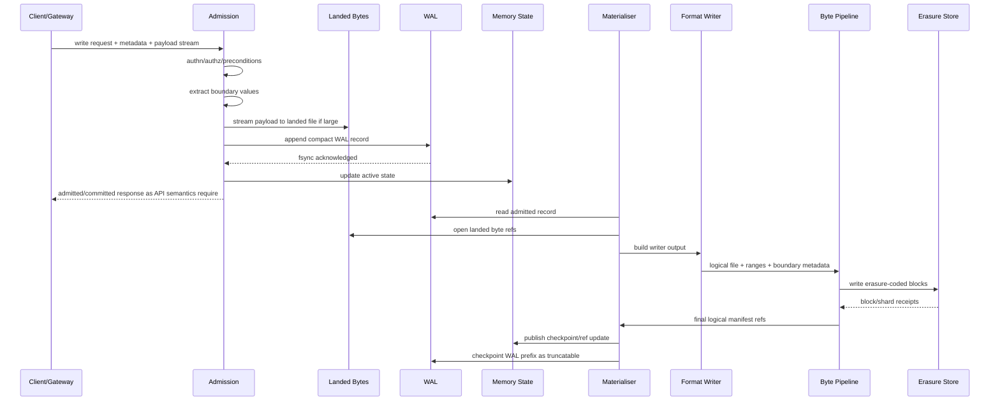
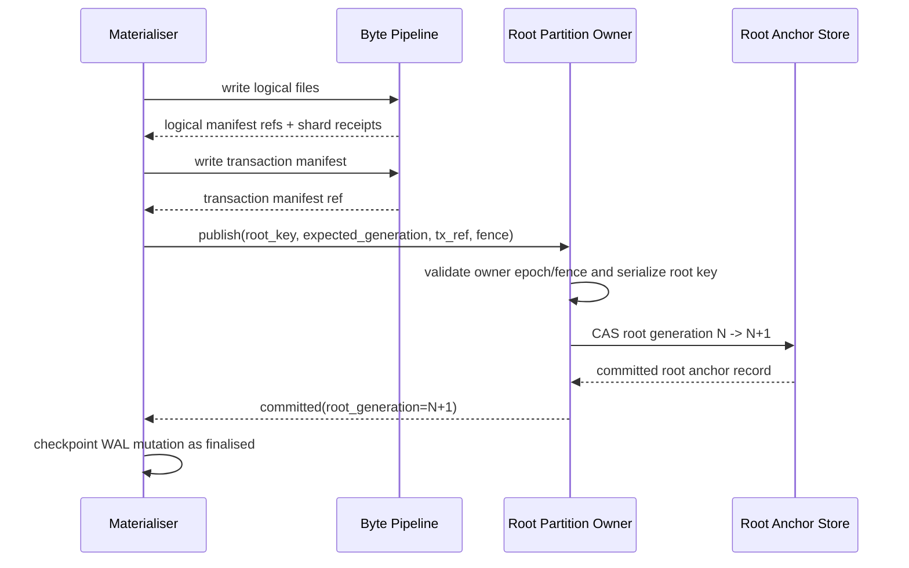
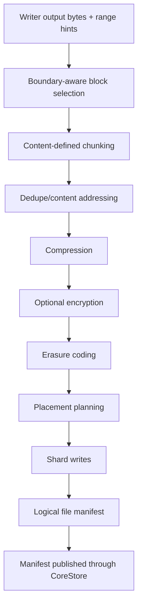
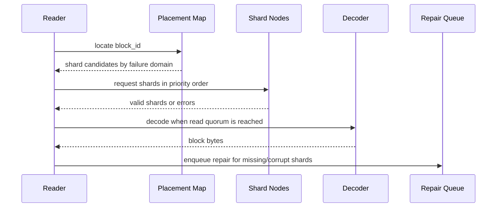
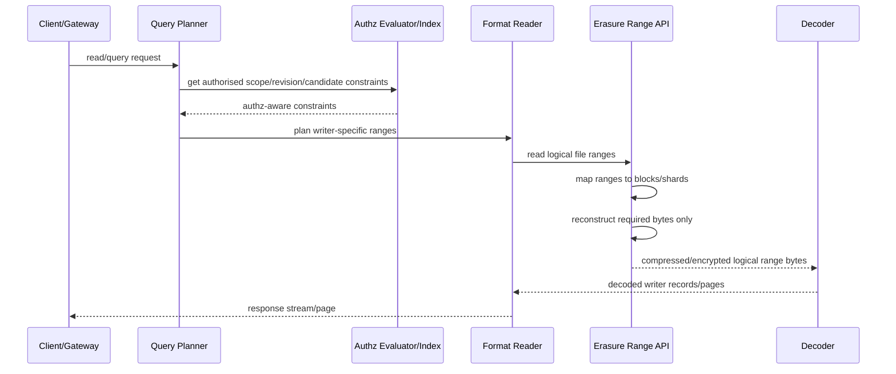

# ANVIL-0007: CoreStore Unified Storage Manifest

Status: Draft for implementation
Audience: Anvil implementors, operators, storage engineers
Scope: CoreStore storage architecture, file formats, write/read paths, observability, and performance gates

## 1. Summary

Anvil must have one durable storage substrate. Every durable byte, whether it is
an object payload, a mutable reference head, a stream record, a transaction, an
index segment, an authz tuple page, a PersonalDB snapshot, registry metadata, or
mesh control state, must eventually land in the same erasure-coded distributed
CoreStore block layer.

Feature-specific writers are allowed and required. They decide how to arrange
bytes for their own read paths. They do not own separate durability,
replication, quorum, or distribution systems. They emit logical binary files and
range metadata into the CoreStore byte pipeline. The byte pipeline performs
chunking, dedupe, compression, optional encryption, erasure coding, placement,
and manifest publication.

Fast writes are admitted through a bounded WAL plus landed byte files. The WAL is
for recovery and ordering, not for storing terabyte-scale payloads and not for
serving normal reads. Large bytes land locally once, are referenced by WAL
records, and are later materialised into final erasure-coded CoreStore blocks.
Recent WAL state is mirrored in memory so hot reads do not have to scan the disk
WAL.

Anvil tenants may store data for many application tenants, organisations,
customers, projects, or legal realms inside one bucket. Anvil therefore exposes a
user-defined boundary schema. Boundary dimensions tell Anvil which object or
record properties are meaningful for chunking, placement, compaction, query
pruning, and prefetching. Boundary dimensions are layout hints and planning
inputs. They are not authorisation grants.

This RFC is prescriptive. Implementors must not introduce sidecar durable JSON
files, feature-specific local stores, or independent replication mechanisms for
subsystems. Local temporary files, lock files, WAL files, and caches are allowed
only as non-final implementation mechanisms with explicit recovery semantics.

## 2. Goals

- Provide one final durable storage system for all Anvil features.
- Support very fast writes without putting large payloads inside the WAL.
- Recover safely after process, node, or machine failure.
- Allow format-aware writers to optimise binary structures for their readers.
- Route every writer output through one byte pipeline.
- Support object-level and range-level user-defined boundary metadata.
- Preserve efficient range reads over erasure-coded blocks.
- Support search, vector, log, authz, PersonalDB, registry, and mesh data without
  separate durable storage stacks.
- Include tracing and metrics from request entry through WAL, materialisation,
  writer output, byte pipeline, erasure coding, block placement, reads, and
  fsync.
- Define a repeatable performance baseline comparable to MinIO, S3-compatible
  object systems, and specialised systems used for logs/search where applicable.

## 3. Non-Goals

- Reimplement Kafka, Pulsar, Lucene, Tantivy, Elasticsearch, or any other
  external system. Anvil may adopt proven ideas from them but must keep a
  coherent CoreStore design.
- Require every writer to use the same file format. Writers produce different
  binary structures; the final storage substrate is unified.
- Treat S3 semantics as the core Anvil data model. S3 is one gateway.
- Use boundary metadata as an authorisation mechanism.
- Allow unbounded WAL growth.
- Allow durable feature state outside CoreStore final storage.

## 4. Normative Language

The words MUST, MUST NOT, REQUIRED, SHOULD, SHOULD NOT, and MAY are normative.

## 5. Architecture Overview

```text
                              API / gateway request
                    Native API | S3 | registry | admin | internal
                                      |
                                      v
                       authn, authz, validation, routing
                                      |
                                      v
+----------------------------------------------------------------------------+
| Fast write admission                                                       |
|----------------------------------------------------------------------------|
| - assign mutation id and idempotency context                               |
| - validate request preconditions                                           |
| - extract and validate boundary values                                     |
| - stream large bytes into landed byte files                                |
| - append compact WAL records referencing landed bytes                      |
| - update in-memory active state                                            |
+----------------------------------------------------------------------------+
                                      |
                    +-----------------+------------------+
                    |                                    |
                    v                                    v
        Bounded WAL records                     Landed byte files
        small, fsynced, replayable              content-addressed, checked
        no large payload bodies                 referenced by WAL records
                    |                                    |
                    +-----------------+------------------+
                                      |
                                      v
                            in-memory active state
              refs, stream heads, recent object versions, hot query deltas,
              pending materialisation cursors, boundary maps
                                      |
                                      v
+----------------------------------------------------------------------------+
| Materialisation engine                                                     |
|----------------------------------------------------------------------------|
| - reads admitted WAL records                                               |
| - consumes landed byte refs                                                |
| - invokes the responsible format-aware writer                              |
| - sends writer output to the unified byte pipeline                         |
| - publishes final manifests/refs/checkpoints                               |
| - truncates WAL only after final storage is durable                        |
+----------------------------------------------------------------------------+
                                      |
                                      v
+----------------------------------------------------------------------------+
| Format-aware writers                                                       |
|----------------------------------------------------------------------------|
| object blob | log stream | full text | vector | typed index | authz |       |
| PersonalDB | registry | mesh/control | future writer families              |
+----------------------------------------------------------------------------+
                                      |
                                      v
+----------------------------------------------------------------------------+
| Unified byte pipeline                                                      |
|----------------------------------------------------------------------------|
| boundary-aware block selection -> content-defined chunking -> dedupe ->     |
| compression -> optional encryption -> erasure coding -> placement ->        |
| final manifest publication                                                 |
+----------------------------------------------------------------------------+
                                      |
                                      v
                       Erasure-coded distributed block store
```

## 6. Storage Responsibility Boundary

CoreStore has three durability classes.

```text
Class A: final durable storage
  Everything that must survive and be queryable after materialisation.
  MUST be stored through the unified byte pipeline and erasure-coded block store.

Class B: recovery/admission storage
  WAL records and landed byte files. Used to recover admitted writes before
  final materialisation. Bounded and eventually truncatable/deletable.

Class C: local operational storage
  locks, pid files, local caches, process telemetry buffers, temporary build or
  upload scratch. Never authoritative.
```

Only Class A is the final source of truth. Class B may temporarily contain the
latest admitted writes, but only until materialisation checkpoints make the
corresponding final CoreStore state durable. Class C must be rebuildable or
expendable.

## 7. Local Directory Model

This is the only allowed local directory model. Names are illustrative; the
semantics are normative.

```text
<anvil-data>/
  admission/
    wal/
      active/
        wal-<node-id>-<epoch>-<seq>.anw
      sealed/
        wal-<node-id>-<epoch>-<seq>.anw
      checkpoints/
        checkpoint-<node-id>-<epoch>.json

    landed-bytes/
      sha256/
        <hh>/
          <hash>.landed
          <hash>.meta

  corestore/
    blocks/
      local-cache/
        <erasure-set-id>/
          shard-<shard-index>-<block-id>.anb
      # physical final shards owned by this node

    manifests-cache/
      # optional cache only. Final manifests are themselves CoreStore data.

    staging/
      locks/
      tmp/
      # non-authoritative local operational files

  telemetry/
    local-buffer/
      # optional, non-authoritative performance/event export buffer
```

MUST NOT exist as final durable stores:

```text
corestore/refs/*.json
corestore/streams/*.jsonl
corestore/transactions/*.json
corestore/manifests/*.json as the source of truth
feature-specific journals outside the unified substrate
```

A developer may use JSON inside WAL records, manifests, or writer payloads if the
format explicitly says so. The prohibition is on sidecar JSON files acting as a
separate final storage system.

### 7.1 Authoritative File/Record Inventory

Implementors must classify every persistent artifact in code review. The
following inventory is normative.

| Artifact | Class | Location | Authoritative? | Replicated? | Notes |
|---|---:|---|---:|---:|---|
| WAL frame file | B | `admission/wal/*` | temporary | by admission policy only | Recovery and ordering until materialised. |
| Landed byte file | B | `admission/landed-bytes/*` | temporary | no, unless policy elects mirrored landing | Large payload admission before final blocks. |
| WAL checkpoint | B | `admission/wal/checkpoints/*` | temporary | no | Derived from WAL and final manifests. |
| Logical file manifest | A | CoreStore block store | yes | yes | Stored as a CoreStore object, not as final local JSON. |
| Block shard file | A | `corestore/blocks/local-cache/*` or node-owned block path | yes for local shard | yes via erasure set | Physical shard for one erasure-coded block. |
| Object version manifest | A | writer logical file in CoreStore | yes | yes | Emitted by object writer. |
| Stream segment | A | writer logical file in CoreStore | yes | yes | Emitted by stream writer. |
| Index segment | A | writer logical file in CoreStore | yes | yes | Covers full-text, vector, typed metadata. |
| Authz tuple/revision segment | A | writer logical file in CoreStore | yes | yes | Same Zanzibar engine, reserved Anvil schema plus user schemas. |
| Registry catalog/blob metadata | A | writer logical file in CoreStore | yes | yes | Gateway state is data in CoreStore. |
| Mesh/region/node control state | A | writer logical file in CoreStore | yes | yes | No sidecar cluster database. |
| Root register shard | A-root | `corestore/blocks/register/*/generation-*/*.anr` | yes, pointer only | yes, root-register-r3 | Only mutable CoreStore anchor primitive; never feature payload/state. |
| Failover vote record | A-root | `corestore/blocks/register/*/votes/*/*.anfv` | yes for failover decision | yes, root-register quorum | Votes are control-plane safety records for root ownership. |
| Admission local receipt | B | `admission/wal/*` receipt metadata | temporary | profile-dependent | Required before commit certificate. |
| Admission mirror receipt | B | `admission/mirrors/*/receipts/*` | temporary | on mirror node | Required evidence for committed admission. |
| Replay claim | B | `admission/mirrors/*/receipts/*` | temporary | on claimant/mirror | Grants one replay fence after source loss. |
| Admission commit certificate | B | `admission/mirrors/*/receipts/*` and source WAL metadata | temporary | profile-dependent | Mandatory before a client-visible committed response. |
| Admission abort certificate | B | `admission/mirrors/*/receipts/*` | temporary | profile-dependent | Valid only when quorum proves the mutation never committed. |
| Admission mirror GC certificate | B | `admission/mirrors/*/receipts/*` | temporary | profile-dependent | Authorises deletion of mirror recovery artifacts. |
| Local cache | C | `corestore/*-cache`, `telemetry/*` | no | no | Rebuildable and expendable. |

Any new persistent artifact not listed here must be added to this table before
implementation. If the artifact is Class A, it must be written through the
unified byte pipeline. The only exception is Class A-root, the minimal root
register primitive that makes the first and latest CoreStore roots discoverable;
it is not available to feature writers and cannot store feature payloads, indexes,
streams, tuples, registry data, or application data.

## 8. Write Path

### 8.1 Write Admission Sequence



### 8.2 Admission Atomicity

A write is admitted only when:

1. request-level validation succeeds;
2. boundary extraction succeeds for all required dimensions;
3. landed bytes, if any, have been fully written and hash-verified;
4. the WAL record has reached the configured admission durability rule;
5. in-memory active state has been updated or can be rebuilt from the WAL.

If any of those fail, the write is not admitted. Partial landed bytes are garbage
collectable.

### 8.3 WAL Does Not Store Large Bytes

The WAL MUST store references to landed byte files or final CoreStore object
refs. It MUST NOT inline large payloads. The hard default maximum WAL record body
is 64 KiB. Implementations MAY set a lower limit. Raising the limit requires an
RFC update.

### 8.4 Native Write API Sketch

All gateways are adapters over the native write model. Gateways may hide fields
from their callers, but they must still produce this internal request.

```rust
pub struct CoreWriteRequest {
    pub request_id: RequestId,
    pub idempotency_key: Option<IdempotencyKey>,
    pub tenant: AnvilStorageTenantId,
    pub authz_scope: AuthzScope,
    pub family: WriterFamily,
    pub target: CoreTarget,
    pub headers: WriteHeaders,
    pub user_metadata: BTreeMap<String, String>,
    pub boundary_values: Vec<BoundaryValue>,
    pub preconditions: Vec<WritePrecondition>,
    pub body: WriteBody,
}

pub enum WriteBody {
    Empty,
    Bytes(Bytes),
    Stream(Box<dyn AsyncRead + Send + Unpin>),
    ExistingCoreRef(CoreRef),
}

pub enum WritePrecondition {
    ObjectVersionEquals(ObjectVersionId),
    ObjectAbsent,
    LinkTargetEquals(CoreRef),
    LeaseFence {
        lease_id: LeaseId,
        fence_token: u64,
        owner_principal: PrincipalId,
    },
    AuthzRevisionAtLeast(AuthzRevision),
}
```

The admission layer must convert each `CoreWriteRequest` into exactly one
admitted mutation or a clear rejection. It must not let a gateway bypass
boundary extraction, WAL admission, or writer selection.


### 8.5 Response States and Durability

Anvil distinguishes internal admission from externally visible durability.

```text
Received
  request entered the server, no durability promised.

Admitted
  internal state only. The local node has validated the request, written landed
  bytes, appended the WAL frame, and updated memory. No client-visible success
  may be returned at this state.

Committed
  safe response state for normal writes. Local WAL and landed bytes are fsynced,
  admission mirrors have returned durable receipts, and the mutation is
  recoverable after the loss tolerated by the configured admission profile, even
  if final materialisation has not completed.

Finalised
  the mutation is represented by final erasure-coded CoreStore blocks and a
  committed root anchor generation.
```

Default public write APIs return only after `Committed`. A caller may request
`wait_for_finalization=true`; then the response returns only after `Finalised` or
an explicit timeout while preserving idempotency.

### 8.6 Admission Profiles

The default production admission profile is `regional-2-of-3`:

```text
local WAL frame fsynced:           required
local landed bytes fsynced:        required for large bodies
remote WAL mirrors acknowledged:   1 of 2 peers
remote landed byte mirrors:        1 of 2 peers for referenced landed bytes
machine-loss guarantee:            survives loss of any one admission replica
```

Single-node admission is allowed only when `unsafe_single_node_admission=true` is
set in a development profile. Production builds and release tests must reject
that profile.

Landed byte durability is not optional for committed writes. Before a WAL frame
references landed bytes, the node must:

1. write the landed temp file;
2. verify length and hash;
3. fsync the landed temp file;
4. atomically rename to the final landed path;
5. fsync the landed directory;
6. mirror and verify according to the admission profile.

Mirror protocol:

```protobuf
service AdmissionMirrorService {
  rpc MirrorLandedBytes(MirrorLandedBytesRequest) returns (AdmissionMirrorReceipt);
  rpc MirrorWalFrame(MirrorWalFrameRequest) returns (AdmissionMirrorReceipt);
}

message AdmissionAttemptId {
  string mutation_id = 1;
  string root_anchor_key = 2;
  string root_key_hash = 3;
  string source_node_id = 4;
  uint64 source_wal_epoch = 5;
  uint64 source_wal_sequence = 6;
  string request_hash = 7;
  string admission_profile = 8;
  uint64 admission_profile_epoch = 9;
  repeated string selected_mirror_node_ids = 10;
}

enum AdmissionReceiptKind {
  ADMISSION_RECEIPT_UNSPECIFIED = 0;
  LOCAL = 1;
  MIRROR_LANDED_BYTES = 2;
  MIRROR_WAL_FRAME = 3;
  MIRROR_COMBINED = 4;
}

message AdmissionMirrorReceipt {
  string schema = 1;                 // anvil.admission.mirror_receipt.v1
  AdmissionAttemptId attempt_id = 2;
  AdmissionReceiptKind receipt_kind = 3;
  string mirror_node_id = 4;
  repeated string landed_byte_hashes = 5;
  repeated string descriptor_hashes = 6;
  string wal_frame_hash = 7;
  uint64 mirror_fsync_sequence = 8;
  uint64 received_at_unix_nanos = 9;
  string signed_payload_hash = 10;    // hash over attempt + receipt fields except signature
  bytes mirror_signature = 11;
}

message LocalAdmissionReceipt {
  string schema = 1;                 // anvil.admission.local_receipt.v1
  AdmissionAttemptId attempt_id = 2;
  repeated string landed_byte_hashes = 3;
  repeated string descriptor_hashes = 4;
  string wal_frame_hash = 5;
  uint64 local_wal_fsync_sequence = 6;
  uint64 local_landed_fsync_sequence = 7;
  string signed_payload_hash = 8;
  bytes source_signature = 9;
}

message MirrorLandedBytesRequest {
  AdmissionAttemptId attempt_id = 1;
  repeated LandedByteDescriptor landed_bytes = 2;
  string landing_id = 3;              // identifies which descriptor this chunk belongs to
  string descriptor_hash = 4;
  string chunk_hash = 5;
  uint64 chunk_ordinal = 6;
  bytes chunk = 7;                    // streaming transports send repeated chunks
  uint64 chunk_offset = 8;
  bool final_chunk = 9;
  bytes source_signature = 10;
}

message MirrorWalFrameRequest {
  AdmissionAttemptId attempt_id = 1;
  bytes wal_frame = 2;
  string wal_frame_hash = 3;
  repeated string landed_byte_hashes = 4;
  repeated string descriptor_hashes = 5;
  bytes source_signature = 6;
}

message LandedByteDescriptor {
  string landing_id = 1;
  string sha256 = 2;
  uint64 length = 3;
  string content_class = 4;
  string descriptor_hash = 5;
}

message AdmissionCommitCertificate {
  AdmissionAttemptId attempt_id = 1;
  LocalAdmissionReceipt local_receipt = 2;
  repeated AdmissionMirrorReceipt mirror_receipts = 3;
  uint64 committed_at_unix_nanos = 4;
  string signed_payload_hash = 5;
  bytes source_signature = 6;
}

message LocalAdmissionAbortReceipt {
  string schema = 1;                 // anvil.admission.local_abort_receipt.v1
  AdmissionAttemptId attempt_id = 2;
  string reason = 3;
  uint64 aborted_at_unix_nanos = 4;
  string signed_payload_hash = 5;
  bytes source_signature = 6;
}
```

A `Committed` response requires a signed `LocalAdmissionReceipt`, the remote
receipt count required by the admission profile, and a signed
`AdmissionCommitCertificate`. If the admitting node dies after `Committed` and
before `Finalised`, any mirror with the WAL frame, landed bytes, and commit
certificate may replay the mutation. Replay ownership is assigned by the mesh
partition owner for the affected root key; other mirrors must not publish root
updates directly.

`request_hash` is:

```text
request_hash = blake3(canonical(
  operation_family,
  writer_family,
  target,
  preconditions,
  user_metadata,
  boundary_values,
  body_descriptor_hashes,
  idempotency_key_hash))
```

The request hash includes hashes/descriptors for body bytes, not the body bytes
themselves. The same logical write through different gateways must produce the
same request hash after gateway normalisation.

Signed payload rules are fixed and non-recursive:

```text
AdmissionMirrorReceipt.signed_payload_hash =
  blake3(canonical(fields 1..9 of AdmissionMirrorReceipt))

LocalAdmissionReceipt.signed_payload_hash =
  blake3(canonical(fields 1..7 of LocalAdmissionReceipt))

LocalAdmissionAbortReceipt.signed_payload_hash =
  blake3(canonical(fields 1..4 of LocalAdmissionAbortReceipt))

AdmissionCommitCertificate.signed_payload_hash =
  blake3(canonical(attempt_id,
                   blake3(canonical(local_receipt fields 1..8)),
                   sorted blake3(canonical(mirror_receipt fields 1..10)),
                   committed_at_unix_nanos))
```

Signatures sign exactly the corresponding `signed_payload_hash`. Verifiers must
recompute each signed payload hash before checking signatures. Nested receipt
signatures remain embedded as evidence, but are not recursively included in the
parent certificate hash except through their signed payload hashes.

Mirror storage paths:

```text
admission/mirrors/<source-node-id>/<wal-epoch>/landed/<sha256>.landed
admission/mirrors/<source-node-id>/<wal-epoch>/wal/<20-digit-sequence>.awf
admission/mirrors/<source-node-id>/<wal-epoch>/receipts/<20-digit-sequence>.receipt
```

Mirror operations are idempotent. A duplicate chunk or WAL frame with the same
hash returns the original receipt. A duplicate with different bytes fails with
`IdempotencyConflict`. Mirrors fsync landed bytes, WAL frame files, and parent
directories before issuing a receipt. Receipts are signed by the mirror node key
and validated by the source before the write reaches `Committed`.

Peer selection uses rendezvous hashing over
`(attempt_id.mutation_id, attempt_id.root_key_hash, attempt_id.source_node_id,
attempt_id.source_wal_epoch, attempt_id.admission_profile_epoch)` and the current
healthy admission-mirror node set, excluding the source node. The selected peer
set is stored in `AdmissionAttemptId.selected_mirror_node_ids` and signed in
every receipt/certificate. Mirror GC may delete mirrored landed bytes and WAL frames only after
observing either a finalised root generation covering the mutation or a signed GC
certificate from the partition owner.

Replay claim after source loss:

```text
1. mirror detects source unavailable or receives recovery assignment;
2. mirror asks root partition owner for ReplayClaim with the full signed commit certificate;
3. owner verifies local receipt, mirror receipts, selected peer set, and committed quorum;
4. owner grants exactly one replay fence;
5. claimant materialises and publishes through normal root CAS;
6. other mirrors reject replay without the current replay fence.
```

Chunk ordering/idempotency:

```text
chunk key = (source_node_id, wal_epoch, wal_sequence, landing_id, chunk_ordinal)
chunk_hash = blake3(landing_id || chunk_offset || chunk_len || final_chunk || chunk bytes)
descriptor_hash = blake3(landing_id || sha256 || length || content_class)
```

A mirror accepts chunks in any order, writes each to a temporary chunk file, and
assembles the landed byte only after all byte ranges from `0..length` are present,
non-overlapping, and contiguous. Before issuing a receipt, the mirror recomputes
the assembled byte hash and verifies it equals the descriptor `sha256`; it also
verifies the descriptor hash and total length. Duplicate chunks with identical
`chunk_hash` are accepted idempotently; duplicates with different bytes fail with
`IdempotencyConflict`.

Receipt hash input:

```text
receipt_hash = blake3(canonical(AdmissionMirrorReceipt without mirror_signature))
local_receipt_hash = blake3(canonical(LocalAdmissionReceipt without source_signature))
commit_certificate_hash = blake3(canonical(AdmissionCommitCertificate without source_signature))
```

The source must persist the `AdmissionCommitCertificate` before returning
`Committed` to the client. A replay claim must include that certificate with full
embedded signed local and mirror receipts. The partition owner verifies the local
receipt signature, every mirror receipt signature, the selected mirror peer set,
the admission profile quorum rule, the request hash, the root key hash, and the
mutation id before issuing a `ReplayClaim`. A replay claim without this full
evidence is rejected with `ForbiddenByPolicy`.

Replay and GC messages:

```protobuf
message ReplayClaimRequest {
  AdmissionAttemptId attempt_id = 1;
  AdmissionCommitCertificate commit_certificate = 2;
  string claimant_node_id = 3;
}

message ReplayClaim {
  AdmissionAttemptId attempt_id = 1;
  string claimant_node_id = 2;
  uint64 replay_fence = 3;
  uint64 expires_at_unix_nanos = 4;
  string commit_certificate_hash = 5;
  bytes owner_signature = 6;
}

message AdmissionMirrorGcCertificate {
  AdmissionAttemptId attempt_id = 1;
  GcDecision decision = 2;
  optional uint64 finalised_root_generation = 3;
  optional string transaction_manifest_ref = 4;
  optional AdmissionCommitCertificate commit_certificate = 5;
  optional AdmissionAbortCertificate abort_certificate = 6;
  bytes owner_signature = 7;
}

enum GcDecision {
  GC_DECISION_UNSPECIFIED = 0;
  FINALISED = 1;
  ABORTED_BEFORE_COMMIT = 2;
}

message NegativeAdmissionReceipt {
  AdmissionAttemptId attempt_id = 1;
  string mirror_node_id = 2;
  uint64 checked_after_unix_nanos = 3;
  string reason = 4;              // no_wal_frame, no_landed_bytes, source_abort_seen
  string signed_payload_hash = 5;
  bytes mirror_signature = 6;
}

message AdmissionAbortCertificate {
  AdmissionAttemptId attempt_id = 1;
  optional LocalAdmissionAbortReceipt local_abort_receipt = 2;
  repeated NegativeAdmissionReceipt negative_receipts = 3;
  string reason = 4;
  string signed_payload_hash = 5;
  bytes partition_owner_signature = 6;
}
```

Replay, GC, negative receipt, and abort signatures use these payload hashes:

```text
NegativeAdmissionReceipt.signed_payload_hash =
  blake3(canonical(fields 1..4 of NegativeAdmissionReceipt))

AdmissionAbortCertificate.signed_payload_hash =
  blake3(canonical(attempt_id,
                   optional blake3(canonical(local_abort_receipt fields 1..5)),
                   sorted blake3(canonical(negative_receipt fields 1..5)),
                   reason))

ReplayClaim owner_signature payload =
  blake3(canonical(attempt_id, claimant_node_id, replay_fence,
                   expires_at_unix_nanos, commit_certificate_hash))

AdmissionMirrorGcCertificate owner_signature payload =
  blake3(canonical(attempt_id, decision, finalised_root_generation,
                   transaction_manifest_ref,
                   optional commit_certificate_hash,
                   optional abort_certificate_hash))
```

`abort_certificate_hash` is `blake3(canonical(AdmissionAbortCertificate fields
1..5))`. `commit_certificate_hash` is the value defined above. Owner signatures
must be verified against these exact hashes.

Mirrors store replay claims, commit certificates, abort certificates, and GC
certificates under the mirror receipt path. A mirror may delete mirrored WAL or
landed bytes only after:

1. a valid GC certificate with `FINALISED` and the final transaction manifest; or
2. a valid GC certificate with `ABORTED_BEFORE_COMMIT` and an
   `AdmissionAbortCertificate` proving that no `AdmissionCommitCertificate` can
   exist for the configured profile.

Abort proof rule: for `regional-2-of-3`, an abort certificate requires a source
local abort receipt created before client-visible commit plus negative receipts
from both selected mirror peers, or equivalent evidence that fewer than the
required mirror receipts could ever have existed. If the source node is lost
before it emits either a commit certificate or a local abort receipt, the mutation
is indeterminate and mirror artifacts must be retained for replay/repair; they
must not be garbage-collected by timeout.

A retention timeout alone is not sufficient to delete a mirrored mutation that
may have contributed to a committed quorum.

### 8.7 WAL Capacity and Backpressure


The WAL is bounded by both bytes and materialisation lag.

```text
wal_soft_limit_bytes        default 8 GiB per node
wal_hard_limit_bytes        default 12 GiB per node
wal_soft_lag_seconds        default 60 s
wal_hard_lag_seconds        default 300 s
landed_bytes_soft_limit     default 2x wal_soft_limit_bytes
landed_bytes_hard_limit     default 3x wal_soft_limit_bytes
```

At the soft limit, admission must apply backpressure by delaying or shedding
low-priority writes. At the hard limit, admission must reject new writes with
`ResourceExhaustedWalBacklog` until materialisation catches up. It must not
allow unbounded WAL or landed-byte growth.

### 8.8 Idempotency Outcomes

For a repeated idempotency key within the retention window:

```text
same request hash, state committed/finalised
  -> return the original successful response state.

same request hash, state in progress
  -> return in-progress with retry-after or wait if the API mode requested wait.

different request hash
  -> reject with IdempotencyConflict.

original transaction failed before admission
  -> allow retry as a new admission attempt.
```

The idempotency table is CoreStore data materialised by the control writer; the
hot in-memory copy is only a cache.

## 9. WAL Format

The WAL is a sequence of length-delimited frames. The frame format is binary so
recovery does not depend on line delimiters or partial JSON parsing.

```text
WAL file magic:  41 4e 57 41 4c 0a        # "ANWAL\n"
WAL version:     u16 little-endian         # initial value 1
File header:     WalFileHeader
Frames:          WalFrame*
File trailer:    optional WalFileTrailer when sealed
```

Frame layout:

```text
WalFrame =
  frame_magic        4 bytes     # "AWF1"
  header_len         u32-le
  payload_len        u64-le
  header_json        header_len bytes, UTF-8 JSON
  payload            payload_len bytes, usually empty or small
  crc32c             u32-le over frame_magic..payload
```

`payload_len` MUST be <= 64 KiB. Most records SHOULD have empty payload and put
all structured data in `header_json`.

Required `header_json` fields:

```json
{
  "schema": "anvil.core.wal_record.v1",
  "node_id": "node-a",
  "wal_epoch": 12,
  "sequence": 49152,
  "mutation_id": "01J...",
  "idempotency_key_hash": "sha256:...",
  "anvil_storage_tenant_id": "ast_...",
  "authz_scope": {"realm_id": "realm_...", "revision": "..."},
  "operation_family": "object.put",
  "writer_family": "object_blob",
  "target": {"bucket": "documents", "key": "2026/report.pdf"},
  "preconditions": [],
  "boundary_values": [
    {"dimension": "customer_tenant", "type": "uuid", "value": "..."}
  ],
  "landed_bytes": [
    {"sha256": "sha256:...", "length": 104857600, "landing_id": "..."}
  ],
  "created_at_unix_nanos": 1783426157854397000
}
```

Recovery MUST reject frames with invalid checksums, unknown required schema
versions, missing landed byte files for unmaterialised mutations, or invalid
boundary values.


### 9.1 WAL Header and Trailer

`WalFileHeader` layout:

```text
WalFileHeader =
  magic                 6 bytes      # "ANWAL\n"
  version               u16-le       # 1
  node_id_len           u16-le
  node_id               node_id_len UTF-8 bytes
  wal_epoch             u64-le
  first_sequence        u64-le
  created_at_unix_nanos u64-le
  header_crc32c         u32-le over all previous header bytes
```

`WalFileTrailer` layout when sealed:

```text
WalFileTrailer =
  magic                 8 bytes      # "ANWALT1\0"
  last_sequence         u64-le
  frame_count           u64-le
  wal_payload_bytes     u64-le
  sealed_at_unix_nanos  u64-le
  file_crc32c           u32-le over file header and frames
```

A WAL file without a valid trailer is active or crashed-open. Recovery must scan
frames until the first invalid or partial frame and truncate to the last valid
frame after quarantine metadata is recorded.

### 9.2 Canonical Record Encoding

WAL `header_json` uses canonical JSON:

- UTF-8 only;
- object keys sorted bytewise;
- no insignificant whitespace;
- integers encoded as decimal strings when wider than signed 53-bit;
- timestamps as unsigned nanoseconds since Unix epoch;
- hashes as lowercase `algorithm:hex` strings.

IDs and hashes follow this grammar:

```abnf
id-char       = ALPHA / DIGIT / "_" / "-"
node-id       = 1*128(id-char)
realm-id      = "realm_" 1*96(id-char)
bucket-name   = 1*255(%x21-2E / %x30-7E) ; excludes slash
object-key    = 1*4096(%x20-7E / UTF8-2 / UTF8-3 / UTF8-4)
hash-name     = "sha256" / "blake3"
hex-lower     = DIGIT / %x61-66
hash          = hash-name ":" 64hex-lower
mutation-id   = 16*64(id-char)
```

Validation failures use the common error envelope in section 20.1.

## 10. Landed Bytes

Landed bytes are written before WAL admission for large payloads.

```text
incoming payload stream
  -> <anvil-data>/admission/landed-bytes/sha256/<hh>/<hash>.landed.tmp
  -> rolling hash and length verification
  -> atomic rename to <hash>.landed
  -> write <hash>.meta with source request and boundary summary
  -> WAL references landing id/hash/length
```

The `.meta` file is recovery metadata, not final object metadata. It MUST include
only information needed to validate and clean landed bytes. The WAL remains the
admission source.

Garbage collection rules:

- landed bytes with no WAL reference after the recovery safety window MAY be
  deleted;
- landed bytes whose WAL mutation is fully materialised MAY be deleted;
- landed bytes whose hash or length does not match WAL MUST be quarantined and
  reported.

## 11. In-Memory State

The in-memory active state is the hot view of admitted but not necessarily fully
materialised data.

It MUST include:

- latest admitted ref values;
- stream heads and recent stream records;
- recent object versions and delete markers;
- landed-byte materialisation cursors;
- recent boundary value maps;
- pending index/authz/personaldb projection updates;
- WAL checkpoint position.

It MUST be rebuildable from WAL plus final manifests. It MUST NOT be the only
copy of committed state.

## 12. Materialisation Engine

The materialiser converts admitted mutations into final CoreStore structures.

```text
WAL cursor -> mutation planner -> writer invocation -> byte pipeline ->
manifest publication -> checkpoint -> WAL truncation
```

Materialisation MUST be idempotent. Replaying the same WAL mutation after a crash
must produce the same final logical result or detect the existing result by
mutation id/content hash.

Materialisation MUST expose backpressure to admission. If final storage cannot
keep up, admission must slow down or reject writes before WAL capacity is
exhausted.


## 13. CoreStore Root, Transactions, and Atomic Publication

Final storage is immutable except for a small set of versioned root anchors. A
root anchor is the only mutable CoreStore primitive. It is not a feature store;
it is the CoreStore commit pointer used by all writer families.

```text
logical files and manifests are immutable
  -> transaction manifest references new immutable files
  -> root anchor CAS publishes the transaction
  -> readers select a committed root generation
```

### 13.1 Root Anchor Key Space

Each root anchor is keyed by:

```text
RootAnchorKey = realm_id "/" root_kind "/" partition_id
root_kind     = "objects" | "streams" | "indexes" | "authz" | "personaldb" |
                "registry" | "mesh" | "core-control"
partition_id  = u64 decimal, assigned by the mesh partition map
root_key_hash = blake3("anvil-root-key-v1" || canonical_utf8(RootAnchorKey))
```

`root_key_hash` is the canonical 32-byte key used in register paths, register
shard headers, cohort hashes, failover votes, root owner epoch rows, trace
fields, and metrics. Implementations must not hash display/debug variants.

Root anchors are stored in the CoreStore control writer family and replicated
through the same erasure-coded block substrate. Implementations may keep a local
root cache, but the durable root value must be recoverable from CoreStore blocks
and WAL replay.

### 13.2 Root Anchor Record Format

```text
CoreRootAnchorRecord =
  magic                  8 bytes       # "ANROOT1\0"
  version                u16-le        # initial value 1
  header_len             u32-le
  body_len               u64-le
  header_cbor            header_len bytes, canonical CBOR map
  body_cbor              body_len bytes, canonical CBOR map
  crc32c                 u32-le over magic..body_cbor
```

Required `header_cbor` keys:

```text
schema                  = "anvil.core.root_anchor.v1"
root_anchor_key         = RootAnchorKey
root_generation         = u64
previous_root_hash      = sha256 or null
transaction_manifest    = ManifestRef or null only for genesis generation 0
checkpoint_manifest     = ManifestRef or null only for genesis generation 0
publisher_node_id       = NodeId
publisher_epoch         = u64
partition_owner_fence   = u64
created_at_unix_nanos   = u64
```

Required `body_cbor` keys:

```text
root_state              = "committed"
mutation_range          = { first: MutationId, last: MutationId }
writer_families         = [WriterFamily]
manifest_count          = u64
final_block_count       = u64
```

Root anchor records are content-addressed. A reader must reject a root anchor if
its checksum fails, its generation regresses, its `previous_root_hash` does not
match the previous committed root for the same key, or its partition owner fence
is stale for the mesh partition epoch.

### 13.3 Transaction Manifest

A transaction manifest is immutable CoreStore data that lists all logical file
manifests, ref changes, tombstones, and checkpoints produced by one admitted
mutation or one idempotent materialisation batch.

```text
TransactionManifest =
  magic                  8 bytes       # "ANXACT1\0"
  version                u16-le
  header_len             u32-le
  body_len               u64-le
  header_cbor            canonical CBOR
  body_cbor              canonical CBOR
  crc32c                 u32-le
```

Required body fields:

```text
mutation_ids            = [MutationId]
idempotency_key_hashes  = [Hash]
pre_root_generation     = u64
post_root_generation    = u64
logical_manifests       = [ManifestRef]
ref_updates             = [RefUpdate]
tombstones              = [Tombstone]
writer_checkpoints      = [WriterCheckpoint]
boundary_schema_refs    = [BoundarySchemaRef]
```

`RefUpdate` is:

```text
RefUpdate = {
  ref_key: string,
  expected_ref: ManifestRef | null,
  new_ref: ManifestRef | null,
  update_kind: "put" | "delete" | "link" | "checkpoint"
}
```

### 13.4 Publication Protocol



The CAS must be linearizable per `RootAnchorKey`. Two publishers racing on the
same root key must produce exactly one winner. The loser must re-read the current
root, re-plan against the new generation, and retry only if the operation remains
valid and idempotency permits it.

### 13.5 Partition Ownership and Fencing

The mesh partition map assigns each root partition to exactly one owner node per
membership epoch. The owner holds a monotonically increasing `partition_owner_fence`.
A root publication request must include the expected membership epoch and fence.
The owner must reject:

- stale membership epochs;
- stale fences;
- requests from non-owner nodes unless proxied through the owner;
- duplicate mutation ids with mismatched transaction content;
- expected root generations that do not match the current committed root.

Equal-node serialization is mandatory: all root updates for the same
`RootAnchorKey` are sequenced by that key's owner. Implementations must not rely
on wall-clock ordering.

### 13.6 Bootstrap

A new realm starts with a `core-control` root anchor at generation zero. Bootstrap
is executed below the public/admin API authorisation layer during node start only
when no valid system realm root exists. Bootstrap writes exactly one generation `0` root anchor for the system
`core-control` root. It does not write derived generation `0` roots for other
writer families. Those roots are created at generation `1` by the genesis
transition in section 13.12a.

Bootstrap is idempotent. If any genesis root anchor exists and verifies, bootstrap
must not create an alternative system realm.

### 13.7 Recovery States

```text
Prepared logical files, no transaction manifest
  -> garbage collect after safety window unless referenced by a later tx.

Transaction manifest exists, root CAS absent
  -> if mutation not acknowledged as finalised, retry publication;
     if preconditions no longer hold, mark failed and keep audit record.

Root CAS committed, acknowledgement lost
  -> idempotency lookup returns committed success.

Root CAS committed, WAL checkpoint absent
  -> rebuild checkpoint from root and transaction manifests, then truncate WAL.
```


### 13.8 Root Register Physical Protocol

Root anchors are published through the CoreStore root register. The register is a
CoreStore primitive, not a feature-specific side store. Its only job is to make a
small mutable chain discoverable after restart.

Register shard path on each selected node:

```text
corestore/blocks/register/
  <root-partition-id>/
    <root-key-hash-prefix>/
      <root-key-hash>/
        generation-<20-digit-generation>/
          shard-<0|1|2>.anr
```

`RootRegisterShard` layout:

```text
RootRegisterShard =
  magic                 8 bytes       # "ANREGRT1"
  version               u16-le
  root_partition_id     u64-le
  root_key_hash         32 bytes
  root_generation       u64-le
  shard_index           u16-le        # 0..2 for root-register-r3
  header_len            u32-le
  root_anchor_len       u64-le
  header_cbor           canonical CBOR
  root_anchor_record    CoreRootAnchorRecord bytes
  crc32c                u32-le over magic..root_anchor_record
  sha256                32 bytes over all previous bytes
```

The `header_cbor` includes:

```text
root_key_hash           Hash
root_generation         u64
register_cohort_nodes   [NodeId] sorted by shard_index
register_cohort_hash    blake3(canonical(root_key_hash, root_generation, register_cohort_nodes))
placement_epoch         u64
created_at_unix_nanos   u64
```

The root register profile is `root-register-r3`: three shard replicas in three
distinct cells where available, otherwise three distinct nodes. A root generation
is committed when at least two of three register shards contain the exact same
`root_anchor_record` hash, `register_cohort_hash`, and valid fsync receipts. A
third shard may be repaired asynchronously. A generation with no majority is not
committed and must not be used for reads.

### 13.9 Root CAS Algorithm

For `RootAnchorKey K`, partition owner `O` publishes generation `N+1` as follows:

```text
1. read_latest_committed(K) -> generation N, hash H
2. verify request.expected_generation == N
3. verify request.previous_root_hash == H
4. verify owner_epoch and partition_owner_fence are current
5. build CoreRootAnchorRecord for N+1
6. choose three register nodes using rendezvous(K, owner_epoch)
7. compute register_cohort_hash from root_key_hash, N+1, and selected nodes
8. write RootRegisterShard with create_new semantics to all three nodes
9. require two matching durable shard receipts
10. record committed generation N+1 in memory
11. return root_generation N+1 and root_anchor_hash
```

If a `create_new` detects an existing different shard for the same generation,
the owner reads all shards for that generation. If a majority exists, that
majority is the winner. If no majority exists, the generation is marked
`RootGenerationInDoubt`, repair is required, and publication for that root key
halts until an operator or automatic repair resolves it by majority evidence.

### 13.10 Root Discovery After Total Restart

On restart with empty memory:

```text
1. load local mesh genesis hints from bootstrap config;
2. scan register shard directories for all root partitions owned or cached;
3. exchange root-register inventories with peers in the mesh;
4. group shards by root_key_hash and generation;
5. choose highest generation with two matching valid shards;
6. verify previous_root_hash chain back to the latest checkpoint or genesis;
7. load transaction/checkpoint manifests referenced by the root;
8. rebuild in-memory root cache and partition-owner fences.
```

A node must not serve latest reads for a root key until step 6 succeeds. It may
serve reads at an explicitly requested older verified generation if policy allows
stale reads.

### 13.11 Fence Issuance and Failover

Partition owner fences are assigned by the mesh/control writer. The current mesh
root generation defines `(partition_id, owner_node_id, owner_epoch, fence)`. A
new owner may publish only after a mesh/control root update records the handoff.
The old owner must fail all publication attempts once it observes or is informed
of a higher owner epoch. If a partition owner is unreachable, failover is a
mesh/control mutation that itself uses the root-register protocol for the
`core-control` root partition.


### 13.12 Genesis CAS Protocol

Genesis uses the same root register but does not require a pre-existing mesh
owner. The bootstrap configuration defines:

```text
genesis_cluster_id
bootstrap_node_ids sorted bytewise
root_register_nodes = first three bootstrap nodes by rendezvous(genesis_cluster_id)
genesis_config_hash = blake3(canonical bootstrap config)
```

Any bootstrap node may propose generation `0` for the system `core-control` root.
The generation `0` record uses these canonical sentinel values:

```text
root_generation           = 0
previous_root_hash        = null
transaction_manifest      = null
checkpoint_manifest       = null
publisher_node_id         = "genesis"
publisher_epoch           = 0
partition_owner_fence     = 0
created_at_unix_nanos     = 0
mutation_range            = { first: "genesis", last: "genesis" }
writer_families           = ["mesh_control", "authz", "core_control"]
manifest_count            = 0
final_block_count         = 0
body_cbor.genesis_bundle  = canonical genesis bundle
```

The genesis bundle must also use `created_at_unix_nanos = 0`; runtime wall-clock
time is not part of generation `0`. Root-register shards for generation `0` use
create-new semantics. Outcomes:

```text
2 of 3 shards contain the same genesis hash
  -> genesis committed, all nodes adopt it.

existing 2 of 3 majority with same hash
  -> proposer adopts existing genesis.

any valid majority with a different hash
  -> node refuses to join with GenesisConfigConflict.

no majority
  -> node waits/retries; it must not create an alternative root.
```

Concurrent genesis is therefore safe only when all bootstrapping nodes have the
same canonical config. A different config cannot silently fork the system.


### 13.12a Genesis Bundle Format

Generation `0` of the system `core-control` root uses an embedded genesis bundle
instead of normal `transaction_manifest` and `checkpoint_manifest` refs. This is
the only allowed null-manifest root record. The `body_cbor` includes:

```text
genesis_bundle = {
  schema: "anvil.core.genesis_bundle.v1",
  genesis_config_hash: Hash,
  mesh_control_segment: MeshControlBody bytes,
  authz_reserved_schema_segment: AuthzBody bytes,
  initial_root_keys: [RootAnchorKey],
  initial_partition_map: [PartitionMapRow],
  created_at_unix_nanos: 0
}
```

The bundle is small enough to fit inside the root-register shard and is verified
by the same root-register majority. After genesis is committed, the first normal
materialisation pass writes the embedded mesh/authz bytes as ordinary CoreStore
logical manifests and publishes generation `1` with non-null
`transaction_manifest` and `checkpoint_manifest`. From generation `1` onward,
null manifest refs are invalid.

Genesis transition algorithm:

```text
1. discover committed generation 0 root-register majority;
2. load embedded genesis_bundle;
3. initialise in-memory mesh/authz state from bundle;
4. materialise bundle bytes into normal writer segments;
5. publish core-control generation 1 via root CAS;
6. mark generation 0 as genesis-only historical root.
```

### 13.12b Failover Vote Records

Root-register nodes persist failover votes next to register shards:

```text
corestore/blocks/register/<partition>/<root-key-hash>/votes/<target-generation>/<voter-node>.anfv
```

```text
FailoverVoteRecord =
  magic                 8 bytes       # "ANFOVT1\0"
  version               u16-le
  root_key_hash         32 bytes
  current_generation    u64-le
  current_root_hash     Hash
  target_generation     u64-le
  target_root_hash      Hash
  transaction_manifest_hash Hash
  register_cohort_hash  Hash
  observed_owner_node   string
  proposed_owner_node   string
  previous_owner_fence  u64-le
  proposed_owner_fence  u64-le
  evidence_hash         Hash
  voter_node_id         string
  vote_decision         u8            # 1 grant, 2 reject
  reason_code           string
  created_at_unix_nanos u64-le
  voter_signature       bytes
  crc32c                u32-le
```

One root-register node may write at most one grant vote per
`(root_key_hash,current_root_hash,target_generation,register_cohort_hash)`. It
may repeat the same vote idempotently, but must reject a conflicting vote with
`RootGenerationInDoubt`. The register cohort for the vote is pinned to the cohort
that stored the current committed root generation; failover does not change the
cohort until after the `N+1` core-control root is committed.

`OwnerFailoverRecord` embedded in the mesh/control transaction is:

```text
OwnerFailoverRecord =
  root_key_hash             Hash
  previous_generation       u64
  new_generation            u64
  old_owner_node_id         NodeId
  new_owner_node_id         NodeId
  old_owner_fence           u64
  new_owner_fence           u64
  current_root_hash         Hash
  target_root_hash          Hash
  transaction_manifest_hash Hash
  register_cohort_hash      Hash
  evidence_hash             Hash
  vote_record_hashes        [Hash]    # at least 2 matching grants
  decision                  "failover"
```

Failure evidence threshold for release: owner missed three consecutive health
probes over at least `failover_timeout_ms`, and at least two root-register nodes
independently observed or verified that evidence. Once two grant votes exist for
generation `N+1`, root-register nodes reject old-owner writes for generation
`N+1` or later with `StaleFenceToken`, even if the old owner returns before the
new root is fully published.

Root-register nodes must verify that the published generation `N+1` root anchor
hashes to `target_root_hash`, references `transaction_manifest_hash`, and embeds
the exact `OwnerFailoverRecord` covered by the grant votes. A mismatch is
`RootGenerationInDoubt`, not a best-effort conflict.

Root-register node state machine:

```text
FollowerHealthy -> SuspectOwner -> VoteGranted -> FailoverCommitted
                 -> VoteRejected -> FollowerHealthy
                 -> InDoubt      -> operator/repair resolution
```

### 13.13 Core-Control Owner Loss

The `core-control` root cannot depend on a failed owner to publish the mutation
that replaces that owner. Core-control failover is the only root update that may
be proposed by a non-owner, and it has a stricter register quorum.

```text
1. candidate observes owner missing for failover_timeout_ms;
2. candidate reads latest committed core-control root generation N;
3. candidate builds OwnerFailoverRecord selecting next owner by
   rendezvous(partition_id, active_nodes, N+1);
4. candidate asks root-register nodes for failover votes;
5. at least 2 of 3 root-register nodes verify the same latest root hash,
   failure evidence, and next-owner calculation;
6. candidate writes generation N+1 with root-register-r3 majority;
7. new owner fence = previous fence + 1;
8. old owner's later publications fail with StaleFenceToken.
```

`OwnerFailoverRecord` is stored inside the mesh/control segment and referenced by
the transaction manifest. The failure evidence is not trusted for authorisation;
it is a liveness input accepted only by root-register quorum for core-control
failover. Non-core-control partitions are moved by normal mesh/control mutations
once core-control ownership is healthy.

## 14. Core Types and Writer Interface

### 14.1 Normative Type Registry

The following types are normative. Implementors must not invent alternate
representations.

```text
ManifestRef =
  manifest_hash          Hash
  logical_file_id        LogicalFileId
  writer_family          WriterFamily
  writer_generation      u64

LogicalFileId = "lf_" 1*96(id-char)
BlockId       = "blk_" 1*96(id-char)
NodeId        = node-id
RegionId      = "r_" 1*64(id-char)
CellId        = "c_" 1*64(id-char)

WriterFamily =
  "object_blob" | "stream" | "full_text" | "vector" | "typed_index" |
  "authz" | "personaldb" | "registry" | "mesh_control" | "core_control"

BoundaryValue =
  dimension_id           u32-le
  dimension_name         string
  value_type             u8
  canonical_value        TypedValue

ByteSource =
  InlineBytes(bytes) | LandedBytes(landing_id, hash, length) |
  TempFile(path, hash, length) | ExistingCoreRef(ManifestRef)

PipelinePolicy =
  erasure_profile_id     string
  compression            "none" | "zstd"
  encryption             "none" | "aes_gcm_siv"
  target_block_size      u64
  boundary_mode          "honour" | "prefer" | "ignore_for_diagnostic_only"

TraceContext =
  trace_id               string
  parent_span_id         optional<string>
  request_id             string
  sampled                bool
```

### 14.2 Writer Interface

Every format-aware writer implements the same conceptual interface.

```rust
pub trait CoreFormatWriter {
    fn family(&self) -> WriterFamily;

    fn plan(&self, input: WriterPlanInput) -> Result<WriterPlan>;

    fn build(&self, input: WriterBuildInput) -> Result<Vec<LogicalFileWrite>>;

    fn recover(&self, input: WriterRecoveryInput) -> Result<WriterRecoveryPlan>;
}
```

`LogicalFileWrite` is the writer output passed to the byte pipeline:

```rust
pub struct LogicalFileWrite {
    pub logical_file_id: LogicalFileId,
    pub writer_family: WriterFamily,
    pub writer_generation: u64,
    pub bytes: ByteSource,
    pub ranges: Vec<LogicalRangeHint>,
    pub durability_class: DurabilityClass,
    pub compaction_policy: CompactionPolicy,
    pub read_profile: ReadProfile,
}
```

`LogicalRangeHint` carries writer and user boundary metadata:

```rust
pub struct LogicalRangeHint {
    pub byte_start: u64,
    pub byte_end: u64,
    pub writer_record_kind: String,
    pub boundary_values: Vec<BoundaryValue>,
    pub statistics: RangeStatistics,
    pub preferred_block_boundary: BoundaryStrength,
    pub prefetch_group: Option<String>,
}
```

A writer MUST NOT write authoritative files directly to local disk. It may create
temporary build files as Class C operational storage, but final writer output
must enter the byte pipeline as a `LogicalFileWrite`.

## 15. Writer Families

### 15.1 Object Blob Writer

The object blob writer stores opaque object bytes and object version manifests.
It must support efficient full reads, range reads, dedupe, object versioning, and
delete markers.

```text
object version
  -> content-defined chunk map where useful
  -> adaptive block map
  -> object version manifest
  -> logical file write(s)
  -> byte pipeline
```

Required read operations:

- get full object;
- get byte range;
- head object;
- list object versions by key/prefix;
- resolve aliases/links to object versions.

Required writer metadata:

- object key;
- object version id;
- content type;
- user metadata hash;
- boundary values;
- block map suitable for range reads;
- dedupe references.

### 15.2 Log / Stream Writer

The log writer stores ordered records. It must take proven ideas from Kafka and
Pulsar: append-friendly ledgers, sealed immutable segments, sequence/time
indexes, and cursor-based reads.

```text
stream family / partition
  -> active segment descriptor in memory + WAL
  -> append records
  -> sparse sequence index
  -> sparse timestamp index
  -> sealed immutable segment logical file
  -> segment manifest ref
```

Required operations:

- append record;
- read from sequence/cursor;
- tail stream;
- seal segment;
- compact stream family where configured;
- recover active head from WAL and sealed segment manifests.

Segment binary layout:

```text
StreamSegment =
  magic              8 bytes   # "ANSTRM\n\0"
  version            u16-le
  header_len         u32-le
  header_json        header_len bytes
  record_count       u64-le
  record_frame*      repeated
  index_len          u64-le
  index_bytes        StreamSparseIndex bytes
  trailer_len        u32-le
  trailer_json       trailer_len bytes
  segment_sha256     32 bytes over all previous bytes
```

Each `record_frame`:

```text
RecordFrame =
  sequence           u64-le
  timestamp_nanos    i64-le
  header_len         u32-le
  payload_len        u64-le
  header_json        header_len bytes
  payload            payload_len bytes
  crc32c             u32-le
```

Sparse stream index layout:

```text
StreamSparseIndex =
  magic              8 bytes   # "ANSSIX1\0"
  sequence_count     u32-le
  sequence_entry*    sorted by first_sequence
  timestamp_count    u32-le
  timestamp_entry*   sorted by first_timestamp_nanos
  crc32c             u32-le

sequence_entry =
  first_sequence     u64-le
  record_ordinal     u32-le
  byte_offset        u64-le

timestamp_entry =
  first_timestamp_nanos i64-le
  record_ordinal        u32-le
  byte_offset           u64-le
```

Stream reader algorithm:

```text
read_from_sequence(S):
  find greatest sequence_entry.first_sequence <= S
  seek to byte_offset
  scan RecordFrame until sequence >= S
  return frames until limit/end
```

### 15.3 Full-Text Writer

The full-text writer must produce search-engine structures, not generic scanned
JSON. It should adopt proven structures from Lucene/Tantivy-style engines.

```text
text delta
  -> analyser/tokeniser
  -> term dictionary block(s)
  -> postings block(s)
  -> skip data / block max data
  -> stored fields / doc values if needed
  -> segment manifest
```

Required operations:

- term query;
- boolean AND/OR/NOT planning;
- phrase query where analyser supports positions;
- field-scoped query;
- authz-aware candidate pruning;
- boundary-aware range pruning;
- stable pagination.

The reader must fetch only relevant dictionary/postings/doc-value ranges.

### 15.4 Vector Writer

The vector writer stores vector indexes such as HNSW graph layers and associated
metadata filters.

```text
vector delta
  -> vector data blocks
  -> graph layer blocks
  -> entrypoint metadata
  -> metadata filter blocks
  -> segment manifest
```

Required operations:

- nearest-neighbour query;
- metadata/boundary pre-filter or post-filter according to index capability;
- authz-aware candidate pruning;
- incremental segment creation;
- compaction/merge.

Production embedding generation is outside CoreStore. CoreStore stores vectors
and vector index structures. Test-only deterministic embeddings MUST NOT be the
production path.

### 15.5 Typed / Metadata Index Writer

The typed index writer stores structured fields with type semantics.

```text
typed field delta
  -> field dictionary
  -> typed column pages
  -> range/sort pages
  -> bitmap pages where useful
  -> page statistics
  -> stable pagination metadata
```

Required query support:

- equality;
- range;
- set membership;
- ordering;
- stable pagination tokens;
- boundary pruning;
- authz pruning.

### 15.6 Authz Writer

The authz writer stores Zanzibar tuples, schema revisions, relation indexes, and
derived userset data. It is the single authz storage implementation for Anvil
system realms and user realms.

```text
authz mutation
  -> tuple delta segment
  -> schema revision segment
  -> userset expansion block
  -> reverse lookup block
  -> revision checkpoint
```

Required properties:

- all checks are revision-aware;
- list-object/list-subject queries use the same semantics as permission checks;
- tuple writes are atomic according to the API contract;
- public APIs cannot read/write reserved Anvil system realms;
- admin APIs are authorised through the system realm.

### 15.7 PersonalDB Writer

The PersonalDB writer stores changesets, snapshots, witness state, and projection
materialisations.

```text
PersonalDB commit
  -> changeset segment
  -> witness decision record
  -> snapshot/checkpoint logical file when due
  -> projection materialisation block
```

Required properties:

- witness decisions are durable and idempotent;
- snapshots are range-readable where possible;
- projections are maintained through watch/materialisation, not external DBs;
- recovery can replay changesets and checkpoints.

### 15.8 Registry Writer

Registry gateways for container images, Rust crates, npm, Maven, Python, or
other package systems must emit package-specific structures through CoreStore.

```text
registry mutation
  -> repository metadata block
  -> package version manifest
  -> tag/link record
  -> asset blob ref
  -> search/catalog index update
```

The registry writer must not make S3 naming assumptions part of CoreStore.

### 15.9 Mesh / Control Writer

Mesh, region, cell, node, routing, placement, and lifecycle state is CoreStore
data.

```text
mesh control mutation
  -> control log segment
  -> descriptor block
  -> routing index block
  -> lifecycle checkpoint
```

This state must be stored through the same final substrate. Bootstrap may create
initial admission/control state, but not a permanent separate store.


### 15.10 Common Writer Segment Envelope

Every writer-owned binary segment uses this envelope unless a section defines a
stricter format.

```text
WriterSegment =
  magic                 8 bytes
  version               u16-le
  flags                 u16-le
  header_len            u32-le
  body_len              u64-le
  range_index_len       u64-le
  trailer_len           u32-le
  header_cbor           canonical CBOR
  body_bytes            writer-specific bytes
  range_index_bytes     canonical binary range index
  trailer_cbor          canonical CBOR
  segment_hash          32 bytes blake3 over magic..trailer_cbor
```

Common `header_cbor` fields:

```text
schema                  writer schema string
logical_file_id         LogicalFileId
writer_family           WriterFamily
writer_generation       u64
boundary_schema_refs    [BoundarySchemaRef]
min_record_key          optional bytes/string
max_record_key          optional bytes/string
created_at_unix_nanos   u64
```

`range_index_bytes` is a sorted table:

```text
RangeIndexEntry =
  logical_start         u64-le
  logical_end           u64-le
  record_count          u64-le
  boundary_value_count  u16-le
  boundary_values       repeated BoundaryValueRef
  min_key_len           u16-le
  min_key               bytes
  max_key_len           u16-le
  max_key               bytes
  stats_ref_len         u16-le
  stats_ref             bytes
```

### 15.11 Common Table Encoding

A writer segment `body_bytes` begins with a table directory when the body contains
more than one table.

```text
WriterBodyTableDirectory =
  magic                 8 bytes       # "ANTDIR1\0"
  version               u16-le
  table_count           u16-le
  table_entry*          sorted by table_id
  directory_crc32c      u32-le

TableDirectoryEntry =
  table_id              u16-le
  row_type_id           u16-le
  offset                u64-le        # from start of body_bytes
  length                u64-le
  page_count            u32-le
  min_key_len           u16-le
  min_key               bytes
  max_key_len           u16-le
  max_key               bytes
  table_hash            Hash
```

`offset + length` must be within `body_bytes`. Table ranges must not overlap.
A reader must verify the directory checksum, table hashes, and page checksums
before returning rows. Unknown required table ids make the segment unreadable;
unknown optional table ids are skipped only when the segment flags mark them
optional.

For every table in this RFC, `row_type_id` MUST equal `table_id`. The row layout
is selected by `table_id`; repeated use of the same row shape in multiple writer
families intentionally receives different ids so table identity remains enough to
decode the bytes. Future RFCs may add distinct row type ids only by updating this
section and the numeric registry.

Writer tables use this page format unless a stricter table format is specified.
All integers are little-endian. Lengths are unsigned LEB128 when rows are
variable-width and fixed-width integers where the layout names `u32-le` or
`u64-le`.

```text
TablePage =
  magic                 8 bytes       # writer/table specific
  version               u16-le
  flags                 u16-le
  key_schema_id         u16-le
  row_count             u32-le
  min_key_len           u16-le
  min_key               bytes
  max_key_len           u16-le
  max_key               bytes
  row_offsets           row_count * u32-le
  row_bytes             concatenated rows
  page_crc32c           u32-le over magic..row_bytes
  page_hash             32 bytes blake3 over magic..page_crc32c
```

Rows in a page are sorted by the table-specific key. Page tables in a segment are
sorted by `min_key`. Readers binary search page tables, then row offsets. A page
whose checksum/hash fails is corrupt and must not be partially read.

Common value encoding:

```text
string          = uleb128 byte_len, UTF-8 bytes
bytes           = uleb128 byte_len, raw bytes
hash            = 1 byte algorithm id, 32 bytes value for sha256/blake3
bool            = 0x00 false, 0x01 true
optional<T>     = 0x00 absent | 0x01 present followed by T
tombstone       = u8 tombstone_kind, u64-le visible_from_generation
revision_range  = u64-le start_generation, u64-le end_generation_or_u64_max
```

Version visibility rule: if a row has a `revision_range`, it is visible for a
read generation `G` when `start_generation <= G < end_generation_or_u64_max`.
Compaction may physically remove rows only after no retained read generation can
observe them.

Common referenced binary types:

```text
BoundaryValueRef =
  dimension_id           u32-le
  value_type             u8
  value_len              uleb128
  value_bytes            bytes       # canonical encoding for value_type

ManifestRangeRef =
  manifest_ref_len       u16-le
  manifest_ref           bytes
  range_id_len           u16-le
  range_id               bytes
  byte_start             u64-le
  byte_end               u64-le

TypedValue =
  type_id                u8          # 1 string,2 bytes,3 bool,4 i64,5 u64,6 f64,7 decimal,8 timestamp,9 uuid,10 hash,11 enum
  value_len              uleb128
  value_bytes            canonical bytes
```

Canonical typed value ordering is bytewise over `(type_id, normalized value)`,
where signed integers are biased by flipping the high bit, floating point values
use sortable IEEE-754 encoding with NaN rejected, timestamps are signed
nanoseconds, UUIDs are 16 raw bytes, and strings are UTF-8 NFC normalized.

### 15.12 Object Segment Format

Object version manifests use magic `ANOBJM1\0` and describe content blocks for one
object version.

```text
ObjectVersionBody =
  object_header
  chunk_entry_count u64-le
  chunk_entry*      sorted by logical offset
  metadata_len      u32-le
  metadata_cbor     canonical CBOR
  link_count        u32-le
  link_record*
```

`chunk_entry` layout:

```text
ObjectChunkEntry =
  logical_offset          u64-le
  logical_length          u64-le
  plaintext_hash          hash
  pipeline_block_id_len   u16-le
  pipeline_block_id       bytes
  compression_id          u8        # 0 none, 1 zstd
  encryption_id           u8        # 0 none, 1 aes-gcm-siv
  dedupe_generation       u64-le
  block_ref_count_hint    u32-le
```

`link_record` layout:

```text
LinkRecord =
  link_name               string
  target_object_version   string
  visible_revision_range  revision_range
```

Range reads binary search `chunk_entry` by byte offset and fetch only overlapping
CoreStore ranges. Deletes are tombstone manifests with the same object key and a
higher version id. Compaction may rewrite chunk maps but must preserve visible
version ordering and must keep tombstones until no retained read generation can
observe the deleted version.

### 15.13 Full-Text Segment Format

Full-text segments use magic `ANFTSG1\0`.

```text
FullTextBody =
  field_catalog
  analyser_catalog
  term_dictionary_block
  postings_block_table
  position_block_table
  doc_values_table
  stored_field_table
  delete_bitmap_ref
```

The term dictionary is sorted by `(field_id, term_bytes)` and stores fence keys
for range pruning.

```text
TermDictionaryRow =
  field_id                u32-le
  term_len                u16-le
  term_bytes              bytes
  doc_freq                u64-le
  postings_block_ref      ManifestRangeRef
  positions_block_ref     optional<ManifestRangeRef>
  min_doc_id              u64-le
  max_doc_id              u64-le

PostingsBlockRefRow =
  field_id                u32-le
  term_len                u16-le
  term_bytes              bytes
  postings_ref            ManifestRangeRef
  min_doc_id              u64-le
  max_doc_id              u64-le
  visible_revision_range  revision_range

PostingsBlock =
  magic                   8 bytes # "ANPOST1\0"
  doc_count               u32-le
  first_doc_id            u64-le
  doc_id_deltas           uleb128 repeated
  term_freqs              uleb128 repeated
  skip_entry_count        u32-le
  skip_entries            (doc_ordinal u32-le, byte_offset u32-le)*
  crc32c                  u32-le
```

Doc values are sorted by `(field_id, encoded_value, doc_id)` for filter/order
queries. The reader resolves the query to dictionary ranges, reads
postings/doc-value ranges, intersects with authz and boundary candidate sets,
then fetches stored fields only for the final page. It must not scan source
objects for normal term, boolean, phrase, or field queries.

### 15.14 Vector Segment Format

Vector segments use magic `ANVECG1\0`.

```text
VectorBody =
  vector_header
  vector_block_table
  hnsw_layer_table
  entrypoint_table
  id_map_table
  typed_filter_block_table
  delete_bitmap_ref
```

Vectors are stored in fixed-dimension blocks. HNSW graph layers are stored as
range-addressable adjacency blocks.

```text
VectorBlockRow =
  vector_id               u64-le
  dimension               u16-le
  element_type            u8        # 1 f32, 2 f16, 3 i8-quantized
  vector_bytes            dimension * element_width
  boundary_ref            u32-le
  visible_revision_range  revision_range

HnswAdjacencyRow =
  layer                   u16-le
  vector_id               u64-le
  neighbour_count         u16-le
  neighbour_ids           neighbour_count * u64-le
```

`typed_filter_block_table` is a CoreStore block table, not a sidecar store; it
contains boundary/authz/filter bitsets keyed by the same document ids used by
vector blocks. Query planning applies boundary and authz candidate sets before
graph expansion where the index supports it, and must report when post-filtering
was required.

### 15.15 Typed / Metadata Index Segment Format

Typed index segments use magic `ANTIDX1\0`.

```text
TypedIndexBody =
  field_catalog
  sorted_column_block_table
  bitmap_block_table
  range_fence_table
  order_tuple_table
  delete_bitmap_ref
```

Fields have explicit types: string, bytes, bool, i64, u64, f64, decimal,
timestamp nanoseconds, uuid, hash, and enum string.

```text
SortedColumnRow =
  field_id                u32-le
  encoded_value           TypedValue
  object_doc_id           u64-le
  visible_revision_range  revision_range

BitmapBlockRow =
  field_id                u32-le
  encoded_value_hash      hash
  roaring_bitmap_bytes    bytes

OrderTupleRow =
  tuple_key               bytes      # concatenated typed sort values
  object_doc_id           u64-le
  tie_breaker             bytes
```

Range predicates use `range_fence_table` to select sorted column blocks. Equality
and `IN` predicates use bitmap blocks. Ordered pagination uses `order_tuple_table`;
page tokens carry the last sort tuple and index generation.

### 15.16 Authz Segment Format

Authz segments use magic `ANAUTH1\0` and store the single Zanzibar implementation
used by Anvil internal realms and user-defined realms.

```text
AuthzBody =
  schema_descriptor_table
  tuple_block_table
  relation_rule_table
  userset_edge_block_table
  caveat_descriptor_table
  revision_log_table
  list_objects_index_table
  list_subjects_index_table
```

Tuple table rows are sorted by `(realm_id, object_namespace, object_id,
relation, subject_key, revision_start)`.

```text
AuthzTupleRow =
  realm_id                string
  object_namespace        string
  object_id               string
  relation                string
  subject_kind            u8        # 1 entity, 2 userset
  subject_namespace       string
  subject_id              string
  subject_relation        optional<string>
  caveat_ref              optional<ManifestRangeRef>
  visible_revision_range  revision_range
```

Relation-rule rows are sorted by `(realm_id, schema_generation, namespace,
relation)`. Userset edge rows are sorted for both check traversal and
list-object/list-subject traversal. Anvil's reserved realm is stored in this same
format but can be modified only by server-internal bootstrap or authorised admin
operations. Public APIs cannot write reserved authz paths directly. Tuple writes
create new revision records; checks and list operations execute against a named
or latest revision. Compaction may merge tuple blocks but must preserve revision
visibility until retention expires.

### 15.17 PersonalDB Segment Format

PersonalDB segments use magic `ANPDB1\0`.

```text
PersonalDbBody =
  group_descriptor
  changeset_block_table
  snapshot_page_table
  projection_page_table
  witness_record_table
  owner_transfer_table
```

Changeset rows are sorted by `(group_id, actor_id, sequence)`.

```text
PersonalDbChangesetRow =
  group_id                string
  actor_id                string
  actor_sequence          u64-le
  dependency_count        u16-le
  dependencies            (actor_id string, sequence u64-le)*
  changeset_hash          hash
  payload_ref             ManifestRangeRef
  visible_revision_range  revision_range

WitnessRecordRow =
  group_id                string
  witness_epoch           u64-le
  committed_sequence      u64-le
  owner_node_id           string
  owner_fence             u64-le
  signature               bytes
```

Snapshot and projection pages are derived logical files. Witness and
owner-transfer records are first-class CoreStore data so node handoff and replay
are recoverable without a separate coordination store.

### 15.18 Registry Segment Format

Registry segments use magic `ANREG1\0`.

```text
RegistryBody =
  namespace_table
  package_table
  version_table
  blob_descriptor_table
  tag_or_dist_ref_table
  credential_policy_ref_table
```

Table mapping:

```text
namespace_table              -> NamespaceRow, key (registry_kind, namespace)
package_table                -> PackageRow, key (registry_kind, namespace, package_name)
version_table                -> PackageVersionRow, key (registry_kind, namespace, package_name, version_or_digest)
blob_descriptor_table        -> BlobDescriptorRow, key (digest)
tag_or_dist_ref_table        -> RegistryRefRow, key (registry_kind, namespace, package_name, ref_name)
credential_policy_ref_table  -> CredentialPolicyRow, key (registry_kind, namespace, principal, relation)
```

Registry rows are sorted by `(registry_kind, namespace, package, version,
record_kind)`.

```text
PackageVersionRow =
  registry_kind           u8        # docker,maven,npm,pypi,cargo
  namespace               string
  package_name            string
  version_or_digest       string
  manifest_ref            ManifestRangeRef
  published_at_unix_nanos u64-le
  visible_revision_range  revision_range

RegistryRefRow =
  registry_kind           u8
  namespace               string
  package_name            string
  ref_name                string     # tag, dist-tag, alias, channel
  target_version_or_digest string
  visible_revision_range  revision_range
```

Docker, Maven, npm, Python, Rust, and future package gateways map protocol
metadata into this segment format. Gateway-specific naming must stay in the
gateway adapter and registry writer metadata. CoreStore sees packages, versions,
blobs, tags, aliases, credentials, and policy refs as typed registry records.

### 15.19 Mesh / Control Segment Format

Mesh/control segments use magic `ANMESH1\0`.

```text
MeshControlBody =
  region_table
  cell_table
  node_table
  partition_map_table
  root_owner_epoch_table
  lifecycle_event_table
  repair_finding_table
  anti_entropy_checkpoint_table
```

Table mapping:

```text
region_table                    -> RegionRow, key (region_id, effective_epoch)
cell_table                      -> CellRow, key (region_id, cell_id, effective_epoch)
node_table                      -> NodeRow, key (region_id, cell_id, node_id, effective_epoch)
partition_map_table             -> PartitionMapRow, key (partition_id, owner_epoch)
root_owner_epoch_table          -> RootOwnerEpochRow, key (root_key_hash, owner_epoch)
lifecycle_event_table           -> LifecycleEventRow, key (event_id)
repair_finding_table            -> RepairFindingRow, key (finding_id)
anti_entropy_checkpoint_table   -> AntiEntropyCheckpointRow, key (partition_id, scanner_node_id)
```

Mesh rows are sorted by `(record_kind, region_id, cell_id, node_id,
effective_epoch)`.

```text
NodeRow =
  region_id               string
  cell_id                 string
  node_id                 string
  state                   u8        # joining, active, draining, removed
  capacity_bytes          u64-le
  advertised_addr         string
  effective_epoch         u64-le

PartitionMapRow =
  partition_id            u64-le
  owner_node_id           string
  owner_epoch             u64-le
  owner_fence             u64-le
  replica_node_count      u16-le
  replica_node_ids        string repeated

RootOwnerEpochRow =
  root_key_hash           Hash
  owner_node_id           string
  owner_epoch             u64-le
  owner_fence             u64-le
  register_cohort_hash    Hash
```

Cells usually correspond to racks or equivalent failure domains. Partition maps
assign root anchor ownership, placement responsibility, and routing. Draining a
node, draining a cell, adding a region, and moving a bucket are lifecycle events
stored in this format and published through root anchor CAS.

### 15.20 Writer Table Row Registry

Every table named in writer body diagrams uses `TablePage` from section 15.11.
The row schemas are:

```text
ObjectHeader =
  bucket string, key string, object_version string, content_type string, content_length u64-le, user_metadata_hash Hash, created_at_unix_nanos u64-le, visible_revision_range revision_range

PositionBlockRow =
  field_id u32-le, term bytes, doc_id u64-le, positions uleb128 repeated, visible_revision_range revision_range

FieldCatalogRow =
  field_id u32-le, field_name string, field_type u8, analyser_id optional<u32-le>, flags u32-le

AnalyserCatalogRow =
  analyser_id u32-le, analyser_name string, config_hash hash, config_ref optional<ManifestRangeRef>

StoredFieldRow =
  doc_id u64-le, field_id u32-le, value TypedValue, visible_revision_range revision_range

DocValueRow =
  field_id u32-le, value TypedValue, doc_id u64-le, visible_revision_range revision_range

DeleteBitmapRow =
  generation u64-le, roaring_bitmap_bytes bytes, bitmap_hash hash

VectorHeaderRow =
  index_id string, dimension u16-le, element_type u8, metric u8, m u16-le, ef_construction u16-le

EntrypointRow =
  layer u16-le, vector_id u64-le, distance_score f64-le, generation u64-le

IdMapRow =
  external_id string, vector_id u64-le, object_ref ManifestRangeRef, visible_revision_range revision_range

TypedFilterBlockRow =
  field_id u32-le, value TypedValue, roaring_bitmap_bytes bytes, visible_revision_range revision_range

SchemaDescriptorRow =
  realm_id string, schema_generation u64-le, schema_hash hash, schema_segment_ref ManifestRangeRef

RelationRuleRow =
  realm_id string, schema_generation u64-le, namespace string, relation string, rule_bytes bytes

UsersetEdgeRow =
  realm_id string, from_object string, relation string, to_subject string, revision_range revision_range

CaveatDescriptorRow =
  caveat_id string, expression_hash hash, expression_ref ManifestRangeRef, schema_generation u64-le

RevisionLogRow =
  revision u64-le, mutation_id string, tuple_count u32-le, committed_at_unix_nanos u64-le

ListObjectsIndexRow =
  realm_id string, subject_key string, relation string, object_key string, revision_range revision_range

ListSubjectsIndexRow =
  realm_id string, object_key string, relation string, subject_key string, revision_range revision_range

GroupDescriptorRow =
  group_id string, owner_actor string, current_snapshot_ref optional<ManifestRangeRef>, generation u64-le

SnapshotPageRow =
  group_id string, page_no u64-le, page_hash hash, page_ref ManifestRangeRef

ProjectionPageRow =
  group_id string, projection_name string, page_key bytes, page_ref ManifestRangeRef, generation u64-le

OwnerTransferRow =
  group_id string, old_owner string, new_owner string, old_fence u64-le, new_fence u64-le, revision u64-le

NamespaceRow =
  registry_kind u8, namespace string, policy_ref optional<ManifestRangeRef>, visible_revision_range revision_range

PackageRow =
  registry_kind u8, namespace string, package_name string, package_policy_ref optional<ManifestRangeRef>, visible_revision_range revision_range

BlobDescriptorRow =
  digest hash, size u64-le, media_type string, blob_ref ManifestRangeRef, visible_revision_range revision_range

CredentialPolicyRow =
  registry_kind u8, namespace string, principal string, relation string, policy_ref ManifestRangeRef

RegionRow =
  region_id string, state u8, endpoint string, effective_epoch u64-le

CellRow =
  region_id string, cell_id string, state u8, failure_domain string, effective_epoch u64-le

LifecycleEventRow =
  event_id string, event_kind string, target string, state string, checkpoint_ref optional<ManifestRangeRef>

RepairFindingRow =
  finding_id string, finding_kind string, severity u8, target_ref ManifestRangeRef, state string

AntiEntropyCheckpointRow =
  partition_id u64-le, scanner_node_id string, checked_generation u64-le, checkpoint_hash hash
```

Exhaustive writer body table map:

```text
ObjectVersionBody.object_header              -> ObjectHeader fields in object_header
ObjectVersionBody.chunk_entry                -> ObjectChunkEntry
ObjectVersionBody.link_record                -> LinkRecord
FullTextBody.field_catalog                   -> FieldCatalogRow
FullTextBody.analyser_catalog                -> AnalyserCatalogRow
FullTextBody.term_dictionary_block           -> TermDictionaryRow
FullTextBody.postings_block_table            -> PostingsBlockRefRow
FullTextBody.position_block_table            -> PositionBlockRow
FullTextBody.doc_values_table                -> DocValueRow
FullTextBody.stored_field_table              -> StoredFieldRow
FullTextBody.delete_bitmap_ref               -> DeleteBitmapRow
VectorBody.vector_header                     -> VectorHeaderRow
VectorBody.vector_block_table                -> VectorBlockRow
VectorBody.hnsw_layer_table                  -> HnswAdjacencyRow
VectorBody.entrypoint_table                  -> EntrypointRow
VectorBody.id_map_table                      -> IdMapRow
VectorBody.typed_filter_block_table          -> TypedFilterBlockRow
VectorBody.delete_bitmap_ref                 -> DeleteBitmapRow
TypedIndexBody.field_catalog                 -> FieldCatalogRow
TypedIndexBody.sorted_column_block_table     -> SortedColumnRow
TypedIndexBody.bitmap_block_table            -> BitmapBlockRow
TypedIndexBody.range_fence_table             -> RangeIndexEntry
TypedIndexBody.order_tuple_table             -> OrderTupleRow
TypedIndexBody.delete_bitmap_ref             -> DeleteBitmapRow
AuthzBody.schema_descriptor_table            -> SchemaDescriptorRow
AuthzBody.tuple_block_table                  -> AuthzTupleRow
AuthzBody.relation_rule_table                -> RelationRuleRow
AuthzBody.userset_edge_block_table           -> UsersetEdgeRow
AuthzBody.caveat_descriptor_table            -> CaveatDescriptorRow
AuthzBody.revision_log_table                 -> RevisionLogRow
AuthzBody.list_objects_index_table           -> ListObjectsIndexRow
AuthzBody.list_subjects_index_table          -> ListSubjectsIndexRow
PersonalDbBody.group_descriptor              -> GroupDescriptorRow
PersonalDbBody.changeset_block_table         -> PersonalDbChangesetRow
PersonalDbBody.snapshot_page_table           -> SnapshotPageRow
PersonalDbBody.projection_page_table         -> ProjectionPageRow
PersonalDbBody.witness_record_table          -> WitnessRecordRow
PersonalDbBody.owner_transfer_table          -> OwnerTransferRow
RegistryBody.namespace_table                 -> NamespaceRow
RegistryBody.package_table                   -> PackageRow
RegistryBody.version_table                   -> PackageVersionRow
RegistryBody.blob_descriptor_table           -> BlobDescriptorRow
RegistryBody.tag_or_dist_ref_table           -> RegistryRefRow
RegistryBody.credential_policy_ref_table     -> CredentialPolicyRow
MeshControlBody.region_table                 -> RegionRow
MeshControlBody.cell_table                   -> CellRow
MeshControlBody.node_table                   -> NodeRow
MeshControlBody.partition_map_table          -> PartitionMapRow
MeshControlBody.root_owner_epoch_table       -> RootOwnerEpochRow
MeshControlBody.lifecycle_event_table        -> LifecycleEventRow
MeshControlBody.repair_finding_table         -> RepairFindingRow
MeshControlBody.anti_entropy_checkpoint_table -> AntiEntropyCheckpointRow
```

Numeric table and row ids are fixed. `required` means unknown or missing table id
makes the segment unreadable.

```text
# Object writer
0x0101 ObjectVersionBody.object_header               ObjectHeader              required
0x0102 ObjectVersionBody.chunk_entry                 ObjectChunkEntry          required
0x0103 ObjectVersionBody.link_record                 LinkRecord                optional

# Full-text writer
0x0201 FullTextBody.field_catalog                    FieldCatalogRow           required
0x0202 FullTextBody.analyser_catalog                 AnalyserCatalogRow        required
0x0203 FullTextBody.term_dictionary_block            TermDictionaryRow         required
0x0204 FullTextBody.postings_block_table             PostingsBlockRefRow       required
0x0205 FullTextBody.position_block_table             PositionBlockRow          optional
0x0206 FullTextBody.doc_values_table                 DocValueRow               optional
0x0207 FullTextBody.stored_field_table               StoredFieldRow            optional
0x0208 FullTextBody.delete_bitmap_ref                DeleteBitmapRow           optional

# Vector writer
0x0301 VectorBody.vector_header                      VectorHeaderRow           required
0x0302 VectorBody.vector_block_table                 VectorBlockRow            required
0x0303 VectorBody.hnsw_layer_table                   HnswAdjacencyRow          required
0x0304 VectorBody.entrypoint_table                   EntrypointRow             required
0x0305 VectorBody.id_map_table                       IdMapRow                  required
0x0306 VectorBody.typed_filter_block_table           TypedFilterBlockRow       optional
0x0307 VectorBody.delete_bitmap_ref                  DeleteBitmapRow           optional

# Typed index writer
0x0401 TypedIndexBody.field_catalog                  FieldCatalogRow           required
0x0402 TypedIndexBody.sorted_column_block_table      SortedColumnRow           required
0x0403 TypedIndexBody.bitmap_block_table             BitmapBlockRow            optional
0x0404 TypedIndexBody.range_fence_table              RangeIndexEntry           required
0x0405 TypedIndexBody.order_tuple_table              OrderTupleRow             optional
0x0406 TypedIndexBody.delete_bitmap_ref              DeleteBitmapRow           optional

# Authz writer
0x0501 AuthzBody.schema_descriptor_table             SchemaDescriptorRow       required
0x0502 AuthzBody.tuple_block_table                   AuthzTupleRow             required
0x0503 AuthzBody.relation_rule_table                 RelationRuleRow           required
0x0504 AuthzBody.userset_edge_block_table            UsersetEdgeRow            required
0x0505 AuthzBody.caveat_descriptor_table             CaveatDescriptorRow       optional
0x0506 AuthzBody.revision_log_table                  RevisionLogRow            required
0x0507 AuthzBody.list_objects_index_table            ListObjectsIndexRow       required
0x0508 AuthzBody.list_subjects_index_table           ListSubjectsIndexRow      required

# PersonalDB writer
0x0601 PersonalDbBody.group_descriptor               GroupDescriptorRow        required
0x0602 PersonalDbBody.changeset_block_table          PersonalDbChangesetRow    required
0x0603 PersonalDbBody.snapshot_page_table            SnapshotPageRow           optional
0x0604 PersonalDbBody.projection_page_table          ProjectionPageRow         optional
0x0605 PersonalDbBody.witness_record_table           WitnessRecordRow          required
0x0606 PersonalDbBody.owner_transfer_table           OwnerTransferRow          required

# Registry writer
0x0701 RegistryBody.namespace_table                  NamespaceRow              required
0x0702 RegistryBody.package_table                    PackageRow                required
0x0703 RegistryBody.version_table                    PackageVersionRow         required
0x0704 RegistryBody.blob_descriptor_table            BlobDescriptorRow         required
0x0705 RegistryBody.tag_or_dist_ref_table            RegistryRefRow            required
0x0706 RegistryBody.credential_policy_ref_table      CredentialPolicyRow       optional

# Mesh/control writer
0x0801 MeshControlBody.region_table                  RegionRow                 required
0x0802 MeshControlBody.cell_table                    CellRow                   required
0x0803 MeshControlBody.node_table                    NodeRow                   required
0x0804 MeshControlBody.partition_map_table           PartitionMapRow           required
0x0805 MeshControlBody.root_owner_epoch_table        RootOwnerEpochRow         required
0x0806 MeshControlBody.lifecycle_event_table         LifecycleEventRow         required
0x0807 MeshControlBody.repair_finding_table          RepairFindingRow          optional
0x0808 MeshControlBody.anti_entropy_checkpoint_table AntiEntropyCheckpointRow  optional
```

Table row keys are the tuple shown in the writer table mapping sections. The key
encoding is concatenated `TypedValue` encodings with field separators `0x00` and
is stored as `min_key`/`max_key` in `TableDirectoryEntry` and `TablePage`.

Reader algorithms are table-driven:

```text
point lookup:       binary search page table by key fences -> binary search row offsets
range lookup:       select pages whose fences overlap predicate -> scan visible rows
bitmap lookup:      select bitmap rows by field/value -> combine roaring bitmaps
ordered page:       seek first order tuple greater than page token -> stream rows until limit
authz traversal:    use userset/list indexes by key order, bounded by requested revision
```

Any writer adding a new table must extend this registry before implementation.

## 16. Unified Byte Pipeline

The byte pipeline accepts `LogicalFileWrite` values from writers and returns a
`LogicalFileManifestRef`.



### 16.1 Block Selection

Block boundaries MUST consider:

- writer-provided preferred boundaries;
- declared boundary dimensions;
- target block size policy;
- compression window safety;
- encryption range independence;
- erasure coding stripe size;
- expected read locality;
- compaction boundaries.

The block selector SHOULD avoid mixing values from `security_realm` and
`compaction_group` dimensions when those dimensions require same-value grouping.

### 16.2 Content-Defined Chunking

Content-defined chunking SHOULD be used for object blobs and other byte streams
where dedupe is likely. Writers that already produce page-aligned structures MAY
request fixed or writer-defined chunks.

### 16.3 Dedupe and Reference Counting

Dedupe operates on content-addressed chunks below the writer layer. Reference
counts or reachability metadata must be maintained as CoreStore data. Deletes
must not remove physical blocks until all referencing manifests are unreachable
and the safety window has expired.

### 16.4 Compression

Compression policy is selected by bucket, realm, writer family, and content type.
Already-compressed formats SHOULD opt out. Compression metadata is recorded in
the logical manifest.

### 16.5 Encryption

Encryption-at-rest is optional by bucket/realm/internal namespace. Encryption
happens after compression. Encryption metadata is authenticated and recorded in
the logical manifest. Boundary metadata needed for placement and authz-aware
query planning must remain available as authenticated manifest metadata and must
not require decrypting unrelated payload blocks.

### 16.6 Erasure Coding

The erasure-coded layer accepts arbitrary byte blocks from the pipeline. It does
not know whether they came from object payloads, postings lists, vector graph
pages, authz indexes, or registry metadata.

Every final block has:

- erasure profile id;
- data shard count;
- parity shard count;
- read quorum;
- write acknowledgement requirement;
- placement epoch;
- shard refs.


The initial production profiles are fixed:

| Profile | Data shards | Parity shards | Logical block target | Max shard size | Read quorum | Write publish rule |
|---|---:|---:|---:|---:|---:|---|
| `ec-4-2` | 4 | 2 | 64 MiB | 16 MiB | 4 | all 6 durable receipts |
| `ec-8-3` | 8 | 3 | 128 MiB | 16 MiB | 8 | all 11 durable receipts |
| `replicated-3` | 1 | 2 replicas | 16 MiB | 16 MiB | 1 | all 3 durable receipts |

Small clusters use `replicated-3`. Distributed production clusters default to
`ec-4-2`; `ec-8-3` is for larger cells where placement can satisfy failure-domain
rules.

Shard ordering is deterministic:

```text
block_id       = blake3(logical_file_id || writer_generation || block_ordinal || plaintext_hash)
data_shard_i   = reed_solomon_encode(block_bytes)[i] for i in 0..k
parity_shard_j = reed_solomon_encode(block_bytes)[k+j] for j in 0..m
shard_id       = block_id || ":" || shard_index
```

A final manifest may reference a block only after the write publish rule returns
receipts for all required shards. Degraded publication is forbidden. Degraded
reads are allowed after publication when at least `read_quorum` valid shards are
available.

### 16.6.1 Shard Receipt Format

```text
ShardReceipt = {
  schema: "anvil.core.shard_receipt.v1",
  block_id: BlockId,
  shard_id: ShardId,
  shard_index: u16,
  erasure_profile: string,
  node_id: NodeId,
  region_id: RegionId,
  cell_id: CellId,
  placement_epoch: u64,
  shard_length: u64,
  shard_hash: Hash,
  fsync_sequence: u64,
  written_at_unix_nanos: u64
}
```

Receipts are included in the logical file manifest. A node must not issue a
receipt before the shard file and containing directory fsync required by section
16.9 have completed.

### 16.6.2 Degraded Read and Repair



Repair reads the manifest, reconstructs missing shards from `read_quorum` valid
shards, writes replacement shards through the same block write path, and publishes
an updated repair receipt manifest. Repair metadata is CoreStore control data;
there is no separate repair database.

Anti-entropy periodically samples manifests, verifies shard receipts, and
compares node-local shard inventories against CoreStore manifests. Any mismatch
becomes a repair finding stored through the mesh/control writer.

### 16.7 Placement

Placement uses policy plus hints. It must balance locality with durability and
hotspot avoidance.

Placement inputs:

- region/cell/node membership;
- erasure profile;
- object/bucket/realm policy;
- boundary dimensions;
- writer family;
- observed hotness;
- repair backlog;
- legal/retention constraints.

Placement outputs:

- erasure set id;
- shard-to-node map;
- prefetch hints;
- repair priority.

Placement algorithm:

```text
candidate_nodes = nodes matching region/cell/policy/health/storage-class
failure_domains = group candidate_nodes by cell_id
required_shards = data_shards + parity_shards

if profile is ec-4-2:
  require >= 3 cells and >= 6 candidate nodes
  place at most 2 shards per cell and at most 1 shard per node

if profile is ec-8-3:
  require >= 4 cells and >= 11 candidate nodes
  place at most 3 shards per cell and at most 1 shard per node

if profile is replicated-3 or root-register-r3:
  require >= 3 nodes, prefer >= 3 cells
  place at most 1 replica per node

selection order = rendezvous_hash(block_id, node_id, placement_epoch, boundary_affinity)
```

If requirements cannot be met, the write fails with
`InsufficientPlacementCapacity`; it must not silently downgrade the durability
profile. A bucket policy may explicitly choose a lower profile before the write
is planned.

Repair target selection uses the same algorithm with the missing shard id as an
additional hash input and excludes nodes that currently hold another shard for
the same block unless no valid placement exists. Repair must never reduce the
failure-domain diversity of a block.

### 16.7.1 Erasure Codec Rules

The Reed-Solomon codec is systematic over GF(2^8) with primitive polynomial
`0x11d` and primitive element `0x02`. Addition is XOR. Multiplication uses
log/antilog tables generated from that polynomial. This is the wire-compatible
codec definition; changing Rust crates must not change encoded bytes.

Codec ids:

```text
rs-gf256-vandermonde-0x11d-v1/ec-4-2
rs-gf256-vandermonde-0x11d-v1/ec-8-3
```

For `k` data shards and `m` parity shards:

```text
plaintext_block_len      original logical block byte length
shard_payload_len        ceil(plaintext_block_len / k)
padded_block_len         shard_payload_len * k
padding                  zero bytes after plaintext_block_len
D_i[pos]                 padded_block_bytes[i * shard_payload_len + pos]
P_r[pos]                 XOR over i=0..k-1 of gf_mul(gf_pow(i+1, r), D_i[pos])
encoded shard order      D_0..D_(k-1), P_0..P_(m-1)
```

`P_0` is XOR parity because `gf_pow(i+1, 0) == 1`. Higher parity rows use the
Vandermonde coefficients above. The manifest records `plaintext_block_len`,
`shard_payload_len`, `padding_len`, `data_shards`, `parity_shards`, and
`codec_id`. Readers must remove padding only after checksum verification and
erasure decoding. Partial logical blocks use the same padding rule; there is no
special short-block format.

Golden vectors with 4-byte data shards:

```text
codec: rs-gf256-vandermonde-0x11d-v1/ec-4-2
D0 = 00010203
D1 = 10111213
D2 = 20212223
D3 = 30313233
P0 = 00000000
P1 = 8084888c

codec: rs-gf256-vandermonde-0x11d-v1/ec-8-3
D0 = 00010203
D1 = 10111213
D2 = 20212223
D3 = 30313233
D4 = 40414243
D5 = 50515253
D6 = 60616263
D7 = 70717273
P0 = 00000000
P1 = bab2aaa2
P2 = 2565a5e5
```

Release tests must include these vectors and random round-trip recovery for every
allowed missing-shard combination up to `parity_shards`.

### 16.8 CoreStore Block API

Writers do not call filesystem APIs for final durable data. They call the
CoreStore block API through the byte pipeline.

```rust
pub trait CoreStoreBlockApi {
    fn write_logical_file(
        &self,
        request: WriteLogicalFileRequest,
    ) -> impl Future<Output = Result<LogicalFileManifest>>;

    fn read_logical_range(
        &self,
        request: ReadLogicalRangeRequest,
    ) -> impl Future<Output = Result<ByteStream>>;

    fn verify_manifest(
        &self,
        manifest: &LogicalFileManifest,
    ) -> impl Future<Output = Result<VerificationReport>>;
}

pub struct WriteLogicalFileRequest {
    pub writer_family: WriterFamily,
    pub generation: u64,
    pub source: ByteSource,
    pub range_hints: Vec<LogicalRangeHint>,
    pub pipeline_policy: PipelinePolicy,
    pub trace_context: TraceContext,
}

pub struct ReadLogicalRangeRequest {
    pub manifest_ref: ManifestRef,
    pub ranges: Vec<ByteRange>,
    pub authz_scope: AuthzScope,
    pub expected_boundary: Option<BoundaryPredicate>,
    pub prefetch_policy: PrefetchPolicy,
    pub trace_context: TraceContext,
}
```

`write_logical_file` must return only after the configured final durability rule
is met for the manifest and its referenced erasure shards. `read_logical_range`
must plan from the manifest and range index; it must not reconstruct the whole
logical file unless the requested range is the whole file.

### 16.9 Fsync Contract

Every path that claims durability must name the fsync boundary.

```text
WAL admission durability
  fsync WAL file data and directory entry when a new WAL file is created.

Landed byte durability
  fsync landed temp file before rename when policy requires crash-safe landing;
  fsync landed directory after rename.

Final block durability
  fsync block shard file and block directory before shard receipt is reported.

Final manifest durability
  publish manifest only after all required shard receipts are durable;
  fsync manifest logical write according to the same block rules.
```

Tracing must record each fsync duration separately. A single aggregate "write
latency" metric is not sufficient.

## 17. Boundary Metadata

### 17.1 Rationale

An Anvil storage tenant may store data for many application-level tenants in one
bucket. For example, a SaaS platform may store all customer documents in one
bucket while each customer has a separate `customer_tenant_id`. That
`customer_tenant_id` is often a better storage and query boundary than the Anvil
bucket.

Anvil therefore lets users declare boundary dimensions. Boundary dimensions are
not limited to Anvil-known properties. They can come from user metadata, object
paths, JSON bodies, writer-supplied internal values, or system metadata.

### 17.2 Boundary Schema

A boundary schema is versioned per bucket or internal namespace.

API sketch:

```protobuf
message PutBoundarySchemaRequest {
  string bucket = 1;
  uint64 expected_generation = 2;
  repeated BoundaryDimension dimensions = 3;
}

message BoundaryDimension {
  string name = 1;
  BoundarySource source = 2;
  BoundaryValueType value_type = 3;
  repeated BoundaryCategory categories = 4;
  bool required = 5;
  CardinalityHint cardinality = 6;
  optional uint32 max_values_per_block = 7;
  PlacementAffinity placement_affinity = 8;
  CompactionScope compaction_scope = 9;
}

message BoundarySource {
  oneof kind {
    UserMetadataJsonPointer user_metadata_json_pointer = 1;
    SystemMetadataField system_metadata = 2;
    PathTemplate path_template = 3;
    BodyJsonPointer body_json_pointer = 4;
    WriterSuppliedBoundary writer_supplied = 5;
  }
}
```

JSON example:

```json
{
  "bucket": "customer-documents",
  "expected_generation": 7,
  "dimensions": [
    {
      "name": "customer_tenant",
      "source": {"user_metadata_json_pointer": "/customer_tenant_id"},
      "value_type": "uuid",
      "categories": ["security_realm", "storage_partition", "query_prune"],
      "required": true,
      "cardinality": "extreme",
      "max_values_per_block": 1,
      "placement_affinity": "prefer_colocate",
      "compaction_scope": "require_same_value"
    },
    {
      "name": "project",
      "source": {"path_template": "/customers/{customer_tenant}/projects/{project}/**"},
      "value_type": "string",
      "categories": ["storage_partition", "query_prune"],
      "required": false,
      "cardinality": "high",
      "max_values_per_block": 8,
      "placement_affinity": "prefer_colocate",
      "compaction_scope": "prefer_same_value"
    }
  ]
}
```

### 17.3 Boundary Categories

```text
security_realm
  Strongest boundary. Represents customer, organisation, account, legal realm,
  or equivalent isolation unit. The block selector must avoid mixing values
  unless the writer explicitly marks the range as shared. This is not an authz
  grant.

storage_partition
  Strong physical/logical locality boundary. Good for customer tenant,
  workspace, project, repository, or database group. Writers should prefer page
  and segment boundaries at value transitions.

query_prune
  Query planning boundary. Values must appear in range/page statistics so search
  and listing can skip irrelevant ranges.

placement_affinity
  Placement hint. Can colocate related ranges or spread hot ranges. Does not
  force block splitting by itself.

compaction_group
  Compaction hint. The compactor should avoid merging unrelated values when it
  would make future reads/deletes expensive.

retention_group
  Lifecycle hint. Data with different retention or legal-hold policies should not
  be merged into blocks that make expiry expensive.

observability_group
  Billing/metrics/debug grouping. Does not affect physical layout unless another
  category also applies.
```

### 17.4 Boundary Validation

On write:

```text
request metadata/body/path
  -> extract each declared dimension
  -> normalise by value type
  -> validate required dimensions
  -> attach boundary vector to WAL record
  -> expose vector to writer
  -> pass range-level vector to byte pipeline
```

Invalid required boundary values reject the write. Optional missing values are
recorded as absent, not as empty string or zero.

### 17.5 Boundary Values in Manifests

Writers must produce range-level boundary metadata.

```text
Logical file: postings-segment-481

range 0..8192
  writer_record_kind = term_postings
  boundary customer_tenant = A
  boundary project = alpha
  term_range = account..invoice

range 8192..16384
  writer_record_kind = term_postings
  boundary customer_tenant = A
  boundary project = beta
  term_range = invoice..receipt

range 16384..24576
  writer_record_kind = term_postings
  boundary customer_tenant = B
  boundary project = omega
  term_range = account..receipt
```

The byte pipeline may split or merge ranges only according to the boundary
schema and writer constraints.

### 17.6 Boundary Metadata Is Not Authz

Boundary metadata never grants access. It only helps plan storage and queries.
Authorisation is decided by the Zanzibar-backed authz writer and evaluator.
Query planning may use boundary metadata to avoid reading ranges that cannot
contain authorised results, but final result visibility still requires authz
checks or authz-derived indexes.


### 17.7 Boundary Extractor Grammar

Path-template extractors use this grammar:

```abnf
path-template   = "/" segment *("/" segment)
segment         = literal / capture
literal         = 1*(ALPHA / DIGIT / "-" / "_" / ".")
capture         = "{" capture-name [":" capture-type] "}"
capture-name    = ALPHA *(ALPHA / DIGIT / "_")
capture-type    = "string" / "uuid" / "u64" / "i64" / "date" / "timestamp"
```

JSON pointer extractors follow RFC 6901 syntax and must name the expected value
type in the boundary dimension. Body JSON extraction is allowed only when the
body content type is declared as JSON and the body size is within the configured
streaming extraction limit. For larger bodies, the gateway must provide the
boundary as user metadata or the write is rejected if the dimension is required.

### 17.8 Boundary Schema Evolution

Boundary schemas are versioned by generation. A new generation is accepted only
if this compatibility matrix passes.

| Change | Allowed? | Rule |
|---|---:|---|
| add optional dimension | yes | Applies to new writes; old ranges have value `missing`. |
| add required dimension | no for existing bucket | Requires explicit reindex/migration plan. |
| remove dimension | yes with deprecation | Old manifests keep values until compaction. |
| rename dimension | no | Add new dimension and deprecate old one. |
| change value type | no | Requires new dimension. |
| tighten cardinality hint | yes | Placement hint only; must not invalidate old data. |
| change `security_realm` category | no | Requires new bucket/realm migration. |
| change `compaction_group` category | migration required | Old and new generations coexist until compaction. |

Reads and queries must carry a boundary schema generation set. Query planning can
use any generation whose extractor and value type are compatible with the query
predicate. Page tokens must include the boundary schema generation hash.

Migration-required changes create a boundary migration job stored by the
mesh/control writer. The job has states `queued`, `running`, `blocked`,
`complete`, and `failed`. Its checkpoint records the last logical manifest and
range processed, rewritten range count, skipped range count, and current
compaction generation. Queries must include both generations until the job is
`complete`; after completion, compaction may remove old generation metadata after
the retention window.

### 17.9 Boundary Authorisation

Updating a boundary schema requires authz relation `boundary_schema.manage` on
the bucket or internal namespace. Reading a boundary schema requires
`bucket.view` or the equivalent internal relation. A tenant may define boundary
dimensions for its own buckets, but cannot define dimensions under Anvil reserved
internal namespaces.

### 17.10 Boundary Error Codes

```text
BoundaryRequiredMissing
BoundaryTypeMismatch
BoundaryExtractorUnsupportedContentType
BoundaryExtractorBodyTooLarge
BoundarySchemaGenerationConflict
BoundarySchemaIncompatibleChange
UnauthorizedReservedNamespace
ForbiddenByPolicy
BoundaryMigrationRequired
BoundaryMigrationInProgress
BoundaryMigrationFailed
```

## 18. Logical File Manifest

A logical file manifest describes writer output after the byte pipeline has
chunked, transformed, erasure-coded, and placed it. The manifest itself is
CoreStore data and must be stored through CoreStore.

```protobuf
message LogicalFileManifest {
  string schema = 1;                 // anvil.core.logical_file_manifest.v1
  string logical_file_id = 2;
  string writer_family = 3;
  uint64 writer_generation = 4;
  uint64 logical_size = 5;
  string content_hash = 6;
  uint64 boundary_schema_generation = 7;
  repeated LogicalRange ranges = 8;
  repeated BlockRef blocks = 9;
  CompressionDescriptor compression = 10;
  EncryptionDescriptor encryption = 11;
  string erasure_profile_id = 12;
  uint64 placement_epoch = 13;
  string created_by_mutation_id = 14;
}

message LogicalRange {
  string range_id = 1;
  uint64 byte_start = 2;
  uint64 byte_end = 3;
  string writer_record_kind = 4;
  repeated BoundaryValue boundary_values = 5;
  bytes writer_statistics = 6;
  repeated string block_ids = 7;
  repeated string prefetch_next_range_ids = 8;
}

message BlockRef {
  string block_id = 1;
  uint64 logical_offset = 2;
  uint64 logical_length = 3;
  uint64 compressed_length = 4;
  uint64 encrypted_length = 5;
  string content_hash = 6;
  string erasure_set_id = 7;
  repeated ShardRef shards = 8;
}

message ShardRef {
  string node_id = 1;
  string region_id = 2;
  string cell_id = 3;
  uint32 shard_index = 4;
  string shard_hash = 5;
  uint64 stored_length = 6;
  uint64 generation = 7;
}
```

The protobuf schema is the semantic contract. On disk, the manifest is stored in
the common writer segment envelope with magic `ANLMAN1\0`; the protobuf message
is encoded with deterministic protobuf serialization. Implementations must reject
manifests whose deterministic re-encoding does not match the stored bytes.

Manifest limits:

```text
max manifest body size       64 MiB
max ranges per manifest      1,000,000
max blocks per manifest      1,000,000
max shard refs per block     32
max boundary values/range    64
```

If a writer exceeds these limits, it must split output into multiple logical
files and publish a higher-level segment list.

## 19. Block File Format

Physical shard files are implementation-level block containers. The shard format
must be self-validating.

```text
AnvilBlockShard =
  magic             8 bytes     # "ANBLK\n\0\0"
  version           u16-le      # initial value 1
  header_len        u32-le
  header_cbor       header_len bytes, canonical CBOR
  payload_len       u64-le
  payload           payload_len bytes
  crc32c            u32-le over header_cbor + payload
  sha256            32 bytes over all previous bytes
```

Required header fields:

```text
schema                  = "anvil.core.block_shard.v1"
block_id                = BlockId
erasure_set_id          = ErasureSetId
shard_index             = u16
erasure_profile_id      = string
logical_file_id         = LogicalFileId
logical_offset          = u64
logical_length          = u64
payload_plain_hash      = Hash
payload_stored_hash     = Hash
compression             = "none" | "zstd"
encryption              = "none" | "aes_gcm_siv"
placement_epoch         = u64
boundary_summary_hash   = Hash
writer_family           = WriterFamily
created_by_mutation_id  = MutationId
```

The shard header may contain a compact boundary summary hash. Full boundary
metadata lives in logical manifests and range indexes.

Shard validation must verify magic, version, CBOR canonical form, CRC32C,
SHA-256, shard hash in the receipt, erasure profile, and placement epoch before
returning bytes to a decoder.


## 20. Native API Contract and Error Envelope

The public API is native Anvil. S3 and package registries are gateways over this
contract. The following services are required; implementations may expose them as
gRPC, HTTP/JSON, or CLI commands, but semantics must be identical.

```protobuf
service ObjectService {
  rpc PutObject(PutObjectRequest) returns (WriteResponse);
  rpc GetObject(GetObjectRequest) returns (stream ObjectChunk);
  rpc HeadObject(HeadObjectRequest) returns (ObjectHead);
  rpc ListObjects(ListObjectsRequest) returns (ListObjectsResponse);
  rpc DeleteObject(DeleteObjectRequest) returns (WriteResponse);
  rpc PutLink(PutLinkRequest) returns (WriteResponse);
  rpc ResolveLink(ResolveLinkRequest) returns (ResolveLinkResponse);
}

service StreamService {
  rpc AppendRecord(AppendRecordRequest) returns (WriteResponse);
  rpc ReadStream(ReadStreamRequest) returns (stream StreamRecord);
  rpc SealSegment(SealSegmentRequest) returns (WriteResponse);
}

service IndexService {
  rpc PutIndexDefinition(PutIndexDefinitionRequest) returns (WriteResponse);
  rpc QueryIndex(QueryIndexRequest) returns (QueryIndexResponse);
  rpc HybridSearch(HybridSearchRequest) returns (HybridSearchResponse);
}

service AuthzService {
  rpc PutSchema(PutSchemaRequest) returns (WriteResponse);
  rpc BindSchema(BindSchemaRequest) returns (WriteResponse);
  rpc WriteTuples(WriteTuplesRequest) returns (WriteResponse);
  rpc CheckPermission(CheckPermissionRequest) returns (CheckPermissionResponse);
  rpc ListObjects(ListAuthzObjectsRequest) returns (ListAuthzObjectsResponse);
  rpc ListSubjects(ListAuthzSubjectsRequest) returns (ListAuthzSubjectsResponse);
}

service PersonalDbService {
  rpc ApplyChangeset(ApplyChangesetRequest) returns (WriteResponse);
  rpc GetSnapshot(GetSnapshotRequest) returns (PersonalDbSnapshot);
  rpc WatchGroup(WatchGroupRequest) returns (stream PersonalDbEvent);
}

service BoundarySchemaService {
  rpc PutBoundarySchema(PutBoundarySchemaRequest) returns (WriteResponse);
  rpc GetBoundarySchema(GetBoundarySchemaRequest) returns (BoundarySchema);
  rpc StartBoundaryMigration(StartBoundaryMigrationRequest) returns (WriteResponse);
  rpc GetBoundaryMigration(GetBoundaryMigrationRequest) returns (BoundaryMigrationStatus);
}

service RegistryService {
  rpc PutPackageBlob(PutPackageBlobRequest) returns (WriteResponse);
  rpc PutPackageVersion(PutPackageVersionRequest) returns (WriteResponse);
  rpc PutRegistryRef(PutRegistryRefRequest) returns (WriteResponse);
  rpc GetPackageVersion(GetPackageVersionRequest) returns (PackageVersion);
  rpc ListPackageVersions(ListPackageVersionsRequest) returns (ListPackageVersionsResponse);
}

service MeshControlService {
  rpc PutRegion(PutRegionRequest) returns (WriteResponse);
  rpc PutCell(PutCellRequest) returns (WriteResponse);
  rpc PutNode(PutNodeRequest) returns (WriteResponse);
  rpc DrainNode(DrainNodeRequest) returns (WriteResponse);
  rpc DrainCell(DrainCellRequest) returns (WriteResponse);
  rpc MoveBucket(MoveBucketRequest) returns (WriteResponse);
  rpc GetPartitionMap(GetPartitionMapRequest) returns (PartitionMap);
}
```

Required request and response shapes for this RFC. Implementations may add optional fields in later versions, but must not omit these fields or weaken their semantics:

```protobuf
message PutObjectRequest {
  string bucket = 1;
  string key = 2;
  bytes inline_body = 3;              // empty when streaming transport is used
  string content_type = 4;
  map<string,string> user_metadata = 5;
  WriteOptions options = 6;
}

message GetObjectRequest {
  string bucket = 1;
  string key_or_link = 2;
  optional ByteRange range = 3;
  ReadConsistency consistency = 4;
}

message ListObjectsRequest {
  string bucket = 1;
  string prefix = 2;
  ReadConsistency consistency = 3;
  uint32 limit = 4;
  string page_token = 5;
}

message AppendRecordRequest {
  string stream = 1;
  string partition_key = 2;
  bytes payload = 3;
  map<string,string> user_metadata = 4;
  WriteOptions options = 5;
}

message QueryIndexRequest {
  string bucket = 1;
  string index_name = 2;
  string predicate_json = 3;
  string order_json = 4;
  ReadConsistency consistency = 5;
  uint32 limit = 6;
  string page_token = 7;
}

message WriteTuplesRequest {
  string realm = 1;
  string schema_binding = 2;
  repeated TupleMutation mutations = 3;
  WriteOptions options = 4;
}

message CheckPermissionRequest {
  string realm = 1;
  string subject = 2;
  string relation = 3;
  string object = 4;
  ReadConsistency consistency = 5;
}

message ApplyChangesetRequest {
  string group_id = 1;
  string actor_id = 2;
  bytes changeset = 3;
  WriteOptions options = 4;
}

message StartBoundaryMigrationRequest {
  string bucket = 1;
  uint64 from_generation = 2;
  uint64 to_generation = 3;
  BoundaryMigrationMode mode = 4;
  WriteOptions options = 5;
}

enum BoundaryMigrationMode {
  BOUNDARY_MIGRATION_UNSPECIFIED = 0;
  REINDEX_ONLY = 1;
  REWRITE_ON_COMPACTION = 2;
  FORCE_REWRITE_NOW = 3;
}

message BoundaryMigrationStatus {
  string migration_id = 1;
  uint64 from_generation = 2;
  uint64 to_generation = 3;
  string state = 4;           // queued,running,blocked,complete,failed
  uint64 ranges_total = 5;
  uint64 ranges_done = 6;
  string checkpoint_ref = 7;
  optional AnvilError last_error = 8;
}

message ObjectChunk {
  bytes data = 1;
  uint64 logical_offset = 2;
  string object_version = 3;
  string trace_id = 4;
}

message ObjectHead {
  string bucket = 1;
  string key = 2;
  string object_version = 3;
  uint64 content_length = 4;
  string content_type = 5;
  map<string,string> user_metadata = 6;
  string content_hash = 7;
  uint64 root_generation = 8;
}

message ListObjectsResponse {
  repeated ObjectHead objects = 1;
  string next_page_token = 2;
  uint64 root_generation = 3;
}

message StreamRecord {
  string stream = 1;
  string partition = 2;
  uint64 sequence = 3;
  int64 timestamp_nanos = 4;
  bytes payload = 5;
  map<string,string> user_metadata = 6;
}

message QueryHit {
  string bucket = 1;
  string key = 2;
  string object_version = 3;
  double score = 4;
  map<string,string> fields = 5;
}

message QueryIndexResponse {
  repeated QueryHit hits = 1;
  string next_page_token = 2;
  uint64 index_generation = 3;
  uint64 root_generation = 4;
  uint64 candidates_before_authz = 5;
  uint64 candidates_after_authz = 6;
  uint64 logical_ranges_read = 7;
}

message HybridSearchResponse { repeated QueryHit hits = 1; string next_page_token = 2; }
message CheckPermissionResponse { bool allowed = 1; string authz_revision = 2; }
message ListAuthzObjectsResponse { repeated string objects = 1; string next_page_token = 2; string authz_revision = 3; }
message ListAuthzSubjectsResponse { repeated string subjects = 1; string next_page_token = 2; string authz_revision = 3; }
message PersonalDbSnapshot { string group_id = 1; bytes snapshot = 2; string checkpoint = 3; }
message PersonalDbEvent { string group_id = 1; uint64 sequence = 2; bytes payload = 3; }
message PackageVersion { string registry_kind = 1; string namespace = 2; string package_name = 3; string version = 4; string manifest_ref = 5; }
message ListPackageVersionsResponse { repeated PackageVersion versions = 1; string next_page_token = 2; }
message ResolveLinkResponse { string bucket = 1; string link = 2; string target_key = 3; string target_version = 4; }
message BoundarySchema { string bucket = 1; uint64 generation = 2; repeated BoundaryDimension dimensions = 3; }
message PartitionMap { uint64 epoch = 1; repeated string partition_rows = 2; }
```

Gateway mappings:

```text
S3 PUT object          -> PutObjectRequest
S3 GET/HEAD object     -> GetObjectRequest / HeadObjectRequest
Docker manifest PUT    -> registry writer via PutObjectRequest-equivalent registry call
npm dist-tag update    -> registry writer tag/ref update with WriteOptions
admin tuple grant      -> AuthzService.WriteTuples on reserved or user realm
```

Gateways must not introduce their own persistence, idempotency, pagination, or
authorisation semantics. They translate protocol syntax into native Anvil
requests and translate native responses back to the protocol.

All write requests include:

```protobuf
message WriteOptions {
  string idempotency_key = 1;
  ConsistencyMode consistency = 2;
  bool wait_for_finalization = 3;
  repeated WritePrecondition preconditions = 4;
  repeated BoundaryValue boundary_values = 5;
}

enum ConsistencyMode {
  CONSISTENCY_UNSPECIFIED = 0;
  COMMITTED = 1;
  FINALISED = 2;
}

message WriteResponse {
  string request_id = 1;
  string mutation_id = 2;
  WriteState state = 3;
  optional uint64 root_generation = 4;
  optional string transaction_manifest_ref = 5;
  string idempotency_outcome = 6;
  optional string retry_after_hint = 7;
}

enum WriteState {
  WRITE_STATE_UNSPECIFIED = 0;
  WRITE_STATE_COMMITTED = 1;
  WRITE_STATE_FINALISED = 2;
}
```

For `WRITE_STATE_COMMITTED`, `root_generation` and `transaction_manifest_ref` are
empty unless the write finalised before the response was sent. For
`WRITE_STATE_FINALISED`, both fields are required.

All list/query requests include a consistency selector and page token:

```protobuf
message ReadConsistency {
  oneof mode {
    bool latest = 1;
    uint64 at_root_generation = 2;
    string at_authz_revision = 3;
  }
}

message PageTokenV1 {
  string tenant_hash = 1;
  string bucket_hash = 2;
  string query_hash = 3;
  string order_hash = 4;
  uint64 root_generation = 5;
  uint64 index_generation = 6;
  string last_sort_tuple = 7;
  string boundary_schema_hash = 8;
}
```

Page tokens are opaque to clients and authenticated by the server. Reusing a page
token with a different predicate, order, bucket, tenant, authz subject, or index
generation must fail with `PageTokenScopeMismatch`.

### 20.1 Error Envelope

All native APIs return the same error envelope.

```protobuf
message AnvilError {
  string request_id = 1;
  string code = 2;          // stable PascalCase AnvilErrorCode::as_str() value
  string message = 3;
  map<string,string> details = 4;
  bool retryable = 5;
}
```

Stable error-code registry for this RFC:

```text
Unauthorized
UnauthorizedReservedNamespace
ForbiddenByPolicy
BucketNotFound
ObjectNotFound
VersionNotFound
PreconditionFailed
PartitionNotOwned
StaleFenceToken
ManifestInvalid
SegmentInvalid
IndexUnavailable
IndexDoesNotSupportQuery
AuthzRevisionUnavailable
WatchCursorExpired
PersonalDbGroupNotFound
PersonalDbStaleBase
PersonalDbInvalidChangeset
PersonalDbUnauthorizedMutation
PersonalDbProjectionWriteBackRejected
PersonalDbDivergentReplicaRequiresSnapshot
PersonalDbSnapshotInvalid
PayloadHashMismatch
UnsupportedFormatVersion
LeaseHeld
LeaseExpired
StaleFence
LeaseOwnerMismatch
LeaseCasConflict
IdempotencyConflict
BoundaryRequiredMissing
BoundaryTypeMismatch
BoundaryExtractorUnsupportedContentType
BoundaryExtractorBodyTooLarge
BoundarySchemaGenerationConflict
BoundarySchemaIncompatibleChange
BoundaryMigrationRequired
BoundaryMigrationInProgress
BoundaryMigrationFailed
ResourceExhaustedWalBacklog
PageTokenScopeMismatch
RootGenerationConflict
RootGenerationInDoubt
InsufficientPlacementCapacity
RangeUnavailable
GenesisConfigConflict
InternalInvariantViolation
```

The stable wire value is the PascalCase string name. Existing stable names from
`anvil-core/src/error_codes.rs` must not be renamed. New RFC-specific codes must
be added to that same stable list before implementation. `UnauthorizedReservedNamespace`
is the required error for any external read or write attempt against reserved
Anvil internal namespaces, including `_anvil/authz` and root-register internals.

Gateways must map their protocol-specific errors to this envelope internally so
tracing, metrics, retries, and release gates can classify failures consistently.

## 21. Read Path



A reader MUST NOT materialise a whole object, postings file, vector segment, log
ledger, or registry index when a smaller range is sufficient.

The erasure range API must support:

```rust
pub async fn read_logical_range(
    manifest_ref: LogicalFileManifestRef,
    range: ByteRange,
    options: RangeReadOptions,
) -> Result<Bytes>;
```

`RangeReadOptions` includes:

- authz revision context;
- prefetch policy;
- decompression/decryption policy;
- consistency/freshness requirement;
- tracing span context.

## 22. Query Planning and Authz-Aware Filtering

Query and index reads must be permission-aware before expensive data access.

```text
query predicate
  + boundary filters
  + authz subject/relation/object namespace
  + index statistics
  -> candidate range set
  -> erasure range reads
  -> final result verification
```

Anvil must avoid the failure mode where it scans billions of records and then
filters nearly all results by authz. Authz writer outputs and index writer outputs
must be joinable at planning time through revision-aware candidate sets.

## 23. Compaction, Tombstones, and Deletes

Updates and deletes are immutable mutations plus reachability changes.

```text
update/delete
  -> WAL record
  -> memory state update
  -> writer emits tombstone/replacement structures
  -> byte pipeline stores new immutable data
  -> manifest/ref update changes reachability
  -> compactor rewrites efficient segments
  -> unreachable blocks reclaimed after safety window
```

Compaction must respect boundary categories. It MUST NOT merge ranges across
`security_realm` or `require_same_value` compaction boundaries unless an explicit
schema allows shared ranges.

Compaction outputs are new writer logical files. They go through the same byte
pipeline. Compaction must not rewrite local sidecar files as final storage.

## 24. Recovery

Recovery sequence:

```text
node starts
  -> load durable final root/checkpoint refs
  -> scan WAL from last checkpoint
  -> validate landed byte references
  -> rebuild in-memory active state
  -> resume unfinished materialisation
  -> verify final manifests/refs/checkpoints
  -> truncate WAL prefixes proven durable
```

Recovery must handle:

- complete WAL record, missing final manifest: rematerialise;
- complete WAL record, final manifest exists: mark complete and truncate when
  safe;
- WAL record references missing landed bytes: fail/quarantine unless final
  manifest proves completion;
- partial WAL frame: truncate to last valid frame;
- landed bytes without WAL: garbage collect after safety window;
- final blocks without reachable manifests: repair or collect after safety
  window according to policy.

## 25. Observability and Performance Instrumentation

Instrumentation is not optional. Every implementation of this RFC must include
request-to-fsync tracing that can be enabled in development, CI, and production
sampling.

### 25.1 Trace Scope

Every request must carry a trace/request id through:

```text
API entry
  -> authn/authz
  -> admission validation
  -> boundary extraction
  -> landed byte writes
  -> WAL append/fsync
  -> memory state update
  -> materialisation queue
  -> writer planning/building
  -> admission mirror write/fsync/quorum
  -> byte pipeline stages
  -> shard write/fsync
  -> root-register CAS/quorum
  -> manifest publication
  -> partition failover when applicable
  -> anti-entropy and repair when applicable
  -> read planning
  -> erasure range read
  -> decompression/decryption
  -> response stream
```

### 25.2 Required Metrics

Metrics must include at least:

```text
anvil_request_duration_ms
  labels: plane, method, path, status, tenant_present, request_id_sampled

anvil_admission_duration_ms
  labels: operation_family, writer_family, bucket, boundary_schema_generation

anvil_wal_append_duration_ms
  labels: node_id, wal_epoch, fsync_mode, status

anvil_wal_bytes_total
  labels: node_id, wal_epoch

anvil_landed_bytes_duration_ms
  labels: operation, content_class, status

anvil_materialisation_lag_ms
  labels: writer_family, bucket, boundary_schema_generation

anvil_writer_build_duration_ms
  labels: writer_family, output_kind, status

anvil_byte_pipeline_stage_duration_ms
  labels: stage, writer_family, compression, encryption, erasure_profile

anvil_block_write_duration_ms
  labels: node_id, region_id, cell_id, operation, fsync_mode, status

anvil_block_read_duration_ms
  labels: node_id, region_id, cell_id, operation, cache_status, status

anvil_fsync_duration_ms
  labels: component, file_class, operation

anvil_erasure_reconstruct_duration_ms
  labels: erasure_profile, missing_shards, range_read

anvil_query_plan_duration_ms
  labels: index_kind, authz_pruned, boundary_pruned

anvil_query_ranges_read_total
  labels: index_kind, writer_family

anvil_boundary_prune_ratio
  labels: boundary_dimension, writer_family, index_kind

anvil_authz_candidate_prune_ratio
  labels: object_namespace, relation, index_kind

anvil_compaction_duration_ms
  labels: writer_family, compaction_policy, status

anvil_recovery_duration_ms
  labels: phase, status

anvil_admission_mirror_duration_ms
  labels: operation, source_node_id, mirror_node_id, status

anvil_admission_mirror_quorum_total
  labels: profile, outcome

anvil_root_register_cas_duration_ms
  labels: root_kind, partition_id_hash, outcome

anvil_root_generation_in_doubt_total
  labels: root_kind, reason

anvil_partition_failover_duration_ms
  labels: root_kind, reason, status

anvil_anti_entropy_findings_total
  labels: finding_kind, writer_family, severity

anvil_repair_queue_depth
  labels: repair_kind, region_id, cell_id

anvil_repair_duration_ms
  labels: repair_kind, writer_family, status
anvil_mirror_chunk_receive_duration_ms
  labels: source_node_id, mirror_node_id, status

anvil_mirror_chunk_assemble_duration_ms
  labels: source_node_id, mirror_node_id, status

anvil_mirror_gc_total
  labels: decision, status

anvil_replay_claim_total
  labels: outcome, reason

anvil_failover_vote_total
  labels: decision, reason

anvil_protocol_errors_total
  labels: operation, code

```

High-cardinality values such as raw object keys, raw tenant ids, and raw request
ids must not be unconditionally emitted as metric labels. They may be present in
sampled traces or local debug output.


Metric types and histogram buckets are fixed for release gates:

```text
*_duration_ms          histogram buckets: 0.1,0.25,0.5,1,2,5,10,25,50,100,250,500,1000,2500,5000,10000
*_bytes_total          counter
*_lag_ms               gauge + histogram for sampled observations
*_ratio                gauge in range 0.0..1.0
*_queue_depth          gauge
*_errors_total         counter labelled by AnvilErrorCode
```

Greptime line protocol shape:

```text
anvil_request_duration_ms,plane=public,method=PutObject,status=ok value=12.4,bytes=4096i,trace_sampled=true 1783426157854397000
anvil_fsync_duration_ms,component=wal,file_class=wal,operation=append value=1.8 1783426157854398000
anvil_byte_pipeline_stage_duration_ms,stage=erasure,writer_family=object_blob,erasure_profile=ec-4-2 value=3.1,bytes_in=67108864i,bytes_out=100663296i 1783426157854399000
```

A dashboard or release gate must fail if required metrics are absent for a
scenario that should exercise them.

### 25.3 Greptime and Grafana Setup

The repository must include a Docker Compose profile for performance
observation:

```text
ops/perf/docker-compose.yml
  greptime
    HTTP SQL/write endpoint exposed on localhost
    SQL-compatible query endpoint if useful for Grafana

  grafana
    datasource provisioned for Greptime
    dashboards provisioned from ops/perf/grafana/dashboards
```

Required dashboards:

```text
Anvil Performance Overview
  request latency, error rate, throughput, WAL lag, materialisation lag

Request To Disk
  per request sampled path from API entry to WAL fsync and block fsync

CoreStore Byte Pipeline
  chunking, dedupe, compression, encryption, erasure coding, placement costs

Index And Query
  query latency, boundary pruning, authz pruning, range reads, result counts

WAL And Recovery
  WAL size, truncation lag, replay duration, landed byte backlog

Compaction And Repair
  compaction backlog, bytes rewritten, tombstone debt, repair queue
```

The metrics exporter must support Greptime's Influx line protocol endpoint as
used by the current local performance setup. The process must also support
ordinary tracing subscribers so the same spans can be captured by other backends.

### 25.4 Trace Output for CI

CI performance tests must be able to write:

```text
target/anvil/perf/<run-id>/performance-summary.json
target/anvil/perf/<run-id>/anvil.line
target/anvil/perf/<run-id>/release-gate-step.json
target/anvil/perf/<run-id>/slow-spans.json
```

`performance-summary.json` must include:

- command;
- git commit;
- machine class when available;
- dataset id;
- total elapsed time;
- per-scenario p50/p90/p95/p99;
- throughput;
- bytes written/read;
- WAL bytes;
- final CoreStore bytes;
- dedupe ratio;
- compression ratio;
- number of fsyncs;
- slowest traced spans;
- pass/fail against baseline.

### 25.5 Trace Event Schema

Sampled traces must use a stable event schema so a slow request can be followed
from the public API down to physical disk operations.

```json
{
  "schema": "anvil.trace_event.v1",
  "trace_id": "01J...",
  "span_id": "01J...",
  "parent_span_id": "01J...",
  "request_id": "req_...",
  "component": "corestore.byte_pipeline",
  "operation": "erasure_write",
  "writer_family": "object_blob",
  "bucket_hash": "sha256:...",
  "boundary_schema_generation": 7,
  "start_unix_nanos": 1783426157854397000,
  "duration_micros": 318,
  "bytes_in": 1048576,
  "bytes_out": 699050,
  "fsync_count": 1,
  "status": "ok"
}
```

Trace events may include hashes of high-cardinality values. They must not expose
raw object keys, user identifiers, tenant identifiers, or secrets unless an
explicit local debug mode is enabled.

Stable trace operation names:

```text
api.request
admission.validate
admission.boundary_extract
admission.landed_write
admission.landed_fsync
admission.wal_append
admission.wal_fsync
admission.mirror_landed_send
admission.mirror_wal_send
admission.mirror_quorum_wait
mirror.chunk_receive
mirror.chunk_assemble
mirror.chunk_fsync
mirror.gc_certificate_validate
mirror.gc_delete
failover.vote_grant
failover.vote_reject
failover.in_doubt
admission.replay_claim
materialiser.plan
writer.build
byte_pipeline.chunk
byte_pipeline.dedupe
byte_pipeline.compress
byte_pipeline.encrypt
byte_pipeline.erasure_encode
placement.plan
block.shard_write
block.shard_fsync
root_register.cas_read
root_register.cas_write
root_register.quorum_wait
root_register.failover_vote
root_register.failover_publish
manifest.publish
query.plan
query.authz_prune
query.boundary_prune
erasure.range_read
erasure.decode
repair.enqueue
repair.reconstruct
anti_entropy.scan
response.stream
```

Release gates must assert that the relevant operation names appear for scenarios
that exercise admission mirroring, root CAS, owner failover, degraded reads,
repair, and query pruning.

### 25.6 Dashboard Contract

The Grafana dashboards are release artifacts, not ad-hoc local charts. Each
dashboard must have stable panels that match the metric names above.

```text
Anvil Performance Overview
  P50/P95/P99 request latency by plane and method
  request throughput and error rate
  admitted writes vs materialised writes
  WAL bytes, truncation lag, and landed-byte backlog

Request To Disk
  sampled request waterfall by trace id
  WAL append duration and WAL fsync duration
  landed byte write duration
  final shard write duration and shard fsync duration
  manifest publish duration

CoreStore Byte Pipeline
  stage duration by chunk/dedupe/compression/encryption/erasure/placement
  dedupe hit ratio
  compression ratio
  erasure reconstruction rate and missing shard count

Index And Query
  query plan duration
  authz candidate prune ratio
  boundary prune ratio
  logical ranges read per query
  payload bytes avoided by pruning

Compaction And Repair
  compaction backlog
  tombstone debt
  bytes rewritten
  repair queue depth
  repair success/failure count

Admission And Root Protocols
  admission mirror latency and quorum outcomes
  mirror chunk receive/assemble/fsync latency
  replay claim grants, rejects, and single-fence conflicts
  mirror GC certificate validation and delete counts
  root-register CAS latency and conflict rate
  failover vote grants/rejects/in-doubt counts
  root generation in-doubt count
  partition failover latency and failures
  anti-entropy findings by severity
```

Dashboards must work from a fresh checkout with only the documented
`ops/perf/docker-compose.yml` stack and must not require manually-created
Grafana panels.


### 25.7 Required Verification Tests

The implementation must include these named tests or release-gate steps:

```text
corestore_no_final_sidecar_files
corestore_wal_records_never_inline_large_payloads
corestore_landed_bytes_recover_after_crash
corestore_admission_mirror_committed_replay
corestore_mirror_descriptor_hash_mismatch_rejected
corestore_mirror_final_content_hash_mismatch_rejected
corestore_replay_evidence_reconstructed_from_signed_receipts
corestore_gc_evidence_reconstructed_from_signed_receipts
corestore_admission_gc_finalised_certificate
corestore_admission_gc_abort_certificate
corestore_replay_claim_single_fence_conflict
corestore_root_anchor_cas_single_winner
corestore_stale_partition_fence_rejected
corestore_core_control_owner_loss_failover
corestore_failover_vote_split_brain_rejected
corestore_failover_vote_in_doubt_metric
corestore_ec_degraded_read_and_repair
corestore_object_range_read_fetches_only_required_ranges
corestore_fulltext_query_uses_postings_ranges
corestore_vector_query_uses_vector_segment
corestore_typed_due_query_uses_typed_index
corestore_authz_prunes_before_payload_fetch
corestore_reserved_authz_paths_external_read_write_denied
corestore_boundary_schema_migration_matrix
corestore_metrics_required_series_present
corestore_grafana_dashboards_load_from_provisioning
corestore_perf_baseline_smoke
corestore_perf_baseline_release
```

Each test must emit a machine-readable artifact under `target/anvil/perf` or
`target/anvil/conformance` with request id, trace id, git commit, and pass/fail
reason.

## 26. Performance Baseline

The implementation is not release-ready until it passes a fixed, repeatable,
end-to-end performance baseline. Baselines must run against Anvil and at least
one reference object store on the same machine/network. MinIO is the required
local reference. S3 or another cloud object store is an optional external
reference because internet and region latency vary.

### 26.1 Baseline Dataset

The baseline dataset is named `anvil-corestore-baseline-v1`.

```text
Small objects
  1,000,000 objects
  size distribution: 1 KiB, 4 KiB, 16 KiB, 64 KiB
  metadata: customer_tenant, project, content_type, created_day

Medium objects
  100,000 objects
  size distribution: 256 KiB, 1 MiB, 4 MiB
  metadata: customer_tenant, project, content_type

Large objects
  1,000 objects
  size distribution: 128 MiB, 1 GiB, 5 GiB
  operations: full read, ranged read, overwrite version, delete marker

Streams
  100 streams
  10 partitions each
  10,000,000 total records
  record sizes: 256 B, 1 KiB, 8 KiB

Full text
  10,000,000 documents
  fields: title, body, tenant, project
  queries: term, boolean, phrase, field-scoped, paginated

Vector
  10,000,000 vectors where hardware permits; smaller approved smoke profile for
  laptops
  dimensions: 384 and 768
  queries: top-k with boundary and authz filters

Typed metadata
  10,000,000 records
  fields: tenant, project, state, priority, available_at, created_at
  queries: equality, range, ordered due-work query, paginated listing

Authz
  10,000,000 tuples
  scenarios: direct relation, computed userset, tuple-to-userset, list objects

PersonalDB
  10,000 groups
  1,000,000 changesets
  snapshot and projection workloads
```

The dataset generator uses fixed seed `anvil-corestore-baseline-v1-seed-42`.
Object keys, boundary values, text bodies, vectors, and authz tuples must be
deterministically generated from that seed so runs are comparable.

Release baseline runs use these concurrency profiles:

```text
object writes:      64 concurrent clients, 256 in-flight requests
object reads:       128 concurrent clients, 512 in-flight requests
stream appends:     32 producers per stream family
queries:            64 concurrent clients, mixed predicates from fixed corpus
authz checks:       256 concurrent subjects, fixed relation mix
```

The laptop/dev smoke profile may scale counts down by 100x and concurrency down
by 8x, but it must use the same seed and query mix. CI release gates must include
a dedicated larger runner profile before a production release.

Reference MinIO configuration is:

```text
single host:        MinIO server with one NVMe-backed data path
cluster profile:    MinIO distributed with the same node count and disks as Anvil
version:            pinned in ops/perf/baseline-manifest.json
bucket versioning:  enabled when comparing versioned Anvil operations
```

### 26.2 Object Store Baselines

For object operations, Anvil must be comparable to MinIO on the same hardware.
Initial acceptance thresholds:

```text
PUT small object p50         <= 2.0x MinIO
PUT small object p95         <= 3.0x MinIO
GET small object p50         <= 2.0x MinIO
GET small object p95         <= 3.0x MinIO
GET 1 MiB range p95          <= 3.0x MinIO
LIST prefix p95              <= 3.0x MinIO for equivalent indexed listing
Sustained write throughput   >= 50% MinIO for same replication/durability class
Sustained read throughput    >= 50% MinIO for same replication/durability class
```

If Anvil uses stronger durability than the reference MinIO configuration, the
benchmark report must state the difference and include a closest-equivalent
configuration where possible.

### 26.3 Log/Search/Index Baselines

For non-object features, the baseline is against purpose-appropriate expectations
and, where practical, comparable systems.

```text
Stream append 1 KiB p95             <= 25 ms at release concurrency
Stream append throughput            >= 100,000 records/s per 10-node cluster profile
Stream read after cursor p95        <= 50 ms for 1,000-record page
Stream read bytes fetched           <= requested segment ranges + 10% overhead

Full-text term query p95            <= 150 ms over release corpus
Full-text boolean query p95         <= 250 ms over release corpus
Full-text phrase query p95          <= 400 ms over release corpus
Full-text scanned-doc ratio         <= 2% of corpus unless query selectivity exceeds 2%

Vector top-k 384-d p95              <= 250 ms for k=20 with boundary filter
Vector top-k 768-d p95              <= 400 ms for k=20 with boundary filter
Vector recall target                >= 0.95 against brute-force sample oracle
Vector candidate scan ratio         <= 5% of corpus outside explicit smoke mode

Typed equality query p95            <= 100 ms over release corpus
Typed range query p95               <= 150 ms over release corpus
Typed due-work query p95            <= 150 ms ordered by available_at, priority, id
Typed full-scan fallback            forbidden outside explicit diagnostic mode

Authz check p95                     <= 25 ms for direct relation
Authz computed userset p95          <= 75 ms for bounded-depth graph
Authz list objects p95              <= 200 ms for 1,000-object page
Authz-aware search prune ratio      must report candidate counts before/after authz

PersonalDB apply changeset p95      <= 50 ms for 4 KiB changeset
PersonalDB snapshot read p95        <= 200 ms for 16 MiB snapshot
PersonalDB projection lag p95       <= 2 s under release ingest profile
```

Comparable-system notes are recorded in `ops/perf/baseline-manifest.json`. If a
specialised reference system is not run in CI, the benchmark must still enforce
the numeric Anvil thresholds above and record the reason the external comparison
was skipped.

### 26.4 Regression Policy

A PR touching CoreStore, writers, WAL, byte pipeline, indexes, authz, or query
planning must run the relevant focused performance suite. A release must run the
full baseline. Any regression over 10% in p95 or throughput requires either a fix
or an explicit written exception.

## 27. Implementation Phases Without Architecture Drift

Implementation may be incremental, but each phase must preserve the target
architecture.

Allowed temporary state:

- WAL and landed byte files;
- local caches;
- feature writer build scratch;
- in-memory indexes rebuilt from WAL/final manifests.

Forbidden temporary shortcuts:

- final refs as JSON sidecar files;
- final streams as JSONL sidecar files;
- final transactions as JSON sidecar files;
- feature-specific durable directories with their own replication;
- query indexes stored outside CoreStore final manifests/blocks;
- authz tuple stores outside CoreStore;
- hidden compatibility paths that bypass the byte pipeline.

## 28. Acceptance Criteria

The RFC is implemented only when all criteria are met.

### 28.1 Storage Unification

- All final durable feature state is stored through the unified byte pipeline.
- No final durable sidecar JSON/control files exist outside CoreStore blocks.
- Tests scan the data directory and fail on forbidden final file families.
- Temporary/WAL/cache paths are documented and classified.

### 28.2 WAL and Recovery

- WAL records are bounded and do not inline large payloads.
- Large bytes land separately and are referenced by hash/length.
- Recovery can replay WAL and complete materialisation.
- WAL truncates after final storage checkpoints.
- Backpressure triggers before WAL capacity is exhausted.
- Public writes return `Committed` only after the production admission profile is
  satisfied.
- `wait_for_finalization=true` proves the write reached final CoreStore blocks
  and a committed root anchor generation.

### 28.3 Atomic Publication

- Root anchor CAS has a single-winner concurrency test.
- Stale partition fences are rejected.
- Lost acknowledgement after root publication returns idempotent success.
- Prepared-but-unpublished transactions recover according to section 13.7.
- Bootstrap creates exactly one genesis system realm.

### 28.4 Format-Aware Writers

- Object, stream, full-text, vector, typed index, authz, PersonalDB, registry,
  and mesh/control writers emit `LogicalFileWrite` structures.
- Writers do not own independent durable stores.
- Each writer has binary format tests and range-read tests.
- Each writer segment magic/version is tested against corruption and unknown
  version cases.

### 28.5 Erasure Coding and Placement

- EC profile `ec-4-2` passes write, degraded read, repair, and anti-entropy
  tests.
- Shard receipt validation fails on stale placement epoch, hash mismatch, and
  missing fsync sequence.
- Placement tests prove shards respect node/cell failure-domain rules.

### 28.6 Boundary Metadata

- API supports boundary schema creation/update/read.
- Writes validate required boundaries.
- Boundary values appear in WAL, writer ranges, logical manifests, and query
  planning.
- Boundary metadata supports application tenant boundaries inside one Anvil
  bucket.
- Boundary metadata is never accepted as an authorisation grant.

### 28.7 Range Reads

- Object range reads reconstruct only required blocks.
- Full-text queries fetch only needed dictionary/postings/doc-value ranges.
- Vector queries fetch only needed graph/vector ranges.
- Stream reads after cursor do not materialise full stream history.

### 28.8 Observability

- Metrics and traces cover request-to-fsync paths.
- Greptime/Grafana local perf stack is documented and checked into the repo.
- Dashboards show WAL, byte pipeline, CoreStore, query, compaction, and recovery
  metrics.
- CI emits performance summary artifacts.
- Required metric series and trace events are validated by automated tests.
- Grafana dashboard provisioning is tested from a clean Docker Compose stack.

### 28.9 Performance

- Fixed baseline dataset exists.
- MinIO comparison suite exists for object operations.
- Release gates fail when Anvil is outside accepted thresholds.
- Performance reports include slow spans and fsync counts.
- Non-object workloads have numeric thresholds and fixed seeds.
- Release artifacts include the full baseline summary JSON.

## 29. Implementor Checklist

Before writing code for a CoreStore feature, answer these questions in the PR:

1. Which writer family owns the logical structure?
2. What binary file or segment format does the writer emit?
3. What range metadata does it pass down?
4. Which boundary dimensions affect layout/query planning?
5. Which byte pipeline stages apply?
6. What is the read path and which ranges does it fetch?
7. What WAL records are needed for recovery?
8. What metrics and spans prove request-to-fsync behaviour?
9. Which performance baseline scenario covers it?
10. Which tests prove no sidecar durable storage was introduced?
